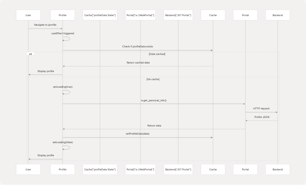
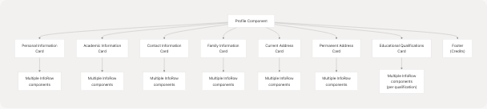

# Profile Module

> Source: https://deepwiki.com/codeblech/jportal/4.5-profile-module

# Profile Module

Relevant source files

* [jportal/src/assets/fakedata.json](https://github.com/codeblech/jportal/blob/4df0fde4/jportal/src/assets/fakedata.json)
* [jportal/src/components/MockWebPortal.js](https://github.com/codeblech/jportal/blob/4df0fde4/jportal/src/components/MockWebPortal.js)
* [jportal/src/components/Navbar.jsx](https://github.com/codeblech/jportal/blob/4df0fde4/jportal/src/components/Navbar.jsx)
* [jportal/src/components/Profile.jsx](https://github.com/codeblech/jportal/blob/4df0fde4/jportal/src/components/Profile.jsx)
* [jportal/src/components/ui/tabs.jsx](https://github.com/codeblech/jportal/blob/4df0fde4/jportal/src/components/ui/tabs.jsx)
* [jportal/src/index.css](https://github.com/codeblech/jportal/blob/4df0fde4/jportal/src/index.css)

## Purpose and Scope

The Profile Module provides a read-only display of student personal information retrieved from the JIIT portal. It organizes student data into seven logical sections: personal information, academic details, contact information, family information, current address, permanent address, and educational qualifications.

This page documents the Profile component implementation, data flow, and display structure. For navigation integration, see [Header](/codeblech/jportal/5.2-theme-and-navigation-components). For the underlying data abstraction layer, see [Data Layer & API Integration](/codeblech/jportal/3.3-data-layer-and-api-integration).

**Sources:** [jportal/src/components/Profile.jsx1-157](https://github.com/codeblech/jportal/blob/4df0fde4/jportal/src/components/Profile.jsx#L1-L157)

---

## Component Architecture

The Profile module consists of a single component `Profile` that receives the portal instance (`w`) and profile data state management props from `AuthenticatedApp`.

### Component Structure


```

**Sources:** [jportal/src/components/Profile.jsx6-157](https://github.com/codeblech/jportal/blob/4df0fde4/jportal/src/components/Profile.jsx#L6-L157)

### Props Interface

| Prop | Type | Description |
| --- | --- | --- |
| `w` | `WebPortal | MockWebPortal` | Portal API instance for data fetching |
| `profileData` | `Object | null` | Cached profile data object |
| `setProfileData` | `Function` | State setter for caching profile data |

**Sources:** [jportal/src/components/Profile.jsx6](https://github.com/codeblech/jportal/blob/4df0fde4/jportal/src/components/Profile.jsx#L6-L6)

---

## Data Flow

The Profile module implements a simple caching strategy to avoid redundant API calls. Data is fetched once and stored in the parent component's state.

### Data Fetching Flow Diagram

```

```

**Sources:** [jportal/src/components/Profile.jsx9-29](https://github.com/codeblech/jportal/blob/4df0fde4/jportal/src/components/Profile.jsx#L9-L29)

### Implementation Details

The caching logic is implemented in the `useEffect` hook:

```
```
useEffect(() => {
  const fetchProfileData = async () => {
    // Return early if data is already cached
    if (profileData) {
      setLoading(false);
      return;
    }

    setLoading(true);
    try {
      const data = await w.get_personal_info();
      setProfileData(data);
    } catch (error) {
      console.error("Failed to fetch profile data:", error);
    } finally {
      setLoading(false);
    }
  };

  fetchProfileData();
}, [w, profileData, setProfileData]);
```
```

**Sources:** [jportal/src/components/Profile.jsx9-29](https://github.com/codeblech/jportal/blob/4df0fde4/jportal/src/components/Profile.jsx#L9-L29)

---

## Data Structure

The profile data follows a specific schema returned by the portal API, consisting of two main sections: `generalinformation` and `qualification`.

### Profile Data Schema

```

```

**Sources:** [jportal/src/components/Profile.jsx39-41](https://github.com/codeblech/jportal/blob/4df0fde4/jportal/src/components/Profile.jsx#L39-L41) [jportal/src/assets/fakedata.json](https://github.com/codeblech/jportal/blob/4df0fde4/jportal/src/assets/fakedata.json) (profile section)

### Mock Data Example

The `MockWebPortal` class returns profile data from `fakedata.json`:

```
```
async get_personal_info() {
  return fakeData.profile;
}
```
```

**Sources:** [jportal/src/components/MockWebPortal.js93-95](https://github.com/codeblech/jportal/blob/4df0fde4/jportal/src/components/MockWebPortal.js#L93-L95)

---

## UI Layout and Sections

The Profile component renders seven distinct card sections, each grouping related information. All sections use the `InfoRow` helper component for consistent display.

### Section Breakdown

```


**Sources:** [jportal/src/components/Profile.jsx43-146](https://github.com/codeblech/jportal/blob/4df0fde4/jportal/src/components/Profile.jsx#L43-L146)

### Section Details Table

| Section | Fields Displayed | Line Reference |
| --- | --- | --- |
| **Personal Information** | Name, Registration No, DOB, Gender, Blood Group, Nationality, Category | [45-56](https://github.com/codeblech/jportal/blob/4df0fde4/45-56) |
| **Academic Information** | Program, Branch, Section, Batch, Semester, Institute, Academic Year, Admission Year | [59-71](https://github.com/codeblech/jportal/blob/4df0fde4/59-71) |
| **Contact Information** | Student Email (College), Student Email (Personal), Mobile, Telephone | [74-82](https://github.com/codeblech/jportal/blob/4df0fde4/74-82) |
| **Family Information** | Father's Name, Mother's Name, Parent's Email, Parent's Mobile, Parent's Telephone | [85-94](https://github.com/codeblech/jportal/blob/4df0fde4/85-94) |
| **Current Address** | Address, City, District, State, Postal Code | [97-106](https://github.com/codeblech/jportal/blob/4df0fde4/97-106) |
| **Permanent Address** | Address, City, District, State, Postal Code | [109-121](https://github.com/codeblech/jportal/blob/4df0fde4/109-121) |
| **Educational Qualifications** | Qualification, Board, Year of Passing, Marks Obtained, Percentage, Division, Grade | [124-137](https://github.com/codeblech/jportal/blob/4df0fde4/124-137) |

**Sources:** [jportal/src/components/Profile.jsx45-137](https://github.com/codeblech/jportal/blob/4df0fde4/jportal/src/components/Profile.jsx#L45-L137)

---

## Component Implementation

### Loading State

The component displays a centered loading message while fetching data:

```
```
if (loading) {
  return (
    <div className="text-foreground flex items-center justify-center py-4 h-[calc(100vh_-_<header_height>-<navbar_height>)]">
      Loading profile...
    </div>
  );
}
```
```

**Sources:** [jportal/src/components/Profile.jsx31-37](https://github.com/codeblech/jportal/blob/4df0fde4/jportal/src/components/Profile.jsx#L31-L37)

### InfoRow Helper Component

The `InfoRow` component provides consistent formatting for label-value pairs with responsive layout:

```
```
function InfoRow({ label, value }) {
  return (
    <div className="flex flex-col sm:flex-row sm:justify-between py-1">
      <span className="text-muted-foreground">{label}:</span>
      <span className="font-medium">{value || "N/A"}</span>
    </div>
  );
}
```
```

**Key features:**

* Vertical layout on mobile (`flex-col`)
* Horizontal layout on larger screens (`sm:flex-row sm:justify-between`)
* Displays "N/A" for missing values
* Uses theme colors (`text-muted-foreground`, `font-medium`)

**Sources:** [jportal/src/components/Profile.jsx150-157](https://github.com/codeblech/jportal/blob/4df0fde4/jportal/src/components/Profile.jsx#L150-L157)

### Card Structure

Each section follows this pattern:

```
```
<div className="bg-card p-4 rounded-lg shadow-lg">
  <h2 className="text-xl font-semibold mb-4">Section Title</h2>
  <div className="grid">
    <InfoRow label="Field Name" value={info.fieldname} />
    {/* More InfoRow components */}
  </div>
</div>
```
```

**Sources:** [jportal/src/components/Profile.jsx45-137](https://github.com/codeblech/jportal/blob/4df0fde4/jportal/src/components/Profile.jsx#L45-L137)

---

## Styling and Theming

The Profile module uses theme-aware styling through CSS custom properties defined in the theme system.

### Theme Integration

| CSS Class | Theme Variable | Purpose |
| --- | --- | --- |
| `text-foreground` | `--foreground` | Primary text color |
| `text-muted-foreground` | `--muted-foreground` | Label text color |
| `bg-card` | `--card` | Card background |
| `shadow-lg` | `--shadow-lg` | Card elevation |
| `rounded-lg` | `--radius-lg` | Border radius |

**Sources:** [jportal/src/components/Profile.jsx43-137](https://github.com/codeblech/jportal/blob/4df0fde4/jportal/src/components/Profile.jsx#L43-L137) [jportal/src/index.css7-88](https://github.com/codeblech/jportal/blob/4df0fde4/jportal/src/index.css#L7-L88)

### Responsive Design

The layout adapts to different screen sizes:

* **Mobile (< 640px)**: Labels and values stack vertically
* **Tablet/Desktop (≥ 640px)**: Labels on left, values on right
* **Container**: Scrollable with padding (`pt-2 pb-4 px-3`)

**Sources:** [jportal/src/components/Profile.jsx43](https://github.com/codeblech/jportal/blob/4df0fde4/jportal/src/components/Profile.jsx#L43-L43) [jportal/src/components/Profile.jsx152-154](https://github.com/codeblech/jportal/blob/4df0fde4/jportal/src/components/Profile.jsx#L152-L154)

---

## Navigation Integration

The Profile module is accessible via the bottom navigation bar at route `/profile`.

### Navigation Configuration

From `Navbar.jsx`:

```
```
const navItems = [
  // ... other items
  { name: " PROFILE ", path: "/profile", IconComponent: ProfileIcon },
];
```
```

**Sources:** [jportal/src/components/Navbar.jsx14](https://github.com/codeblech/jportal/blob/4df0fde4/jportal/src/components/Navbar.jsx#L14-L14)

### Routing

The route is defined in `AuthenticatedApp`:

```
```
<Route path="/profile" element={<Profile w={w} profileData={profileData} setProfileData={setProfileData} />} />
```
```

**Sources:** Referenced from architectural diagrams

---

## Error Handling

The Profile module implements basic error handling with console logging:

```
```
try {
  const data = await w.get_personal_info();
  setProfileData(data);
} catch (error) {
  console.error("Failed to fetch profile data:", error);
}
```
```

**Notes:**

* Errors are logged but not displayed to the user
* Loading state is cleared regardless of success or failure
* Missing fields display "N/A" instead of empty strings

**Sources:** [jportal/src/components/Profile.jsx19-24](https://github.com/codeblech/jportal/blob/4df0fde4/jportal/src/components/Profile.jsx#L19-L24)

---

## Demo Mode Behavior

In demo mode, the `MockWebPortal` class provides static profile data from `fakedata.json`. The profile data structure is identical in both real and demo modes, ensuring seamless switching.

**Sources:** [jportal/src/components/MockWebPortal.js93-95](https://github.com/codeblech/jportal/blob/4df0fde4/jportal/src/components/MockWebPortal.js#L93-L95) [jportal/src/assets/fakedata.json](https://github.com/codeblech/jportal/blob/4df0fde4/jportal/src/assets/fakedata.json) (profile section)

---

## Key Implementation Files

| File | Purpose |
| --- | --- |
| [jportal/src/components/Profile.jsx1-157](https://github.com/codeblech/jportal/blob/4df0fde4/jportal/src/components/Profile.jsx#L1-L157) | Main Profile component implementation |
| [jportal/src/components/MockWebPortal.js93-95](https://github.com/codeblech/jportal/blob/4df0fde4/jportal/src/components/MockWebPortal.js#L93-L95) | Mock data provider for demo mode |
| [jportal/src/assets/fakedata.json](https://github.com/codeblech/jportal/blob/4df0fde4/jportal/src/assets/fakedata.json) | Static profile data for demo mode |
| [jportal/src/components/Navbar.jsx14](https://github.com/codeblech/jportal/blob/4df0fde4/jportal/src/components/Navbar.jsx#L14-L14) | Navigation integration |
| [jportal/src/index.css7-88](https://github.com/codeblech/jportal/blob/4df0fde4/jportal/src/index.css#L7-L88) | Theme token definitions |