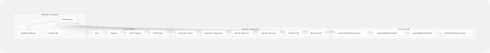
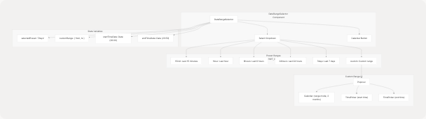

# Analytics Dashboard

## Purpose and Scope

This page documents the Analytics Dashboard feature, which provides web analytics visualization using Cloudflare's Web Analytics GraphQL API. The dashboard displays visitor statistics, page views, browser/OS distributions, and time-series data with interactive date range selection.

This page covers the `Cloudflare` component and its associated `DateRangeSelector` component. For information about other feature modules, see [Feature Modules](/codeblech/jportal/4-feature-modules). For UI component documentation, see [UI Components](/codeblech/jportal/5-ui-components).

---

## Overview

The Analytics Dashboard is a standalone feature accessible via the `/stats` route. It operates independently of the authentication system and does not require the `w` (WebPortal) prop like other feature modules. Instead, it connects directly to Cloudflare's GraphQL API to fetch and visualize web analytics data.

The dashboard provides:

* **Aggregate statistics**: Total visitors and page views for a selected time range
* **Time-series visualizations**: Visits and page views over time displayed as area charts
* **Distribution analytics**: Browser and OS usage shown as pie and bar charts
* **Flexible date range selection**: Preset ranges (15 minutes to 7 days) and custom date/time selection

**Sources:** [jportal/src/components/Cloudflare.jsx1-497](https://github.com/codeblech/jportal/blob/4df0fde4/jportal/src/components/Cloudflare.jsx#L1-L497)

---

## Component Architecture

### Main Component Structure


```

**Diagram: Cloudflare Component Architecture**

The `Cloudflare` component ([jportal/src/components/Cloudflare.jsx16-497](https://github.com/codeblech/jportal/blob/4df0fde4/jportal/src/components/Cloudflare.jsx#L16-L497)) orchestrates the entire analytics dashboard. It manages date range state, invokes custom hooks for data fetching, and renders multiple visualization types using Recharts components wrapped in shadcn/ui chart containers.

**Sources:** [jportal/src/components/Cloudflare.jsx1-497](https://github.com/codeblech/jportal/blob/4df0fde4/jportal/src/components/Cloudflare.jsx#L1-L497)

---

## State Management

### Date Range State

The component maintains date range state initialized to the last 7 days:

| State Variable | Type | Purpose |
| --- | --- | --- |
| `dateRange` | `{from: Date, to: Date}` | Current selected date range for analytics queries |
| `themeState` | Zustand store | Theme configuration for dynamic chart colors |
| `forceUpdate` | `{}` | Triggers re-render when theme changes |

**Sources:** [jportal/src/components/Cloudflare.jsx17-38](https://github.com/codeblech/jportal/blob/4df0fde4/jportal/src/components/Cloudflare.jsx#L17-L38)

### Theme Integration

The component subscribes to the theme store to dynamically retrieve chart colors:

```
getChartColor(index) => getComputedStyle(document.documentElement)
  .getPropertyValue(`--chart-${(index % 5) + 1}`)
```

This function retrieves CSS custom properties (`--chart-1` through `--chart-5`) defined by the current theme preset, ensuring visualizations match the selected theme.

**Sources:** [jportal/src/components/Cloudflare.jsx17-31](https://github.com/codeblech/jportal/blob/4df0fde4/jportal/src/components/Cloudflare.jsx#L17-L31)

---

## Data Fetching Layer

### Custom Hooks Architecture


**Diagram: Data Fetching Flow**

Each custom hook makes GraphQL queries to Cloudflare's Web Analytics API through a CORS proxy. The hooks accept `from` and `to` Date parameters and return data objects along with loading states.

**Sources:** [jportal/src/components/Cloudflare.jsx4-9](https://github.com/codeblech/jportal/blob/4df0fde4/jportal/src/components/Cloudflare.jsx#L4-L9) [jportal/src/components/Cloudflare.jsx91-100](https://github.com/codeblech/jportal/blob/4df0fde4/jportal/src/components/Cloudflare.jsx#L91-L100)

### Hook Invocations

The component invokes four hooks with the current date range:

```
// Aggregate stats
const { data: aggregateData, isLoading: aggregateLoading } = 
  useFetchWebAnalyticsAggregate(dateRange.from, dateRange.to)

// Browser distribution  
const { data: browserData, isLoading: browserLoading } = 
  useFetchWebAnalyticsBrowser(dateRange.from, dateRange.to)

// OS distribution
const { data: osData, isLoading: osLoading } = 
  useFetchWebAnalyticsOS(dateRange.from, dateRange.to)

// Time-series data
const { data: sparklineData, isLoading: sparklineLoading } = 
  useFetchWebAnalyticsSparkline(dateRange.from, dateRange.to)
```

**Sources:** [jportal/src/components/Cloudflare.jsx91-100](https://github.com/codeblech/jportal/blob/4df0fde4/jportal/src/components/Cloudflare.jsx#L91-L100)

---

## Date Range Selection

### DateRangeSelector Component



**Diagram: DateRangeSelector Component Structure**

The `DateRangeSelector` component provides two interaction modes:

1. **Preset selection**: Quick access to common time ranges via dropdown
2. **Custom selection**: Date range picker with calendar and time inputs

**Sources:** [jportal/src/components/DateRangeSelector.jsx1-177](https://github.com/codeblech/jportal/blob/4df0fde4/jportal/src/components/DateRangeSelector.jsx#L1-L177)

### Preset Ranges Configuration

The component defines preset ranges in the `PRESET_RANGES` object:

| Preset Key | Label | Duration (minutes) |
| --- | --- | --- |
| `15min` | Last 15 minutes | 15 |
| `1hour` | Last hour | 60 |
| `6hours` | Last 6 hours | 360 |
| `24hours` | Last 24 hours | 1440 |
| `7days` | Last 7 days | 10080 |
| `custom` | Custom range | null |

**Sources:** [jportal/src/components/DateRangeSelector.jsx10-17](https://github.com/codeblech/jportal/blob/4df0fde4/jportal/src/components/DateRangeSelector.jsx#L10-L17)

### Preset Range Selection

When a user selects a preset:

```
handlePresetChange(value) {
  if (value === "custom") {
    // Open calendar popover
    setTimeout(() => setIsCalendarOpen(true), 100)
    return
  }

  // Calculate date range from preset
  const preset = PRESET_RANGES[value]
  const to = new Date()
  const from = new Date(to.getTime() - preset.minutes * 60 * 1000)
  onDateRangeChange({ from, to })
}
```

**Sources:** [jportal/src/components/DateRangeSelector.jsx37-57](https://github.com/codeblech/jportal/blob/4df0fde4/jportal/src/components/DateRangeSelector.jsx#L37-L57)

### Custom Range Selection

When `custom` is selected, a `Popover` opens with:

* **Calendar component**: Range mode with 2 months displayed ([jportal/src/components/DateRangeSelector.jsx136-152](https://github.com/codeblech/jportal/blob/4df0fde4/jportal/src/components/DateRangeSelector.jsx#L136-L152))
* **Time pickers**: Start and end time inputs ([jportal/src/components/DateRangeSelector.jsx153-157](https://github.com/codeblech/jportal/blob/4df0fde4/jportal/src/components/DateRangeSelector.jsx#L153-L157))

The calendar restricts selection to dates between `2020-01-01` and the current date.

**Sources:** [jportal/src/components/DateRangeSelector.jsx59-103](https://github.com/codeblech/jportal/blob/4df0fde4/jportal/src/components/DateRangeSelector.jsx#L59-L103) [jportal/src/components/DateRangeSelector.jsx136-159](https://github.com/codeblech/jportal/blob/4df0fde4/jportal/src/components/DateRangeSelector.jsx#L136-L159)

### Time Picker Components

The `TimePicker` component ([jportal/src/components/ui/time-picker.tsx14-40](https://github.com/codeblech/jportal/blob/4df0fde4/jportal/src/components/ui/time-picker.tsx#L14-L40)) uses two `TimePickerInput` instances for hours and minutes. It manages:

* **Hour input**: 24-hour format (00-23)
* **Minute input**: Standard format (00-59)
* **Arrow navigation**: Left/right arrow keys move between inputs
* **Up/down arrows**: Increment/decrement time values

**Sources:** [jportal/src/components/ui/time-picker.tsx1-40](https://github.com/codeblech/jportal/blob/4df0fde4/jportal/src/components/ui/time-picker.tsx#L1-L40) [jportal/src/components/ui/time-picker-input.tsx1-122](https://github.com/codeblech/jportal/blob/4df0fde4/jportal/src/components/ui/time-picker-input.tsx#L1-L122)

---

## Visualizations

### Aggregate Statistics Cards

The dashboard displays two metric cards at the top:

```
┌─────────────────────────┐  ┌─────────────────────────┐
│ Total Visitors          │  │ Total Page Views        │
│                         │  │                         │
│ 1,234                   │  │ 5,678                   │
└─────────────────────────┘  └─────────────────────────┘
```

These cards use the `aggregateData` from `useFetchWebAnalyticsAggregate`:

* `aggregateData.visits` → Total Visitors
* `aggregateData.pageViews` → Total Page Views

While loading, `Skeleton` components display placeholder UI.

**Sources:** [jportal/src/components/Cloudflare.jsx119-145](https://github.com/codeblech/jportal/blob/4df0fde4/jportal/src/components/Cloudflare.jsx#L119-L145)

### Time-Series Charts

#### Visits Over Time (Area Chart)

The component renders an `AreaChart` with:

* **Data source**: `sparklineData.visits` array of `{ timestamp, visits }` objects
* **X-axis**: Timestamps formatted as `"MMM DD"`
* **Y-axis**: Visit counts
* **Styling**: Gradient fill with dynamic theme color
* **Tooltip**: Custom tooltip showing formatted date/time and visit count

**Sources:** [jportal/src/components/Cloudflare.jsx147-231](https://github.com/codeblech/jportal/blob/4df0fde4/jportal/src/components/Cloudflare.jsx#L147-L231)

#### Page Views Over Time (Area Chart)

Similar structure to the visits chart but uses `sparklineData.pageviews`:

* **Data source**: `sparklineData.pageviews` array
* **Color**: Uses `getChartColor(1)` (second theme color)

**Sources:** [jportal/src/components/Cloudflare.jsx233-317](https://github.com/codeblech/jportal/blob/4df0fde4/jportal/src/components/Cloudflare.jsx#L233-L317)

### Distribution Charts

Both browser and OS distributions use a dual-chart approach:

#### Chart Configuration

Each distribution section displays:

1. **Pie Chart**: Donut style with `innerRadius={60}`
2. **Bar Chart**: Horizontal layout showing exact counts

```


**Diagram: Distribution Chart Architecture**

**Sources:** [jportal/src/components/Cloudflare.jsx319-493](https://github.com/codeblech/jportal/blob/4df0fde4/jportal/src/components/Cloudflare.jsx#L319-L493)

#### Browser Distribution Implementation

The browser distribution card ([jportal/src/components/Cloudflare.jsx321-407](https://github.com/codeblech/jportal/blob/4df0fde4/jportal/src/components/Cloudflare.jsx#L321-L407)):

* Maps `browserData` array to pie chart format with dynamic colors
* Displays horizontal bar chart with browser names as Y-axis labels
* Uses `ChartContainer` config for consistent theming

#### OS Distribution Implementation

The OS distribution card ([jportal/src/components/Cloudflare.jsx409-492](https://github.com/codeblech/jportal/blob/4df0fde4/jportal/src/components/Cloudflare.jsx#L409-L492)) follows identical structure to browser distribution but uses `osData`.

---

## Dynamic Date Range Description

The component includes a helper function `getDateRangeDescription()` ([jportal/src/components/Cloudflare.jsx44-89](https://github.com/codeblech/jportal/blob/4df0fde4/jportal/src/components/Cloudflare.jsx#L44-L89)) that generates human-readable descriptions for chart subtitles:

| Condition | Description Output |
| --- | --- |
| Last 15-30 minutes | "last 15 minutes" / "last 30 minutes" |
| Last 1 hour | "last hour" |
| Last 3-6-12-24 hours | "last 3 hours" / "last 6 hours" / etc. |
| Last 1-7 days | "last 7 days" |
| Custom range | "5 days (Jan 1 to Jan 5)" |

This description appears in the `CardDescription` for time-series charts.

**Sources:** [jportal/src/components/Cloudflare.jsx44-89](https://github.com/codeblech/jportal/blob/4df0fde4/jportal/src/components/Cloudflare.jsx#L44-L89) [jportal/src/components/Cloudflare.jsx151](https://github.com/codeblech/jportal/blob/4df0fde4/jportal/src/components/Cloudflare.jsx#L151-L151) [jportal/src/components/Cloudflare.jsx237](https://github.com/codeblech/jportal/blob/4df0fde4/jportal/src/components/Cloudflare.jsx#L237-L237)

---

## Configuration

### Environment Variables

The analytics dashboard requires the following environment variables (defined in [jportal/.env.example1-7](https://github.com/codeblech/jportal/blob/4df0fde4/jportal/.env.example#L1-L7)):

| Variable | Purpose | Example Value |
| --- | --- | --- |
| `VITE_CLOUDFLARE_API_TOKEN` | Authentication token for Cloudflare API | `g29zrxuDBV3FfsTpC3q4_...` |
| `VITE_CLOUDFLARE_PROXY_URL` | CORS proxy endpoint | `https://cors-header-proxy.my-malikyash.workers.dev` |
| `VITE_CLOUDFLARE_BASE_URL` | Cloudflare GraphQL endpoint | `https://api.cloudflare.com/client/v4/graphql` |
| `VITE_CLOUDFLARE_ACCOUNT_TAG` | Cloudflare account identifier | `2af5100754a8644e0e2a576365803123` |
| `VITE_CLOUDFLARE_SITE_TAG` | Site/zone identifier | `b34248b80c7a4ca6ba091bdefee60093` |

These variables are accessed by the custom hooks (not shown in provided files) to construct GraphQL queries.

**Sources:** [jportal/.env.example1-7](https://github.com/codeblech/jportal/blob/4df0fde4/jportal/.env.example#L1-L7)

---

## Integration with Application

### Routing and Navigation

The analytics dashboard is accessible via the `/stats` route. Unlike other feature modules that are rendered within `AuthenticatedApp`, the `Cloudflare` component:

* Uses `PublicHeader` with back button ([jportal/src/components/Cloudflare.jsx106](https://github.com/codeblech/jportal/blob/4df0fde4/jportal/src/components/Cloudflare.jsx#L106-L106))
* Does not require authentication
* Operates independently of the `w` (WebPortal) prop

### Layout Structure

```
┌──────────────────────────────────────┐
│ PublicHeader (sticky, showBackButton)│
├──────────────────────────────────────┤
│ Stats for Nerds 🤓                   │
│ Web Analytics Dashboard              │
│                        [Date Selector]│
├──────────────────────────────────────┤
│ [Total Visitors] [Total Page Views]  │
├──────────────────────────────────────┤
│ Visits Over Time (Area Chart)        │
├──────────────────────────────────────┤
│ Page Views Over Time (Area Chart)    │
├──────────────────────────────────────┤
│ [Browser Dist.] [OS Distribution]    │
└──────────────────────────────────────┘
```

The layout uses responsive grid classes:

* Aggregate cards: `grid gap-4 md:grid-cols-2`
* Distribution charts: `grid gap-6 xl:grid-cols-2`

**Sources:** [jportal/src/components/Cloudflare.jsx102-494](https://github.com/codeblech/jportal/blob/4df0fde4/jportal/src/components/Cloudflare.jsx#L102-L494)

---

## Loading and Error States

The component handles loading states for each data source independently:

| Data Type | Loading Check | Skeleton Display |
| --- | --- | --- |
| Aggregate stats | `aggregateLoading` | `<Skeleton className="h-8 w-24" />` |
| Time-series | `sparklineLoading` | `<Skeleton className="h-[300px] w-full" />` |
| Browser data | `browserLoading` | `<Skeleton className="h-[400px] w-full" />` |
| OS data | `osLoading` | `<Skeleton className="h-[400px] w-full" />` |

When data is unavailable (empty arrays), the component displays fallback messages:

* "No visits data available"
* "No pageviews data available"
* "No browser data available"
* "No OS data available"

**Sources:** [jportal/src/components/Cloudflare.jsx126-140](https://github.com/codeblech/jportal/blob/4df0fde4/jportal/src/components/Cloudflare.jsx#L126-L140) [jportal/src/components/Cloudflare.jsx154-229](https://github.com/codeblech/jportal/blob/4df0fde4/jportal/src/components/Cloudflare.jsx#L154-L229) [jportal/src/components/Cloudflare.jsx328-405](https://github.com/codeblech/jportal/blob/4df0fde4/jportal/src/components/Cloudflare.jsx#L328-L405) [jportal/src/components/Cloudflare.jsx416-490](https://github.com/codeblech/jportal/blob/4df0fde4/jportal/src/components/Cloudflare.jsx#L416-L490)
