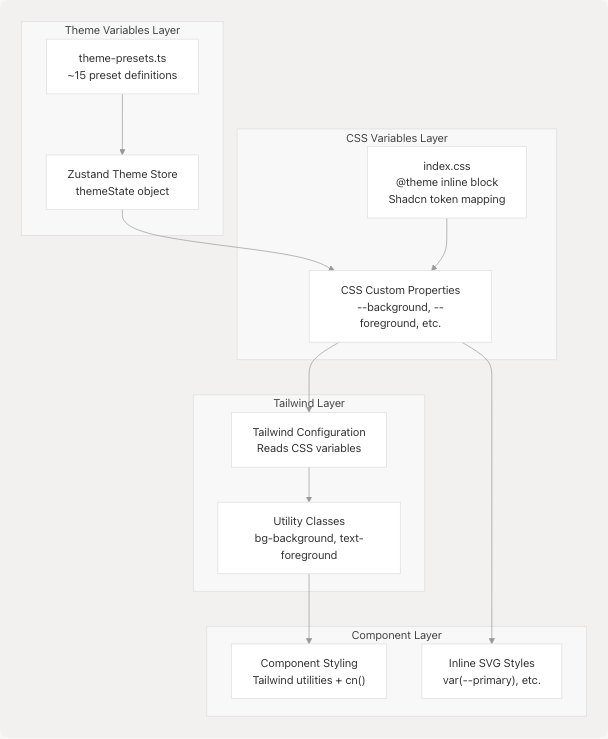

# UI Components

## Purpose and Scope

This document provides an overview of JPortal's UI component architecture, including the component hierarchy, styling infrastructure, and integration patterns. For detailed documentation of specific component types, see:

* Custom feature components like `AttendanceCard` and `CircleProgress` → [Custom Feature Components](5.1-custom-feature-components)
* Navigation and theme-related components → [Theme & Navigation Components](5.2-theme-and-navigation-components)
* Base Radix UI wrapper components → [Base UI Components](5.3-base-ui-components)
* Styling system details → [Styling System](5.4-styling-system)

## Component Architecture Overview

JPortal implements a **three-layer component architecture** that combines accessibility-focused primitives with custom domain-specific components.

### Component Hierarchy Diagram


**Sources:** [jportal/src/components/AttendanceCard.jsx1-359](https://github.com/codeblech/jportal/blob/4df0fde4/jportal/src/components/AttendanceCard.jsx#L1-L359) [jportal/src/components/CircleProgress.jsx1-53](https://github.com/codeblech/jportal/blob/4df0fde4/jportal/src/components/CircleProgress.jsx#L1-L53) [jportal/src/components/SubjectInfoCard.jsx1-26](https://github.com/codeblech/jportal/blob/4df0fde4/jportal/src/components/SubjectInfoCard.jsx#L1-L26) [jportal/src/components/Profile.jsx1-157](https://github.com/codeblech/jportal/blob/4df0fde4/jportal/src/components/Profile.jsx#L1-L157) [jportal/src/components/ui/tabs.jsx1-42](https://github.com/codeblech/jportal/blob/4df0fde4/jportal/src/components/ui/tabs.jsx#L1-L42) [jportal/package.json15-43](https://github.com/codeblech/jportal/blob/4df0fde4/jportal/package.json#L15-L43)

## UI Library Stack

### Dependency Matrix

| Layer | Library | Version | Purpose | Files |
| --- | --- | --- | --- | --- |
| **Primitives** | `@radix-ui/react-*` | ~1.1-2.1 | Accessible, unstyled UI components | Multiple packages |
| **Wrappers** | Custom components in `ui/` | N/A | Styled Radix UI wrappers with theme integration | `src/components/ui/*.jsx` |
| **Feature** | Custom components | N/A | Domain-specific UI for attendance, grades, etc. | `src/components/*.jsx` |
| **Charts** | `recharts` | ^2.15.4 | Data visualization (line/bar charts) | Used in attendance/grades |
| **Calendar** | `react-day-picker` | ^8.10.1 | Calendar date picker component | Used in attendance calendar |
| **Styling** | `tailwindcss` | ^4.1.12 | Utility-first CSS framework | Global |
| **Variants** | `class-variance-authority` | ^0.7.0 | Component variant management | Wrapper components |
| **Utilities** | `clsx`, `tailwind-merge` | Latest | Class name manipulation | Utility functions |

**Sources:** [jportal/package.json15-43](https://github.com/codeblech/jportal/blob/4df0fde4/jportal/package.json#L15-L43)

### Component Import Patterns

The codebase follows consistent import patterns across all feature components:

```
// Layer 1: Radix UI primitives (used internally by wrapper components)
import * as TabsPrimitive from "@radix-ui/react-tabs"

// Layer 2: Wrapper components from ui/ directory
import { Sheet, SheetContent, SheetHeader, SheetTitle } from "@/components/ui/sheet"
import { Calendar } from "@/components/ui/calendar"
import { Button } from "@/components/ui/button"

// Layer 3: Custom feature components
import CircleProgress from "./CircleProgress"
import AttendanceCard from "./AttendanceCard"

// Visualization libraries
import { LineChart, Line, XAxis, YAxis, CartesianGrid, Tooltip, ResponsiveContainer } from "recharts"

// Utilities
import { cn } from "@/lib/utils"
```

**Sources:** [jportal/src/components/AttendanceCard.jsx1-5](https://github.com/codeblech/jportal/blob/4df0fde4/jportal/src/components/AttendanceCard.jsx#L1-L5) [jportal/src/components/ui/tabs.jsx1-4](https://github.com/codeblech/jportal/blob/4df0fde4/jportal/src/components/ui/tabs.jsx#L1-L4) [jportal/src/components/Profile.jsx1-4](https://github.com/codeblech/jportal/blob/4df0fde4/jportal/src/components/Profile.jsx#L1-L4)

## Component Categories

### Category Breakdown by Function


**Sources:** [jportal/src/components/AttendanceCard.jsx7-13](https://github.com/codeblech/jportal/blob/4df0fde4/jportal/src/components/AttendanceCard.jsx#L7-L13) [jportal/src/components/SubjectInfoCard.jsx1-26](https://github.com/codeblech/jportal/blob/4df0fde4/jportal/src/components/SubjectInfoCard.jsx#L1-L26) [jportal/src/components/CircleProgress.jsx3](https://github.com/codeblech/jportal/blob/4df0fde4/jportal/src/components/CircleProgress.jsx#L3-L3) [jportal/src/components/Navbar.jsx8-15](https://github.com/codeblech/jportal/blob/4df0fde4/jportal/src/components/Navbar.jsx#L8-L15)

### Component Prop Patterns

JPortal components follow consistent prop patterns across feature modules:

| Component Type | Common Props | Example |
| --- | --- | --- |
| **Feature Cards** | `subject`, `selectedSubject`, `setSelectedSubject`, data props | `AttendanceCard` receives subject object and selection handlers |
| **Display Components** | `percentage`, `label`, `className` | `CircleProgress` receives numeric data and styling props |
| **Page Components** | `w` (WebPortal instance), state, setState | `Profile` receives `w`, `profileData`, `setProfileData` |
| **Wrapper Components** | `className`, `children`, Radix-specific props | All `ui/` components accept `className` for style overrides |
| **Navigation Components** | Route configuration via constants | `Navbar` uses local `navItems` array with paths and icons |

**Sources:** [jportal/src/components/AttendanceCard.jsx7-13](https://github.com/codeblech/jportal/blob/4df0fde4/jportal/src/components/AttendanceCard.jsx#L7-L13) [jportal/src/components/CircleProgress.jsx3](https://github.com/codeblech/jportal/blob/4df0fde4/jportal/src/components/CircleProgress.jsx#L3-L3) [jportal/src/components/Profile.jsx6](https://github.com/codeblech/jportal/blob/4df0fde4/jportal/src/components/Profile.jsx#L6-L6) [jportal/src/components/Navbar.jsx9-15](https://github.com/codeblech/jportal/blob/4df0fde4/jportal/src/components/Navbar.jsx#L9-L15)

## Styling Infrastructure

### CSS Architecture Layers



**Sources:** [jportal/src/index.css1-240](https://github.com/codeblech/jportal/blob/4df0fde4/jportal/src/index.css#L1-L240)

### Key CSS Variable Groups

The styling system defines several groups of CSS custom properties in [jportal/src/index.css7-88](https://github.com/codeblech/jportal/blob/4df0fde4/jportal/src/index.css#L7-L88):

| Variable Group | Example Variables | Usage Context |
| --- | --- | --- |
| **Shadcn Tokens** | `--color-background`, `--color-foreground`, `--color-primary` | Mapped from Shadcn design system to Tailwind |
| **Semantic Colors** | `--background`, `--foreground`, `--card`, `--muted` | Core UI colors for backgrounds and text |
| **Interactive** | `--primary`, `--secondary`, `--accent`, `--destructive` | Button and interactive element colors |
| **Chart Colors** | `--chart-1` through `--chart-5` | Used in Recharts visualizations |
| **Custom JPortal** | `--grade-aa`, `--marks-outstanding`, etc. | Domain-specific color coding |
| **Typography** | `--font-sans`, `--font-serif`, `--font-mono` | Font family definitions |
| **Spacing** | `--radius`, `--spacing`, `--shadow-*` | Layout and visual depth |

**Sources:** [jportal/src/index.css7-160](https://github.com/codeblech/jportal/blob/4df0fde4/jportal/src/index.css#L7-L160)

### Component Styling Example

The `CircleProgress` component demonstrates the integration of CSS variables with inline SVG styling:

```
// CSS variable usage in SVG
<circle
  stroke="var(--primary)"
  strokeWidth={strokeWidth}
  strokeDasharray={circumference}
  strokeDashoffset={offset}
  className="transition-all duration-1000 ease-out"
/>
<text
  className="text-[13px] fill-foreground font-medium group-hover:fill-accent-foreground"
>
  {label ?? percentage}
</text>
```

**Sources:** [jportal/src/components/CircleProgress.jsx23-48](https://github.com/codeblech/jportal/blob/4df0fde4/jportal/src/components/CircleProgress.jsx#L23-L48)

## Key Design Patterns

### Pattern 1: Sheet-Based Detail Views

Multiple feature components use the `Sheet` component (Radix Dialog) for displaying detailed information in a bottom drawer:

**Implementation in AttendanceCard:**

* Main card is clickable: [jportal/src/components/AttendanceCard.jsx104-129](https://github.com/codeblech/jportal/blob/4df0fde4/jportal/src/components/AttendanceCard.jsx#L104-L129)
* Sheet opens with `open={selectedSubject?.name === subject.name}`: [jportal/src/components/AttendanceCard.jsx131-137](https://github.com/codeblech/jportal/blob/4df0fde4/jportal/src/components/AttendanceCard.jsx#L131-L137)
* Sheet content uses snap scrolling for calendar and chart sections: [jportal/src/components/AttendanceCard.jsx140-351](https://github.com/codeblech/jportal/blob/4df0fde4/jportal/src/components/AttendanceCard.jsx#L140-L351)

### Pattern 2: Responsive Sizing with Tailwind

Components use Tailwind's responsive breakpoint modifiers extensively:

```
// From AttendanceCard - responsive text sizing
<h2 className="text-sm font-semibold max-[390px]:text-xs">
  {displayName}
</h2>

// From Navbar - responsive text sizing
<p className="max-[370px]:text-[0.6rem] max-[390px]:text-[0.7rem] text-xs">
  {item.name}
</p>
```

**Sources:** [jportal/src/components/AttendanceCard.jsx109](https://github.com/codeblech/jportal/blob/4df0fde4/jportal/src/components/AttendanceCard.jsx#L109-L109) [jportal/src/components/Navbar.jsx39-41](https://github.com/codeblech/jportal/blob/4df0fde4/jportal/src/components/Navbar.jsx#L39-L41)

### Pattern 3: Data Visualization Integration

Feature components integrate Recharts with theme variables for consistent styling:

```
// From AttendanceCard - themed chart configuration
<LineChart data={processAttendanceData()}>
  <CartesianGrid strokeDasharray="3 3" stroke="var(--border)" />
  <XAxis stroke="var(--muted-foreground)" />
  <YAxis stroke="var(--muted-foreground)" />
  <Tooltip
    contentStyle={{
      backgroundColor: "var(--card)",
      border: "1px solid var(--border)",
      color: "var(--card-foreground)",
    }}
  />
  <Line stroke="var(--chart-5)" />
</LineChart>
```

**Sources:** [jportal/src/components/AttendanceCard.jsx301-347](https://github.com/codeblech/jportal/blob/4df0fde4/jportal/src/components/AttendanceCard.jsx#L301-L347)

### Pattern 4: State-Driven UI with Loading States

All page-level components implement loading states while fetching data:

```
// From Profile - loading state pattern
const [loading, setLoading] = useState(true);

if (loading) {
  return (
    <div className="...">
      Loading profile...
    </div>
  );
}

// Render actual content
return <div>...</div>
```

**Sources:** [jportal/src/components/Profile.jsx7-37](https://github.com/codeblech/jportal/blob/4df0fde4/jportal/src/components/Profile.jsx#L7-L37)

### Pattern 5: Utility Function for Class Merging

The `cn()` utility (from `@/lib/utils`) is used throughout wrapper components to merge Tailwind classes with Radix UI classes:

```
// From tabs.jsx - class merging pattern
const TabsList = React.forwardRef(({ className, ...props }, ref) => (
  <TabsPrimitive.List
    ref={ref}
    className={cn(
      "inline-flex h-10 items-center justify-center rounded-md bg-muted p-1",
      className
    )}
    {...props}
  />
))
```

**Sources:** [jportal/src/components/ui/tabs.jsx8-16](https://github.com/codeblech/jportal/blob/4df0fde4/jportal/src/components/ui/tabs.jsx#L8-L16)

## Component Communication Patterns

### Props Drilling Architecture


**Sources:** [jportal/src/components/AttendanceCard.jsx7-13](https://github.com/codeblech/jportal/blob/4df0fde4/jportal/src/components/AttendanceCard.jsx#L7-L13) [jportal/src/components/CircleProgress.jsx3](https://github.com/codeblech/jportal/blob/4df0fde4/jportal/src/components/CircleProgress.jsx#L3-L3) [jportal/src/components/Profile.jsx6](https://github.com/codeblech/jportal/blob/4df0fde4/jportal/src/components/Profile.jsx#L6-L6)

### Event Handler Patterns

Feature components implement consistent event handling patterns:

| Pattern | Example | Location |
| --- | --- | --- |
| **Async fetch on interaction** | `handleClick` fetches subject attendance when card clicked | [jportal/src/components/AttendanceCard.jsx22-29](https://github.com/codeblech/jportal/blob/4df0fde4/jportal/src/components/AttendanceCard.jsx#L22-L29) |
| **Conditional data loading** | Check if data exists before fetching | [jportal/src/components/AttendanceCard.jsx24](https://github.com/codeblech/jportal/blob/4df0fde4/jportal/src/components/AttendanceCard.jsx#L24-L24) |
| **Loading state management** | Set loading before/after async operations | [jportal/src/components/AttendanceCard.jsx25-27](https://github.com/codeblech/jportal/blob/4df0fde4/jportal/src/components/AttendanceCard.jsx#L25-L27) |
| **State cleanup on close** | Reset selected subject when sheet closes | [jportal/src/components/AttendanceCard.jsx133-135](https://github.com/codeblech/jportal/blob/4df0fde4/jportal/src/components/AttendanceCard.jsx#L133-L135) |

## Component Accessibility Features

All wrapper components in the `ui/` directory inherit accessibility features from Radix UI primitives:

* **Keyboard Navigation**: Full keyboard support for tabs, dialogs, selects
* **ARIA Attributes**: Proper `aria-*` attributes automatically applied
* **Focus Management**: Automatic focus trapping in dialogs and popovers
* **Screen Reader Support**: Semantic HTML and labels for assistive technologies

The wrapper components preserve these features while adding custom styling via the `className` prop pattern.

**Sources:** [jportal/src/components/ui/tabs.jsx1-42](https://github.com/codeblech/jportal/blob/4df0fde4/jportal/src/components/ui/tabs.jsx#L1-L42) [jportal/package.json17-19](https://github.com/codeblech/jportal/blob/4df0fde4/jportal/package.json#L17-L19)
