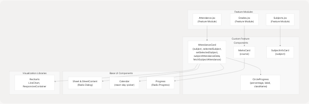
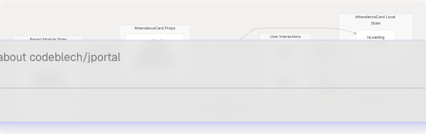
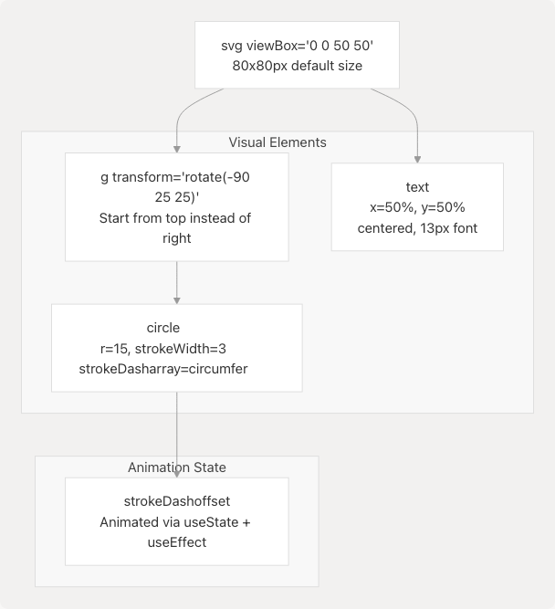
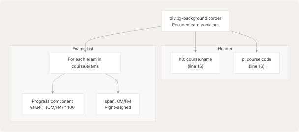

# Custom Feature Components

This document covers the custom UI components built specifically for JPortal's feature modules. These components provide domain-specific visualizations and interactions for attendance tracking, grades display, and subject information. For base UI components from Radix UI (Dialog, Sheet, Select, etc.), see [Base UI Components](5.3-base-ui-components). For navigation and theme components, see [Theme & Navigation Components](5.2-theme-and-navigation-components).

## Overview

JPortal implements four primary custom feature components that encapsulate complex domain logic and visualizations:

| Component | Purpose | Used In | Key Features |
| --- | --- | --- | --- |
| `AttendanceCard` | Display subject attendance with drill-down | Attendance Module | Calendar view, line chart, class-by-class details |
| `CircleProgress` | Circular percentage indicator | Attendance Module | Animated SVG ring with configurable radius |
| `MarksCard` | Display course marks breakdown | Grades Module | Progress bars with color-coded performance |
| `SubjectInfoCard` | Display subject details | Subjects Module | Course info, credits, faculty listing |

These components are **stateful**, managing local UI state (e.g., selected dates, loading indicators) while receiving data through props from parent feature modules. They integrate with base UI primitives from [src/components/ui/](https://github.com/codeblech/jportal/blob/4df0fde4/src/components/ui/) and data visualization libraries (Recharts).

**Sources:** [jportal/src/components/AttendanceCard.jsx1-359](https://github.com/codeblech/jportal/blob/4df0fde4/jportal/src/components/AttendanceCard.jsx#L1-L359) [jportal/src/components/CircleProgress.jsx1-53](https://github.com/codeblech/jportal/blob/4df0fde4/jportal/src/components/CircleProgress.jsx#L1-L53) [jportal/src/components/MarksCard.jsx1-42](https://github.com/codeblech/jportal/blob/4df0fde4/jportal/src/components/MarksCard.jsx#L1-L42) [jportal/src/components/SubjectInfoCard.jsx1-26](https://github.com/codeblech/jportal/blob/4df0fde4/jportal/src/components/SubjectInfoCard.jsx#L1-L26)

## Component Architecture

### Component Hierarchy



**Component Hierarchy Diagram**

This diagram shows how custom feature components integrate with their parent modules and depend on base UI primitives. `AttendanceCard` is the most complex, combining multiple base components and a visualization library.

**Sources:** [jportal/src/components/AttendanceCard.jsx1-13](https://github.com/codeblech/jportal/blob/4df0fde4/jportal/src/components/AttendanceCard.jsx#L1-L13) [jportal/src/components/CircleProgress.jsx3](https://github.com/codeblech/jportal/blob/4df0fde4/jportal/src/components/CircleProgress.jsx#L3-L3) [jportal/src/components/MarksCard.jsx4](https://github.com/codeblech/jportal/blob/4df0fde4/jportal/src/components/MarksCard.jsx#L4-L4) [jportal/src/components/SubjectInfoCard.jsx1](https://github.com/codeblech/jportal/blob/4df0fde4/jportal/src/components/SubjectInfoCard.jsx#L1-L1)

### Data Flow Pattern



**Data Flow in AttendanceCard**

This diagram illustrates the dual-state architecture: parent module state is passed via props, while local UI state (like `selectedDate`) is managed internally. User interactions trigger callbacks that update parent state via the `fetchSubjectAttendance` prop.

**Sources:** [jportal/src/components/AttendanceCard.jsx7-13](https://github.com/codeblech/jportal/blob/4df0fde4/jportal/src/components/AttendanceCard.jsx#L7-L13) [jportal/src/components/AttendanceCard.jsx19-20](https://github.com/codeblech/jportal/blob/4df0fde4/jportal/src/components/AttendanceCard.jsx#L19-L20) [jportal/src/components/AttendanceCard.jsx22-29](https://github.com/codeblech/jportal/blob/4df0fde4/jportal/src/components/AttendanceCard.jsx#L22-L29) [jportal/src/components/AttendanceCard.jsx249](https://github.com/codeblech/jportal/blob/4df0fde4/jportal/src/components/AttendanceCard.jsx#L249-L249)

## AttendanceCard Component

`AttendanceCard` is the most sophisticated custom component, providing a multi-view interface for subject attendance tracking.

### Component Structure

The component is defined in [jportal/src/components/AttendanceCard.jsx7-356](https://github.com/codeblech/jportal/blob/4df0fde4/jportal/src/components/AttendanceCard.jsx#L7-L356) and accepts five props:

| Prop | Type | Purpose |
| --- | --- | --- |
| `subject` | Object | Subject data containing name, attendance stats, class counts |
| `selectedSubject` | Object | null | Currently selected subject for detail view |
| `setSelectedSubject` | Function | Setter to update selected subject in parent |
| `subjectAttendanceData` | Object | Map of subject names to array of class records |
| `fetchSubjectAttendance` | Function | Async function to fetch detailed attendance for a subject |

### Visual Components

The component renders two distinct views:

#### 1. Card View (Collapsed)


**AttendanceCard Collapsed View Structure**

The collapsed card displays summary statistics with a `CircleProgress` component showing overall attendance percentage. The `displayName` strips parenthetical content from subject names using regex [jportal/src/components/AttendanceCard.jsx17](https://github.com/codeblech/jportal/blob/4df0fde4/jportal/src/components/AttendanceCard.jsx#L17-L17)

**Sources:** [jportal/src/components/AttendanceCard.jsx104-129](https://github.com/codeblech/jportal/blob/4df0fde4/jportal/src/components/AttendanceCard.jsx#L104-L129) [jportal/src/components/AttendanceCard.jsx14-17](https://github.com/codeblech/jportal/blob/4df0fde4/jportal/src/components/AttendanceCard.jsx#L14-L17)

#### 2. Detail View (Sheet)

When clicked, the card opens a bottom sheet ([jportal/src/components/AttendanceCard.jsx131-353](https://github.com/codeblech/jportal/blob/4df0fde4/jportal/src/components/AttendanceCard.jsx#L131-L353)) containing two scrollable sections:

**Calendar Section** ([jportal/src/components/AttendanceCard.jsx142-295](https://github.com/codeblech/jportal/blob/4df0fde4/jportal/src/components/AttendanceCard.jsx#L142-L295)):

* Uses `react-day-picker` Calendar component with custom modifiers
* Implements **10 distinct modifiers** for attendance visualization:
  + `presentSingle`, `absentSingle`: Single class days (lines 147-154)
  + `presentDouble`, `absentDouble`, `mixedDouble`: Days with 2 classes (lines 155-166)
  + `presentTriple`, `absentTriple`: Days with 3 classes, all same status (lines 167-174)
  + `mixedTripleAllPresent`, `mixedTripleAllAbsent`, `mixedTripleEqual`: Days with 3 classes, mixed attendance (lines 175-189)
* Applies gradient backgrounds via `modifiersStyles` (lines 192-246)
* Selected date shows class-by-class breakdown (lines 277-293)

**Chart Section** ([jportal/src/components/AttendanceCard.jsx298-350](https://github.com/codeblech/jportal/blob/4df0fde4/jportal/src/components/AttendanceCard.jsx#L298-L350)):

* Recharts `LineChart` showing cumulative attendance percentage over time
* `processAttendanceData()` function (lines 69-100) computes running percentage from individual class records

### Key Algorithms

#### Date Matching Logic

The `getDayStatus()` function [jportal/src/components/AttendanceCard.jsx32-45](https://github.com/codeblech/jportal/blob/4df0fde4/jportal/src/components/AttendanceCard.jsx#L32-L45) matches calendar dates to attendance records:

```
1. Convert Date object to "DD/MM/YYYY" format
2. Filter subjectAttendanceData for matching date prefix
3. Return array of boolean statuses (true = Present, false = Absent)
4. Array length indicates number of classes that day
```

This powers the calendar modifiers, which use array length and composition to determine visual styling.

#### Cumulative Attendance Calculation

The `processAttendanceData()` function [jportal/src/components/AttendanceCard.jsx69-100](https://github.com/codeblech/jportal/blob/4df0fde4/jportal/src/components/AttendanceCard.jsx#L69-L100) transforms flat class records into time-series data:

```
1. Sort all class records by date (oldest first)
2. Iterate chronologically, maintaining running counters:
   - cumulativePresent: total attended classes
   - cumulativeTotal: total classes
3. For each unique date, store percentage = (present/total) * 100
4. Deduplicate by date to get one data point per day
```

This produces a monotonically changing line chart showing attendance trends.

**Sources:** [jportal/src/components/AttendanceCard.jsx32-100](https://github.com/codeblech/jportal/blob/4df0fde4/jportal/src/components/AttendanceCard.jsx#L32-L100) [jportal/src/components/AttendanceCard.jsx131-353](https://github.com/codeblech/jportal/blob/4df0fde4/jportal/src/components/AttendanceCard.jsx#L131-L353)

## CircleProgress Component

`CircleProgress` renders an animated circular progress indicator using SVG.

### Component API

Defined in [jportal/src/components/CircleProgress.jsx3-50](https://github.com/codeblech/jportal/blob/4df0fde4/jportal/src/components/CircleProgress.jsx#L3-L50):

| Prop | Type | Default | Purpose |
| --- | --- | --- | --- |
| `percentage` | Number | - | Value from 0-100 to display |
| `label` | String | undefined | Override text display (defaults to percentage) |
| `className` | String | "" | Additional CSS classes |

### SVG Implementation



**CircleProgress SVG Structure**

The component uses the **stroke-dashoffset technique** for circular progress animation:

1. **Initial State**: Circle outline has `circumference = 2πr = 94.25` units
2. **Offset Calculation**: `offset = circumference - (percentage/100) * circumference`
3. **Animation**: `useEffect` updates offset from 100% (empty) to actual percentage over 1000ms [jportal/src/components/CircleProgress.jsx11-21](https://github.com/codeblech/jportal/blob/4df0fde4/jportal/src/components/CircleProgress.jsx#L11-L21)

The rotation transform [jportal/src/components/CircleProgress.jsx25](https://github.com/codeblech/jportal/blob/4df0fde4/jportal/src/components/CircleProgress.jsx#L25-L25) ensures the progress starts at 12 o'clock position instead of 3 o'clock (SVG default).

### Styling Integration

The component uses CSS custom properties for theming:

* `stroke="var(--primary)"` for the circle outline [jportal/src/components/CircleProgress.jsx31](https://github.com/codeblech/jportal/blob/4df0fde4/jportal/src/components/CircleProgress.jsx#L31-L31)
* `fill-foreground` and `group-hover:fill-accent-foreground` for text color [jportal/src/components/CircleProgress.jsx44](https://github.com/codeblech/jportal/blob/4df0fde4/jportal/src/components/CircleProgress.jsx#L44-L44)

This allows the component to adapt to theme changes without prop updates.

**Sources:** [jportal/src/components/CircleProgress.jsx1-53](https://github.com/codeblech/jportal/blob/4df0fde4/jportal/src/components/CircleProgress.jsx#L1-L53)

## MarksCard Component

`MarksCard` displays exam marks for a single course with visual progress indicators.

### Component Structure

Defined in [jportal/src/components/MarksCard.jsx4-41](https://github.com/codeblech/jportal/blob/4df0fde4/jportal/src/components/MarksCard.jsx#L4-L41) accepts a single `course` prop with structure:

```
{
  name: string,
  code: string,
  exams: {
    [examName]: { OM: number, FM: number }
  }
}
```

### Visual Layout



**MarksCard Layout Structure**

Each exam entry [jportal/src/components/MarksCard.jsx20-38](https://github.com/codeblech/jportal/blob/4df0fde4/jportal/src/components/MarksCard.jsx#L20-L38) consists of a horizontal progress bar with marks displayed on the right.

### Dynamic Color Coding

The `getProgressColor()` function [jportal/src/components/MarksCard.jsx5-10](https://github.com/codeblech/jportal/blob/4df0fde4/jportal/src/components/MarksCard.jsx#L5-L10) assigns semantic colors based on performance:

| Percentage Range | Color Class | Meaning |
| --- | --- | --- |
| ≥ 80% | `bg-marks-outstanding` | Excellent performance |
| 60-79% | `bg-marks-good` | Good performance |
| 40-59% | `bg-marks-average` | Average performance |
| < 40% | `bg-marks-poor` | Poor performance |

These color classes are defined in the theme system (see [Theme System](3.4-theme-system)) and adapt to light/dark modes.

**Sources:** [jportal/src/components/MarksCard.jsx1-42](https://github.com/codeblech/jportal/blob/4df0fde4/jportal/src/components/MarksCard.jsx#L1-L42)

## SubjectInfoCard Component

`SubjectInfoCard` provides a condensed view of subject registration details.

### Component API

Defined in [jportal/src/components/SubjectInfoCard.jsx1-24](https://github.com/codeblech/jportal/blob/4df0fde4/jportal/src/components/SubjectInfoCard.jsx#L1-L24) accepts a `subject` prop:

```
{
  name: string,
  code: string,
  credits: number,
  isAudit: boolean,
  components: [
    { type: 'L'|'T'|'P', teacher: string }
  ]
}
```

### Layout Implementation


**SubjectInfoCard Layout**

The component uses a simple two-column flex layout with subject details on the left and prominent credit display on the right [jportal/src/components/SubjectInfoCard.jsx3-22](https://github.com/codeblech/jportal/blob/4df0fde4/jportal/src/components/SubjectInfoCard.jsx#L3-L22)

### Component Type Mapping

The component maps component types to readable labels [jportal/src/components/SubjectInfoCard.jsx10-17](https://github.com/codeblech/jportal/blob/4df0fde4/jportal/src/components/SubjectInfoCard.jsx#L10-L17):

* `'L'` → "Lecture"
* `'T'` → "Tutorial"
* `'P'` → "Practical"

Each component shows the assigned teacher name.

**Sources:** [jportal/src/components/SubjectInfoCard.jsx1-26](https://github.com/codeblech/jportal/blob/4df0fde4/jportal/src/components/SubjectInfoCard.jsx#L1-L26)

## Component Integration Patterns

### Props Drilling Pattern

Custom feature components receive data through **extensive props drilling** from parent feature modules:


**Props Drilling in Attendance Module**

Each `AttendanceCard` receives:

1. **Data props**: `subject`, `subjectAttendanceData` (read-only)
2. **State props**: `selectedSubject` (shared across all cards)
3. **Callback props**: `setSelectedSubject`, `fetchSubjectAttendance` (to modify parent state)

This pattern enables coordinated behavior (e.g., only one card can be expanded at a time) but creates tight coupling between parent and child components.

**Sources:** [jportal/src/components/AttendanceCard.jsx7-13](https://github.com/codeblech/jportal/blob/4df0fde4/jportal/src/components/AttendanceCard.jsx#L7-L13)

### Lazy Data Loading

`AttendanceCard` implements lazy loading for detailed attendance data [jportal/src/components/AttendanceCard.jsx22-29](https://github.com/codeblech/jportal/blob/4df0fde4/jportal/src/components/AttendanceCard.jsx#L22-L29):

```
handleClick():
  1. Set selectedSubject to open sheet
  2. Check if subjectAttendanceData[subject.name] exists
  3. If not, set isLoading = true
  4. Call fetchSubjectAttendance(subject) 
  5. Parent module fetches from API and updates state
  6. Set isLoading = false
```

This avoids fetching granular attendance data for all subjects on page load, reducing initial load time.

### Responsive Design Strategy

All custom components implement responsive sizing using Tailwind breakpoint classes:

| Breakpoint | AttendanceCard | CircleProgress | MarksCard | SubjectInfoCard |
| --- | --- | --- | --- | --- |
| Default | `text-sm` | `w-[80px] h-[80px]` | `p-3` | `text-sm` |
| ≤390px | `max-[390px]:text-xs` | `text-[12px]` | N/A | `max-[390px]:text-xs` |
| ≤375px | N/A | `max-[375px]:text-[12px]` | N/A | N/A |
| ≥640px (sm) | N/A | N/A | `sm:p-4, sm:text-base` | N/A |
| ≥1024px (lg) | `lg:text-base` | N/A | N/A | `lg:text-base` |

This ensures readability across mobile devices (down to 320px width) and desktop screens.

**Sources:** [jportal/src/components/AttendanceCard.jsx109-112](https://github.com/codeblech/jportal/blob/4df0fde4/jportal/src/components/AttendanceCard.jsx#L109-L112) [jportal/src/components/CircleProgress.jsx24](https://github.com/codeblech/jportal/blob/4df0fde4/jportal/src/components/CircleProgress.jsx#L24-L24) [jportal/src/components/MarksCard.jsx13-16](https://github.com/codeblech/jportal/blob/4df0fde4/jportal/src/components/MarksCard.jsx#L13-L16) [jportal/src/components/SubjectInfoCard.jsx5-12](https://github.com/codeblech/jportal/blob/4df0fde4/jportal/src/components/SubjectInfoCard.jsx#L5-L12)

## Accessibility Considerations

Custom components inherit accessibility features from their base UI dependencies:

* **AttendanceCard**: Uses Radix `Sheet` with proper ARIA attributes and focus management
* **MarksCard**: Radix `Progress` component includes `role="progressbar"` and `aria-valuenow`
* **Calendar**: react-day-picker implements full keyboard navigation and screen reader support

All interactive elements use semantic HTML (`button`, `div[role="button"]`) and maintain accessible contrast ratios through the theme system.

**Sources:** [jportal/src/components/AttendanceCard.jsx131-137](https://github.com/codeblech/jportal/blob/4df0fde4/jportal/src/components/AttendanceCard.jsx#L131-L137) [jportal/src/components/ui/progress.jsx1-25](https://github.com/codeblech/jportal/blob/4df0fde4/jportal/src/components/ui/progress.jsx#L1-L25)
