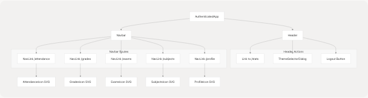
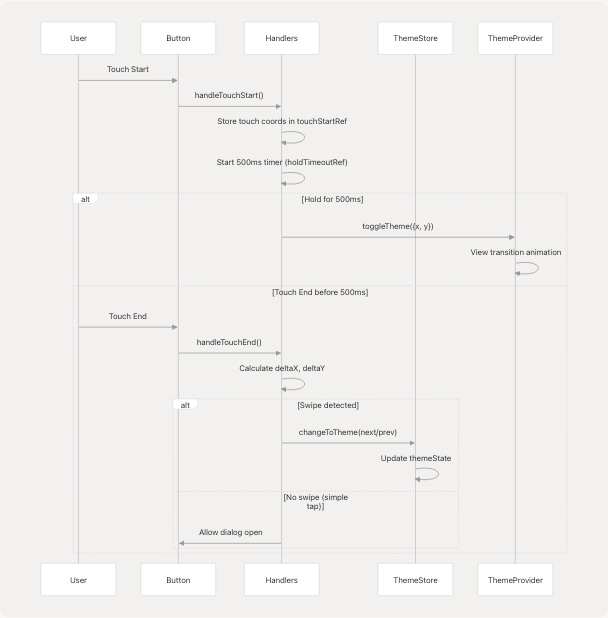
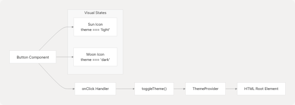
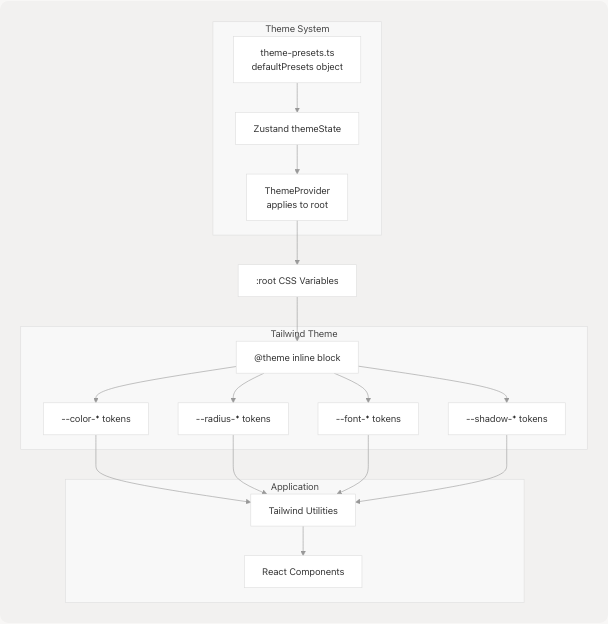

# Theme & Navigation Components

## Purpose and Scope

This document covers the navigation and theme-related UI components that provide the application shell and visual customization capabilities in JPortal. The navigation components (`Header` and `Navbar`) provide persistent UI for routing and user actions, while the theme components (`ThemeSelectorDialog`, `ThemeToggle`) enable visual customization.

For broader UI infrastructure, see [UI Components](5-ui-components). For the underlying theme system architecture including theme presets and Zustand store, see [Theme System](3.4-theme-system). For base Radix UI components, see [Base UI Components](5.3-base-ui-components).

---

## Navigation Component Architecture

### Component Hierarchy

**Navigation Component Structure**



---

## Header Component

The `Header` component provides the top navigation bar with branding and global actions.

### Component Structure

**Header Component Flow**


### Implementation Details

The `Header` component is defined in [jportal/src/components/Header.jsx8-40](https://github.com/codeblech/jportal/blob/4df0fde4/jportal/src/components/Header.jsx#L8-L40) It receives two state setters as props:

| Prop | Type | Purpose |
| --- | --- | --- |
| `setIsAuthenticated` | Function | Sets authentication state to false on logout |
| `setIsDemoMode` | Function | Optional setter to disable demo mode on logout |

**Key Features:**

1. **Branding**: Displays "JPortal" title at [jportal/src/components/Header.jsx25](https://github.com/codeblech/jportal/blob/4df0fde4/jportal/src/components/Header.jsx#L25-L25)
2. **Stats Navigation**: Links to `/stats` route for analytics dashboard at [jportal/src/components/Header.jsx27-31](https://github.com/codeblech/jportal/blob/4df0fde4/jportal/src/components/Header.jsx#L27-L31)
3. **Theme Selection**: Renders `ThemeSelectorDialog` at [jportal/src/components/Header.jsx32](https://github.com/codeblech/jportal/blob/4df0fde4/jportal/src/components/Header.jsx#L32-L32)
4. **Logout Functionality**: Clears stored credentials and navigates to login at [jportal/src/components/Header.jsx11-20](https://github.com/codeblech/jportal/blob/4df0fde4/jportal/src/components/Header.jsx#L11-L20)

### Logout Mechanism

The `handleLogout` function at [jportal/src/components/Header.jsx11-20](https://github.com/codeblech/jportal/blob/4df0fde4/jportal/src/components/Header.jsx#L11-L20) performs the following operations:

1. Removes `username`, `password`, and `attendanceData` from localStorage
2. Calls `setIsAuthenticated(false)` to trigger re-render of `App` component
3. Optionally calls `setIsDemoMode(false)` if provided
4. Navigates to `/login` route using React Router

---

## Navbar Component

The `Navbar` component provides bottom navigation with links to the five main feature modules.

### Navigation Configuration

**Navbar Route Structure**


### Implementation Details

The navigation items are defined as an array at [jportal/src/components/Navbar.jsx9-15](https://github.com/codeblech/jportal/blob/4df0fde4/jportal/src/components/Navbar.jsx#L9-L15):

```
const navItems = [
  { name: "ATTENDANCE", path: "/attendance", IconComponent: AttendanceIcon },
  { name: "  GRADES  ", path: "/grades", IconComponent: GradesIcon },
  { name: "  EXAMS", path: "/exams", IconComponent: ExamsIcon },
  { name: " SUBJECTS ", path: "/subjects", IconComponent: SubjectsIcon },
  { name: " PROFILE ", path: "/profile", IconComponent: ProfileIcon },
];
```

**Icon Integration:**

SVG icons are imported as React components using Vite's `?react` suffix at [jportal/src/components/Navbar.jsx2-6](https://github.com/codeblech/jportal/blob/4df0fde4/jportal/src/components/Navbar.jsx#L2-L6):

* `AttendanceIcon` from [jportal/public/icons/attendance.svg](https://github.com/codeblech/jportal/blob/4df0fde4/jportal/public/icons/attendance.svg)
* `GradesIcon` from [jportal/public/icons/grades.svg](https://github.com/codeblech/jportal/blob/4df0fde4/jportal/public/icons/grades.svg)
* `ExamsIcon` from [jportal/public/icons/exams.svg](https://github.com/codeblech/jportal/blob/4df0fde4/jportal/public/icons/exams.svg)
* `SubjectsIcon` from [jportal/public/icons/subjects1.svg](https://github.com/codeblech/jportal/blob/4df0fde4/jportal/public/icons/subjects1.svg)
* `ProfileIcon` from [jportal/public/icons/profile.svg](https://github.com/codeblech/jportal/blob/4df0fde4/jportal/public/icons/profile.svg)

### Active State Styling

The `NavLink` component from React Router provides `isActive` state at [jportal/src/components/Navbar.jsx20-44](https://github.com/codeblech/jportal/blob/4df0fde4/jportal/src/components/Navbar.jsx#L20-L44) Active links receive:

1. `opacity-100` (vs `opacity-70` for inactive)
2. `bg-primary` background on the icon container
3. `fill-primary-foreground` for the icon fill (vs `fill-muted-foreground`)

The component uses a fixed position at the bottom of the viewport with `fixed bottom-0 left-0` at [jportal/src/components/Navbar.jsx18](https://github.com/codeblech/jportal/blob/4df0fde4/jportal/src/components/Navbar.jsx#L18-L18)

---

## Theme Selector Dialog

The `ThemeSelectorDialog` component provides a comprehensive interface for theme customization with advanced interaction patterns.

### Component Architecture

**ThemeSelectorDialog Data Flow**


### Interaction Patterns

The component implements multiple interaction patterns using refs and event handlers:

| Interaction | Detection | Action | Implementation |
| --- | --- | --- | --- |
| Click | Mouse up within 500ms | Open dialog | [jportal/src/components/theme-selector-dialog.tsx78-86](https://github.com/codeblech/jportal/blob/4df0fde4/jportal/src/components/theme-selector-dialog.tsx#L78-L86) |
| Long Press | Hold for 500ms | Toggle light/dark mode | [jportal/src/components/theme-selector-dialog.tsx55-62](https://github.com/codeblech/jportal/blob/4df0fde4/jportal/src/components/theme-selector-dialog.tsx#L55-L62) |
| Swipe Left | deltaX < -50px | Next theme preset | [jportal/src/components/theme-selector-dialog.tsx125-128](https://github.com/codeblech/jportal/blob/4df0fde4/jportal/src/components/theme-selector-dialog.tsx#L125-L128) |
| Swipe Right | deltaX > 50px | Previous theme preset | [jportal/src/components/theme-selector-dialog.tsx122-125](https://github.com/codeblech/jportal/blob/4df0fde4/jportal/src/components/theme-selector-dialog.tsx#L122-L125) |
| Swipe Up | deltaY < -50px | Next theme preset | [jportal/src/components/theme-selector-dialog.tsx133-136](https://github.com/codeblech/jportal/blob/4df0fde4/jportal/src/components/theme-selector-dialog.tsx#L133-L136) |
| Swipe Down | deltaY > 50px | Previous theme preset | [jportal/src/components/theme-selector-dialog.tsx136-139](https://github.com/codeblech/jportal/blob/4df0fde4/jportal/src/components/theme-selector-dialog.tsx#L136-L139) |

### Event Handler Implementation

**Touch Event Flow:**



### State Management

The component uses multiple `useRef` hooks at [jportal/src/components/theme-selector-dialog.tsx21-24](https://github.com/codeblech/jportal/blob/4df0fde4/jportal/src/components/theme-selector-dialog.tsx#L21-L24) to track interaction state:

* `holdTimeoutRef`: Timeout ID for long press detection
* `isHoldingRef`: Flag to prevent dialog opening after theme toggle
* `touchStartRef`: Initial touch coordinates for swipe detection
* `hasSwipedRef`: Flag to prevent dialog opening after swipe

The `changeToTheme` function at [jportal/src/components/theme-selector-dialog.tsx29-41](https://github.com/codeblech/jportal/blob/4df0fde4/jportal/src/components/theme-selector-dialog.tsx#L29-L41) updates the Zustand theme store with both light and dark mode styles from the selected preset.

### Dialog Content Structure

The dialog renders at [jportal/src/components/theme-selector-dialog.tsx173-193](https://github.com/codeblech/jportal/blob/4df0fde4/jportal/src/components/theme-selector-dialog.tsx#L173-L193) with:

1. **Header**: Title and description (hidden on mobile)
2. **Mode Toggle Section**: Light/dark mode switch using `ThemeToggle` component
3. **Preset Selector Section**: Grid of theme preset cards using `ThemeSelector` component

The dialog uses Radix UI's `Dialog` component with responsive sizing: `max-w-4xl max-h-[80vh]` at [jportal/src/components/theme-selector-dialog.tsx173](https://github.com/codeblech/jportal/blob/4df0fde4/jportal/src/components/theme-selector-dialog.tsx#L173-L173)

---

## Theme Toggle Component

The `ThemeToggle` component provides a simple button to switch between light and dark modes with visual feedback.

### Component Flow

**ThemeToggle Interaction**



### Implementation

The component at [jportal/src/components/theme-toggle.tsx8-31](https://github.com/codeblech/jportal/blob/4df0fde4/jportal/src/components/theme-toggle.tsx#L8-L31) is a wrapper around the `Button` component from the UI library. Key features:

1. **Icon Switching**: Renders `Sun` or `Moon` icon based on current theme at [jportal/src/components/theme-toggle.tsx24-27](https://github.com/codeblech/jportal/blob/4df0fde4/jportal/src/components/theme-toggle.tsx#L24-L27)
2. **Click Coordinates**: Passes click position to `toggleTheme()` for view transition animation origin at [jportal/src/components/theme-toggle.tsx11-14](https://github.com/codeblech/jportal/blob/4df0fde4/jportal/src/components/theme-toggle.tsx#L11-L14)
3. **Props Forwarding**: Accepts all standard `Button` props via spread operator

The component uses CSS transitions defined in the `Sun` and `Moon` components:

* Light mode: `rotate-0 scale-100 dark:-rotate-90 dark:scale-0`
* Dark mode: `rotate-90 scale-0 dark:rotate-0 dark:scale-100`

---

## CSS Variables and Theme Tokens

The styling infrastructure uses CSS custom properties to enable dynamic theme switching.

### Variable Mapping Architecture

**CSS Variable System**



### Shadcn Design Token Mapping

The `@theme inline` block at [jportal/src/index.css7-88](https://github.com/codeblech/jportal/blob/4df0fde4/jportal/src/index.css#L7-L88) maps root CSS variables to Tailwind theme tokens:

**Color Tokens:**

| Tailwind Token | CSS Variable | Purpose |
| --- | --- | --- |
| `--color-background` | `var(--background)` | Main background color |
| `--color-foreground` | `var(--foreground)` | Main text color |
| `--color-primary` | `var(--primary)` | Primary brand color |
| `--color-primary-foreground` | `var(--primary-foreground)` | Text on primary background |
| `--color-card` | `var(--card)` | Card background |
| `--color-muted` | `var(--muted)` | Muted background |
| `--color-accent` | `var(--accent)` | Accent color |
| `--color-destructive` | `var(--destructive)` | Error/destructive actions |

**Radius Tokens:**

Defined at [jportal/src/index.css60-63](https://github.com/codeblech/jportal/blob/4df0fde4/jportal/src/index.css#L60-L63):

* `--radius-sm`: `calc(var(--radius) - 4px)`
* `--radius-md`: `calc(var(--radius) - 2px)`
* `--radius-lg`: `var(--radius)`
* `--radius-xl`: `calc(var(--radius) + 4px)`

**Font Tokens:**

Defined at [jportal/src/index.css56-58](https://github.com/codeblech/jportal/blob/4df0fde4/jportal/src/index.css#L56-L58):

* `--font-sans`: Sans-serif font stack
* `--font-mono`: Monospace font stack
* `--font-serif`: Serif font stack

### Custom JPortal Color Tokens

Application-specific colors for grades and marks at [jportal/src/index.css74-88](https://github.com/codeblech/jportal/blob/4df0fde4/jportal/src/index.css#L74-L88):

**Grade Colors:**

| Token | Default HSL | Usage |
| --- | --- | --- |
| `--color-grade-aa` | `hsl(142 76% 36%)` | AA grade display |
| `--color-grade-a` | `hsl(120 60% 50%)` | A grade display |
| `--color-grade-bb` | `hsl(60 90% 60%)` | B+ grade display |
| `--color-grade-b` | `hsl(45 90% 60%)` | B grade display |
| `--color-grade-f` | `hsl(0 84.2% 60.2%)` | F grade display |

**Marks Colors:**

| Token | Purpose |
| --- | --- |
| `--color-marks-outstanding` | Marks >= 90% |
| `--color-marks-good` | Marks 70-89% |
| `--color-marks-average` | Marks 50-69% |
| `--color-marks-poor` | Marks < 50% |

---

## View Transition Animations

The theme system uses the View Transitions API for smooth light/dark mode switching with circular reveal animations.

### Animation Implementation

**View Transition Flow**


### CSS Animation Definition

The animation is defined at [jportal/src/index.css163-189](https://github.com/codeblech/jportal/blob/4df0fde4/jportal/src/index.css#L163-L189) using the `@supports` feature query:

**Keyframes:**

1. **Expand Animation** (new state) at [jportal/src/index.css178-182](https://github.com/codeblech/jportal/blob/4df0fde4/jportal/src/index.css#L178-L182):

   * Starts with `clip-path: circle(0 at var(--x, 50%) var(--y, 50%))`
   * Ends with `clip-path: circle(100vmax at var(--x, 50%) var(--y, 50%))`
2. **Shrink Animation** (old state) at [jportal/src/index.css184-188](https://github.com/codeblech/jportal/blob/4df0fde4/jportal/src/index.css#L184-L188):

   * Ends with `clip-path: circle(0 at var(--x, 50%) var(--y, 50%))`

The animations run for `1s` duration as specified at [jportal/src/index.css165-167](https://github.com/codeblech/jportal/blob/4df0fde4/jportal/src/index.css#L165-L167)

**Fallback Behavior:**

If View Transitions API is not supported, the browser falls back to instant theme switching without animation. The feature detection uses `@supports (view-transition-name: none)` at [jportal/src/index.css163](https://github.com/codeblech/jportal/blob/4df0fde4/jportal/src/index.css#L163-L163)

---

## Global Styling Utilities

### Base Layer Styles

Defined at [jportal/src/index.css196-204](https://github.com/codeblech/jportal/blob/4df0fde4/jportal/src/index.css#L196-L204):

**Universal Styles:**

* All elements receive `border-border` color
* Ring offset width forced to `0px` to prevent outline spacing issues

**Body Styles:**

* Background: `bg-background` Tailwind utility
* Text: `text-foreground` Tailwind utility

### Scrollbar Hiding

The application hides scrollbars globally at [jportal/src/index.css206-239](https://github.com/codeblech/jportal/blob/4df0fde4/jportal/src/index.css#L206-L239) while maintaining scroll functionality:

**Implementation:**

* Chrome/Safari/Opera: `::-webkit-scrollbar { display: none; }`
* Firefox: `scrollbar-width: none;`
* IE/Edge: `-ms-overflow-style: none;`

Applied to:

1. All elements (utility layer) at [jportal/src/index.css207-214](https://github.com/codeblech/jportal/blob/4df0fde4/jportal/src/index.css#L207-L214)
2. `.overflow-y-auto` class at [jportal/src/index.css231-239](https://github.com/codeblech/jportal/blob/4df0fde4/jportal/src/index.css#L231-L239)

### Snap Scrolling Utilities

Custom utilities for smooth scroll snapping at [jportal/src/index.css217-228](https://github.com/codeblech/jportal/blob/4df0fde4/jportal/src/index.css#L217-L228):

| Class | CSS Property | Value |
| --- | --- | --- |
| `.snap-y` | `scroll-behavior` | `smooth` |
| `.snap-mandatory` | `scroll-snap-type` | `y mandatory` |
| `.snap-start` | `scroll-snap-align` | `start` |

---

## Component Integration Summary

**Navigation and Theme Component Relationships**


