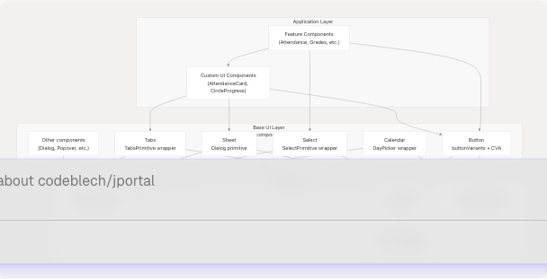
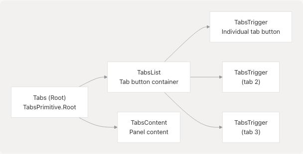

# Base UI Components

> Source: https://deepwiki.com/codeblech/jportal/5.3-base-ui-components

# Base UI Components

Relevant source files

* [jportal/src/components/Navbar.jsx](https://github.com/codeblech/jportal/blob/4df0fde4/jportal/src/components/Navbar.jsx)
* [jportal/src/components/Profile.jsx](https://github.com/codeblech/jportal/blob/4df0fde4/jportal/src/components/Profile.jsx)
* [jportal/src/components/ui/calendar.jsx](https://github.com/codeblech/jportal/blob/4df0fde4/jportal/src/components/ui/calendar.jsx)
* [jportal/src/components/ui/select.jsx](https://github.com/codeblech/jportal/blob/4df0fde4/jportal/src/components/ui/select.jsx)
* [jportal/src/components/ui/sheet.jsx](https://github.com/codeblech/jportal/blob/4df0fde4/jportal/src/components/ui/sheet.jsx)
* [jportal/src/components/ui/tabs.jsx](https://github.com/codeblech/jportal/blob/4df0fde4/jportal/src/components/ui/tabs.jsx)
* [jportal/src/index.css](https://github.com/codeblech/jportal/blob/4df0fde4/jportal/src/index.css)

## Purpose and Scope

This document covers the foundational UI components in JPortal that are built as thin wrappers around **Radix UI primitives**. These components provide accessible, themeable, and reusable building blocks for the entire application. They are located in [src/components/ui/](https://github.com/codeblech/jportal/blob/4df0fde4/src/components/ui/) and serve as the base layer upon which custom feature components are constructed.

For custom components built for specific features (e.g., `AttendanceCard`, `MarksCard`), see [Custom Feature Components](/codeblech/jportal/5.1-custom-feature-components). For navigation and theme-related components (e.g., `Header`, `Navbar`, `ThemeSelector`), see [Theme & Navigation Components](/codeblech/jportal/5.2-theme-and-navigation-components). For information about the styling system, CSS variables, and Tailwind configuration, see [Styling System](/codeblech/jportal/5.4-styling-system).

---

## Architecture Overview

The base UI components follow a consistent architecture pattern where **Radix UI unstyled primitives** are wrapped with **Tailwind CSS utilities** and **Class Variance Authority (CVA)** for variant management. This approach provides:

* **Accessibility**: Radix UI handles ARIA attributes, keyboard navigation, and focus management
* **Flexibility**: Components accept `className` props for customization
* **Consistency**: All components integrate with the theme system via CSS custom properties
* **Type Safety**: TypeScript definitions with proper prop forwarding

### Component Layer Architecture


```

**Sources**: [src/components/ui/calendar.jsx](https://github.com/codeblech/jportal/blob/4df0fde4/src/components/ui/calendar.jsx) [src/components/ui/select.jsx](https://github.com/codeblech/jportal/blob/4df0fde4/src/components/ui/select.jsx) [src/components/ui/sheet.jsx](https://github.com/codeblech/jportal/blob/4df0fde4/src/components/ui/sheet.jsx) [src/components/ui/tabs.jsx](https://github.com/codeblech/jportal/blob/4df0fde4/src/components/ui/tabs.jsx)

---

## Common Component Patterns

All base UI components in [src/components/ui/](https://github.com/codeblech/jportal/blob/4df0fde4/src/components/ui/) follow consistent patterns:

### Forwarded Refs Pattern

Every component uses `React.forwardRef` to properly forward refs to the underlying DOM element or Radix primitive:

```
```
const Component = React.forwardRef(({ className, ...props }, ref) => (
  <RadixPrimitive.Component ref={ref} {...props} />
))
Component.displayName = RadixPrimitive.Component.displayName
```
```

This pattern is used in:

* [src/components/ui/calendar.jsx8-59](https://github.com/codeblech/jportal/blob/4df0fde4/src/components/ui/calendar.jsx#L8-L59)
* [src/components/ui/select.jsx13-28](https://github.com/codeblech/jportal/blob/4df0fde4/src/components/ui/select.jsx#L13-L28)
* [src/components/ui/sheet.jsx16-24](https://github.com/codeblech/jportal/blob/4df0fde4/src/components/ui/sheet.jsx#L16-L24)
* [src/components/ui/tabs.jsx8-16](https://github.com/codeblech/jportal/blob/4df0fde4/src/components/ui/tabs.jsx#L8-L16)

### className Merging with cn() Utility

All components accept a `className` prop that is merged with default styles using the `cn()` utility from [src/lib/utils](https://github.com/codeblech/jportal/blob/4df0fde4/src/lib/utils):

| Component | Base Classes | Merge Location |
| --- | --- | --- |
| `SelectTrigger` | `flex h-10 w-full items-center...` | [src/components/ui/select.jsx16-18](https://github.com/codeblech/jportal/blob/4df0fde4/src/components/ui/select.jsx#L16-L18) |
| `SheetOverlay` | `fixed inset-0 z-50 bg-black/80...` | [src/components/ui/sheet.jsx18-20](https://github.com/codeblech/jportal/blob/4df0fde4/src/components/ui/sheet.jsx#L18-L20) |
| `TabsList` | `inline-flex h-10 items-center...` | [src/components/ui/tabs.jsx11-13](https://github.com/codeblech/jportal/blob/4df0fde4/src/components/ui/tabs.jsx#L11-L13) |
| `Calendar` | `p-3` | [src/components/ui/calendar.jsx17](https://github.com/codeblech/jportal/blob/4df0fde4/src/components/ui/calendar.jsx#L17-L17) |

### Theme Integration via CSS Variables

All components reference CSS custom properties defined in [src/index.css7-88](https://github.com/codeblech/jportal/blob/4df0fde4/src/index.css#L7-L88) These variables are dynamically set by the theme system:

```
--color-background, --color-foreground
--color-primary, --color-primary-foreground
--color-muted, --color-muted-foreground
--color-accent, --color-accent-foreground
--color-border, --color-input, --color-ring
--radius-sm, --radius-md, --radius-lg
```

Components reference these via Tailwind utilities like `bg-background`, `text-foreground`, `border-input`, etc.

**Sources**: [src/index.css7-88](https://github.com/codeblech/jportal/blob/4df0fde4/src/index.css#L7-L88) [src/components/ui/select.jsx](https://github.com/codeblech/jportal/blob/4df0fde4/src/components/ui/select.jsx) [src/components/ui/sheet.jsx](https://github.com/codeblech/jportal/blob/4df0fde4/src/components/ui/sheet.jsx) [src/components/ui/tabs.jsx](https://github.com/codeblech/jportal/blob/4df0fde4/src/components/ui/tabs.jsx)

---

## Component Catalog

### Calendar Component

The `Calendar` component wraps the `react-day-picker` library with custom Radix-styled navigation and day cells.

#### Component Structure

```

```

#### Key Features

| Feature | Implementation | Location |
| --- | --- | --- |
| Navigation Icons | `lucide-react` ChevronLeft/ChevronRight | [src/components/ui/calendar.jsx53-54](https://github.com/codeblech/jportal/blob/4df0fde4/src/components/ui/calendar.jsx#L53-L54) |
| Button Styling | Reuses `buttonVariants` from Button component | [src/components/ui/calendar.jsx25](https://github.com/codeblech/jportal/blob/4df0fde4/src/components/ui/calendar.jsx#L25-L25) |
| Selected Day | `bg-primary text-primary-foreground` | [src/components/ui/calendar.jsx41-42](https://github.com/codeblech/jportal/blob/4df0fde4/src/components/ui/calendar.jsx#L41-L42) |
| Today Indicator | `bg-accent text-accent-foreground` | [src/components/ui/calendar.jsx43](https://github.com/codeblech/jportal/blob/4df0fde4/src/components/ui/calendar.jsx#L43-L43) |
| Outside Days | Configurable via `showOutsideDays` prop | [src/components/ui/calendar.jsx11](https://github.com/codeblech/jportal/blob/4df0fde4/src/components/ui/calendar.jsx#L11-L11) |

#### Styling Classes

The Calendar component defines extensive `classNames` for different parts of the day picker:

* **Layout**: `months`, `month`, `caption`, `nav`, `table`, `head_row`, `row`, `cell`
* **Interactive elements**: `nav_button`, `nav_button_previous`, `nav_button_next`, `day`
* **States**: `day_selected`, `day_today`, `day_outside`, `day_disabled`, `day_range_middle`

All classes are defined in [src/components/ui/calendar.jsx18-51](https://github.com/codeblech/jportal/blob/4df0fde4/src/components/ui/calendar.jsx#L18-L51)

**Sources**: [src/components/ui/calendar.jsx](https://github.com/codeblech/jportal/blob/4df0fde4/src/components/ui/calendar.jsx)

---

### Select Component

The `Select` component provides a dropdown selection interface with search and keyboard navigation support. It exports multiple sub-components that compose the complete select experience.

#### Component Composition

```

```

#### Exported Components

| Component | Radix Primitive | Purpose | Location |
| --- | --- | --- | --- |
| `Select` | `SelectPrimitive.Root` | Root container | [src/components/ui/select.jsx7](https://github.com/codeblech/jportal/blob/4df0fde4/src/components/ui/select.jsx#L7-L7) |
| `SelectGroup` | `SelectPrimitive.Group` | Group related items | [src/components/ui/select.jsx9](https://github.com/codeblech/jportal/blob/4df0fde4/src/components/ui/select.jsx#L9-L9) |
| `SelectValue` | `SelectPrimitive.Value` | Display selected value | [src/components/ui/select.jsx11](https://github.com/codeblech/jportal/blob/4df0fde4/src/components/ui/select.jsx#L11-L11) |
| `SelectTrigger` | `SelectPrimitive.Trigger` | Clickable trigger button | [src/components/ui/select.jsx13-28](https://github.com/codeblech/jportal/blob/4df0fde4/src/components/ui/select.jsx#L13-L28) |
| `SelectContent` | `SelectPrimitive.Content` | Dropdown content portal | [src/components/ui/select.jsx52-78](https://github.com/codeblech/jportal/blob/4df0fde4/src/components/ui/select.jsx#L52-L78) |
| `SelectLabel` | `SelectPrimitive.Label` | Group label text | [src/components/ui/select.jsx80-83](https://github.com/codeblech/jportal/blob/4df0fde4/src/components/ui/select.jsx#L80-L83) |
| `SelectItem` | `SelectPrimitive.Item` | Individual selectable item | [src/components/ui/select.jsx85-103](https://github.com/codeblech/jportal/blob/4df0fde4/src/components/ui/select.jsx#L85-L103) |
| `SelectSeparator` | `SelectPrimitive.Separator` | Visual divider | [src/components/ui/select.jsx105-108](https://github.com/codeblech/jportal/blob/4df0fde4/src/components/ui/select.jsx#L105-L108) |
| `SelectScrollUpButton` | `SelectPrimitive.ScrollUpButton` | Scroll up indicator | [src/components/ui/select.jsx30-39](https://github.com/codeblech/jportal/blob/4df0fde4/src/components/ui/select.jsx#L30-L39) |
| `SelectScrollDownButton` | `SelectPrimitive.ScrollDownButton` | Scroll down indicator | [src/components/ui/select.jsx41-50](https://github.com/codeblech/jportal/blob/4df0fde4/src/components/ui/select.jsx#L41-L50) |

#### Key Features

**Trigger Styling** [src/components/ui/select.jsx16-18](https://github.com/codeblech/jportal/blob/4df0fde4/src/components/ui/select.jsx#L16-L18):

* Full-width flex container with space-between justification
* Includes focus ring with `focus:ring-2 focus:ring-ring`
* ChevronDown icon that cannot shrink (`shrink-0 ml-2`)
* Text truncation and line-clamping for selected value

**Content Positioning** [src/components/ui/select.jsx52-63](https://github.com/codeblech/jportal/blob/4df0fde4/src/components/ui/select.jsx#L52-L63):

* Uses `SelectPrimitive.Portal` for proper z-index layering
* Supports `position="popper"` for positioning relative to trigger
* Maximum height of `max-h-96` with scroll
* Responsive width: `max-w-[var(--radix-select-trigger-width)]`

**Item Selection Indicator** [src/components/ui/select.jsx94-98](https://github.com/codeblech/jportal/blob/4df0fde4/src/components/ui/select.jsx#L94-L98):

* Check icon positioned absolutely at left
* Only visible when item is selected via `SelectPrimitive.ItemIndicator`
* Item text uses `truncate` to handle overflow

#### Usage in JPortal

The Select component is used extensively throughout JPortal for:

* Semester selection in Attendance, Grades, Exams, and Subjects modules
* Event type selection in Exams module
* Theme preset selection in ThemeSelector

**Sources**: [src/components/ui/select.jsx](https://github.com/codeblech/jportal/blob/4df0fde4/src/components/ui/select.jsx)

---

### Sheet Component

The `Sheet` component provides a slide-in panel (also known as drawer or sidebar) built on top of `@radix-ui/react-dialog`. It supports four directional slides and includes overlay, header, and footer compositions.

#### Component Architecture

```

```

#### Side Variants with CVA

The `SheetContent` uses **Class Variance Authority (CVA)** to define four directional variants [src/components/ui/sheet.jsx27-44](https://github.com/codeblech/jportal/blob/4df0fde4/src/components/ui/sheet.jsx#L27-L44):

| Side | Position | Slide Animation | Width/Height | Border |
| --- | --- | --- | --- | --- |
| `top` | `inset-x-0 top-0` | `slide-out-to-top` / `slide-in-from-top` | Full width | `border-b` |
| `bottom` | `inset-x-0 bottom-0` | `slide-out-to-bottom` / `slide-in-from-bottom` | Full width | `border-t` |
| `left` | `inset-y-0 left-0` | `slide-out-to-left` / `slide-in-from-left` | `w-3/4 sm:max-w-sm` | `border-r` |
| `right` (default) | `inset-y-0 right-0` | `slide-out-to-right` / `slide-in-from-right` | `w-3/4 sm:max-w-sm` | `border-l` |

#### Animation and Transitions

The sheet uses data-state attributes for animations:

* `data-[state=open]:animate-in` with fade and slide effects
* `data-[state=closed]:animate-out` with reversed animations
* Duration: 300ms close, 500ms open [src/components/ui/sheet.jsx28](https://github.com/codeblech/jportal/blob/4df0fde4/src/components/ui/sheet.jsx#L28-L28)

#### Overlay Styling

The overlay [src/components/ui/sheet.jsx16-24](https://github.com/codeblech/jportal/blob/4df0fde4/src/components/ui/sheet.jsx#L16-L24) provides:

* Fixed fullscreen positioning: `fixed inset-0 z-50`
* Semi-transparent black backdrop: `bg-black/80`
* Fade animations on open/close
* Z-index of 50 to appear above most content

#### Close Button Integration

The `SheetContent` automatically includes a close button [src/components/ui/sheet.jsx51-55](https://github.com/codeblech/jportal/blob/4df0fde4/src/components/ui/sheet.jsx#L51-L55):

* Positioned absolutely at `right-4 top-4`
* Uses `lucide-react` X icon
* Includes screen reader text "Close"
* Styled with opacity changes on hover and ring on focus

**Sources**: [src/components/ui/sheet.jsx](https://github.com/codeblech/jportal/blob/4df0fde4/src/components/ui/sheet.jsx)

---

### Tabs Component

The `Tabs` component provides a tabbed interface for organizing content into sections. It wraps `@radix-ui/react-tabs` with consistent styling.

#### Component Composition

```

```

#### Component Details

| Component | Styling | Active State | Location |
| --- | --- | --- | --- |
| `TabsList` | `inline-flex h-10 items-center justify-center rounded-md bg-muted p-1` | N/A | [src/components/ui/tabs.jsx8-16](https://github.com/codeblech/jportal/blob/4df0fde4/src/components/ui/tabs.jsx#L8-L16) |
| `TabsTrigger` | `inline-flex items-center justify-center whitespace-nowrap rounded-sm px-3 py-1.5` | `data-[state=active]:bg-background data-[state=active]:text-foreground data-[state=active]:shadow-xs` | [src/components/ui/tabs.jsx19-27](https://github.com/codeblech/jportal/blob/4df0fde4/src/components/ui/tabs.jsx#L19-L27) |
| `TabsContent` | `mt-2 ring-offset-background` | N/A | [src/components/ui/tabs.jsx30-38](https://github.com/codeblech/jportal/blob/4df0fde4/src/components/ui/tabs.jsx#L30-L38) |

#### Active Tab Styling

When a tab is active (`data-[state=active]`):

* Background changes from `muted` to `background`
* Text color changes to `foreground`
* Shadow appears: `shadow-xs` (defined in [src/index.css66](https://github.com/codeblech/jportal/blob/4df0fde4/src/index.css#L66-L66))

This creates a visual effect where the active tab appears to "pop out" from the muted tab list background.

#### Accessibility Features

Built-in from Radix UI:

* Automatic ARIA attributes (`role="tablist"`, `aria-selected`, etc.)
* Keyboard navigation (arrow keys to switch tabs)
* Focus management with visible focus ring: `focus-visible:ring-2 focus-visible:ring-ring`

#### Usage in JPortal

The Tabs component is used in the **Attendance module** to switch between:

* "Overview" tab: Shows overall attendance with semester selection
* "Daily" tab: Shows daily attendance records

See [Attendance Module](/codeblech/jportal/4.1-attendance-module) for implementation details.

**Sources**: [src/components/ui/tabs.jsx](https://github.com/codeblech/jportal/blob/4df0fde4/src/components/ui/tabs.jsx)

---

## Button Component Reference

While not included in the provided files, the `Button` component is referenced by other base components and is a critical part of the UI system. It is located at [src/components/ui/button.jsx](https://github.com/codeblech/jportal/blob/4df0fde4/src/components/ui/button.jsx) and exports:

* **`Button`**: The main button component
* **`buttonVariants`**: CVA-based variant function used by Calendar and other components

The `buttonVariants` function is referenced in:

* [src/components/ui/calendar.jsx6](https://github.com/codeblech/jportal/blob/4df0fde4/src/components/ui/calendar.jsx#L6-L6) - Import statement
* [src/components/ui/calendar.jsx25](https://github.com/codeblech/jportal/blob/4df0fde4/src/components/ui/calendar.jsx#L25-L25) - Used for navigation buttons
* [src/components/ui/calendar.jsx37](https://github.com/codeblech/jportal/blob/4df0fde4/src/components/ui/calendar.jsx#L37-L37) - Used for day cells

This demonstrates the composability of base components, where variant definitions are shared across components.

**Sources**: [src/components/ui/calendar.jsx6](https://github.com/codeblech/jportal/blob/4df0fde4/src/components/ui/calendar.jsx#L6-L6) [src/components/ui/calendar.jsx25](https://github.com/codeblech/jportal/blob/4df0fde4/src/components/ui/calendar.jsx#L25-L25) [src/components/ui/calendar.jsx37](https://github.com/codeblech/jportal/blob/4df0fde4/src/components/ui/calendar.jsx#L37-L37)

---

## Styling Integration

### Tailwind CSS Utilities

All base UI components use Tailwind CSS utility classes extensively. The Tailwind configuration reads CSS custom properties defined in [src/index.css7-88](https://github.com/codeblech/jportal/blob/4df0fde4/src/index.css#L7-L88):

```
@theme inline {
  --color-background: var(--background);
  --color-foreground: var(--foreground);
  --color-primary: var(--primary);
  /* ... etc */
}
```

This allows components to use utilities like:

* `bg-background`, `text-foreground`
* `bg-primary`, `text-primary-foreground`
* `border-input`, `ring-ring`
* `bg-muted`, `text-muted-foreground`

Which automatically respond to theme changes without component code modifications.

### Animation Classes

Components use Tailwind animation utilities from the `tailwindcss-animate` plugin [src/index.css3](https://github.com/codeblech/jportal/blob/4df0fde4/src/index.css#L3-L3):

| Animation | Usage | Example |
| --- | --- | --- |
| `animate-in` / `animate-out` | Entry/exit animations | Sheet, Select content |
| `fade-in-0` / `fade-out-0` | Opacity transitions | Overlays |
| `zoom-in-95` / `zoom-out-95` | Scale transitions | Select dropdown |
| `slide-in-from-*` / `slide-out-to-*` | Directional slides | Sheet panels |

These are applied using Radix UI's data-state attributes, e.g., `data-[state=open]:animate-in`.

### Responsive Design

Base components implement responsive behavior using Tailwind breakpoints:

| Component | Responsive Feature | Implementation |
| --- | --- | --- |
| `Sheet` | Width constraint on desktop | `sm:max-w-sm` ([src/components/ui/sheet.jsx35](https://github.com/codeblech/jportal/blob/4df0fde4/src/components/ui/sheet.jsx#L35-L35)) |
| `Calendar` | Flexible month layout | `flex-col sm:flex-row` ([src/components/ui/calendar.jsx19](https://github.com/codeblech/jportal/blob/4df0fde4/src/components/ui/calendar.jsx#L19-L19)) |
| `SheetHeader` | Text alignment | `text-center sm:text-left` ([src/components/ui/sheet.jsx66](https://github.com/codeblech/jportal/blob/4df0fde4/src/components/ui/sheet.jsx#L66-L66)) |
| `SheetFooter` | Flex direction | `flex-col-reverse sm:flex-row` ([src/components/ui/sheet.jsx76](https://github.com/codeblech/jportal/blob/4df0fde4/src/components/ui/sheet.jsx#L76-L76)) |

**Sources**: [src/index.css](https://github.com/codeblech/jportal/blob/4df0fde4/src/index.css) [src/components/ui/sheet.jsx](https://github.com/codeblech/jportal/blob/4df0fde4/src/components/ui/sheet.jsx) [src/components/ui/calendar.jsx](https://github.com/codeblech/jportal/blob/4df0fde4/src/components/ui/calendar.jsx) [src/components/ui/select.jsx](https://github.com/codeblech/jportal/blob/4df0fde4/src/components/ui/select.jsx)

---

## Other Base Components

While this document focuses on the provided component files, the [src/components/ui/](https://github.com/codeblech/jportal/blob/4df0fde4/src/components/ui/) directory contains additional base components following the same patterns:

* **Dialog**: Modal overlays (used by Sheet internally via `@radix-ui/react-dialog`)
* **Popover**: Floating content containers
* **Dropdown Menu**: Context menus and dropdowns
* **Tooltip**: Hover information displays
* **Input**: Text input fields
* **Textarea**: Multi-line text inputs
* **Checkbox**: Toggle inputs
* **Radio Group**: Single-choice selection
* **Switch**: Toggle switches
* **Slider**: Range inputs
* **Card**: Content containers
* **Badge**: Status indicators
* **Avatar**: User image displays
* **Separator**: Horizontal/vertical dividers
* **Skeleton**: Loading placeholders

All follow the same architectural patterns described in [Common Component Patterns](https://github.com/codeblech/jportal/blob/4df0fde4/Common Component Patterns)

**Sources**: Inferred from [Component Layer Architecture](https://github.com/codeblech/jportal/blob/4df0fde4/Component Layer Architecture) diagram and common Radix UI + Shadcn/ui patterns

---

## Integration with Feature Modules

Base UI components are consumed throughout JPortal's feature modules:

```


### Example: Profile Module Button Usage

The Profile module imports and uses the Button component [src/components/Profile.jsx3](https://github.com/codeblech/jportal/blob/4df0fde4/src/components/Profile.jsx#L3-L3):

```
```
import { Button } from "@/components/ui/button";
```
```

This demonstrates how feature modules depend on base UI components for consistent interaction patterns.

### Example: Navbar Component Integration

While Navbar is covered in [Theme & Navigation Components](/codeblech/jportal/5.2-theme-and-navigation-components), it demonstrates composition patterns by using navigation features that could leverage Sheet for mobile menus or Popover for dropdowns.

**Sources**: [src/components/Profile.jsx3](https://github.com/codeblech/jportal/blob/4df0fde4/src/components/Profile.jsx#L3-L3) [src/components/Navbar.jsx](https://github.com/codeblech/jportal/blob/4df0fde4/src/components/Navbar.jsx)