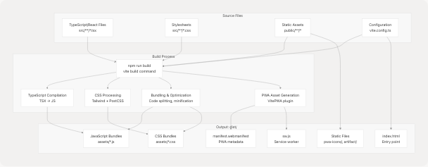
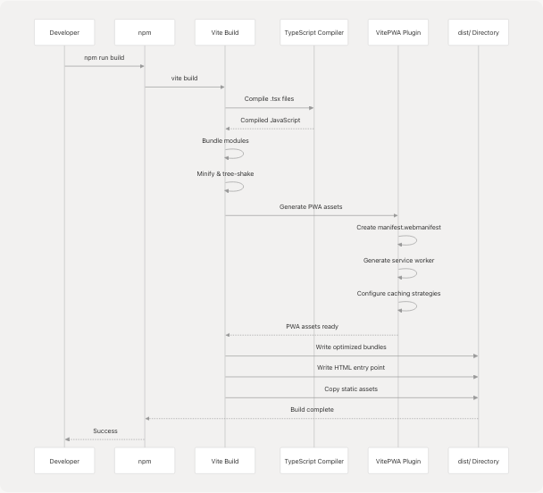

# Build & Deployment

> Source: https://deepwiki.com/codeblech/jportal/6-build-and-deployment

# Build & Deployment

Relevant source files

* [.gitignore](https://github.com/codeblech/jportal/blob/4df0fde4/.gitignore)
* [helpful.md](https://github.com/codeblech/jportal/blob/4df0fde4/helpful.md)
* [jportal/index.html](https://github.com/codeblech/jportal/blob/4df0fde4/jportal/index.html)
* [jportal/package-lock.json](https://github.com/codeblech/jportal/blob/4df0fde4/jportal/package-lock.json)
* [jportal/package.json](https://github.com/codeblech/jportal/blob/4df0fde4/jportal/package.json)
* [jportal/public/pwa-icons/j-yuvraj.svg](https://github.com/codeblech/jportal/blob/4df0fde4/jportal/public/pwa-icons/j-yuvraj.svg)
* [jportal/src/components/DynamicFontLoader.tsx](https://github.com/codeblech/jportal/blob/4df0fde4/jportal/src/components/DynamicFontLoader.tsx)
* [jportal/src/utils/fonts.ts](https://github.com/codeblech/jportal/blob/4df0fde4/jportal/src/utils/fonts.ts)
* [jportal/vite.config.ts](https://github.com/codeblech/jportal/blob/4df0fde4/jportal/vite.config.ts)

This document covers the build pipeline, production optimization, Progressive Web App (PWA) configuration, and deployment process for JPortal. It explains how source code is transformed into production-ready assets and deployed to GitHub Pages.

For detailed information about PWA-specific features like service workers, offline caching, and installation capabilities, see [PWA Configuration](/codeblech/jportal/6.1-pwa-configuration). For development commands, local testing, and contribution workflows, see [Development Workflow](/codeblech/jportal/6.2-development-workflow).

---

## Build System Architecture

JPortal uses **Vite** as its build tool, providing fast development server startup, Hot Module Replacement (HMR), and optimized production builds. The build system is configured via `vite.config.ts` and integrates with TypeScript, React, and PWA tooling.

**Sources:** [jportal/vite.config.ts1-100](https://github.com/codeblech/jportal/blob/4df0fde4/jportal/vite.config.ts#L1-L100) [jportal/package.json1-67](https://github.com/codeblech/jportal/blob/4df0fde4/jportal/package.json#L1-L67)

### Build Tool Stack

| Tool | Purpose | Configuration |
| --- | --- | --- |
| **Vite** | Build tool and dev server | `vite.config.ts` |
| **TypeScript** | Type checking and compilation | `tsconfig.json` |
| **ESLint** | Code linting | `eslint.config.js` |
| **PostCSS** | CSS processing | Tailwind CSS integration |
| **Tailwind CSS** | Utility-first CSS framework | `tailwind.config.ts` |
| **VitePWA Plugin** | Progressive Web App generation | `vite.config.ts` VitePWA block |
| **SVGR Plugin** | SVG to React component conversion | `vite-plugin-svgr` |

**Sources:** [jportal/package.json45-65](https://github.com/codeblech/jportal/blob/4df0fde4/jportal/package.json#L45-L65) [jportal/vite.config.ts14-74](https://github.com/codeblech/jportal/blob/4df0fde4/jportal/vite.config.ts#L14-L74)

---

## Build Pipeline Flow


```

**Sources:** [jportal/vite.config.ts9-99](https://github.com/codeblech/jportal/blob/4df0fde4/jportal/vite.config.ts#L9-L99) [jportal/package.json8-13](https://github.com/codeblech/jportal/blob/4df0fde4/jportal/package.json#L8-L13)

---

## NPM Scripts

The build and deployment process is orchestrated through npm scripts defined in `package.json`:

| Script | Command | Purpose |
| --- | --- | --- |
| `dev` | `vite` | Start Vite development server with HMR |
| `build` | `vite build` | Create production build in `dist/` directory |
| `lint` | `eslint .` | Run ESLint on codebase |
| `preview` | `vite preview` | Preview production build locally |
| `predeploy` | `npm run build` | Hook that runs before `deploy` to ensure fresh build |
| `deploy` | `gh-pages -d dist` | Deploy `dist/` folder to GitHub Pages |

**Sources:** [jportal/package.json7-13](https://github.com/codeblech/jportal/blob/4df0fde4/jportal/package.json#L7-L13)

### Build Command Execution

```

```

**Sources:** [jportal/package.json9](https://github.com/codeblech/jportal/blob/4df0fde4/jportal/package.json#L9-L9) [jportal/vite.config.ts1-99](https://github.com/codeblech/jportal/blob/4df0fde4/jportal/vite.config.ts#L1-L99)

---

## Vite Configuration

The core build configuration is defined in `vite.config.ts`. Key settings include:

### Base Configuration

```
```
// Base path for deployed application
base: "/jportal/"
```
```

This sets the base URL for the deployed application on GitHub Pages. All asset paths are prefixed with `/jportal/`.

**Sources:** [jportal/vite.config.ts13](https://github.com/codeblech/jportal/blob/4df0fde4/jportal/vite.config.ts#L13-L13) [jportal/package.json6](https://github.com/codeblech/jportal/blob/4df0fde4/jportal/package.json#L6-L6)

### Plugins

| Plugin | Purpose | Key Configuration |
| --- | --- | --- |
| `@vitejs/plugin-react` | React Fast Refresh and JSX transformation | Default configuration |
| `vite-plugin-svgr` | Import SVGs as React components | Default configuration |
| `vite-plugin-pwa` | PWA manifest and service worker generation | Extensive configuration (see [#6.1](/codeblech/jportal/6.1-pwa-configuration)) |

**Sources:** [jportal/vite.config.ts14-74](https://github.com/codeblech/jportal/blob/4df0fde4/jportal/vite.config.ts#L14-L74)

### Path Aliases

```
```
resolve: {
  alias: {
    "@": path.resolve(__dirname, "./src")
  }
}
```
```

This allows imports like `import { Button } from "@/components/ui/button"` instead of relative paths.

**Sources:** [jportal/vite.config.ts75-79](https://github.com/codeblech/jportal/blob/4df0fde4/jportal/vite.config.ts#L75-L79)

### Development Server Proxy

The dev server includes a proxy configuration for Cloudflare Analytics API:

```
```
server: {
  proxy: {
    "/api/cloudflare": {
      target: "https://api.cloudflare.com",
      changeOrigin: true,
      rewrite: (path) => path.replace(/^\/api\/cloudflare/, ""),
      configure: (proxy, options) => {
        proxy.on("proxyReq", (proxyReq, req, res) => {
          const token = env.VITE_CLOUDFLARE_API_TOKEN;
          if (token) {
            proxyReq.setHeader("Authorization", `Bearer ${token}`);
          }
        });
      }
    }
  }
}
```
```

This proxies requests from `/api/cloudflare/*` to `https://api.cloudflare.com/*` with authentication headers injected from environment variables.

**Sources:** [jportal/vite.config.ts80-97](https://github.com/codeblech/jportal/blob/4df0fde4/jportal/vite.config.ts#L80-L97)

---

## PWA Build Configuration

The VitePWA plugin generates Progressive Web App assets during the build process. High-level configuration:

### Service Worker Strategy

| Setting | Value | Purpose |
| --- | --- | --- |
| `registerType` | `"autoUpdate"` | Automatically update service worker when new version detected |
| `injectRegister` | `"auto"` | Auto-inject service worker registration code |
| `devOptions.enabled` | `true` | Enable PWA in development mode |

**Sources:** [jportal/vite.config.ts18-22](https://github.com/codeblech/jportal/blob/4df0fde4/jportal/vite.config.ts#L18-L22)

### Workbox Caching Configuration

```
```
workbox: {
  maximumFileSizeToCacheInBytes: 30 * 1024 ** 2, // 30MB
  globPatterns: ["**/*.{js,css,html,ico,png,svg,whl}"]
}
```
```

This configuration allows caching large files like Python wheel files (`.whl`) required for the PDF parsing functionality via Pyodide.

**Sources:** [jportal/vite.config.ts23-25](https://github.com/codeblech/jportal/blob/4df0fde4/jportal/vite.config.ts#L23-L25)

### Critical Pre-cached Assets

The following assets are explicitly pre-cached for offline functionality:

| Asset Type | URL | Purpose |
| --- | --- | --- |
| Pyodide Runtime | `https://cdn.jsdelivr.net/pyodide/v0.23.4/full/pyodide.js` | Python runtime in browser |
| jiit\_marks wheel | `/jportal/artifact/jiit_marks-0.2.0-py3-none-any.whl` | Custom marks parsing library |
| PyMuPDF wheel | `/jportal/artifact/PyMuPDF-1.24.12-cp311-abi3-emscripten_3_1_32_wasm32.whl` | PDF parsing library |

**Sources:** [jportal/vite.config.ts38-42](https://github.com/codeblech/jportal/blob/4df0fde4/jportal/vite.config.ts#L38-L42) [jportal/index.html17](https://github.com/codeblech/jportal/blob/4df0fde4/jportal/index.html#L17-L17)

For detailed PWA configuration including manifest structure and caching strategies, see [PWA Configuration](/codeblech/jportal/6.1-pwa-configuration).

---

## Deployment Process

JPortal is deployed to **GitHub Pages** using the `gh-pages` npm package. The deployment is automated through npm scripts.

```

```

**Sources:** [jportal/package.json6-13](https://github.com/codeblech/jportal/blob/4df0fde4/jportal/package.json#L6-L13)

### Deployment Steps

1. **Developer triggers deployment:**

   ```
   ```
   npm run deploy
   ```
   ```
2. **Pre-deploy hook executes:**

   * The `predeploy` script automatically runs before `deploy`
   * Executes `npm run build` to create fresh production build
   * Ensures `dist/` folder contains latest code
3. **gh-pages publishes:**

   * `gh-pages -d dist` command runs
   * Creates/updates `gh-pages` branch in Git repository
   * Commits entire `dist/` folder contents to this branch
   * Pushes to GitHub remote
4. **GitHub Pages serves:**

   * GitHub detects changes to `gh-pages` branch
   * Deploys static files to `https://codeblech.github.io/jportal`
   * Application accessible at this URL

**Sources:** [jportal/package.json12-13](https://github.com/codeblech/jportal/blob/4df0fde4/jportal/package.json#L12-L13)

### Deployment Configuration

| Setting | Value | Source |
| --- | --- | --- |
| Homepage URL | `https://codeblech.github.io/jportal` | `package.json` |
| Base path | `/jportal/` | `vite.config.ts` |
| Target branch | `gh-pages` | `gh-pages` default |
| Source directory | `dist` | `deploy` script |

**Sources:** [jportal/package.json6](https://github.com/codeblech/jportal/blob/4df0fde4/jportal/package.json#L6-L6) [jportal/vite.config.ts13](https://github.com/codeblech/jportal/blob/4df0fde4/jportal/vite.config.ts#L13-L13)

---

## Build Artifacts Structure

After running `npm run build`, the `dist/` directory contains:

```
dist/
├── index.html                    # Main HTML entry point
├── assets/
│   ├── index-[hash].js          # Main application bundle
│   ├── index-[hash].css         # Compiled stylesheets
│   └── [component]-[hash].js    # Code-split chunks
├── manifest.webmanifest          # PWA manifest
├── sw.js                         # Service worker
├── workbox-[hash].js            # Workbox runtime
├── pwa-icons/
│   ├── circle.ico               # Favicon
│   └── j-yuvraj.svg             # PWA icon
└── artifact/
    ├── jiit_marks-*.whl         # Python wheel for marks parsing
    └── PyMuPDF-*.whl            # Python wheel for PDF parsing
```

**Sources:** [jportal/vite.config.ts23-73](https://github.com/codeblech/jportal/blob/4df0fde4/jportal/vite.config.ts#L23-L73) [jportal/index.html5-71](https://github.com/codeblech/jportal/blob/4df0fde4/jportal/index.html#L5-L71)

### HTML Entry Point

The production `index.html` is generated from the source template with:

* Base path injection: `<base href="/jportal/">`
* Asset path rewriting: All URLs prefixed with `/jportal/`
* Minification: Whitespace removed, comments stripped
* Module script injection: Bundled JavaScript files linked

**Sources:** [jportal/index.html1-25](https://github.com/codeblech/jportal/blob/4df0fde4/jportal/index.html#L1-L25)

### JavaScript Bundles

Vite creates optimized JavaScript bundles with:

* **Code splitting:** Dynamic imports create separate chunks
* **Tree shaking:** Unused exports removed
* **Minification:** UglifyJS/Terser compression
* **Hash-based naming:** Cache busting via content hashes
* **Source maps:** Generated for production debugging (optional)

**Sources:** [jportal/vite.config.ts9](https://github.com/codeblech/jportal/blob/4df0fde4/jportal/vite.config.ts#L9-L9)

### CSS Bundles

CSS processing includes:

* **Tailwind CSS compilation:** Utility classes extracted
* **PostCSS transformations:** Vendor prefixes, polyfills
* **Minification:** Whitespace and comment removal
* **CSS custom properties:** Theme variables preserved
* **Hash-based naming:** Cache invalidation

**Sources:** [jportal/package.json47-60](https://github.com/codeblech/jportal/blob/4df0fde4/jportal/package.json#L47-L60)

---

## External Asset Loading

JPortal loads several external assets that are critical for functionality:

### Google Fonts

Fonts are loaded dynamically based on the active theme using the `DynamicFontLoader` component:

```
```
// Extracts font family from CSS value
extractFontFamily(fontValue: string): string | null

// Builds Google Fonts CSS URL
buildFontCssUrl(family: string, weights: string[]): string

// Injects <link> tag into document head
loadGoogleFont(family: string, weights: string[]): void
```
```

Default font weights loaded: `400`, `500`, `600`, `700`

**Sources:** [jportal/src/utils/fonts.ts1-35](https://github.com/codeblech/jportal/blob/4df0fde4/jportal/src/utils/fonts.ts#L1-L35) [jportal/src/components/DynamicFontLoader.tsx1-34](https://github.com/codeblech/jportal/blob/4df0fde4/jportal/src/components/DynamicFontLoader.tsx#L1-L34)

### Pyodide Runtime

The Pyodide JavaScript runtime is loaded from CDN in the HTML:

```
```
<script src="https://cdn.jsdelivr.net/pyodide/v0.23.4/full/pyodide.js"></script>
```
```

This enables running Python code in the browser for PDF parsing functionality in the Grades module.

**Sources:** [jportal/index.html17](https://github.com/codeblech/jportal/blob/4df0fde4/jportal/index.html#L17-L17)

### Cloudflare Web Analytics

Analytics tracking is injected via Cloudflare's beacon script:

```
```
<script defer src='https://static.cloudflareinsights.com/beacon.min.js' 
        data-cf-beacon='{"token": "bd095dd9dc8b402280735bc9a67d868b"}'>
</script>
```
```

**Sources:** [jportal/index.html14-16](https://github.com/codeblech/jportal/blob/4df0fde4/jportal/index.html#L14-L16)

---

## Build Optimization Techniques

### Code Splitting Strategy

JPortal uses React Router's lazy loading for route-based code splitting:

| Route | Component | Benefit |
| --- | --- | --- |
| `/attendance` | `Attendance` | Loaded only when user navigates to attendance |
| `/grades` | `Grades` | Includes heavy Pyodide dependency, split separately |
| `/exams` | `Exams` | Independent chunk |
| `/subjects` | `Subjects` | Independent chunk |
| `/profile` | `Profile` | Independent chunk |

This reduces initial bundle size and improves Time to Interactive (TTI).

**Sources:** [jportal/vite.config.ts9](https://github.com/codeblech/jportal/blob/4df0fde4/jportal/vite.config.ts#L9-L9)

### Asset Optimization

| Asset Type | Optimization | Tool |
| --- | --- | --- |
| JavaScript | Minification, tree-shaking | Vite (esbuild) |
| CSS | Minification, unused class removal | Tailwind CSS, PostCSS |
| SVG | Component conversion | vite-plugin-svgr |
| Images | Copied as-is to `dist/` | Vite static asset handling |
| Python wheels | Pre-cached in service worker | VitePWA |

**Sources:** [jportal/vite.config.ts14-25](https://github.com/codeblech/jportal/blob/4df0fde4/jportal/vite.config.ts#L14-L25)

### Caching Strategy

Three-tier caching approach:

1. **Browser cache:** Hash-based asset names enable long-term caching
2. **Service worker cache:** Offline-first caching via Workbox
3. **CDN cache:** External assets cached by providers

**Sources:** [jportal/vite.config.ts23-37](https://github.com/codeblech/jportal/blob/4df0fde4/jportal/vite.config.ts#L23-L37)

---

## Environment Variables

The build process supports environment variables through Vite's `loadEnv`:

```
```
const env = loadEnv(mode, process.cwd(), '');
```
```

Currently used variables:

| Variable | Purpose | Usage |
| --- | --- | --- |
| `VITE_CLOUDFLARE_API_TOKEN` | Cloudflare Analytics API authentication | Development proxy only |

Environment variables prefixed with `VITE_` are exposed to client-side code.

**Sources:** [jportal/vite.config.ts10-89](https://github.com/codeblech/jportal/blob/4df0fde4/jportal/vite.config.ts#L10-L89) [.gitignore36](https://github.com/codeblech/jportal/blob/4df0fde4/.gitignore#L36-L36)

---

## Ignored Files

The `.gitignore` file excludes build artifacts and temporary files:

| Pattern | Description |
| --- | --- |
| `node_modules/` | Dependency packages |
| `dist/` | Production build output |
| `dist-ssr/` | SSR build output (if applicable) |
| `dev-dist/` | Development build artifacts |
| `.vite/` | Vite cache directory |
| `*.local` | Local environment files |
| `*.env` | Environment variable files |

**Sources:** [.gitignore1-36](https://github.com/codeblech/jportal/blob/4df0fde4/.gitignore#L1-L36)

---

## Performance Metrics

Typical build output characteristics:

| Metric | Value | Description |
| --- | --- | --- |
| Build time | ~10-30s | Varies by machine and cache state |
| Initial JS bundle | ~200-500KB | Minified, gzipped |
| Total dist/ size | ~35-50MB | Including Python wheels |
| Asset hash length | 8 characters | For cache invalidation |
| Service worker size | ~5-10KB | Workbox runtime included |

**Sources:** [jportal/vite.config.ts24](https://github.com/codeblech/jportal/blob/4df0fde4/jportal/vite.config.ts#L24-L24)

---

## Build Configuration Files

Key configuration files in the repository:

```


**Sources:** [jportal/vite.config.ts1-100](https://github.com/codeblech/jportal/blob/4df0fde4/jportal/vite.config.ts#L1-L100) [jportal/package.json1-67](https://github.com/codeblech/jportal/blob/4df0fde4/jportal/package.json#L1-L67)