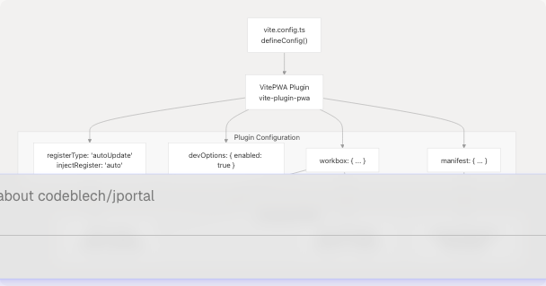
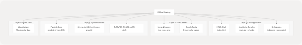

# PWA Configuration

Relevant source files

* [README.md](https://github.com/codeblech/jportal/blob/4df0fde4/README.md)
* [jportal/index.html](https://github.com/codeblech/jportal/blob/4df0fde4/jportal/index.html)
* [jportal/public/pwa-icons/j-yuvraj.svg](https://github.com/codeblech/jportal/blob/4df0fde4/jportal/public/pwa-icons/j-yuvraj.svg)
* [jportal/src/components/DynamicFontLoader.tsx](https://github.com/codeblech/jportal/blob/4df0fde4/jportal/src/components/DynamicFontLoader.tsx)
* [jportal/src/utils/fonts.ts](https://github.com/codeblech/jportal/blob/4df0fde4/jportal/src/utils/fonts.ts)
* [jportal/vite.config.ts](https://github.com/codeblech/jportal/blob/4df0fde4/jportal/vite.config.ts)
* [screenshots/mobile-8.png](https://github.com/codeblech/jportal/blob/4df0fde4/screenshots/mobile-8.png)

This document details the Progressive Web App (PWA) implementation in JPortal, including the VitePWA plugin setup, service worker configuration, caching strategies, web app manifest, and platform-specific installation procedures. For information about the build pipeline and deployment process, see [Build & Deployment](/codeblech/jportal/6-build-and-deployment). For development workflow and scripts, see [Development Workflow](/codeblech/jportal/6.2-development-workflow).

## Overview

JPortal is configured as a PWA using the `vite-plugin-pwa` package with Workbox for service worker generation. The PWA setup enables offline functionality, app-like installation on mobile and desktop platforms, and aggressive caching of critical resources including the Pyodide Python runtime and related dependencies.

**Sources:** [jportal/vite.config.ts1-99](https://github.com/codeblech/jportal/blob/4df0fde4/jportal/vite.config.ts#L1-L99)

## VitePWA Plugin Integration

The PWA functionality is configured through the `VitePWA` plugin in the Vite build configuration. The plugin orchestrates manifest generation, service worker creation, and asset precaching.


```

**Sources:** [jportal/vite.config.ts4](https://github.com/codeblech/jportal/blob/4df0fde4/jportal/vite.config.ts#L4-L4) [jportal/vite.config.ts17-73](https://github.com/codeblech/jportal/blob/4df0fde4/jportal/vite.config.ts#L17-L73)

### Registration Configuration

The service worker registration is configured at [jportal/vite.config.ts18-22](https://github.com/codeblech/jportal/blob/4df0fde4/jportal/vite.config.ts#L18-L22):

| Property | Value | Purpose |
| --- | --- | --- |
| `registerType` | `"autoUpdate"` | Automatically updates service worker when new version detected |
| `injectRegister` | `"auto"` | Automatically injects registration code into application |
| `devOptions.enabled` | `true` | Enables PWA in development mode for testing |

The `autoUpdate` registration type ensures users receive updates immediately without manual intervention. The service worker checks for updates on page load and navigation events.

**Sources:** [jportal/vite.config.ts18-22](https://github.com/codeblech/jportal/blob/4df0fde4/jportal/vite.config.ts#L18-L22)

## Workbox Caching Configuration

The Workbox configuration defines caching strategies for both static assets and runtime resources. This configuration is critical for offline functionality and performance optimization.

```

```

**Sources:** [jportal/vite.config.ts23-43](https://github.com/codeblech/jportal/blob/4df0fde4/jportal/vite.config.ts#L23-L43)

### Static Asset Precaching

The service worker precaches all assets matching the glob patterns at [jportal/vite.config.ts25](https://github.com/codeblech/jportal/blob/4df0fde4/jportal/vite.config.ts#L25-L25):

```
**/*.{js,css,html,ico,png,svg,whl}
```

This pattern ensures all JavaScript bundles, stylesheets, HTML files, icons, images, and Python wheel files (`.whl`) are cached on first load. The `maximumFileSizeToCacheInBytes` is set to 30MB at [jportal/vite.config.ts24](https://github.com/codeblech/jportal/blob/4df0fde4/jportal/vite.config.ts#L24-L24) to accommodate the Pyodide runtime and Python wheel files.

**Sources:** [jportal/vite.config.ts24-25](https://github.com/codeblech/jportal/blob/4df0fde4/jportal/vite.config.ts#L24-L25)

### Runtime Caching Strategy

External resources are cached using runtime caching rules. The Pyodide JavaScript runtime from `cdn.jsdelivr.net` uses a `CacheFirst` strategy at [jportal/vite.config.ts26-36](https://github.com/codeblech/jportal/blob/4df0fde4/jportal/vite.config.ts#L26-L36):

| Configuration | Value | Purpose |
| --- | --- | --- |
| URL Pattern | `/^https:\/\/cdn\.jsdelivr\.net\/pyodide\/v0\.23\.4\/full\/pyodide\.js$/` | Matches exact Pyodide version |
| Handler | `"CacheFirst"` | Serves from cache if available, falls back to network |
| Cache Name | `"pyodide-cache"` | Dedicated cache namespace |
| Max Age | `60 * 60 * 24 * 1000` seconds (1000 days) | Long-term caching for stable resource |

**Sources:** [jportal/vite.config.ts26-36](https://github.com/codeblech/jportal/blob/4df0fde4/jportal/vite.config.ts#L26-L36)

### Additional Manifest Entries

Critical external resources are explicitly precached via `additionalManifestEntries` at [jportal/vite.config.ts38-42](https://github.com/codeblech/jportal/blob/4df0fde4/jportal/vite.config.ts#L38-L42):

```
```
additionalManifestEntries: [
  { url: "https://cdn.jsdelivr.net/pyodide/v0.23.4/full/pyodide.js", revision: null },
  { url: "/jportal/artifact/jiit_marks-0.2.0-py3-none-any.whl", revision: null },
  { url: "/jportal/artifact/PyMuPDF-1.24.12-cp311-abi3-emscripten_3_1_32_wasm32.whl", revision: null },
]
```
```

These entries ensure the Pyodide runtime and Python packages for PDF parsing (see [Grades Module](/codeblech/jportal/4.2-grades-module)) are available offline. The `revision: null` indicates these are external resources that don't participate in Workbox's revision-based cache invalidation.

**Sources:** [jportal/vite.config.ts38-42](https://github.com/codeblech/jportal/blob/4df0fde4/jportal/vite.config.ts#L38-L42)

## Web App Manifest

The web app manifest defines how JPortal appears when installed as a PWA. The manifest is configured at [jportal/vite.config.ts44-72](https://github.com/codeblech/jportal/blob/4df0fde4/jportal/vite.config.ts#L44-L72)

```

```

**Sources:** [jportal/vite.config.ts44-72](https://github.com/codeblech/jportal/blob/4df0fde4/jportal/vite.config.ts#L44-L72)

### Manifest Properties

| Property | Value | Purpose |
| --- | --- | --- |
| `name` | `"JPortal"` | Full application name displayed on install prompts |
| `short_name` | `"JPortal"` | Short name for home screen (character limit constraints) |
| `description` | `"A web portal for students to view attendance and grades."` | App description for app stores and metadata |
| `start_url` | `"/jportal/"` | URL loaded when app is launched (matches `base` in vite.config.ts) |
| `display` | `"standalone"` | Launches in app-like mode without browser UI |
| `background_color` | `"#191c20"` | Splash screen background color (dark theme) |
| `theme_color` | `"#191c20"` | Browser UI theme color (status bar, etc.) |
| `orientation` | `"portrait"` | Locks app to portrait orientation on mobile |

**Sources:** [jportal/vite.config.ts45-52](https://github.com/codeblech/jportal/blob/4df0fde4/jportal/vite.config.ts#L45-L52)

### Icon Configuration

The manifest defines icons for various device sizes and purposes at [jportal/vite.config.ts53-71](https://github.com/codeblech/jportal/blob/4df0fde4/jportal/vite.config.ts#L53-L71):

```
```
icons: [
  {
    src: "pwa-icons/circle.ico",
    sizes: "48x48",
  },
  {
    src: "pwa-icons/j-yuvraj.svg",
    sizes: "72x72 96x96",
    purpose: "maskable",
  },
  {
    src: "pwa-icons/j-yuvraj.svg",
    sizes: "128x128 256x256",
  },
  {
    src: "pwa-icons/j-yuvraj.svg",
    sizes: "512x512",
  },
]
```
```

* **48x48**: Favicon-sized icon using `.ico` format for browser tabs
* **72x72, 96x96**: Maskable icons for adaptive icons on Android (can be cropped to circle/rounded square)
* **128x128, 256x256**: Medium-sized icons for app launchers
* **512x512**: High-resolution icon for splash screens and app stores

The `j-yuvraj.svg` icon at [jportal/public/pwa-icons/j-yuvraj.svg1-231](https://github.com/codeblech/jportal/blob/4df0fde4/jportal/public/pwa-icons/j-yuvraj.svg#L1-L231) is an SVG graphic that scales to all required sizes. The `purpose: "maskable"` property indicates the icon can be safely cropped by the OS.

**Sources:** [jportal/vite.config.ts53-71](https://github.com/codeblech/jportal/blob/4df0fde4/jportal/vite.config.ts#L53-L71) [jportal/public/pwa-icons/j-yuvraj.svg1-231](https://github.com/codeblech/jportal/blob/4df0fde4/jportal/public/pwa-icons/j-yuvraj.svg#L1-L231)

## Offline Capabilities

The caching configuration enables comprehensive offline functionality through a multi-layer strategy.

```

```

**Sources:** [jportal/vite.config.ts23-42](https://github.com/codeblech/jportal/blob/4df0fde4/jportal/vite.config.ts#L23-L42)

### Cached Resource Categories

1. **Core Application Assets** (from `globPatterns`):

   * HTML entry point: `index.html`
   * JavaScript bundles: All `.js` files
   * Stylesheets: All `.css` files
2. **Static Media Assets**:

   * Icons: All `.ico`, `.svg`, `.png` files
   * Google Fonts: Loaded dynamically via `DynamicFontLoader` component
3. **Python Runtime Components** (from `additionalManifestEntries`):

   * Pyodide JavaScript runtime: `pyodide.js` v0.23.4
   * Marks parsing library: `jiit_marks-0.2.0-py3-none-any.whl`
   * PDF library: `PyMuPDF-1.24.12-cp311-abi3-emscripten_3_1_32_wasm32.whl`
4. **Demo Mode Data**:

   * Mock portal data: `fakedata.json` (matched by glob patterns as `.json`)

**Note:** Real authentication data and portal API responses are **not cached** for security reasons. Offline functionality is limited to demo mode or previously cached authenticated sessions.

**Sources:** [jportal/vite.config.ts23-42](https://github.com/codeblech/jportal/blob/4df0fde4/jportal/vite.config.ts#L23-L42) [jportal/src/components/DynamicFontLoader.tsx1-34](https://github.com/codeblech/jportal/blob/4df0fde4/jportal/src/components/DynamicFontLoader.tsx#L1-L34)

## Installation Flow

JPortal can be installed on multiple platforms through browser-native installation prompts. The installation instructions are documented in the README.

```


**Sources:** [jportal/README.md39-44](https://github.com/codeblech/jportal/blob/4df0fde4/jportal/README.md#L39-L44)

### Platform-Specific Instructions

**Android (Chromium-based browsers)** [jportal/README.md42](https://github.com/codeblech/jportal/blob/4df0fde4/jportal/README.md#L42-L42):

1. Press the three-dot menu icon
2. Tap "Add to Home Screen"
3. Press "Install" in the popup

**iOS (Safari)** [jportal/README.md43](https://github.com/codeblech/jportal/blob/4df0fde4/jportal/README.md#L43-L43):

1. Press the Share button
2. Select "Add to Home Screen" from the popup
3. Tap "Add"

**Windows (Chrome/Edge)** [jportal/README.md44](https://github.com/codeblech/jportal/blob/4df0fde4/jportal/README.md#L44-L44):

1. Click the install icon on the right side of the URL bar
2. Click "Install"

**Sources:** [jportal/README.md39-44](https://github.com/codeblech/jportal/blob/4df0fde4/jportal/README.md#L39-L44)

## Development Mode PWA

The PWA is enabled in development mode via `devOptions.enabled: true` at [jportal/vite.config.ts20-22](https://github.com/codeblech/jportal/blob/4df0fde4/jportal/vite.config.ts#L20-L22) This allows testing installation flows, service worker behavior, and offline capabilities during development without requiring a production build.

When running `npm run dev`, the VitePWA plugin generates a development-specific service worker that:

* Hot-reloads on code changes
* Provides verbose console logging
* Does not require HTTPS (uses `localhost` exception)
* Updates immediately without waiting for service worker lifecycle events

**Sources:** [jportal/vite.config.ts20-22](https://github.com/codeblech/jportal/blob/4df0fde4/jportal/vite.config.ts#L20-L22)

## Base URL Configuration

The `base` property in vite.config.ts is set to `"/jportal/"` at [jportal/vite.config.ts13](https://github.com/codeblech/jportal/blob/4df0fde4/jportal/vite.config.ts#L13-L13) to match the GitHub Pages deployment path. This base URL is used throughout the PWA configuration:

* **Manifest `start_url`**: `"/jportal/"` [jportal/vite.config.ts48](https://github.com/codeblech/jportal/blob/4df0fde4/jportal/vite.config.ts#L48-L48)
* **Precached resources**: All paths are relative to `/jportal/`
* **Service worker scope**: Defaults to `/jportal/`

This ensures the PWA works correctly when deployed to `https://codeblech.github.io/jportal/` instead of a root domain.

**Sources:** [jportal/vite.config.ts13](https://github.com/codeblech/jportal/blob/4df0fde4/jportal/vite.config.ts#L13-L13) [jportal/vite.config.ts48](https://github.com/codeblech/jportal/blob/4df0fde4/jportal/vite.config.ts#L48-L48)

## Related Configuration

The PWA setup integrates with other parts of the application:

* **Google Fonts**: Preconnected in `index.html` at [jportal/index.html8-12](https://github.com/codeblech/jportal/blob/4df0fde4/jportal/index.html#L8-L12) for performance, dynamically loaded by `DynamicFontLoader`
* **Cloudflare Analytics**: Script included in `index.html` at [jportal/index.html14-16](https://github.com/codeblech/jportal/blob/4df0fde4/jportal/index.html#L14-L16) cached by service worker
* **Pyodide**: Script tag in `index.html` at [jportal/index.html17](https://github.com/codeblech/jportal/blob/4df0fde4/jportal/index.html#L17-L17) loads runtime, with service worker providing offline caching

**Sources:** [jportal/index.html1-24](https://github.com/codeblech/jportal/blob/4df0fde4/jportal/index.html#L1-L24) [jportal/src/components/DynamicFontLoader.tsx1-34](https://github.com/codeblech/jportal/blob/4df0fde4/jportal/src/components/DynamicFontLoader.tsx#L1-L34)