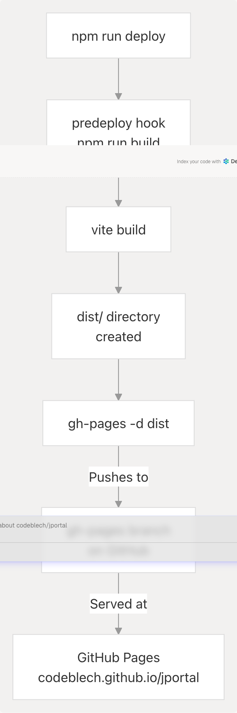

# Development Workflow

This page documents the development workflow for JPortal, including available npm scripts, local development procedures, code linting, production builds, and deployment to GitHub Pages. For information about PWA-specific build configuration and caching strategies, see [PWA Configuration](6.1-pwa-configuration).

---

## Available Scripts

The project defines several npm scripts in `package.json` that handle different aspects of the development and deployment workflow:

| Script | Command | Purpose |
| --- | --- | --- |
| `dev` | `vite` | Starts the Vite development server with hot module replacement |
| `build` | `vite build` | Creates an optimized production build in the `dist/` directory |
| `lint` | `eslint .` | Runs ESLint to check code quality and enforce style guidelines |
| `preview` | `vite preview` | Serves the production build locally for testing before deployment |
| `predeploy` | `npm run build` | Pre-deployment hook that automatically builds the project |
| `deploy` | `gh-pages -d dist` | Deploys the `dist/` directory to GitHub Pages |

**Sources:** [jportal/package.json7-13](https://github.com/codeblech/jportal/blob/4df0fde4/jportal/package.json#L7-L13)

---

## Development Server Workflow

### Starting Development

To start local development, run:

```
npm run dev
```

This launches the Vite development server, which provides:

* **Hot Module Replacement (HMR)**: Changes to source files automatically update in the browser without full page reloads
* **Fast startup**: Vite uses native ES modules for instant server start
* **Source maps**: Debugging with original source code in browser DevTools
* **API proxying**: Cloudflare API requests are proxied through the development server

### Development Server Configuration

The development server is configured in `vite.config.ts`:


**Configuration Details:**

* **Base path**: Set to `/jportal/` to match GitHub Pages deployment path
* **Alias resolution**: `@` is aliased to `./src` for cleaner imports
* **API proxy**: Requests to `/api/cloudflare` are proxied to `https://api.cloudflare.com` with authorization headers injected from `VITE_CLOUDFLARE_API_TOKEN` environment variable
* **PWA dev mode**: Service worker is enabled in development via `devOptions.enabled: true`

**Sources:** [jportal/vite.config.ts9-99](https://github.com/codeblech/jportal/blob/4df0fde4/jportal/vite.config.ts#L9-L99) [jportal/package.json8](https://github.com/codeblech/jportal/blob/4df0fde4/jportal/package.json#L8-L8)

### Environment Variables

The development server loads environment variables from `.env` files:

* Variables prefixed with `VITE_` are exposed to client code
* `VITE_CLOUDFLARE_API_TOKEN` is used by the proxy server to authenticate Cloudflare API requests
* `.env` files are excluded from version control via `.gitignore`

**Sources:** [jportal/vite.config.ts10](https://github.com/codeblech/jportal/blob/4df0fde4/jportal/vite.config.ts#L10-L10) [.gitignore36](https://github.com/codeblech/jportal/blob/4df0fde4/.gitignore#L36-L36)

---

## Production Build Process

### Building for Production

To create an optimized production build:

```
npm run build
```

This executes `vite build`, which performs the following operations:


### Build Outputs

The build process generates several artifacts in the `dist/` directory:

| Output Type | Location | Description |
| --- | --- | --- |
| HTML entry | `dist/index.html` | Minified HTML shell with inlined critical resources |
| JavaScript bundles | `dist/assets/*.js` | Code-split and minified JS bundles with content hashes |
| CSS bundles | `dist/assets/*.css` | Extracted and minified CSS with content hashes |
| Static assets | `dist/pwa-icons/`, `dist/artifact/` | PWA icons and Python wheels for Pyodide |
| Service worker | `dist/sw.js` | Generated Workbox service worker for offline support |
| PWA manifest | `dist/manifest.webmanifest` | App manifest with metadata and icon definitions |

### Build Configuration

Key build settings from `vite.config.ts`:

* **Base path**: `/jportal/` matches the GitHub Pages deployment URL structure
* **Asset handling**: Maximum file size for caching set to 30MB to accommodate Python wheels
* **Glob patterns**: `**/*.{js,css,html,ico,png,svg,whl}` determines which files the service worker caches
* **Additional manifest entries**: Pyodide runtime and Python wheels are pre-cached for offline PDF parsing

**Sources:** [jportal/vite.config.ts13-73](https://github.com/codeblech/jportal/blob/4df0fde4/jportal/vite.config.ts#L13-L73) [jportal/package.json9](https://github.com/codeblech/jportal/blob/4df0fde4/jportal/package.json#L9-L9)

---

## Code Linting

### Running the Linter

To check code quality and style violations:

```
npm run lint
```

This executes ESLint with the project's configuration.

### Linter Configuration

ESLint is configured with the following plugins and rulesets:

* **`@eslint/js`**: Core JavaScript linting rules
* **`eslint-plugin-react`**: React-specific linting rules
* **`eslint-plugin-react-hooks`**: Enforces Rules of Hooks
* **`eslint-plugin-react-refresh`**: Validates Fast Refresh compatibility
* **`@tanstack/eslint-plugin-query`**: TanStack Query best practices

**Common violations checked:**

* Unused variables and imports
* Missing dependencies in React hooks
* Invalid hook usage patterns
* Fast Refresh incompatible exports
* React Query anti-patterns

**Sources:** [jportal/package.json10](https://github.com/codeblech/jportal/blob/4df0fde4/jportal/package.json#L10-L10) [jportal/package.json46-56](https://github.com/codeblech/jportal/blob/4df0fde4/jportal/package.json#L46-L56)

---

## Preview Mode

### Testing Production Builds Locally

After building, preview the production bundle locally:

```
npm run preview
```

This starts a local static file server that serves the contents of `dist/` exactly as they would be served in production. This is useful for:

* **Testing service worker behavior**: Verify offline caching and PWA functionality
* **Checking production optimizations**: Ensure minification and bundling work correctly
* **Validating base path**: Confirm `/jportal/` base path routing works
* **Performance testing**: Measure load times with production-optimized assets

The preview server typically runs on `http://localhost:4173` (or the next available port).

**Sources:** [jportal/package.json11](https://github.com/codeblech/jportal/blob/4df0fde4/jportal/package.json#L11-L11)

---

## Deployment to GitHub Pages

### Deployment Workflow

JPortal is deployed to GitHub Pages using the `gh-pages` package:

```
npm run deploy
```

This command triggers a two-step process:



### Deployment Steps

1. **Pre-deploy hook** (`predeploy`): Automatically runs `npm run build` to ensure fresh production assets
2. **gh-pages package**: Pushes the `dist/` directory contents to the `gh-pages` branch
3. **GitHub Pages**: Automatically detects the branch update and deploys the site

### Deployment Configuration

Critical configuration for GitHub Pages deployment:

| Setting | Value | Location | Purpose |
| --- | --- | --- | --- |
| `homepage` | `https://codeblech.github.io/jportal` | package.json | Defines the deployment URL |
| `base` | `/jportal/` | vite.config.ts | Matches the repository subpath |
| `start_url` | `/jportal/` | PWA manifest | Entry point for installed PWA |

**URL Structure:**

* Root URL: `https://codeblech.github.io/jportal/`
* All asset references use the `/jportal/` base path
* Router uses `HashRouter` to avoid server-side routing configuration

### Excluded from Deployment

The following directories are excluded via `.gitignore` and never deployed:

* `node_modules/` - Dependencies (installed from package.json)
* `dist/` - Build artifacts (regenerated on each deploy)
* `dist-ssr/` - Server-side rendering artifacts
* `dev-dist/`, `.vite/` - Development build cache
* `*.env` - Environment variables (security-sensitive)

**Sources:** [jportal/package.json6](https://github.com/codeblech/jportal/blob/4df0fde4/jportal/package.json#L6-L6) [jportal/package.json12-13](https://github.com/codeblech/jportal/blob/4df0fde4/jportal/package.json#L12-L13) [jportal/vite.config.ts13](https://github.com/codeblech/jportal/blob/4df0fde4/jportal/vite.config.ts#L13-L13) [.gitignore10-36](https://github.com/codeblech/jportal/blob/4df0fde4/.gitignore#L10-L36)

---

## Complete Development Lifecycle

The following diagram illustrates the complete development, testing, and deployment workflow:


**Workflow Phases:**

1. **Local Development**: Rapid iteration with HMR and live reloading
2. **Code Quality**: Periodic linting to catch errors and enforce style
3. **Production Testing**: Build and preview to verify production behavior
4. **Deployment**: Automated build and push to GitHub Pages

**Sources:** [jportal/package.json7-13](https://github.com/codeblech/jportal/blob/4df0fde4/jportal/package.json#L7-L13) [jportal/vite.config.ts9-99](https://github.com/codeblech/jportal/blob/4df0fde4/jportal/vite.config.ts#L9-L99)

---

## Development Dependencies

The following table lists key development tools and their purposes:

| Package | Version | Purpose |
| --- | --- | --- |
| `vite` | ^5.4.10 | Build tool and development server |
| `@vitejs/plugin-react` | ^4.3.3 | React Fast Refresh and JSX transformation |
| `vite-plugin-pwa` | ^0.20.5 | PWA manifest and service worker generation |
| `vite-plugin-svgr` | ^4.5.0 | Import SVG files as React components |
| `eslint` | ^9.13.0 | JavaScript/TypeScript linter |
| `eslint-plugin-react` | ^7.37.2 | React-specific linting rules |
| `eslint-plugin-react-hooks` | ^5.0.0 | React Hooks linting rules |
| `gh-pages` | ^6.2.0 | GitHub Pages deployment utility |
| `typescript` | ^5.9.2 | TypeScript compiler |
| `tailwindcss` | ^4.1.12 | Utility-first CSS framework |
| `postcss` | ^8.4.47 | CSS transformation pipeline |

**Sources:** [jportal/package.json45-65](https://github.com/codeblech/jportal/blob/4df0fde4/jportal/package.json#L45-L65)

---

## Environment Setup

To set up the development environment:

```
# Clone the repository
git clone https://github.com/codeblech/jportal.git
cd jportal

# Install dependencies
npm install

# Create environment file (optional, for Cloudflare stats)
echo "VITE_CLOUDFLARE_API_TOKEN=your_token_here" > .env

# Start development server
npm run dev
```

**Required tools:**

* Node.js (compatible with package versions)
* npm (included with Node.js)
* Git (for version control and deployment)

**Optional configuration:**

* `VITE_CLOUDFLARE_API_TOKEN` for accessing Cloudflare analytics in development

**Sources:** [jportal/package.json1-66](https://github.com/codeblech/jportal/blob/4df0fde4/jportal/package.json#L1-L66) [jportal/vite.config.ts81-96](https://github.com/codeblech/jportal/blob/4df0fde4/jportal/vite.config.ts#L81-L96)
