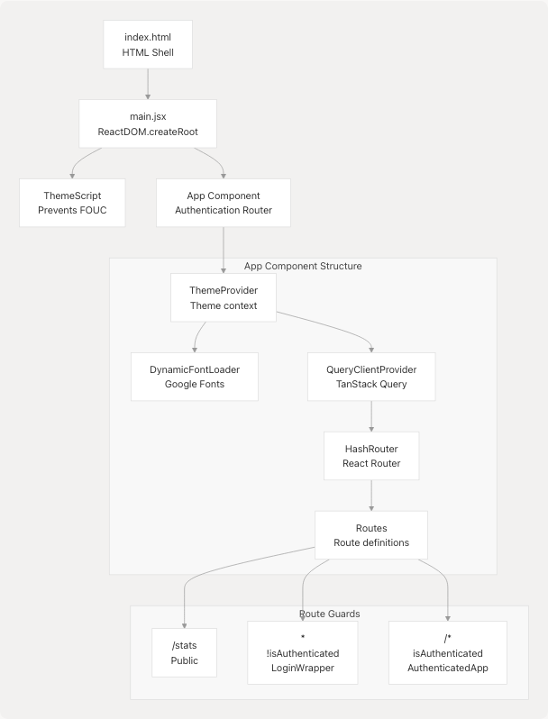
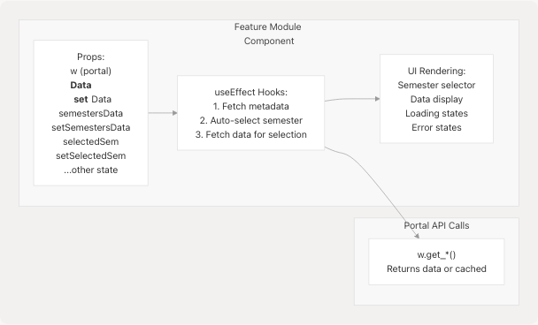

# Development Guide

This guide provides information for developers contributing to JPortal. It covers code organization patterns, architectural decisions, development workflow, and best practices used throughout the codebase. For information about building and deploying the application, see [Build & Deployment](6-build-and-deployment). For details about the mock data system used in demo mode, see [Mock Data System](7.1-mock-data-system). For step-by-step instructions on adding new features, see [Adding New Features](7.2-adding-new-features).

---

## Project Setup

### Prerequisites

JPortal requires Node.js and npm to run. The project uses modern JavaScript/TypeScript tooling with Vite as the build system.

### Installation

Clone the repository and install dependencies:

```
git clone https://github.com/codeblech/jportal
cd jportal
npm install
```

### Development Commands

| Command | Purpose |
| --- | --- |
| `npm run dev` | Start Vite development server with hot reload |
| `npm run build` | Build production bundle to `dist/` |
| `npm run preview` | Preview production build locally |
| `npm run lint` | Run ESLint on codebase |
| `npm run deploy` | Deploy to GitHub Pages (runs predeploy build) |

**Sources:** [package.json7-13](https://github.com/codeblech/jportal/blob/4df0fde4/package.json#L7-L13)

---

## Technology Stack

### Core Dependencies

| Library | Version | Purpose |
| --- | --- | --- |
| React | ^18.3.1 | UI framework |
| React Router DOM | ^6.27.0 | Client-side routing |
| Vite | ^5.4.10 | Build tool and dev server |
| Tailwind CSS | ^4.1.12 | Utility-first CSS framework |
| TypeScript | ^5.9.2 | Type checking (dev) |

### Key Libraries

| Library | Purpose |
| --- | --- |
| Radix UI | Accessible component primitives (Dialog, Select, Tabs, etc.) |
| React Hook Form | Form state management |
| Zod | Schema validation |
| Zustand | Global state management (theme) |
| TanStack Query | Server state management |
| Recharts | Data visualization |
| Sonner | Toast notifications |
| jsjiit | JIIT portal API integration (loaded via CDN) |
| Pyodide | Python runtime in browser (for PDF parsing) |

**Sources:** [package.json15-43](https://github.com/codeblech/jportal/blob/4df0fde4/package.json#L15-L43)

---

## Code Organization

### Directory Structure

```
jportal/
├── src/
│   ├── components/
│   │   ├── Attendance.jsx          # Feature module
│   │   ├── Grades.jsx              # Feature module
│   │   ├── Exams.jsx               # Feature module
│   │   ├── Subjects.jsx            # Feature module
│   │   ├── Profile.jsx             # Feature module
│   │   ├── Cloudflare.jsx          # Analytics dashboard
│   │   ├── Login.jsx               # Authentication
│   │   ├── Header.jsx              # Top navigation
│   │   ├── Navbar.jsx              # Bottom navigation
│   │   ├── MockWebPortal.jsx       # Demo mode API
│   │   ├── theme-*.jsx             # Theme system
│   │   └── ui/                     # Base UI components
│   ├── lib/
│   │   ├── theme-presets.ts        # Theme definitions
│   │   ├── theme-store.ts          # Zustand store
│   │   └── utils.ts                # Utility functions
│   ├── data/
│   │   └── fakedata.json           # Mock data for demo mode
│   ├── App.jsx                     # Root component
│   ├── main.jsx                    # Application entry
│   └── index.css                   # Global styles
├── public/
│   └── j-yuvraj.svg                # PWA icon
└── index.html                      # HTML shell
```

**Sources:** [App.jsx1-16](https://github.com/codeblech/jportal/blob/4df0fde4/App.jsx#L1-L16)

---

## Application Entry Point and Routing

### Main Entry Flow



The application uses `HashRouter` for GitHub Pages compatibility. The `App` component implements authentication-based routing: unauthenticated users see `Login`, while authenticated users access `AuthenticatedApp`. The `/stats` route is publicly accessible.

**Sources:** [App.jsx243-376](https://github.com/codeblech/jportal/blob/4df0fde4/App.jsx#L243-L376)

---

## Authentication System

### Portal Instance Pattern

JPortal uses a **dual-mode architecture** with two portal instances created at module level:

```
const realPortal = new WebPortal();    // jsjiit library
const mockPortal = new MockWebPortal(); // Local mock implementation

// Select active portal based on authentication mode
const activePortal = isDemoMode ? mockPortal : realPortal;
```

Both portals implement the same interface (methods like `get_attendance()`, `get_grades()`, etc.), allowing seamless mode switching.

**Sources:** [App.jsx18-250](https://github.com/codeblech/jportal/blob/4df0fde4/App.jsx#L18-L250)

### Authentication State Flow


The authentication flow automatically attempts login on mount if credentials exist in `localStorage`. Manual login stores credentials for future auto-login. Demo mode bypasses authentication and uses `MockWebPortal`.

**Sources:** [App.jsx252-298](https://github.com/codeblech/jportal/blob/4df0fde4/App.jsx#L252-L298) [Login.jsx24-95](https://github.com/codeblech/jportal/blob/4df0fde4/Login.jsx#L24-L95)

---

## State Management Architecture

### Multi-Layer State Pattern

JPortal uses a **centralized state hub** pattern where `AuthenticatedApp` maintains state for all feature modules and passes it down via props.

#### State Layers Diagram


This pattern involves **extensive props drilling** where state and setter functions are passed through component hierarchies. All feature components receive the `w` prop (portal instance) as their primary data source.

**Sources:** [App.jsx32-101](https://github.com/codeblech/jportal/blob/4df0fde4/App.jsx#L32-L101)

### State Initialization Patterns

Feature modules follow a consistent pattern for state initialization:

1. **Metadata Loading**: Fetch available semesters/options on mount
2. **Default Selection**: Auto-select most recent semester
3. **Data Loading**: Fetch data for selected semester
4. **Caching**: Store fetched data in state to avoid re-fetching

Example state management in `AuthenticatedApp` for Attendance:

```
const [attendanceData, setAttendanceData] = useState({});
const [attendanceSemestersData, setAttendanceSemestersData] = useState(null);
const [selectedAttendanceSem, setSelectedAttendanceSem] = useState(null);
const [attendanceGoal, setAttendanceGoal] = useState(() => {
  const savedGoal = localStorage.getItem("attendanceGoal");
  return savedGoal ? parseInt(savedGoal) : 75;
});
```

**Sources:** [App.jsx33-56](https://github.com/codeblech/jportal/blob/4df0fde4/App.jsx#L33-L56)

---

## Feature Module Patterns

### Standard Feature Module Structure

All feature modules follow a similar structure:



### Common Props Pattern

Every feature module receives:

| Prop Category | Examples | Purpose |
| --- | --- | --- |
| Portal | `w` | API access (WebPortal or MockWebPortal) |
| Data State | `attendanceData`, `gradesData` | Stores fetched data |
| Data Setters | `setAttendanceData`, `setGradesData` | Update data state |
| Metadata | `semestersData`, `examSemesters` | Available options |
| Selection | `selectedSem`, `selectedExamSem` | Current selection |
| UI State | `activeTab`, `isLoading`, `isOpen` | Component-specific UI state |

**Sources:** [App.jsx110-214](https://github.com/codeblech/jportal/blob/4df0fde4/App.jsx#L110-L214)

---

## Portal API Integration Pattern

### The `w` Prop

All feature components receive a `w` prop which is either `realPortal` or `mockPortal`. This abstraction allows identical code to work in both real and demo modes.


### API Call Pattern

Feature modules typically follow this pattern when fetching data:

```
useEffect(() => {
  const fetchData = async () => {
    try {
      setLoading(true);
      const data = await w.get_something(selectedOption);
      setData(data);
    } catch (error) {
      console.error("Error:", error);
      setError(error.message);
    } finally {
      setLoading(false);
    }
  };

  if (selectedOption) {
    fetchData();
  }
}, [selectedOption, w]);
```

**Sources:** [App.jsx250](https://github.com/codeblech/jportal/blob/4df0fde4/App.jsx#L250-L250)

---

## Component Communication Patterns

### Props Drilling

JPortal uses **props drilling** for component communication. State is maintained in `AuthenticatedApp` and passed down to feature components and their children.


### Alternative: Global State (Theme)

The theme system uses **Zustand** for global state, avoiding props drilling:

```
// lib/theme-store.ts
export const useThemeStore = create((set) => ({
  themeState: getInitialTheme(),
  setThemeState: (theme) => set({ themeState: theme }),
}));

// Any component can access theme
const { themeState, setThemeState } = useThemeStore();
```

This demonstrates that JPortal uses **different patterns for different concerns**: props drilling for feature state, Zustand for theme, and potential for TanStack Query for server state.

**Sources:** [App.jsx102-218](https://github.com/codeblech/jportal/blob/4df0fde4/App.jsx#L102-L218)

---

## Local Storage Usage

### Persisted Data

| Key | Type | Purpose | Managed By |
| --- | --- | --- | --- |
| `username` | string | User enrollment number | Login flow |
| `password` | string | User password | Login flow |
| `attendanceGoal` | string (number) | Target attendance percentage | Attendance module |
| Theme data | object | Current theme preset and mode | Theme system |

### Credential Storage Pattern

```
// Store on successful login
localStorage.setItem("username", enrollmentNumber);
localStorage.setItem("password", password);

// Retrieve on app mount for auto-login
const username = localStorage.getItem("username");
const password = localStorage.getItem("password");

// Clear on logout or login error
localStorage.removeItem("username");
localStorage.removeItem("password");
```

**Sources:** [Login.jsx54-55](https://github.com/codeblech/jportal/blob/4df0fde4/Login.jsx#L54-L55) [App.jsx253-280](https://github.com/codeblech/jportal/blob/4df0fde4/App.jsx#L253-L280)

---

## Error Handling Patterns

### Login Error Handling

The application uses custom error types from the `jsjiit` library:

```
try {
  await w.student_login(username, password);
} catch (error) {
  if (error instanceof LoginError && 
      error.message.includes("JIIT Web Portal server is temporarily unavailable")) {
    toast.error("JIIT Web Portal server is temporarily unavailable. Please try again later.");
  } else if (error instanceof LoginError && 
             error.message.includes("Failed to fetch")) {
    toast.error("Please check your internet connection. If connected, JIIT Web Portal server is unavailable.");
  } else {
    toast.error("Login failed. Please check your credentials.");
  }
}
```

### User Feedback

JPortal uses **Sonner** for toast notifications with custom styling:

```
<Toaster
  richColors
  icons={{
    error: <TriangleAlert className="h-4 w-4" />,
  }}
  toastOptions={{
    style: {
      background: "var(--popover)",
      color: "var(--popover-foreground)",
      border: "1px solid var(--border)",
      boxShadow: "var(--shadow-lg)",
    },
  }}
/>
```

**Sources:** [Login.jsx64-76](https://github.com/codeblech/jportal/blob/4df0fde4/Login.jsx#L64-L76) [App.jsx320-333](https://github.com/codeblech/jportal/blob/4df0fde4/App.jsx#L320-L333)

---

## Development Best Practices

### Code Style Conventions

1. **Component Files**: Use `.jsx` extension for React components
2. **Utility Files**: Use `.ts` extension for TypeScript utilities
3. **State Naming**: Follow `[noun]Data` pattern (e.g., `attendanceData`, `gradesData`)
4. **Setter Naming**: Follow `set[Noun]Data` pattern (e.g., `setAttendanceData`)
5. **Loading States**: Use `is[Feature]Loading` pattern (e.g., `isAttendanceMetaLoading`)
6. **Boolean Props**: Use `is*` or `has*` prefixes (e.g., `isOpen`, `hasError`)

### Component Structure

Follow this pattern for feature components:

```
export default function FeatureName({ 
  w, 
  data, 
  setData,
  // ... other props
}) {
  // 1. Local state (if needed)
  const [localState, setLocalState] = useState(null);

  // 2. useEffect hooks for data fetching
  useEffect(() => {
    // Fetch metadata
  }, [w]);

  useEffect(() => {
    // Fetch data based on selection
  }, [selection, w]);

  // 3. Event handlers
  const handleSomething = () => {
    // ...
  };

  // 4. Render
  return (
    <div>
      {/* UI */}
    </div>
  );
}
```

### Prop Passing

When passing many props to a component, use object destructuring and group related props:

```
<Attendance
  // Portal
  w={w}

  // Data
  attendanceData={attendanceData}
  setAttendanceData={setAttendanceData}

  // Metadata
  semestersData={attendanceSemestersData}
  setSemestersData={setAttendanceSemestersData}

  // Selection
  selectedSem={selectedAttendanceSem}
  setSelectedSem={setSelectedAttendanceSem}

  // ... grouped props
/>
```

**Sources:** [App.jsx110-141](https://github.com/codeblech/jportal/blob/4df0fde4/App.jsx#L110-L141)

---

## Routing and Navigation

### Route Structure


### Navigation Components

* **Header**: Fixed at top, contains theme selector and logout button
* **Navbar**: Fixed at bottom, contains navigation links to 5 main routes

Both use hash-based routing (`#/attendance`, `#/grades`, etc.) for GitHub Pages compatibility.

**Sources:** [App.jsx107-369](https://github.com/codeblech/jportal/blob/4df0fde4/App.jsx#L107-L369)

---

## Linting and Code Quality

### ESLint Configuration

The project uses ESLint with React-specific plugins:

* `@eslint/js`: Base JavaScript rules
* `eslint-plugin-react`: React-specific rules
* `eslint-plugin-react-hooks`: Enforce Rules of Hooks
* `eslint-plugin-react-refresh`: Fast Refresh compatibility
* `@tanstack/eslint-plugin-query`: TanStack Query best practices

Run linting with:

```
npm run lint
```

**Sources:** [package.json45-51](https://github.com/codeblech/jportal/blob/4df0fde4/package.json#L45-L51)

---

## Development Workflow

### Local Development

1. **Start dev server**: `npm run dev`
2. **Open browser**: Navigate to `http://localhost:5173` (or shown port)
3. **Make changes**: Hot reload updates automatically
4. **Test in demo mode**: Use "Try Demo" button on login
5. **Test real mode**: Use actual JIIT credentials (if available)

### Testing Both Modes

To verify feature compatibility with both portal implementations:

1. Implement feature using `w.get_*()` methods
2. Test with demo mode first (instant, no network)
3. Test with real mode (requires JIIT credentials)
4. Ensure identical behavior in both modes

### Pre-Deployment Checklist

* Run `npm run lint` - No linting errors
* Test all features in demo mode
* Test all features in real mode (if credentials available)
* Verify theme switching works
* Test PWA installation
* Check responsive design on mobile
* Build succeeds: `npm run build`
* Preview build: `npm run preview`

**Sources:** [package.json8-13](https://github.com/codeblech/jportal/blob/4df0fde4/package.json#L8-L13)

---

## Common Development Tasks

### Adding a New UI Component

1. Create component in `src/components/ui/`
2. Use Radix UI primitives if applicable
3. Style with Tailwind CSS
4. Use CSS variables for theme compatibility
5. Export from component file

### Modifying Theme

1. Edit presets in `src/lib/theme-presets.ts`
2. Add new CSS variables in `src/index.css`
3. Use variables via Tailwind: `bg-background`, `text-foreground`

### Adding a New Route

1. Add state to `AuthenticatedApp` component
2. Create component in `src/components/`
3. Add `<Route>` in `AuthenticatedApp` Routes
4. Add navigation link to `Navbar.jsx` (if needed)
5. Pass necessary props including `w`

### Working with Portal API

When adding new data fetching:

```
// In feature component
useEffect(() => {
  const fetchData = async () => {
    try {
      const data = await w.get_new_data(params);
      setData(data);
    } catch (error) {
      console.error(error);
    }
  };
  fetchData();
}, [params, w]);
```

Ensure `MockWebPortal` implements the same method for demo mode.

**Sources:** [App.jsx32-219](https://github.com/codeblech/jportal/blob/4df0fde4/App.jsx#L32-L219)

---

## Debugging Tips

### Check Portal Mode

Add console logs to verify which portal is active:

```
console.log('Portal mode:', isDemoMode ? 'Demo' : 'Real');
console.log('Portal instance:', w);
```

### Inspect State

Use React DevTools to inspect `AuthenticatedApp` state:

* All feature states are visible in one component
* Check state values before and after API calls
* Verify prop propagation

### Network Requests

* **Real mode**: Check Network tab for JIIT portal requests
* **Demo mode**: No network requests, data from `fakedata.json`

### LocalStorage

Check Application > Local Storage in DevTools:

* Verify credentials are stored correctly
* Check `attendanceGoal` value
* Inspect theme data

### Common Issues

| Issue | Likely Cause | Solution |
| --- | --- | --- |
| "Auto-login failed" | Invalid stored credentials | Clear localStorage, login again |
| Data not loading | Missing semester selection | Check if `selectedSem` is set |
| Props undefined | Missing prop in component | Check prop drilling chain |
| Theme not applying | CSS variables not defined | Check `index.css` for variables |

**Sources:** [App.jsx252-288](https://github.com/codeblech/jportal/blob/4df0fde4/App.jsx#L252-L288)
