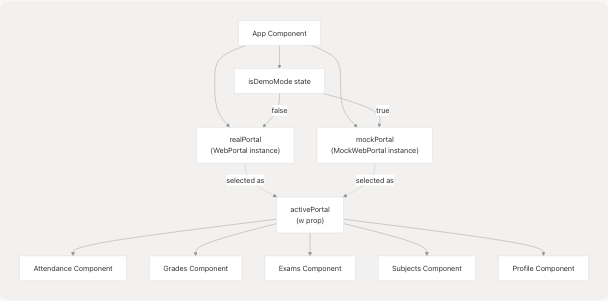
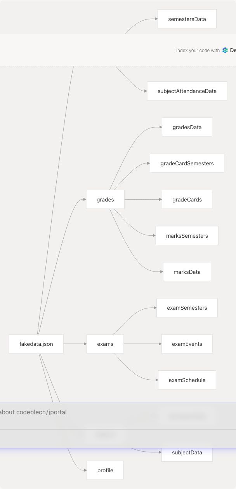
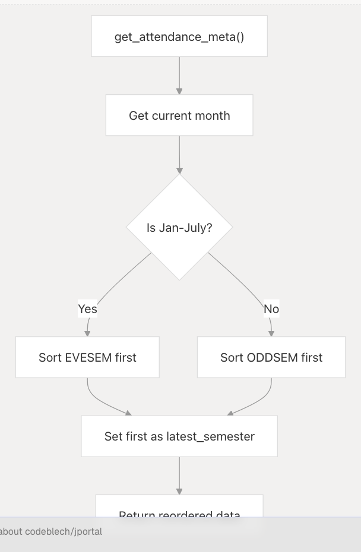

# Mock Data System

The Mock Data System provides a complete simulated backend for JPortal, enabling development, testing, and demonstration without requiring actual JIIT portal credentials or network connectivity. This system consists of the `MockWebPortal` class and a comprehensive `fakedata.json` file containing realistic sample data for all application features.

For information about the real backend integration using the jsjiit library, see [Data Layer & API Integration](3.3-data-layer-and-api-integration).

---

## Purpose and Scope

The Mock Data System serves three primary functions:

1. **Development Mode**: Allows developers to work on the application without valid JIIT credentials
2. **Demo Mode**: Enables users to explore JPortal's features before logging in with real credentials
3. **Testing Environment**: Provides consistent, reproducible data for testing UI components and application logic

The system implements the same interface as the `WebPortal` class from the jsjiit library, allowing seamless switching between mock and real modes without component code changes.

**Sources:** [src/components/MockWebPortal.js1-114](https://github.com/codeblech/jportal/blob/4df0fde4/src/components/MockWebPortal.js#L1-L114) [src/App.jsx20-29](https://github.com/codeblech/jportal/blob/4df0fde4/src/App.jsx#L20-L29)

---

## Architecture Overview

### Portal Abstraction Pattern

The application creates both portal instances at the top level and selects one based on the authentication mode:



**Sources:** [src/App.jsx27-29](https://github.com/codeblech/jportal/blob/4df0fde4/src/App.jsx#L27-L29) [src/App.jsx250](https://github.com/codeblech/jportal/blob/4df0fde4/src/App.jsx#L250-L250) [src/App.jsx360](https://github.com/codeblech/jportal/blob/4df0fde4/src/App.jsx#L360-L360)

### Interface Compatibility

The `MockWebPortal` class implements all methods expected by feature components:

| Method Category | Methods | Purpose |
| --- | --- | --- |
| **Authentication** | `student_login()` | Returns immediately with success |
| **Attendance** | `get_attendance_meta()`, `get_attendance()`, `get_subject_daily_attendance()` | Provides attendance data and metadata |
| **Grades** | `get_sgpa_cgpa()`, `get_semesters_for_grade_card()`, `get_grade_card()`, `get_semesters_for_marks()`, `download_marks()` | Returns grade and marks information |
| **Exams** | `get_semesters_for_exam_events()`, `get_exam_events()`, `get_exam_schedule()` | Provides exam schedule data |
| **Subjects** | `get_registered_subjects_and_faculties()`, `get_registered_semesters()` | Returns subject registration info |
| **Profile** | `get_personal_info()` | Returns student profile data |

**Sources:** [src/components/MockWebPortal.js3-114](https://github.com/codeblech/jportal/blob/4df0fde4/src/components/MockWebPortal.js#L3-L114)

---

## Data Organization (fakedata.json)

### Domain Structure

The `fakedata.json` file is organized into five top-level domains corresponding to JPortal's feature modules:



**Sources:** [src/assets/fakedata.json1-4077](https://github.com/codeblech/jportal/blob/4df0fde4/src/assets/fakedata.json#L1-L4077)

### Attendance Domain

The attendance domain contains data for two semesters with comprehensive attendance records:

**Structure:**

* `semestersData`: Contains semester metadata and the latest semester reference
  + `semesters`: Array of semester objects with `registration_id` and `registration_code`
  + `latest_header`: Header identifier string
  + `latest_semester`: Reference to the current semester
* `attendanceData`: Keyed by semester code (e.g., `"2025EVESEM"`)
  + `studentattendancelist`: Array of subject attendance records containing:
    - Subject identification: `subjectcode`, `subjectdesc`, `individualsubjectcode`, `subjectid`
    - Attendance counts: `Ltotalclass`, `Ltotalpres`, `Lpercentage` (Lecture)
    - Tutorial counts: `Ttotalclass`, `Ttotalpres`, `Tpercentage`
    - Practical counts: `Ptotalclass`, `Ptotalpres`, `Ppercentage`
    - Overall percentage: `LTpercantage`
* `subjectAttendanceData`: Keyed by `individualsubjectcode` (e.g., `"15B11EC611"`)
  + Contains detailed daily attendance records with:
    - `datetime`: Class date and time
    - `classtype`: "Lecture", "Tutorial", or "Practical"
    - `present`: "Present" or "Absent"
    - `attendanceby`: Faculty name

**Example semester codes:** `"2025EVESEM"`, `"2025ODDSEM"`

**Sources:** [src/assets/fakedata.json1-2283](https://github.com/codeblech/jportal/blob/4df0fde4/src/assets/fakedata.json#L1-L2283)

### Grades Domain

Contains SGPA/CGPA trends, grade cards, and detailed marks data:

**Structure:**

* `gradesData`: Array of semester-wise grade records with:
  + `semester_id`, `registration_id`, `semester_alias`
  + `sgpa`: Semester GPA value
  + `cgpa`: Cumulative GPA value
  + `semester_credits_earned`, `semester_credits_registered`
  + `total_credits_earned`
* `gradeCardSemesters`: Array of semesters for which grade cards are available
* `gradeCards`: Keyed by semester code
  + `gradecard`: Array of course grade entries with:
    - Course info: `subjectcode`, `subjectdesc`, `credits`
    - Component grades: `ca`, `mid`, `tf`, `pr`, `lw`, `att`, `jc`
    - Final result: `total`, `grade`
* `marksSemesters`: Array of semesters with marks PDFs
* `marksData`: Keyed by semester code
  + `courses`: Array of courses with:
    - Course details: `subjectCode`, `subjectName`
    - Assessment components: `sessionalMarks`, `midTermMarks`, `endTermMarks`, `practicalMarks`, `totalMarks`
    - Grade: `grade`

**Sources:** [src/assets/fakedata.json2284-3281](https://github.com/codeblech/jportal/blob/4df0fde4/src/assets/fakedata.json#L2284-L3281)

### Exams Domain

Provides exam event metadata and detailed schedules:

**Structure:**

* `examSemesters`: Array of semester objects with exam events
* `examEvents`: Keyed by semester code
  + Array of exam event objects with:
    - `exameventid`, `examtypecode`, `examtypedescription`
    - Date range: `fromdate`, `todate`
    - Status: `schedulepublished`
* `examSchedule`: Keyed by exam event ID
  + Array of subject exam details with:
    - Subject: `subjectcode`, `subjectdesc`
    - Scheduling: `examdate`, `examtime`, `examtiming`
    - Location: `room`

**Sources:** [src/assets/fakedata.json3282-3719](https://github.com/codeblech/jportal/blob/4df0fde4/src/assets/fakedata.json#L3282-L3719)

### Subjects Domain

Contains registered subjects, faculty assignments, and credits information:

**Structure:**

* `semestersData`: Semester metadata
  + `semesters`: Array of available semesters
  + `latest_semester`: Current semester reference
* `subjectData`: Keyed by semester code
  + `subjects`: Array of subject objects with:
    - Identification: `subjectcode`, `subjectdesc`, `individualsubjectcode`
    - Credit info: `l_credit`, `t_credit`, `p_credit`, `total_credits`
    - Faculty: `employeename`, `employeecode`
    - Scheduling: `ltpclassnumber`, `subjectcomponentids`

**Sources:** [src/assets/fakedata.json3720-4050](https://github.com/codeblech/jportal/blob/4df0fde4/src/assets/fakedata.json#L3720-L4050)

### Profile Domain

Contains comprehensive student information organized into sections:

**Structure:**

* `personal_info`: Basic details (name, DOB, gender, nationality, etc.)
* `contact_info`: Email, phone, addresses
* `family_info`: Parent/guardian details
* `address_info`: Permanent and correspondence addresses
* `academic_info`: Enrollment, program, branch, admission details

**Sources:** [src/assets/fakedata.json4051-4077](https://github.com/codeblech/jportal/blob/4df0fde4/src/assets/fakedata.json#L4051-L4077)

---

## MockWebPortal Implementation

### Class Structure


**Sources:** [src/components/MockWebPortal.js3-114](https://github.com/codeblech/jportal/blob/4df0fde4/src/components/MockWebPortal.js#L3-L114)

### Key Implementation Details

#### Session Simulation

The constructor creates a minimal session object to match the expected interface:

```
constructor() {
  this.session = { get_headers: async () => ({}) };
}
```

This prevents errors in components that check for `w.session` existence.

**Sources:** [src/components/MockWebPortal.js4-6](https://github.com/codeblech/jportal/blob/4df0fde4/src/components/MockWebPortal.js#L4-L6)

#### Intelligent Semester Ordering

The `get_attendance_meta()` method implements date-aware semester ordering to improve demo UX:



This ensures the "current" semester matches the real academic calendar:

* **January-July**: Even semester (EVESEM) appears as latest
* **August-December**: Odd semester (ODDSEM) appears as latest

**Sources:** [src/components/MockWebPortal.js12-46](https://github.com/codeblech/jportal/blob/4df0fde4/src/components/MockWebPortal.js#L12-L46)

#### Data Retrieval Pattern

All data methods follow a consistent pattern:

1. **Extract semester/event key** from the parameter object
2. **Look up data** in `fakeData` using the key
3. **Return data** with appropriate structure or empty fallback

Example from `get_attendance()`:

```
async get_attendance(header, semester) {
  const semKey = semester.registration_code || semester;
  return fakeData.attendance.attendanceData[semKey] || { studentattendancelist: [] };
}
```

This pattern handles both object parameters and string keys, providing robust fallback behavior.

**Sources:** [src/components/MockWebPortal.js48-51](https://github.com/codeblech/jportal/blob/4df0fde4/src/components/MockWebPortal.js#L48-L51) [src/components/MockWebPortal.js67-70](https://github.com/codeblech/jportal/blob/4df0fde4/src/components/MockWebPortal.js#L67-L70) [src/components/MockWebPortal.js81-91](https://github.com/codeblech/jportal/blob/4df0fde4/src/components/MockWebPortal.js#L81-L91)

### Method-to-Domain Mapping

| Method | Domain | Data Path | Return Structure |
| --- | --- | --- | --- |
| `get_attendance_meta()` | attendance | `semestersData` | `{ semesters, latest_header(), latest_semester() }` |
| `get_attendance()` | attendance | `attendanceData[semKey]` | `{ studentattendancelist }` |
| `get_subject_daily_attendance()` | attendance | `subjectAttendanceData[code]` | `{ studentAttdsummarylist }` |
| `get_sgpa_cgpa()` | grades | `gradesData` | Array of semester grades |
| `get_grade_card()` | grades | `gradeCards[semKey]` | `{ gradecard }` |
| `download_marks()` | grades | `marksData[semKey]` | `{ courses }` |
| `get_exam_schedule()` | exams | `examSchedule[eventKey]` | `{ subjectinfo }` |
| `get_registered_subjects_and_faculties()` | subjects | `subjectData[semKey]` | `{ subjects, registered_subject_faculty }` |
| `get_personal_info()` | profile | root | Complete profile object |

**Sources:** [src/components/MockWebPortal.js12-114](https://github.com/codeblech/jportal/blob/4df0fde4/src/components/MockWebPortal.js#L12-L114)

---

## Integration Points

### Demo Mode Activation

The demo mode flow involves user interaction in the Login component and state management in App:


**Sources:** [src/components/Login.jsx41-43](https://github.com/codeblech/jportal/blob/4df0fde4/src/components/Login.jsx#L41-L43) [src/App.jsx295-298](https://github.com/codeblech/jportal/blob/4df0fde4/src/App.jsx#L295-L298) [src/App.jsx250](https://github.com/codeblech/jportal/blob/4df0fde4/src/App.jsx#L250-L250)

### Portal Selection Logic

The active portal is determined at render time based on the `isDemoMode` state:

**In App.jsx:**

```
const activePortal = isDemoMode ? mockPortal : realPortal;
```

This selection happens before rendering `AuthenticatedApp`, and the chosen portal is passed down as the `w` prop to all feature components.

**Sources:** [src/App.jsx250](https://github.com/codeblech/jportal/blob/4df0fde4/src/App.jsx#L250-L250) [src/App.jsx360](https://github.com/codeblech/jportal/blob/4df0fde4/src/App.jsx#L360-L360)

### Component Usage Pattern

Feature components receive the portal instance via the `w` prop and use it identically regardless of whether it's the real or mock portal:


Components never need to check which portal they're using—the interface contract ensures compatibility.

**Sources:** [src/App.jsx110-214](https://github.com/codeblech/jportal/blob/4df0fde4/src/App.jsx#L110-L214)

### Logout and Mode Switching

The Header component provides logout functionality that clears demo mode:

```
setIsDemoMode(false);
```

This triggers a re-render with the `realPortal` selected, and the user is presented with the Login screen again.

**Sources:** [src/App.jsx105](https://github.com/codeblech/jportal/blob/4df0fde4/src/App.jsx#L105-L105)

---

## Mock Data Characteristics

### Data Volume

The `fakedata.json` file contains realistic data volumes:

| Domain | Key Metric | Count |
| --- | --- | --- |
| Attendance | Subjects per semester | 10 (EVESEM), 6 (ODDSEM) |
| Attendance | Daily records for main subject | 36 records |
| Grades | Semester records | 8 semesters |
| Grades | Courses per grade card | ~8-10 courses |
| Exams | Events per semester | 1-2 events |
| Exams | Subjects per exam event | 6-10 subjects |
| Subjects | Subjects per semester | 8-10 subjects |
| Profile | Information sections | 5 sections |

**Sources:** [src/assets/fakedata.json1-4077](https://github.com/codeblech/jportal/blob/4df0fde4/src/assets/fakedata.json#L1-L4077)

### Data Realism

The mock data includes:

* **Realistic attendance patterns**: Mix of Present/Absent with varying percentages (66-92%)
* **Multiple class types**: Lectures, Tutorials, Practicals with different attendance counts
* **Faculty names**: Indian names matching JIIT faculty patterns (e.g., "HARLEEN KAUR", "RUBY BENIWAL")
* **Academic terminology**: Actual JIIT subject codes and descriptions
* **Date patterns**: Dates distributed throughout semester months
* **Grade distributions**: Realistic SGPA/CGPA values and grade patterns
* **Subject diversity**: Mix of core subjects, electives, and lab courses

**Sources:** [src/assets/fakedata.json287-503](https://github.com/codeblech/jportal/blob/4df0fde4/src/assets/fakedata.json#L287-L503) [src/assets/fakedata.json2284-2400](https://github.com/codeblech/jportal/blob/4df0fde4/src/assets/fakedata.json#L2284-L2400)

### Extensibility

To add new mock data:

1. **Identify the domain** (attendance, grades, exams, subjects, profile)
2. **Follow the existing structure** within that domain
3. **Add semester-keyed entries** for semester-specific data
4. **Update MockWebPortal methods** if new API endpoints are needed
5. **Ensure key consistency** (use `registration_code` or similar as keys)

The system's pattern-based design makes it straightforward to extend with additional semesters, subjects, or data types.

**Sources:** [src/components/MockWebPortal.js1-114](https://github.com/codeblech/jportal/blob/4df0fde4/src/components/MockWebPortal.js#L1-L114)
