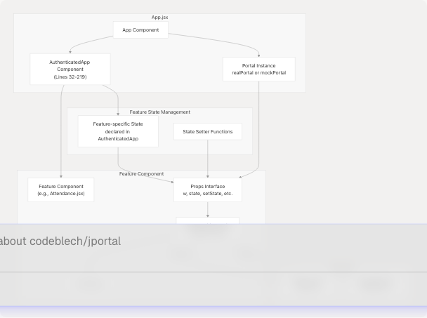
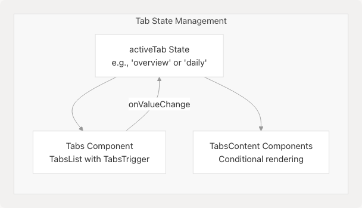
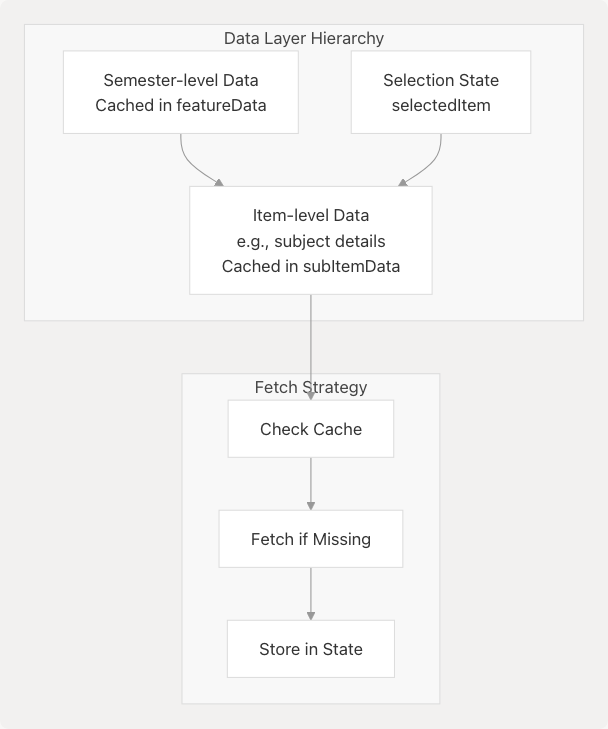

# Adding New Features

> Source: https://deepwiki.com/codeblech/jportal/7.2-adding-new-features

# Adding New Features

Relevant source files

* [jportal/src/App.jsx](https://github.com/codeblech/jportal/blob/4df0fde4/jportal/src/App.jsx)
* [jportal/src/components/Attendance.jsx](https://github.com/codeblech/jportal/blob/4df0fde4/jportal/src/components/Attendance.jsx)
* [jportal/src/components/Exams.jsx](https://github.com/codeblech/jportal/blob/4df0fde4/jportal/src/components/Exams.jsx)
* [jportal/src/components/Grades.jsx](https://github.com/codeblech/jportal/blob/4df0fde4/jportal/src/components/Grades.jsx)
* [jportal/src/components/Login.jsx](https://github.com/codeblech/jportal/blob/4df0fde4/jportal/src/components/Login.jsx)
* [jportal/src/components/Subjects.jsx](https://github.com/codeblech/jportal/blob/4df0fde4/jportal/src/components/Subjects.jsx)

## Purpose and Scope

This document provides a step-by-step guide for developers adding new feature modules to JPortal. It covers the architectural patterns used across existing features and the specific code changes required to integrate a new feature module into the application.

For information about the overall architecture patterns, see [Architecture Overview](/codeblech/jportal/3-architecture-overview). For details about the mock data system used during development, see [Mock Data System](/codeblech/jportal/7.1-mock-data-system). For information about specific UI components that can be reused, see [UI Components](/codeblech/jportal/5-ui-components).

---

## Feature Module Architecture

All feature modules in JPortal follow a consistent architectural pattern. Understanding this pattern is essential before adding new features.

### Core Pattern


```

**Sources**: [jportal/src/App.jsx1-377](https://github.com/codeblech/jportal/blob/4df0fde4/jportal/src/App.jsx#L1-L377) [jportal/src/components/Attendance.jsx1-477](https://github.com/codeblech/jportal/blob/4df0fde4/jportal/src/components/Attendance.jsx#L1-L477) [jportal/src/components/Grades.jsx1-531](https://github.com/codeblech/jportal/blob/4df0fde4/jportal/src/components/Grades.jsx#L1-L531)

### Key Characteristics

| Aspect | Implementation |
| --- | --- |
| **State Location** | All feature state is declared in `AuthenticatedApp` component ([App.jsx32-101](https://github.com/codeblech/jportal/blob/4df0fde4/App.jsx#L32-L101)) |
| **Props Pattern** | Extensive props drilling - state and setters passed down to feature components |
| **Data Access** | Via `w` prop (WebPortal or MockWebPortal instance) |
| **Caching Strategy** | Features cache data in component state, keyed by semester/registration ID |
| **Loading States** | Each feature manages its own loading states for meta and data |
| **Semester Selection** | Most features include semester dropdown for historical data access |

**Sources**: [jportal/src/App.jsx32-219](https://github.com/codeblech/jportal/blob/4df0fde4/jportal/src/App.jsx#L32-L219)

---

## Step-by-Step Implementation Guide

### Step 1: Create the Feature Component

Create a new component file in `src/components/` following the naming convention `FeatureName.jsx`.

#### Component Structure Template

```
```
// src/components/NewFeature.jsx
import React, { useState, useEffect } from "react";
import { Select, SelectContent, SelectItem, SelectTrigger, SelectValue } from "@/components/ui/select";

export default function NewFeature({
  w,                        // Portal instance (required)
  featureData,              // Main data state
  setFeatureData,           // Data setter
  semestersData,            // Semester metadata
  setSemestersData,         // Semester metadata setter
  selectedSem,              // Currently selected semester
  setSelectedSem,           // Semester selection setter
  // Add other feature-specific state props as needed
}) {
  // Local loading states
  const [loading, setLoading] = useState(true);

  // Initial data fetch
  useEffect(() => {
    const fetchData = async () => {
      // Check if data already exists
      if (featureData && semestersData) {
        setLoading(false);
        return;
      }

      try {
        // Fetch metadata (e.g., available semesters)
        const meta = await w.get_feature_meta();
        setSemestersData(meta);

        // Fetch initial data
        const data = await w.get_feature_data(meta.latest_semester);
        setFeatureData(prev => ({
          ...prev,
          [meta.latest_semester.registration_id]: data
        }));
        setSelectedSem(meta.latest_semester);
      } catch (error) {
        console.error("Failed to fetch feature data:", error);
      } finally {
        setLoading(false);
      }
    };

    fetchData();
  }, [w, featureData, setFeatureData, semestersData, setSemestersData]);

  // Semester change handler
  const handleSemesterChange = async (value) => {
    const semester = semestersData.semesters.find(s => s.registration_id === value);
    setSelectedSem(semester);

    // Check cache
    if (featureData[value]) {
      return;
    }

    // Fetch new data
    setLoading(true);
    try {
      const data = await w.get_feature_data(semester);
      setFeatureData(prev => ({
        ...prev,
        [value]: data
      }));
    } catch (error) {
      console.error("Failed to fetch data for semester:", error);
    } finally {
      setLoading(false);
    }
  };

  // Render logic
  return (
    <div className="text-foreground font-sans">
      {/* Sticky header with semester selector */}
      <div className="sticky top-14 bg-background z-20">
        <div className="py-2 px-3">
          <Select onValueChange={handleSemesterChange} value={selectedSem?.registration_id}>
            <SelectTrigger className="bg-background text-foreground border-foreground cursor-pointer hover:bg-accent hover:text-accent-foreground">
              <SelectValue placeholder="Select semester">
                {selectedSem?.registration_code}
              </SelectValue>
            </SelectTrigger>
            <SelectContent className="bg-background text-foreground border-foreground">
              {semestersData?.semesters?.map((sem) => (
                <SelectItem key={sem.registration_id} value={sem.registration_id}>
                  {sem.registration_code}
                </SelectItem>
              ))}
            </SelectContent>
          </Select>
        </div>
      </div>

      {/* Content area */}
      <div className="px-3 pb-4">
        {loading ? (
          <div className="flex items-center justify-center py-4">
            Loading...
          </div>
        ) : (
          // Render feature content
          <div>Feature content here</div>
        )}
      </div>
    </div>
  );
}
```
```

#### Key Implementation Details

1. **Sticky Header Pattern**: Use `sticky top-14` for semester selector to keep it visible during scroll ([Attendance.jsx246-272](https://github.com/codeblech/jportal/blob/4df0fde4/Attendance.jsx#L246-L272))
2. **Loading States**: Maintain separate loading states for metadata and data ([Attendance.jsx99-101](https://github.com/codeblech/jportal/blob/4df0fde4/Attendance.jsx#L99-L101))
3. **Caching Strategy**: Store data keyed by `registration_id` to avoid redundant API calls ([Attendance.jsx107-118](https://github.com/codeblech/jportal/blob/4df0fde4/Attendance.jsx#L107-L118))
4. **Error Handling**: Wrap API calls in try-catch blocks and log errors appropriately

**Sources**: [jportal/src/components/Attendance.jsx12-477](https://github.com/codeblech/jportal/blob/4df0fde4/jportal/src/components/Attendance.jsx#L12-L477) [jportal/src/components/Subjects.jsx11-143](https://github.com/codeblech/jportal/blob/4df0fde4/jportal/src/components/Subjects.jsx#L11-L143) [jportal/src/components/Exams.jsx10-165](https://github.com/codeblech/jportal/blob/4df0fde4/jportal/src/components/Exams.jsx#L10-L165)

---

### Step 2: Define State in AuthenticatedApp

Add state declarations for your new feature in the `AuthenticatedApp` component.

#### State Declaration Pattern

```

```

**Location**: [jportal/src/App.jsx32-101](https://github.com/codeblech/jportal/blob/4df0fde4/jportal/src/App.jsx#L32-L101)

Add state variables following this pattern:

```
```
// In AuthenticatedApp component
function AuthenticatedApp({ w, setIsAuthenticated, setIsDemoMode }) {
  // Add your feature states here

  // Main data state - keyed by registration_id for caching
  const [featureData, setFeatureData] = useState({});

  // Semester metadata state
  const [featureSemestersData, setFeatureSemestersData] = useState(null);

  // Currently selected semester
  const [selectedFeatureSem, setSelectedFeatureSem] = useState(null);

  // Loading states
  const [featureMetaLoading, setFeatureMetaLoading] = useState(true);
  const [featureDataLoading, setFeatureDataLoading] = useState(true);

  // Additional feature-specific states
  const [activeFeatureTab, setActiveFeatureTab] = useState("overview");

  // ... existing state declarations
}
```
```

#### State Naming Conventions

| State Type | Pattern | Example |
| --- | --- | --- |
| Main Data | `{feature}Data` | `attendanceData`, `gradesData` |
| Semester Metadata | `{feature}SemestersData` | `attendanceSemestersData`, `subjectSemestersData` |
| Selected Semester | `selected{Feature}Sem` | `selectedAttendanceSem`, `selectedGradesSem` |
| Loading States | `{feature}Loading` or `is{Feature}Loading` | `gradesLoading`, `isAttendanceMetaLoading` |
| Tab States | `active{Feature}Tab` | `activeGradesTab`, `activeAttendanceTab` |

**Sources**: [jportal/src/App.jsx33-101](https://github.com/codeblech/jportal/blob/4df0fde4/jportal/src/App.jsx#L33-L101)

---

### Step 3: Add Route Configuration

Add the new feature route in the `AuthenticatedApp` routes section.

```

```

**Location**: [jportal/src/App.jsx107-216](https://github.com/codeblech/jportal/blob/4df0fde4/jportal/src/App.jsx#L107-L216)

Add the route in the `Routes` component within `AuthenticatedApp`:

```
```
// In AuthenticatedApp's return statement
<Routes>
  <Route path="/" element={<Navigate to="/attendance" />} />
  <Route path="/login" element={<Navigate to="/attendance" />} />

  {/* Existing routes */}
  <Route path="/attendance" element={<Attendance {...attendanceProps} />} />
  <Route path="/grades" element={<Grades {...gradesProps} />} />

  {/* Add your new feature route */}
  <Route
    path="/new-feature"
    element={
      <NewFeature
        w={w}
        featureData={featureData}
        setFeatureData={setFeatureData}
        semestersData={featureSemestersData}
        setSemestersData={setFeatureSemestersData}
        selectedSem={selectedFeatureSem}
        setSelectedSem={setSelectedFeatureSem}
        featureMetaLoading={featureMetaLoading}
        setFeatureMetaLoading={setFeatureMetaLoading}
        featureDataLoading={featureDataLoading}
        setFeatureDataLoading={setFeatureDataLoading}
        // Pass any additional props needed
      />
    }
  />
</Routes>
```
```

#### Route Path Conventions

* Use lowercase kebab-case for route paths
* Keep paths simple and descriptive (e.g., `/attendance`, `/grades`, `/exams`)
* The path becomes part of the URL: `https://example.com/#/new-feature`

**Sources**: [jportal/src/App.jsx107-216](https://github.com/codeblech/jportal/blob/4df0fde4/jportal/src/App.jsx#L107-L216)

---

### Step 4: Update Navigation Component

Add navigation link in the `Navbar` component to make the feature accessible.

**File**: `src/components/Navbar.jsx`

```
```
// Add import for any new icons
import { IconName } from "lucide-react";

// In the Navbar component's render
<nav className="...">
  {/* Existing nav items */}
  <NavLink to="/attendance">
    <CalendarCheck className="h-5 w-5" />
    <span className="text-xs">Attendance</span>
  </NavLink>

  {/* Add your new feature link */}
  <NavLink to="/new-feature">
    <IconName className="h-5 w-5" />
    <span className="text-xs">Feature Name</span>
  </NavLink>
</nav>
```
```

#### Navigation Best Practices

| Aspect | Guideline |
| --- | --- |
| **Icon Selection** | Use icons from `lucide-react` library for consistency |
| **Label Length** | Keep navigation labels short (1-2 words) |
| **Order** | Place new features logically based on user workflow |
| **Active State** | NavLink automatically handles active state styling |

**Sources**: [jportal/src/App.jsx216](https://github.com/codeblech/jportal/blob/4df0fde4/jportal/src/App.jsx#L216-L216) (Navbar import)

---

### Step 5: Implement Mock Data Support

Extend the `MockWebPortal` class to support your new feature in demo mode.

```

```

#### Add Data to fakedata.json

**File**: `public/fakedata.json`

```
```
{
  "attendance": { /* existing */ },
  "grades": { /* existing */ },
  "newfeature": {
    "semesters": [
      {
        "registration_id": "202301",
        "registration_code": "2023-24 ODD SEM"
      }
    ],
    "data": {
      "202301": {
        // Feature-specific data structure
      }
    }
  }
}
```
```

#### Extend MockWebPortal Class

**File**: `src/components/MockWebPortal.jsx`

```
```
class MockWebPortal {
  constructor() {
    this.fakeData = null;
  }

  async init() {
    if (!this.fakeData) {
      const response = await fetch('/fakedata.json');
      this.fakeData = await response.json();
    }
  }

  // Add methods for your feature
  async get_feature_meta() {
    await this.init();
    return {
      semesters: this.fakeData.newfeature.semesters,
      latest_semester: this.fakeData.newfeature.semesters[0]
    };
  }

  async get_feature_data(semester) {
    await this.init();
    return this.fakeData.newfeature.data[semester.registration_id];
  }
}
```
```

#### Method Naming Conventions

Match the real `WebPortal` API methods from the `jsjiit` library:

* Use snake\_case for method names (e.g., `get_feature_data`, not `getFeatureData`)
* Accept the same parameters as the real API
* Return data in the same structure as the real API

**Sources**: [jportal/src/components/MockWebPortal.jsx1](https://github.com/codeblech/jportal/blob/4df0fde4/jportal/src/components/MockWebPortal.jsx#L1-LNaN) [jportal/public/fakedata.json1](https://github.com/codeblech/jportal/blob/4df0fde4/jportal/public/fakedata.json#L1-LNaN)

---

### Step 6: Add WebPortal API Methods (Real Mode)

For real mode functionality, the feature must call methods available in the `jsjiit` library's `WebPortal` class.

#### API Method Pattern

```
```
// In your feature component
const fetchData = async () => {
  try {
    // Call WebPortal API method
    const data = await w.get_feature_specific_method(params);
    setFeatureData(data);
  } catch (error) {
    console.error("API call failed:", error);
  }
};
```
```

#### Common WebPortal Methods

| Method | Purpose | Used By |
| --- | --- | --- |
| `get_attendance_meta()` | Fetch available semesters for attendance | Attendance |
| `get_attendance(header, semester)` | Fetch attendance data | Attendance |
| `get_sgpa_cgpa()` | Fetch grade overview | Grades |
| `get_grade_card(semester)` | Fetch semester grade card | Grades |
| `get_registered_semesters()` | Fetch registered semesters | Subjects |
| `get_registered_subjects_and_faculties(semester)` | Fetch subject details | Subjects |
| `get_semesters_for_exam_events()` | Fetch exam semesters | Exams |
| `get_exam_schedule(event)` | Fetch exam schedule | Exams |

**Note**: If the required API method doesn't exist in `jsjiit`, you'll need to contribute to that library first or work with mock data only.

**Sources**: [jportal/src/App.jsx18](https://github.com/codeblech/jportal/blob/4df0fde4/jportal/src/App.jsx#L18-L18) (jsjiit import), [jportal/src/components/Attendance.jsx53](https://github.com/codeblech/jportal/blob/4df0fde4/jportal/src/components/Attendance.jsx#L53-L53) [jportal/src/components/Grades.jsx56](https://github.com/codeblech/jportal/blob/4df0fde4/jportal/src/components/Grades.jsx#L56-L56)

---

## Advanced Patterns

### Multi-Tab Features

Some features like Attendance and Grades use tabbed interfaces for different views.

```

```

#### Implementation

```
```
// In AuthenticatedApp state
const [activeFeatureTab, setActiveFeatureTab] = useState("overview");

// Pass to component
<NewFeature
  activeTab={activeFeatureTab}
  setActiveTab={setActiveFeatureTab}
  // other props
/>

// In feature component
<Tabs value={activeTab} onValueChange={setActiveTab}>
  <TabsList className="grid grid-cols-2 bg-background gap-3">
    <TabsTrigger value="overview">Overview</TabsTrigger>
    <TabsTrigger value="details">Details</TabsTrigger>
  </TabsList>

  <TabsContent value="overview">
    {/* Overview content */}
  </TabsContent>

  <TabsContent value="details">
    {/* Details content */}
  </TabsContent>
</Tabs>
```
```

**Sources**: [jportal/src/components/Attendance.jsx279-312](https://github.com/codeblech/jportal/blob/4df0fde4/jportal/src/components/Attendance.jsx#L279-L312) [jportal/src/components/Grades.jsx282-302](https://github.com/codeblech/jportal/blob/4df0fde4/jportal/src/components/Grades.jsx#L282-L302)

---

### Nested Data Structures

Features like Attendance that fetch additional detail data for selected items.

```

```

**Example**: Attendance feature has `subjectAttendanceData` for detailed per-subject data ([App.jsx76-77](https://github.com/codeblech/jportal/blob/4df0fde4/App.jsx#L76-L77))
```
// State in AuthenticatedApp
const [featureData, setFeatureData] = useState({});
const [subItemData, setSubItemData] = useState({});
const [selectedItem, setSelectedItem] = useState(null);

// Pass to component
<NewFeature
  featureData={featureData}
  setFeatureData={setFeatureData}
  subItemData={subItemData}
  setSubItemData={setSubItemData}
  selectedItem={selectedItem}
  setSelectedItem={setSelectedItem}
/>

// In feature component - fetch sub-item data
const fetchSubItemData = async (item) => {
  if (subItemData[item.id]) {
    return; // Already cached
  }

  const data = await w.get_sub_item_data(item);
  setSubItemData(prev => ({
    ...prev,
    [item.id]: data
  }));
};
```
```

**Sources**: [jportal/src/App.jsx76-77](https://github.com/codeblech/jportal/blob/4df0fde4/jportal/src/App.jsx#L76-L77) [jportal/src/components/Attendance.jsx187-212](https://github.com/codeblech/jportal/blob/4df0fde4/jportal/src/components/Attendance.jsx#L187-L212)

---

### Loading State Patterns

Different loading states for different data layers improve UX.

| Loading State Type | Usage | Example |
| --- | --- | --- |
| **Meta Loading** | While fetching metadata (semesters, etc.) | `isAttendanceMetaLoading` |
| **Data Loading** | While fetching primary data | `isAttendanceDataLoading` |
| **Action Loading** | During user-initiated actions | `gradeCardLoading` |

```
```
// In AuthenticatedApp
const [featureMetaLoading, setFeatureMetaLoading] = useState(true);
const [featureDataLoading, setFeatureDataLoading] = useState(true);

// Conditional rendering in feature component
{featureMetaLoading || featureDataLoading ? (
  <div className="flex items-center justify-center py-4">
    Loading...
  </div>
) : (
  // Render content
)}
```
```

**Sources**: [jportal/src/App.jsx99-101](https://github.com/codeblech/jportal/blob/4df0fde4/jportal/src/App.jsx#L99-L101) [jportal/src/components/Attendance.jsx274-278](https://github.com/codeblech/jportal/blob/4df0fde4/jportal/src/components/Attendance.jsx#L274-L278)

---

## Feature Integration Checklist

Use this checklist when adding a new feature:

### Code Changes

* Create feature component in `src/components/FeatureName.jsx`
* Add state declarations in `AuthenticatedApp` ([App.jsx32-101](https://github.com/codeblech/jportal/blob/4df0fde4/App.jsx#L32-L101))
* Add route configuration ([App.jsx107-216](https://github.com/codeblech/jportal/blob/4df0fde4/App.jsx#L107-L216))
* Update `Navbar` component with navigation link
* Import feature component in `App.jsx` ([App.jsx6-11](https://github.com/codeblech/jportal/blob/4df0fde4/App.jsx#L6-L11))

### Data Layer

* Add mock data to `public/fakedata.json`
* Extend `MockWebPortal` class with new methods
* Verify `jsjiit` library supports required API methods
* Test data fetching with both real and mock portals

### UI & Styling

* Use Radix UI components for consistency ([#5.3](/codeblech/jportal/5.3-base-ui-components))
* Follow theme system for colors and styling ([#3.4](/codeblech/jportal/3.4-theme-system))
* Implement responsive design
* Test with different theme presets

### Testing

* Test demo mode functionality
* Test semester selection and caching
* Test loading states
* Test error handling
* Verify browser back/forward navigation
* Test PWA offline functionality if applicable

---

## Common Patterns Reference

### Data Caching by Registration ID

```
```
// Check cache before fetching
if (featureData[semester.registration_id]) {
  // Use cached data
  return;
}

// Fetch and store
const data = await w.get_feature_data(semester);
setFeatureData(prev => ({
  ...prev,
  [semester.registration_id]: data
}));
```
```

### Semester Selector UI

```
```
<Select onValueChange={handleSemesterChange} value={selectedSem?.registration_id}>
  <SelectTrigger className="bg-background text-foreground border-foreground cursor-pointer hover:bg-accent hover:text-accent-foreground">
    <SelectValue placeholder="Select semester">
      {selectedSem?.registration_code}
    </SelectValue>
  </SelectTrigger>
  <SelectContent className="bg-background text-foreground border-foreground">
    {semestersData?.semesters?.map((sem) => (
      <SelectItem key={sem.registration_id} value={sem.registration_id}>
        {sem.registration_code}
      </SelectItem>
    ))}
  </SelectContent>
</Select>
```
```

### Error Handling

```
```
try {
  const data = await w.get_feature_data(params);
  setFeatureData(data);
} catch (error) {
  console.error("Failed to fetch feature data:", error);
  // Optionally set error state for user feedback
  setError("Unable to load data. Please try again.");
}
```
```

**Sources**: [jportal/src/components/Attendance.jsx100-132](https://github.com/codeblech/jportal/blob/4df0fde4/jportal/src/components/Attendance.jsx#L100-L132) [jportal/src/components/Subjects.jsx63-84](https://github.com/codeblech/jportal/blob/4df0fde4/jportal/src/components/Subjects.jsx#L63-L84) [jportal/src/components/Exams.jsx36-67](https://github.com/codeblech/jportal/blob/4df0fde4/jportal/src/components/Exams.jsx#L36-L67)

---

## Notes and Limitations

### Current Limitations

1. **Props Drilling**: The current architecture uses extensive props drilling. Future refactoring may introduce context or global state management to reduce this.
2. **State Centralization**: All state is in `AuthenticatedApp`, making the component large (220+ lines). Consider this when adding complex features.
3. **No State Persistence**: Most feature state is lost on page refresh (except `attendanceGoal`). Consider localStorage for critical state.
4. **jsjiit Dependency**: Features requiring new API methods depend on updates to the external `jsjiit` library.

### Performance Considerations

* Features cache data by semester to minimize API calls
* Use React's `useEffect` cleanup for async operations
* Consider lazy loading for features with heavy data processing (e.g., Grades with Pyodide)

**Sources**: [jportal/src/App.jsx32-219](https://github.com/codeblech/jportal/blob/4df0fde4/jportal/src/App.jsx#L32-L219) [jportal/src/components/Grades.jsx122-209](https://github.com/codeblech/jportal/blob/4df0fde4/jportal/src/components/Grades.jsx#L122-L209)