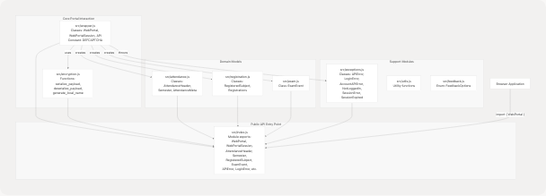
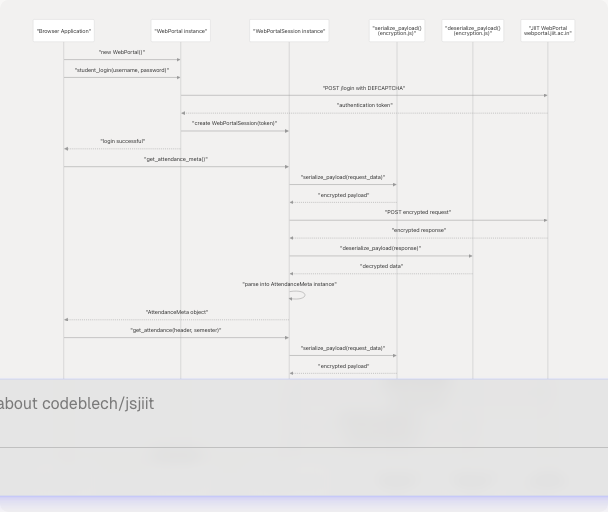
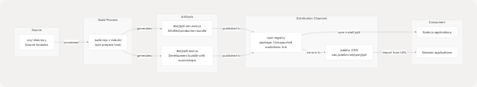

# Home

## Purpose and Scope

This wiki documents **jsjiit**, a browser-compatible JavaScript library that provides programmatic access to the JIIT (Jaypee Institute of Information Technology) WebPortal. The library abstracts the complexity of portal authentication, encryption, and API communication, enabling developers to build web applications that interact with student data without manual portal navigation.

This page provides an architectural overview of the jsjiit system, its core components, and data flow. For installation and usage instructions, see [Getting Started](2-getting-started). For detailed API documentation, see [API Reference](3-api-reference). For build system details, see [Build and Distribution](5-build-and-distribution).

**Sources:** [package.json1-62](https://github.com/codeblech/jsjiit/blob/d123b782/package.json#L1-L62) [README.md1-113](https://github.com/codeblech/jsjiit/blob/d123b782/README.md#L1-L113)

---

## Overview

jsjiit is a client-side library that wraps the JIIT WebPortal API, providing a clean JavaScript interface for authentication, attendance tracking, grade retrieval, exam schedules, and academic records. The library handles AES-CBC encryption, CAPTCHA bypass, session management, and data parsing transparently.

**Key Features:**

* **CAPTCHA-free authentication** via the `student_login` method
* **Attendance retrieval** including metadata, semester attendance, and daily subject attendance
* **Academic records** including grades, SGPA/CGPA, marks, and grade cards
* **Exam information** including schedules and venues
* **Registration data** for subjects and faculty assignments
* **Session management** with automatic encryption/decryption of API payloads

The library is distributed as an ES module via npm (package name: `jsjiit`) and mirrored to jsdelivr CDN for direct browser import.

**Sources:** [package.json1-8](https://github.com/codeblech/jsjiit/blob/d123b782/package.json#L1-L8) [README.md11-18](https://github.com/codeblech/jsjiit/blob/d123b782/README.md#L11-L18)

---

## Core Architecture

The jsjiit library follows a modular architecture where domain-specific modules export data models, and a central wrapper module (`src/wrapper.js`) orchestrates API communication.

### Module Organization



**Diagram: Module dependency graph showing code entities and their relationships**

The `WebPortal` class in `src/wrapper.js` is the primary entry point for all portal operations. It delegates encryption to `src/encryption.js` and returns instances of domain model classes (`AttendanceHeader`, `Semester`, `RegisteredSubject`, `ExamEvent`) defined in their respective modules. All exports are unified through `src/index.js`.

**Sources:** [src/index.js1-32](https://github.com/codeblech/jsjiit/blob/d123b782/src/index.js#L1-L32) [package.json5-8](https://github.com/codeblech/jsjiit/blob/d123b782/package.json#L5-L8)

---

## Runtime Data Flow

The following diagram illustrates how browser applications use jsjiit to communicate with the JIIT WebPortal:



**Diagram: Authentication and data retrieval flow showing concrete function and class names**

All API requests after authentication flow through `WebPortalSession`, which uses `serialize_payload()` to encrypt outgoing data and `deserialize_payload()` to decrypt responses. The JIIT portal uses AES-CBC encryption for all data exchange.

**Sources:** [README.md21-96](https://github.com/codeblech/jsjiit/blob/d123b782/README.md#L21-L96)

---

## Key Components

### WebPortal and WebPortalSession

The `WebPortal` class provides the initial authentication interface. The `student_login()` method bypasses CAPTCHA using a default CAPTCHA value (`DEFCAPTCHA`) and returns a `WebPortalSession` instance that maintains the authenticated session.

```
// Defined in src/wrapper.js
class WebPortal {
  async student_login(username, password) { /* ... */ }
}

class WebPortalSession {
  async get_attendance_meta() { /* ... */ }
  async get_attendance(header, semester) { /* ... */ }
  async get_registered_subjects_and_faculties(semester) { /* ... */ }
  async get_exam_events(semester) { /* ... */ }
  async get_grade_card(semester) { /* ... */ }
  // ... additional methods
}
```

**Sources:** [src/index.js5-6](https://github.com/codeblech/jsjiit/blob/d123b782/src/index.js#L5-L6) [README.md32-38](https://github.com/codeblech/jsjiit/blob/d123b782/README.md#L32-L38)

### Data Models

Domain model classes represent structured data returned by the portal:

| Class | Module | Purpose |
| --- | --- | --- |
| `AttendanceHeader` | `src/attendance.js` | Represents an attendance header with semester and date information |
| `Semester` | `src/attendance.js` | Represents a semester with code and description |
| `AttendanceMeta` | `src/attendance.js` | Container for attendance headers and semesters with helper methods |
| `RegisteredSubject` | `src/registration.js` | Represents a subject registration with faculty details |
| `Registrations` | `src/registration.js` | Container for all registered subjects in a semester |
| `ExamEvent` | `src/exam.js` | Represents an exam event with schedule and venue information |

**Sources:** [src/index.js6-8](https://github.com/codeblech/jsjiit/blob/d123b782/src/index.js#L6-L8) [src/attendance.js1](https://github.com/codeblech/jsjiit/blob/d123b782/src/attendance.js#L1-LNaN) [src/registration.js1](https://github.com/codeblech/jsjiit/blob/d123b782/src/registration.js#L1-LNaN) [src/exam.js1](https://github.com/codeblech/jsjiit/blob/d123b782/src/exam.js#L1-LNaN)

### Exception Hierarchy

The library defines custom exception classes for granular error handling:

| Exception | Module | Thrown When |
| --- | --- | --- |
| `APIError` | `src/exceptions.js` | General API communication failures |
| `LoginError` | `src/exceptions.js` | Authentication failures (invalid credentials) |
| `SessionError` | `src/exceptions.js` | Session-related errors |
| `SessionExpired` | `src/exceptions.js` | Authenticated session has expired |
| `NotLoggedIn` | `src/exceptions.js` | Attempting operations without authentication |
| `AccountAPIError` | `src/exceptions.js` | Account-specific API errors |

**Sources:** [src/index.js9](https://github.com/codeblech/jsjiit/blob/d123b782/src/index.js#L9-L9) [src/exceptions.js1](https://github.com/codeblech/jsjiit/blob/d123b782/src/exceptions.js#L1-LNaN)

---

## Distribution Model

jsjiit is packaged as an ES module and distributed through multiple channels:



**Diagram: Package distribution pipeline showing concrete artifact names**

The `package.json` defines `src/index.js` as the main entry point and `dist/jsjiit.esm.js` as the module/browser field. The `prepare` script automatically runs the build process before npm publish.

**Package Configuration:**

* **Name:** `jsjiit`
* **Version:** `0.0.23`
* **Main entry:** `src/index.js`
* **Module/Browser:** `dist/jsjiit.esm.js`
* **Files included:** `dist/`, `src/`

**Sources:** [package.json1-30](https://github.com/codeblech/jsjiit/blob/d123b782/package.json#L1-L30) [README.md22-29](https://github.com/codeblech/jsjiit/blob/d123b782/README.md#L22-L29)

---

## Usage Example

A minimal example demonstrating authentication and attendance retrieval:

```
import { WebPortal } from 'https://cdn.jsdelivr.net/npm/jsjiit@0.0.23/dist/jsjiit.min.esm.js';

// Create WebPortal instance
const portal = new WebPortal();

// Authenticate (CAPTCHA bypass handled internally)
await portal.student_login('username', 'password');

// Retrieve attendance metadata
const meta = await portal.get_attendance_meta();
const semester = meta.latest_semester();
const header = meta.latest_header();

// Get detailed attendance for the semester
const attendance = await portal.get_attendance(header, semester);
console.log(attendance);
```

This demonstrates the core workflow: instantiate `WebPortal`, call `student_login()` to obtain an authenticated session, then use session methods to retrieve data. All encryption and API communication details are abstracted.

**Sources:** [README.md21-55](https://github.com/codeblech/jsjiit/blob/d123b782/README.md#L21-L55)

---

## Development and Build Environment

The project uses modern JavaScript tooling:

* **Build System:** esbuild (version 0.24.0) for fast bundling and minification
* **Documentation:** JSDoc (version 4.0.4) for API documentation generation
* **Testing:** Manual testing via `test.html` served by local HTTPS server (`run_server`)
* **Package Management:** npm with lockfile version 3

The repository structure separates source code (`src/`), build artifacts (`dist/`), and documentation (`docs/`). The `.gitignore` excludes generated files from version control, while `.npmignore` ensures only essential files are published to npm.

**Sources:** [package.json57-60](https://github.com/codeblech/jsjiit/blob/d123b782/package.json#L57-L60)

---

## Related Pages

* For installation instructions and quick start guide, see [Getting Started](2-getting-started)
* For complete API method documentation, see [API Reference](3-api-reference)
* For build system details, see [Build System](5.1-build-system)
* For architecture deep-dive, see [Architecture and Design](4-architecture-and-design)
* For development workflow, see [Development Guide](7-development-guide)
