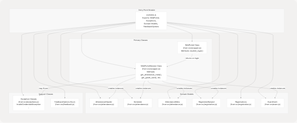
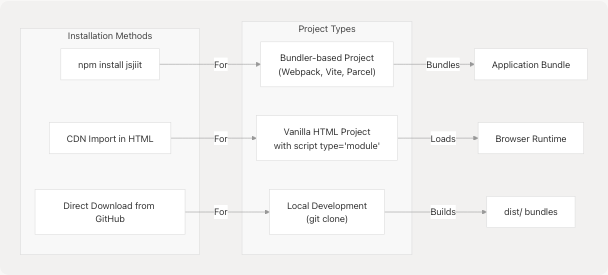

# Getting Started

This page provides an overview of how to install and begin using the jsjiit library. It covers prerequisites, the basic workflow for integrating jsjiit into your application, and the fundamental concepts you need to understand before making API calls to the JIIT Web Portal.

For detailed installation instructions across different environments, see [Installation](2.1-installation). For working code examples and hands-on tutorials, see [Quick Start Guide](2.2-quick-start-guide).

## Purpose and Scope

The jsjiit library is a browser-compatible JavaScript wrapper for the JIIT (Jaypee Institute of Information Technology) Web Portal. It enables programmatic access to portal features including attendance tracking, grade retrieval, exam schedules, and academic records. The library handles authentication (including CAPTCHA bypass), request encryption, and response parsing automatically.

This page covers:

* **Prerequisites** - Requirements for your development environment
* **Distribution Options** - Where and how to obtain the library
* **Core Concepts** - The main classes and workflow
* **Initial Setup** - Your first interaction with the library

For detailed API method documentation, see [API Reference](3-api-reference). For architecture and implementation details, see [Architecture and Design](4-architecture-and-design).

## Prerequisites

### Runtime Environment

The jsjiit library requires a modern browser environment with ES2020+ support. Specifically:

| Requirement | Specification |
| --- | --- |
| JavaScript Version | ES2020+ (ES modules support) |
| Browser APIs | `fetch`, `crypto.subtle` (Web Crypto API) |
| Module System | ES modules (`import`/`export`) |
| Environment | Browser (not Node.js compatible) |

**Sources:** [package.json1-61](https://github.com/codeblech/jsjiit/blob/d123b782/package.json#L1-L61) [README.md1-113](https://github.com/codeblech/jsjiit/blob/d123b782/README.md#L1-L113)

### Development Dependencies

If you plan to build from source or contribute to the library, you will need:

| Tool | Version | Purpose |
| --- | --- | --- |
| Node.js | ≥18 | Running build scripts |
| npm | Latest | Package management |
| esbuild | 0.24.0 | Bundle generation |
| jsdoc | ^4.0.4 | Documentation generation |

**Note:** These are only required for library development. End users who import the pre-built bundles do not need these dependencies.

**Sources:** [package.json57-60](https://github.com/codeblech/jsjiit/blob/d123b782/package.json#L57-L60)

## Distribution and Entry Points

The jsjiit library is distributed through multiple channels, each serving different use cases:


**Distribution Entry Points**

**Sources:** [package.json5-8](https://github.com/codeblech/jsjiit/blob/d123b782/package.json#L5-L8) [package.json22-25](https://github.com/codeblech/jsjiit/blob/d123b782/package.json#L22-L25) [README.md23-24](https://github.com/codeblech/jsjiit/blob/d123b782/README.md#L23-L24)

### Package Configuration

The [package.json5-8](https://github.com/codeblech/jsjiit/blob/d123b782/package.json#L5-L8) defines multiple entry points to support different import scenarios:

| Field | Path | Usage |
| --- | --- | --- |
| `main` | `src/index.js` | CommonJS fallback (not recommended) |
| `module` | `dist/jsjiit.esm.js` | ES module import |
| `browser` | `dist/jsjiit.esm.js` | Browser-specific entry |
| `exports.import` | `dist/jsjiit.esm.js` | Modern ES import |

**Note:** All entry points resolve to the same ES module bundle. The library uses [package.json8](https://github.com/codeblech/jsjiit/blob/d123b782/package.json#L8-L8) `"type": "module"` to indicate it is ES module-based.

**Sources:** [package.json5-8](https://github.com/codeblech/jsjiit/blob/d123b782/package.json#L5-L8) [package.json22-25](https://github.com/codeblech/jsjiit/blob/d123b782/package.json#L22-L25)

## Core Workflow

The typical workflow for using jsjiit follows this sequence:


**Workflow Phases**

**Sources:** [README.md23-96](https://github.com/codeblech/jsjiit/blob/d123b782/README.md#L23-L96) [src/index.js1-8](https://github.com/codeblech/jsjiit/blob/d123b782/src/index.js#L1-L8)

### 1. Import Phase

You import the `WebPortal` class from the distributed bundle. The library exports this class from [src/index.js1-8](https://github.com/codeblech/jsjiit/blob/d123b782/src/index.js#L1-L8) which re-exports from [src/wrapper.js](https://github.com/codeblech/jsjiit/blob/d123b782/src/wrapper.js)

Example import statement from [README.md23-24](https://github.com/codeblech/jsjiit/blob/d123b782/README.md#L23-L24):

```
import { WebPortal } from 'https://cdn.jsdelivr.net/npm/jsjiit@0.0.23/dist/jsjiit.min.esm.js';
```

### 2. Instantiation Phase

Create a new instance of the `WebPortal` class:

```
const portal = new WebPortal();
```

At this point, no network requests have been made. The instance is ready to authenticate.

### 3. Authentication Phase

Call the `student_login()` method with credentials:

```
await portal.student_login('your_username', 'your_password');
```

This method:

* Bypasses the CAPTCHA requirement
* Encrypts the credentials using AES-CBC encryption
* Establishes an authenticated session
* Returns a `WebPortalSession` instance

### 4. Data Retrieval Phase

Once authenticated, use the session methods to retrieve data:

```
const meta = await portal.get_attendance_meta();
const grades = await portal.get_grade_card(semester);
const exams = await portal.get_exam_events(semester);
```

All data exchange with the portal is encrypted and automatically handled by the library.

**Sources:** [README.md32-96](https://github.com/codeblech/jsjiit/blob/d123b782/README.md#L32-L96)

## Core Classes and Module Structure

The library exposes several classes through [src/index.js1-8](https://github.com/codeblech/jsjiit/blob/d123b782/src/index.js#L1-L8) Understanding their relationships helps you use the library effectively:



**Primary Classes**

**Sources:** [src/index.js1-8](https://github.com/codeblech/jsjiit/blob/d123b782/src/index.js#L1-L8) [src/wrapper.js](https://github.com/codeblech/jsjiit/blob/d123b782/src/wrapper.js) [src/attendance.js](https://github.com/codeblech/jsjiit/blob/d123b782/src/attendance.js) [src/registration.js](https://github.com/codeblech/jsjiit/blob/d123b782/src/registration.js) [src/exam.js](https://github.com/codeblech/jsjiit/blob/d123b782/src/exam.js) [src/exceptions.js](https://github.com/codeblech/jsjiit/blob/d123b782/src/exceptions.js) [src/feedback.js](https://github.com/codeblech/jsjiit/blob/d123b782/src/feedback.js)

### WebPortal Class

Defined in [src/wrapper.js](https://github.com/codeblech/jsjiit/blob/d123b782/src/wrapper.js) this is your initial entry point. The `WebPortal` class has a single primary method:

* **`student_login(username, password)`** - Authenticates with the portal and returns a `WebPortalSession` instance

### WebPortalSession Class

Also defined in [src/wrapper.js](https://github.com/codeblech/jsjiit/blob/d123b782/src/wrapper.js) this class contains all methods for retrieving data from the portal after authentication. Key method categories include:

| Category | Example Methods |
| --- | --- |
| Attendance | `get_attendance_meta()`, `get_attendance()`, `get_subject_daily_attendance()` |
| Grades | `get_grade_card()`, `get_sgpa_cgpa()`, `download_marks()` |
| Registration | `get_registered_subjects_and_faculties()` |
| Exams | `get_exam_events()`, `get_exam_schedule()` |
| Account | `get_personal_info()`, `change_password()` |

For complete method documentation, see [API Reference](3-api-reference).

### Domain Model Classes

These classes represent structured data returned by API methods:

* **`AttendanceMeta`** [src/attendance.js](https://github.com/codeblech/jsjiit/blob/d123b782/src/attendance.js) - Container for attendance headers and semesters
* **`AttendanceHeader`** [src/attendance.js](https://github.com/codeblech/jsjiit/blob/d123b782/src/attendance.js) - Represents an attendance period
* **`Semester`** [src/attendance.js](https://github.com/codeblech/jsjiit/blob/d123b782/src/attendance.js) - Represents an academic semester
* **`RegisteredSubject`** [src/registration.js](https://github.com/codeblech/jsjiit/blob/d123b782/src/registration.js) - Information about a registered course
* **`Registrations`** [src/registration.js](https://github.com/codeblech/jsjiit/blob/d123b782/src/registration.js) - Collection of registered subjects
* **`ExamEvent`** [src/exam.js](https://github.com/codeblech/jsjiit/blob/d123b782/src/exam.js) - Exam event information

For detailed documentation of these models, see [Data Models](3.9-data-models).

### Exception Classes

Defined in [src/exceptions.js](https://github.com/codeblech/jsjiit/blob/d123b782/src/exceptions.js) these custom exceptions provide specific error handling:

* `InvalidCredentialsException` - Authentication failed
* `WebPortalException` - General portal errors
* `PasswordTooShortException` - Password validation error
* Additional exception types for various error scenarios

For error handling strategies, see [Error Handling](3.8-error-handling).

**Sources:** [src/index.js1-8](https://github.com/codeblech/jsjiit/blob/d123b782/src/index.js#L1-L8) [src/wrapper.js](https://github.com/codeblech/jsjiit/blob/d123b782/src/wrapper.js) [src/attendance.js](https://github.com/codeblech/jsjiit/blob/d123b782/src/attendance.js) [src/registration.js](https://github.com/codeblech/jsjiit/blob/d123b782/src/registration.js) [src/exam.js](https://github.com/codeblech/jsjiit/blob/d123b782/src/exam.js) [src/exceptions.js](https://github.com/codeblech/jsjiit/blob/d123b782/src/exceptions.js)

## Installation Overview

The jsjiit library can be installed through multiple methods depending on your project structure:



**Installation Method Selection**

**Sources:** [README.md23-24](https://github.com/codeblech/jsjiit/blob/d123b782/README.md#L23-L24) [package.json1-61](https://github.com/codeblech/jsjiit/blob/d123b782/package.json#L1-L61)

### Quick Installation Reference

| Use Case | Installation Method | Import Statement |
| --- | --- | --- |
| Browser (Production) | CDN | `import { WebPortal } from 'https://cdn.jsdelivr.net/npm/jsjiit@0.0.23/dist/jsjiit.min.esm.js'` |
| Browser (Development) | CDN | `import { WebPortal } from 'https://cdn.jsdelivr.net/npm/jsjiit@0.0.23/dist/jsjiit.esm.js'` |
| Bundler Project | npm | `npm install jsjiit` → `import { WebPortal } from 'jsjiit'` |
| Local Development | git clone | `git clone https://github.com/codeblech/jsjiit.git` |

For complete installation instructions including environment-specific setup, see [Installation](2.1-installation).

**Sources:** [README.md23-24](https://github.com/codeblech/jsjiit/blob/d123b782/README.md#L23-L24) [package.json2-3](https://github.com/codeblech/jsjiit/blob/d123b782/package.json#L2-L3)

## Basic Usage Pattern

Here is the minimal code required to authenticate and retrieve data from the portal:

```
// 1. Import the WebPortal class
import { WebPortal } from 'https://cdn.jsdelivr.net/npm/jsjiit@0.0.23/dist/jsjiit.min.esm.js';

// 2. Create a WebPortal instance
const portal = new WebPortal();

// 3. Authenticate (all subsequent operations require this)
await portal.student_login('your_username', 'your_password');

// 4. Retrieve data
const meta = await portal.get_attendance_meta();
const sem = meta.latest_semester();
const header = meta.latest_header();
const attendance = await portal.get_attendance(header, sem);

console.log(attendance);
```

This pattern demonstrates:

* **Import** - Load the `WebPortal` class from the CDN
* **Instantiation** - Create a portal instance
* **Authentication** - Login with credentials
* **Data Retrieval** - Call session methods to get data

**Important Notes:**

1. All API methods after `student_login()` are asynchronous and must be `await`-ed
2. The code must run in a `<script type="module">` context in browsers
3. Authentication must succeed before calling any data retrieval methods
4. The library handles encryption, decryption, and error handling automatically

For more comprehensive examples including error handling and multiple API methods, see [Quick Start Guide](2.2-quick-start-guide).

**Sources:** [README.md32-55](https://github.com/codeblech/jsjiit/blob/d123b782/README.md#L32-L55)

## Security and Encryption

The jsjiit library implements AES-CBC encryption for all portal communications. As a user of the library, you do not need to handle encryption directly—it is managed transparently by the `WebPortalSession` class.

Key security features:

* **Automatic encryption** - All outgoing requests are encrypted using [src/encryption.js](https://github.com/codeblech/jsjiit/blob/d123b782/src/encryption.js)
* **Automatic decryption** - All incoming responses are decrypted automatically
* **CAPTCHA bypass** - Authentication does not require manual CAPTCHA solving
* **Credential security** - Passwords are never sent in plaintext

For detailed information about the encryption implementation, see [Encryption and Security](4.2-encryption-and-security).

**Sources:** [README.md4](https://github.com/codeblech/jsjiit/blob/d123b782/README.md#L4-L4) [README.md13](https://github.com/codeblech/jsjiit/blob/d123b782/README.md#L13-L13)

## Next Steps

After understanding the basic concepts on this page:

1. **[Installation](2.1-installation)** - Follow detailed installation instructions for your specific environment
2. **[Quick Start Guide](2.2-quick-start-guide)** - Work through complete code examples with error handling
3. **[API Reference](3-api-reference)** - Explore the full API surface and available methods
4. **[WebPortal Class](3.1-webportal-class)** - Deep dive into the main entry point class
5. **[Data Models](3.9-data-models)** - Understand the structure of returned data

**Common Next Actions:**

| If you want to... | See |
| --- | --- |
| Install the library | [Installation](2.1-installation) |
| See working examples | [Quick Start Guide](2.2-quick-start-guide) |
| Understand all available methods | [API Reference](3-api-reference) |
| Handle authentication errors | [Error Handling](3.8-error-handling) |
| Learn about the architecture | [Architecture and Design](4-architecture-and-design) |
| Contribute to development | [Development Guide](7-development-guide) |

**Sources:** [README.md1-113](https://github.com/codeblech/jsjiit/blob/d123b782/README.md#L1-L113) [package.json1-61](https://github.com/codeblech/jsjiit/blob/d123b782/package.json#L1-L61)
