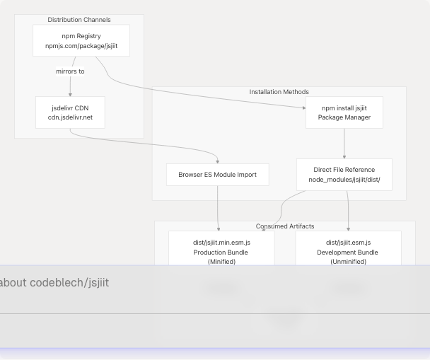
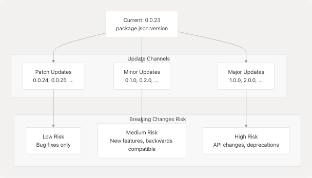

# Installation

This document provides detailed installation instructions for the jsjiit library across different environments and use cases. It covers CDN-based browser installation, npm package installation, version selection, and system requirements.

For a quick introduction to using the library after installation, see [Quick Start Guide](2.2-quick-start-guide). For details about the build artifacts and distribution pipeline, see [Build and Distribution](5-build-and-distribution).

---

## Installation Overview

The jsjiit library is distributed through two primary channels: the jsdelivr CDN for browser applications and the npm registry for projects with package managers. Both methods provide access to the same ES module bundles generated by the build system.



**Sources:** [package.json1-61](https://github.com/codeblech/jsjiit/blob/d123b782/package.json#L1-L61) [README.md20-28](https://github.com/codeblech/jsjiit/blob/d123b782/README.md#L20-L28)

---

## System Requirements

The jsjiit library targets modern browser environments with ES2020+ support. No polyfills or transpilation are required for supported environments.

| Requirement | Specification | Notes |
| --- | --- | --- |
| **JavaScript Version** | ES2020 or later | ES modules with async/await support |
| **Browser Type** | Modern browsers | Chrome 80+, Firefox 74+, Safari 13.1+, Edge 80+ |
| **Module System** | ES Modules (ESM) | Uses `import` statements |
| **Package Type** | Pure ESM | No CommonJS support |
| **Runtime** | Browser only | Not compatible with Node.js runtime |

**Sources:** [package.json8](https://github.com/codeblech/jsjiit/blob/d123b782/package.json#L8-L8) [package.json22-25](https://github.com/codeblech/jsjiit/blob/d123b782/package.json#L22-L25)

---

## Installation Methods Comparison

The following table compares the available installation methods to help you choose the appropriate approach:

| Method | Use Case | Bundle Access | Version Control | Build Step Required |
| --- | --- | --- | --- | --- |
| **CDN Import** | Quick prototyping, static sites | `jsjiit.min.esm.js` only | Manual URL update | No |
| **npm Install** | Production applications, version locking | All bundles + sources | `package.json` managed | No (pre-built) |
| **Direct File** | Custom build pipelines, bundler integration | All bundles + sources | Manual file management | Depends on use case |

**Sources:** [package.json6-7](https://github.com/codeblech/jsjiit/blob/d123b782/package.json#L6-L7) [package.json22-29](https://github.com/codeblech/jsjiit/blob/d123b782/package.json#L22-L29)

---

## CDN Installation (Recommended for Browser Applications)

The jsdelivr CDN provides immediate access to the jsjiit library without requiring a package manager. This method is ideal for browser-based applications, demos, and rapid prototyping.

### Import Syntax

```
<script type="module">
  import { WebPortal } from 'https://cdn.jsdelivr.net/npm/jsjiit@0.0.23/dist/jsjiit.min.esm.js';

  // Library is now available
  const portal = new WebPortal();
</script>
```

### CDN URL Structure


**Sources:** [README.md24](https://github.com/codeblech/jsjiit/blob/d123b782/README.md#L24-L24) [package.json2-3](https://github.com/codeblech/jsjiit/blob/d123b782/package.json#L2-L3) [package.json22-25](https://github.com/codeblech/jsjiit/blob/d123b782/package.json#L22-L25)

### Version Pinning Strategies

| Strategy | URL Format | Behavior | Recommended For |
| --- | --- | --- | --- |
| **Exact Version** | `jsjiit@0.0.23/dist/...` | Fixed version, no auto-updates | Production deployments |
| **Latest Version** | `jsjiit/dist/...` | Auto-updates to newest release | Development, testing |
| **Minor Range** | `jsjiit@0.0.x/dist/...` | Updates within 0.0.\* series | Balanced approach |

### Available CDN Bundles

The CDN provides access to both production and development bundles:

```
https://cdn.jsdelivr.net/npm/jsjiit@0.0.23/dist/jsjiit.min.esm.js  // Minified production
https://cdn.jsdelivr.net/npm/jsjiit@0.0.23/dist/jsjiit.esm.js      // Unminified development
https://cdn.jsdelivr.net/npm/jsjiit@0.0.23/dist/jsjiit.min.esm.js.map  // Source map
```

**Sources:** [package.json6-7](https://github.com/codeblech/jsjiit/blob/d123b782/package.json#L6-L7) [README.md24](https://github.com/codeblech/jsjiit/blob/d123b782/README.md#L24-L24)

---

## NPM Installation

For projects using npm, yarn, or pnpm, the jsjiit package can be installed as a dependency. This method provides version locking through `package-lock.json` and access to all distributed files.

### Installation Command

```
# Using npm
npm install jsjiit

# Using yarn
yarn add jsjiit

# Using pnpm
pnpm add jsjiit
```

### Package Resolution Flow


**Sources:** [package.json1-29](https://github.com/codeblech/jsjiit/blob/d123b782/package.json#L1-L29)

### Import Syntax After Installation

Once installed via npm, the library can be imported using the package name:

```
// ES module import (recommended)
import { WebPortal } from 'jsjiit';

// The import resolves to dist/jsjiit.esm.js via package.json:exports
```

### Package.json Export Configuration

The jsjiit package defines specific export paths that determine which files are used by different tools:

| Field | Path | Resolved By |
| --- | --- | --- |
| `main` | `src/index.js` | Legacy CommonJS tools (fallback) |
| `module` | `dist/jsjiit.esm.js` | Modern bundlers (webpack, rollup) |
| `browser` | `dist/jsjiit.esm.js` | Browser-aware bundlers |
| `exports.import` | `dist/jsjiit.esm.js` | Node.js ESM resolution |

**Sources:** [package.json5-7](https://github.com/codeblech/jsjiit/blob/d123b782/package.json#L5-L7) [package.json22-25](https://github.com/codeblech/jsjiit/blob/d123b782/package.json#L22-L25)

### Included Files

The npm package includes only the files specified in the `files` field:

```
node_modules/jsjiit/
├── dist/
│   ├── jsjiit.min.esm.js      (production bundle)
│   ├── jsjiit.min.esm.js.map  (source map)
│   ├── jsjiit.esm.js          (development bundle)
│   └── jsjiit.esm.js.map      (source map)
├── src/
│   ├── index.js               (public API surface)
│   ├── wrapper.js             (WebPortal classes)
│   ├── encryption.js          (AES-CBC cryptography)
│   ├── attendance.js          (data models)
│   ├── registration.js        (data models)
│   ├── exam.js                (data models)
│   ├── exceptions.js          (error classes)
│   ├── feedback.js            (enums)
│   └── utils.js               (utilities)
└── package.json
```

**Sources:** [package.json26-29](https://github.com/codeblech/jsjiit/blob/d123b782/package.json#L26-L29)

---

## Direct File Usage

For advanced use cases requiring direct file access, the library files can be referenced explicitly. This is useful for custom bundler configurations or when debugging.

### Accessing Specific Bundles

```
// Import minified production bundle directly
import { WebPortal } from './node_modules/jsjiit/dist/jsjiit.min.esm.js';

// Import unminified development bundle for debugging
import { WebPortal } from './node_modules/jsjiit/dist/jsjiit.esm.js';

// Import from source (requires bundler)
import { WebPortal } from './node_modules/jsjiit/src/index.js';
```

### Bundle Characteristics

| Bundle | Size | Minified | Source Map | Use Case |
| --- | --- | --- | --- | --- |
| `dist/jsjiit.min.esm.js` | Smallest | Yes | Yes | Production deployment |
| `dist/jsjiit.esm.js` | Larger | No | Yes | Development debugging |
| `src/index.js` | N/A | No | N/A | Custom build pipeline |

**Sources:** [package.json6-7](https://github.com/codeblech/jsjiit/blob/d123b782/package.json#L6-L7) [package.json26-29](https://github.com/codeblech/jsjiit/blob/d123b782/package.json#L26-L29)

---

## Version Selection and Updates

The jsjiit library follows semantic versioning. The current stable version is defined in `package.json`.

### Checking Installed Version

```
// After import
import { WebPortal } from 'jsjiit';

// The version is not exposed programmatically
// Check package.json or npm list instead
```
# Check installed version via npm
npm list jsjiit

# View package information
npm info jsjiit

# Check latest available version
npm show jsjiit version
```

### Version Update Strategy



**Sources:** [package.json3](https://github.com/codeblech/jsjiit/blob/d123b782/package.json#L3-L3) [README.md27-28](https://github.com/codeblech/jsjiit/blob/d123b782/README.md#L27-L28)

### Updating the Package

```
# Update to latest version
npm update jsjiit

# Update to specific version
npm install jsjiit@0.0.24

# Update to latest within semver range
npm install jsjiit@^0.0.23
```

---

## Installation Verification

After installation, verify the library is accessible and functioning correctly.

### Basic Import Test

```
<script type="module">
  import { WebPortal } from 'https://cdn.jsdelivr.net/npm/jsjiit@0.0.23/dist/jsjiit.min.esm.js';

  // Verify WebPortal class is available
  console.log('WebPortal constructor:', typeof WebPortal);  // "function"

  // Verify instantiation
  const portal = new WebPortal();
  console.log('WebPortal instance:', portal);

  // Check for key methods
  console.log('student_login method:', typeof portal.student_login);  // "function"
</script>
```

### Verification Checklist

| Check | Expected Result | Failure Indicates |
| --- | --- | --- |
| Import succeeds | No error thrown | Correct URL/path, network access |
| `typeof WebPortal` | `"function"` | Valid export, ES module support |
| `new WebPortal()` | Object instance | Constructor works, no initialization errors |
| `typeof portal.student_login` | `"function"` | Public API surface intact |

**Sources:** [README.md34-38](https://github.com/codeblech/jsjiit/blob/d123b782/README.md#L34-L38) [src/index.js1-10](https://github.com/codeblech/jsjiit/blob/d123b782/src/index.js#L1-L10) (referenced indirectly)

---

## Troubleshooting

### Common Installation Issues

| Symptom | Possible Cause | Solution |
| --- | --- | --- |
| `Uncaught SyntaxError` in import | Missing `type="module"` attribute | Add to `<script>` tag |
| `Cannot use import statement` | Non-module script context | Wrap in `<script type="module">` |
| `404 Not Found` from CDN | Incorrect version number | Verify version exists on npm/jsdelivr |
| Module not found after npm install | Import path incorrect | Use `'jsjiit'` not relative path |
| Wrong bundle loaded | Export field misconfiguration | Check bundler ESM support |

### Browser Console Verification

```
// Test in browser console after import
import('https://cdn.jsdelivr.net/npm/jsjiit@0.0.23/dist/jsjiit.min.esm.js')
  .then(module => {
    console.log('Available exports:', Object.keys(module));
    // Expected: ["WebPortal", ...]
  })
  .catch(err => {
    console.error('Import failed:', err);
  });
```

**Sources:** [README.md20-28](https://github.com/codeblech/jsjiit/blob/d123b782/README.md#L20-L28) [package.json8](https://github.com/codeblech/jsjiit/blob/d123b782/package.json#L8-L8)

---

## Next Steps

After successful installation, proceed to [Quick Start Guide](2.2-quick-start-guide) to learn basic usage patterns, or consult the [API Reference](3-api-reference) for comprehensive documentation of all available methods and classes.

For information about the build system that produces these distribution artifacts, see [Build System](5.1-build-system). For details on dependency management and the development toolchain, see [Dependency Management](5.3-dependency-management).
