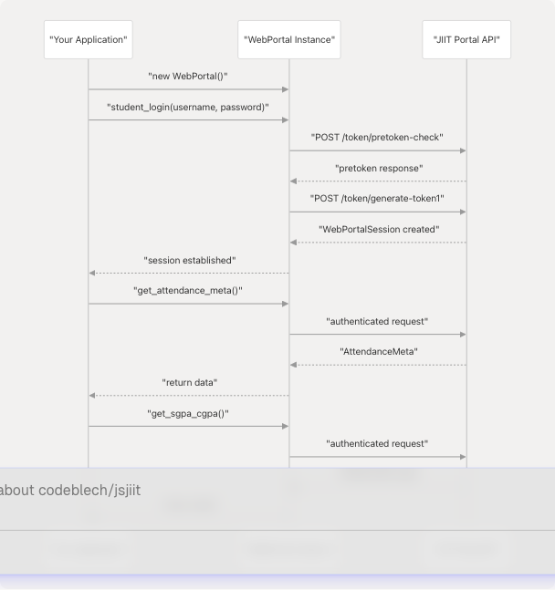
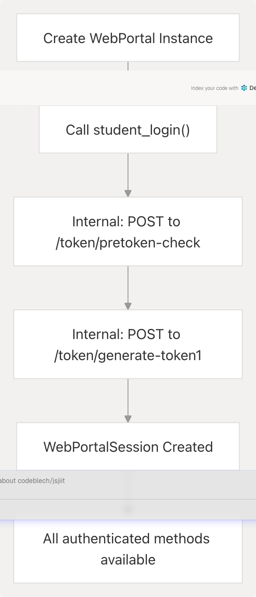
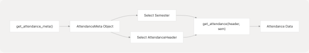

# Quick Start Guide

> Source: https://deepwiki.com/codeblech/jsjiit/2.2-quick-start-guide

# Quick Start Guide

Relevant source files

* [README.md](https://github.com/codeblech/jsjiit/blob/d123b782/README.md)
* [src/feedback.js](https://github.com/codeblech/jsjiit/blob/d123b782/src/feedback.js)
* [src/wrapper.js](https://github.com/codeblech/jsjiit/blob/d123b782/src/wrapper.js)
* [test.html](https://github.com/codeblech/jsjiit/blob/d123b782/test.html)

## Purpose and Scope

This guide provides minimal working examples to get you started with the jsjiit library, covering authentication and basic data retrieval operations. It is designed for developers who want to quickly understand the core usage patterns and start making API calls to the JIIT Web Portal.

For detailed installation instructions, see [Installation](/codeblech/jsjiit/2.1-installation). For comprehensive API documentation of all available methods, see [API Reference](/codeblech/jsjiit/3-api-reference). For information about the internal architecture and security mechanisms, see [Architecture and Design](/codeblech/jsjiit/4-architecture-and-design).

## Overview of Basic Usage Flow

The jsjiit library follows a simple pattern: import the `WebPortal` class, authenticate, then call methods to retrieve data. All data retrieval methods require prior authentication and return Promises.

**Basic Usage Pattern**


```

Sources: [src/wrapper.js75-186](https://github.com/codeblech/jsjiit/blob/d123b782/src/wrapper.js#L75-L186) [README.md21-39](https://github.com/codeblech/jsjiit/blob/d123b782/README.md#L21-L39)

## Importing the Library

The library can be imported as an ES module from the CDN or from local source files.

### From CDN (Production)

```
```
import { WebPortal } from 'https://cdn.jsdelivr.net/npm/jsjiit@0.0.23/dist/jsjiit.min.esm.js';
```
```

### From Local Source (Development)

```
```
import { WebPortal } from "./src/index.js";
```
```

| Import Method | Use Case | File Path |
| --- | --- | --- |
| CDN (versioned) | Production applications | `jsjiit@{version}/dist/jsjiit.min.esm.js` |
| CDN (latest) | Always use latest version | `jsjiit/dist/jsjiit.esm.js` |
| Local source | Development and testing | `./src/index.js` |

Sources: [README.md21-24](https://github.com/codeblech/jsjiit/blob/d123b782/README.md#L21-L24) [test.html18-20](https://github.com/codeblech/jsjiit/blob/d123b782/test.html#L18-L20)

## Authentication

All API operations require authentication. The `student_login()` method creates a `WebPortalSession` and stores it in the `WebPortal` instance.

**Authentication Flow**

```

```

### Basic Authentication Example

```
```
// Create portal instance
const portal = new WebPortal();

// Authenticate with username and password
await portal.student_login('your_username', 'your_password');

// Session is now established and stored in portal.session
// All subsequent API calls will be authenticated
```
```

The `student_login()` method accepts three parameters:

| Parameter | Type | Required | Default | Description |
| --- | --- | --- | --- | --- |
| `username` | string | Yes | - | Student username/enrollment number |
| `password` | string | Yes | - | Student password |
| `captcha` | object | No | `DEFCAPTCHA` | CAPTCHA bypass object |

The default CAPTCHA value (`DEFCAPTCHA`) is defined at [src/wrapper.js20](https://github.com/codeblech/jsjiit/blob/d123b782/src/wrapper.js#L20-L20) and enables login without manual CAPTCHA solving.

Sources: [src/wrapper.js168-186](https://github.com/codeblech/jsjiit/blob/d123b782/src/wrapper.js#L168-L186) [README.md32-38](https://github.com/codeblech/jsjiit/blob/d123b782/README.md#L32-L38)

## Common Data Retrieval Patterns

Once authenticated, the `WebPortal` instance provides methods to retrieve various types of data. Most methods follow a two-step pattern: first retrieve metadata (like available semesters), then fetch specific data for a selected item.

### Pattern 1: Attendance Data

```
```
// Step 1: Get attendance metadata
const meta = await portal.get_attendance_meta();

// Step 2: Select semester and header
const sem = meta.latest_semester();
const header = meta.latest_header();

// Step 3: Get attendance details
const attendance = await portal.get_attendance(header, sem);
```
```

**Attendance Retrieval Flow**

```

```

Sources: [src/wrapper.js243-277](https://github.com/codeblech/jsjiit/blob/d123b782/src/wrapper.js#L243-L277) [README.md50-55](https://github.com/codeblech/jsjiit/blob/d123b782/README.md#L50-L55)

### Pattern 2: Subject-Level Attendance

For detailed attendance of individual classes within a subject:

```
```
// After retrieving attendance as shown above
const subjectIndex = 1;
let subjectid = attendance["studentattendancelist"][subjectIndex]["subjectid"];
let individualsubjectcode = attendance["studentattendancelist"][subjectIndex]["individualsubjectcode"];

// Extract component IDs (Lecture, Practical, Tutorial)
const possibleComponentCodes = ["Lsubjectcomponentid", "Psubjectcomponentid", "Tsubjectcomponentid"];
let subjectcomponentids = [];
for (let possibleComponentCode of possibleComponentCodes) {
    if (attendance["studentattendancelist"][subjectIndex][possibleComponentCode]) {
        subjectcomponentids.push(attendance["studentattendancelist"][subjectIndex][possibleComponentCode]);
    }
}

// Get daily attendance for the subject
let subjectAttendance = await portal.get_subject_daily_attendance(
    sem, 
    subjectid, 
    individualsubjectcode, 
    subjectcomponentids
);
```
```

Sources: [src/wrapper.js287-300](https://github.com/codeblech/jsjiit/blob/d123b782/src/wrapper.js#L287-L300) [README.md57-69](https://github.com/codeblech/jsjiit/blob/d123b782/README.md#L57-L69)

### Pattern 3: Academic Performance (SGPA/CGPA)
```
// Direct retrieval - no metadata required
const sgpaCgpa = await portal.get_sgpa_cgpa();
```
```

Sources: [src/wrapper.js499-509](https://github.com/codeblech/jsjiit/blob/d123b782/src/wrapper.js#L499-L509) [README.md71-73](https://github.com/codeblech/jsjiit/blob/d123b782/README.md#L71-L73)

### Pattern 4: Grade Cards

```
```
// Step 1: Get available semesters
const gradeCardSems = await portal.get_semesters_for_grade_card();

// Step 2: Select semester (index 0 is latest)
const latestSem = gradeCardSems[0];

// Step 3: Retrieve grade card
const grades = await portal.get_grade_card(latestSem);
```
```

Sources: [src/wrapper.js437-476](https://github.com/codeblech/jsjiit/blob/d123b782/src/wrapper.js#L437-L476) [README.md43-47](https://github.com/codeblech/jsjiit/blob/d123b782/README.md#L43-L47)

### Pattern 5: Registered Subjects and Faculties

```
```
// Step 1: Get registered semesters
const registeredSems = await portal.get_registered_semesters();

// Step 2: Select semester
const latestSem = registeredSems[0];

// Step 3: Get subjects and faculty information
const registeredSubjects = await portal.get_registered_subjects_and_faculties(latestSem);
```
```

Sources: [src/wrapper.js306-331](https://github.com/codeblech/jsjiit/blob/d123b782/src/wrapper.js#L306-L331) [README.md81-85](https://github.com/codeblech/jsjiit/blob/d123b782/README.md#L81-L85)

### Pattern 6: Exam Events and Schedule

```
```
// Step 1: Get semesters with exam events
const examSems = await portal.get_semesters_for_exam_events();

// Step 2: Select semester
const latestSem = examSems[0];

// Step 3: Get exam events for that semester
const examEvents = await portal.get_exam_events(latestSem);

// Step 4: Get schedule for specific exam event
const examSchedule = await portal.get_exam_schedule(examEvents[0]);
```
```

Sources: [src/wrapper.js337-379](https://github.com/codeblech/jsjiit/blob/d123b782/src/wrapper.js#L337-L379) [README.md87-92](https://github.com/codeblech/jsjiit/blob/d123b782/README.md#L87-L92)

## Method Categories and Return Types

The following table summarizes the common methods and their return types:

| Category | Method | Returns | Requires Metadata |
| --- | --- | --- | --- |
| **Authentication** | `student_login()` | `WebPortalSession` | No |
| **Attendance** | `get_attendance_meta()` | `AttendanceMeta` | No |
|  | `get_attendance()` | Object | Yes (header + semester) |
|  | `get_subject_daily_attendance()` | Object | Yes (semester + subject info) |
| **Academic Records** | `get_sgpa_cgpa()` | Object | No |
|  | `get_semesters_for_grade_card()` | `Array<Semester>` | No |
|  | `get_grade_card()` | Object | Yes (semester) |
|  | `get_semesters_for_marks()` | `Array<Semester>` | No |
|  | `download_marks()` | void (triggers download) | Yes (semester) |
| **Registration** | `get_registered_semesters()` | `Array<Semester>` | No |
|  | `get_registered_subjects_and_faculties()` | `Registrations` | Yes (semester) |
| **Exams** | `get_semesters_for_exam_events()` | `Array<Semester>` | No |
|  | `get_exam_events()` | `Array<ExamEvent>` | Yes (semester) |
|  | `get_exam_schedule()` | Object | Yes (exam event) |
| **Personal** | `get_personal_info()` | Object | No |

Sources: [src/wrapper.js192-671](https://github.com/codeblech/jsjiit/blob/d123b782/src/wrapper.js#L192-L671)

## Complete Working Example

Here is a minimal HTML page that demonstrates the complete flow:

```
```
<!DOCTYPE html>
<html lang="en">
<head>
    <meta charset="UTF-8">
    <title>jsjiit Quick Start</title>
</head>
<body>
    <script type="module">
        import { WebPortal } from 'https://cdn.jsdelivr.net/npm/jsjiit@0.0.23/dist/jsjiit.min.esm.js';

        async function main() {
            // Create portal instance
            const portal = new WebPortal();

            // Authenticate
            await portal.student_login('username', 'password');

            // Get SGPA/CGPA
            const sgpaCgpa = await portal.get_sgpa_cgpa();
            console.log('Academic Performance:', sgpaCgpa);

            // Get attendance
            const meta = await portal.get_attendance_meta();
            const sem = meta.latest_semester();
            const header = meta.latest_header();
            const attendance = await portal.get_attendance(header, sem);
            console.log('Attendance:', attendance);
        }

        main().catch(console.error);
    </script>
</body>
</html>
```
```

Sources: [test.html1-92](https://github.com/codeblech/jsjiit/blob/d123b782/test.html#L1-L92) [README.md21-55](https://github.com/codeblech/jsjiit/blob/d123b782/README.md#L21-L55)

## Error Handling Basics

All authenticated methods require a valid session. If you call a method without logging in first, a `NotLoggedIn` exception will be thrown. For detailed error handling strategies, see [Error Handling](/codeblech/jsjiit/3.8-error-handling).

```
```
import { WebPortal, LoginError } from './src/index.js';

const portal = new WebPortal();

try {
    await portal.student_login(username, password);
} catch (e) {
    if (e instanceof LoginError) {
        console.error('Login failed:', e.message);
        return;
    }
}

// Now safe to call authenticated methods
```
```

**Common Exception Types**

| Exception Class | Thrown When | Location |
| --- | --- | --- |
| `LoginError` | Login credentials are invalid or API error during login | [src/exceptions.js](https://github.com/codeblech/jsjiit/blob/d123b782/src/exceptions.js) |
| `NotLoggedIn` | Calling authenticated method without login | [src/exceptions.js](https://github.com/codeblech/jsjiit/blob/d123b782/src/exceptions.js) |
| `SessionExpired` | Session token has expired (HTTP 401) | [src/exceptions.js](https://github.com/codeblech/jsjiit/blob/d123b782/src/exceptions.js) |
| `APIError` | General API communication error | [src/exceptions.js](https://github.com/codeblech/jsjiit/blob/d123b782/src/exceptions.js) |

Sources: [src/wrapper.js679-719](https://github.com/codeblech/jsjiit/blob/d123b782/src/wrapper.js#L679-L719) [test.html25-34](https://github.com/codeblech/jsjiit/blob/d123b782/test.html#L25-L34) [src/exceptions.js](https://github.com/codeblech/jsjiit/blob/d123b782/src/exceptions.js)

## Data Model Objects

Several methods return typed objects rather than raw JSON. These objects provide convenient access to structured data:

| Class | Returned By | Key Properties | Source File |
| --- | --- | --- | --- |
| `WebPortalSession` | `student_login()` | `token`, `memberid`, `name`, `enrollmentno`, `expiry` | [src/wrapper.js25-70](https://github.com/codeblech/jsjiit/blob/d123b782/src/wrapper.js#L25-L70) |
| `AttendanceMeta` | `get_attendance_meta()` | `headers`, `semesters`, methods: `latest_semester()`, `latest_header()` | [src/attendance.js](https://github.com/codeblech/jsjiit/blob/d123b782/src/attendance.js) |
| `Semester` | Various `get_semesters_*()` methods | `registration_id`, `registration_code` | [src/attendance.js](https://github.com/codeblech/jsjiit/blob/d123b782/src/attendance.js) |
| `AttendanceHeader` | From `AttendanceMeta.headers` | `stynumber` | [src/attendance.js](https://github.com/codeblech/jsjiit/blob/d123b782/src/attendance.js) |
| `Registrations` | `get_registered_subjects_and_faculties()` | Subject and faculty information | [src/registration.js](https://github.com/codeblech/jsjiit/blob/d123b782/src/registration.js) |
| `ExamEvent` | `get_exam_events()` | `exam_event_id`, `registration_id` | [src/exam.js](https://github.com/codeblech/jsjiit/blob/d123b782/src/exam.js) |

For complete documentation of these data models, see [Data Models](/codeblech/jsjiit/3.9-data-models).

Sources: [src/wrapper.js25-70](https://github.com/codeblech/jsjiit/blob/d123b782/src/wrapper.js#L25-L70) [src/attendance.js1-100](https://github.com/codeblech/jsjiit/blob/d123b782/src/attendance.js#L1-L100) [src/registration.js1-50](https://github.com/codeblech/jsjiit/blob/d123b782/src/registration.js#L1-L50) [src/exam.js1-30](https://github.com/codeblech/jsjiit/blob/d123b782/src/exam.js#L1-L30)

## Next Steps

Now that you understand the basic usage patterns:

1. **Explore all available methods**: See [API Reference](/codeblech/jsjiit/3-api-reference) for comprehensive documentation of all `WebPortal` methods
2. **Understand authentication lifecycle**: See [Authentication and Session Management](/codeblech/jsjiit/3.2-authentication-and-session-management) for details on session tokens and expiry
3. **Learn about error handling**: See [Error Handling](/codeblech/jsjiit/3.8-error-handling) for recommended exception handling strategies
4. **Review security mechanisms**: See [Encryption and Security](/codeblech/jsjiit/4.2-encryption-and-security) to understand how data is encrypted during transmission
5. **Set up local development**: See [Local Development Setup](/codeblech/jsjiit/7.1-local-development-setup) if you want to modify or contribute to the library

Sources: [README.md1-113](https://github.com/codeblech/jsjiit/blob/d123b782/README.md#L1-L113)