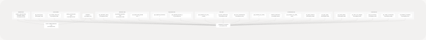
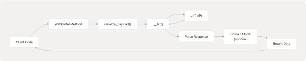

# WebPortal Class

## Purpose and Scope

This document provides a comprehensive reference for the `WebPortal` class, which is the primary interface for interacting with the JIIT Web Portal API. The class abstracts the complexity of authentication, encryption, and API communication, providing a simple async/await interface for accessing student data.

This page covers the `WebPortal` class structure, initialization, session management, and the internal HTTP client architecture. For detailed documentation of specific method groups, see:

* Authentication details: [Authentication and Session Management](/codeblech/jsjiit/3.2-authentication-and-session-management)
* Attendance methods: [Attendance Methods](/codeblech/jsjiit/3.3-attendance-methods)
* Registration methods: [Registration and Subject Methods](/codeblech/jsjiit/3.4-registration-and-subject-methods)
* Exam methods: [Exam and Schedule Methods](/codeblech/jsjiit/3.5-exam-and-schedule-methods)
* Academic records: [Academic Records Methods](/codeblech/jsjiit/3.6-academic-records-methods)
* Feedback and account operations: [Feedback and Account Methods](/codeblech/jsjiit/3.7-feedback-and-account-methods)
* Error types and handling: [Error Handling](/codeblech/jsjiit/3.8-error-handling)
* Return type structures: [Data Models](/codeblech/jsjiit/3.9-data-models)

**Sources:** [src/wrapper.js72-671](https://github.com/codeblech/jsjiit/blob/d123b782/src/wrapper.js#L72-L671) [README.md1-113](https://github.com/codeblech/jsjiit/blob/d123b782/README.md#L1-L113)

---

## Class Structure

The `WebPortal` class is defined in [src/wrapper.js75-671](https://github.com/codeblech/jsjiit/blob/d123b782/src/wrapper.js#L75-L671) and serves as the main API wrapper. It maintains a single session object and provides methods for all portal operations.

### Constructor

```
constructor()
```

The constructor initializes a new `WebPortal` instance with no active session. The session is set to `null` until authentication succeeds.

**Location:** [src/wrapper.js79-81](https://github.com/codeblech/jsjiit/blob/d123b782/src/wrapper.js#L79-L81)

**Properties:**

| Property | Type | Description |
| --- | --- | --- |
| `session` | `WebPortalSession` | `null` | Active session object after login, `null` before authentication |

### WebPortal Class Architecture


```

**Sources:** [src/wrapper.js75-671](https://github.com/codeblech/jsjiit/blob/d123b782/src/wrapper.js#L75-L671)

---

## Session Management

The `WebPortal` class collaborates with the `WebPortalSession` class to manage authentication state. After successful login, the session object stores credentials and provides methods for generating authenticated headers.

### WebPortalSession Class

The `WebPortalSession` class is defined in [src/wrapper.js25-70](https://github.com/codeblech/jsjiit/blob/d123b782/src/wrapper.js#L25-L70) and encapsulates all session-related data:

| Property | Type | Description | Source |
| --- | --- | --- | --- |
| `raw_response` | `Object` | Complete API response from login | Line 40 |
| `regdata` | `Object` | Registration data containing user details | Line 41 |
| `institute` | `string` | Institute name label | Line 44 |
| `instituteid` | `string` | Institute identifier | Line 45 |
| `memberid` | `string` | User's member ID | Line 46 |
| `userid` | `string` | User ID | Line 47 |
| `token` | `string` | JWT authentication token | Line 49 |
| `expiry` | `Date` | Token expiration timestamp | Line 51 |
| `clientid` | `string` | Client identifier | Line 53 |
| `membertype` | `string` | Type of member (e.g., "S" for student) | Line 54 |
| `name` | `string` | User's full name | Line 55 |
| `enrollmentno` | `string` | Enrollment number | Line 56 |

### Session Creation Flow


**Sources:** [src/wrapper.js25-70](https://github.com/codeblech/jsjiit/blob/d123b782/src/wrapper.js#L25-L70) [src/wrapper.js168-186](https://github.com/codeblech/jsjiit/blob/d123b782/src/wrapper.js#L168-L186)

---

## HTTP Client Architecture

The `__hit()` method ([src/wrapper.js97-158](https://github.com/codeblech/jsjiit/blob/d123b782/src/wrapper.js#L97-L158)) is the internal HTTP client that all API methods use. It handles request construction, header management, error handling, and response parsing.

### Method Signature

```
async __hit(method, url, options = {})
```

**Parameters:**

| Parameter | Type | Description |
| --- | --- | --- |
| `method` | `string` | HTTP method (GET, POST, etc.) |
| `url` | `string` | Full API endpoint URL |
| `options.headers` | `Object` | Additional headers to include |
| `options.json` | `Object` | JSON payload (auto-stringified) |
| `options.body` | `string` | Raw body payload |
| `options.authenticated` | `boolean` | Whether request requires authentication |
| `options.exception` | `Error` | Custom exception class to throw on error |

**Returns:** `Promise<Object>` - Parsed JSON response from API

**Throws:** Exception class specified in `options.exception`, defaults to `APIError`

### Request Processing Pipeline


**Sources:** [src/wrapper.js97-158](https://github.com/codeblech/jsjiit/blob/d123b782/src/wrapper.js#L97-L158)

### Error Handling Strategy

The `__hit()` method implements a multi-layered error handling strategy:

1. **HTTP Status Errors** ([src/wrapper.js138-143](https://github.com/codeblech/jsjiit/blob/d123b782/src/wrapper.js#L138-L143)):

   * `513`: Server temporarily unavailable
   * `401`: Session expired (throws `SessionExpired`)
2. **Response Status Errors** ([src/wrapper.js147-149](https://github.com/codeblech/jsjiit/blob/d123b782/src/wrapper.js#L147-L149)):

   * Checks `resp.status.responseStatus !== "Success"`
   * Throws exception with formatted status details
3. **Network Errors** ([src/wrapper.js151-157](https://github.com/codeblech/jsjiit/blob/d123b782/src/wrapper.js#L151-L157)):

   * Catches `TypeError` for CORS failures
   * Re-throws with appropriate error message

**Sources:** [src/wrapper.js97-158](https://github.com/codeblech/jsjiit/blob/d123b782/src/wrapper.js#L97-L158) [src/exceptions.js1](https://github.com/codeblech/jsjiit/blob/d123b782/src/exceptions.js#L1-LNaN)

---

## API Constants

The module exports two constants used throughout the library:

### API Base URL

```
export const API = "https://webportal.jiit.ac.in:6011/StudentPortalAPI";
```

**Location:** [src/wrapper.js14](https://github.com/codeblech/jsjiit/blob/d123b782/src/wrapper.js#L14-L14)

All API endpoints are constructed by appending paths to this base URL.

### Default CAPTCHA

```
export const DEFCAPTCHA = { captcha: "phw5n", hidden: "gmBctEffdSg=" };
```

**Location:** [src/wrapper.js20](https://github.com/codeblech/jsjiit/blob/d123b782/src/wrapper.js#L20-L20)

Default CAPTCHA values used for login, bypassing manual CAPTCHA entry. These values are provided by the JIIT portal and enable automated login.

**Sources:** [src/wrapper.js14](https://github.com/codeblech/jsjiit/blob/d123b782/src/wrapper.js#L14-L14) [src/wrapper.js20](https://github.com/codeblech/jsjiit/blob/d123b782/src/wrapper.js#L20-L20)

---

## Method Organization by Category

The `WebPortal` class provides 25+ public methods organized into functional categories:

### Method Categories Table

| Category | Method Count | Example Methods | Authentication Required |
| --- | --- | --- | --- |
| Authentication | 1 | `student_login()` | No |
| Personal Data | 3 | `get_personal_info()`, `get_student_bank_info()`, `change_password()` | Yes |
| Attendance | 3 | `get_attendance_meta()`, `get_attendance()`, `get_subject_daily_attendance()` | Yes |
| Registration | 2 | `get_registered_semesters()`, `get_registered_subjects_and_faculties()` | Yes |
| Exam Events | 3 | `get_semesters_for_exam_events()`, `get_exam_events()`, `get_exam_schedule()` | Yes |
| Academic Records | 5 | `get_semesters_for_marks()`, `download_marks()`, `get_grade_card()`, `get_sgpa_cgpa()` | Yes |
| Financial | 2 | `get_fines_msc_charges()`, `get_fee_summary()` | Yes |
| Other Services | 3 | `get_hostel_details()`, `get_subject_choices()`, `fill_feedback_form()` | Yes |

### Data Flow Pattern

Most methods follow a common pattern:



**Sources:** [src/wrapper.js192-670](https://github.com/codeblech/jsjiit/blob/d123b782/src/wrapper.js#L192-L670)

---

## Authentication Decorator Pattern

The `WebPortal` class uses a decorator pattern to enforce authentication requirements on methods. This is implemented using the `authenticated()` function ([src/wrapper.js679-686](https://github.com/codeblech/jsjiit/blob/d123b782/src/wrapper.js#L679-L686)) and applied to methods listed in the `authenticatedMethods` array ([src/wrapper.js692-715](https://github.com/codeblech/jsjiit/blob/d123b782/src/wrapper.js#L692-L715)).

### Decorator Implementation


### Protected Methods List

The following methods are wrapped with the `authenticated()` decorator ([src/wrapper.js692-715](https://github.com/codeblech/jsjiit/blob/d123b782/src/wrapper.js#L692-L715)):

* `get_personal_info`
* `get_student_bank_info`
* `change_password`
* `get_attendance_meta`
* `get_attendance`
* `get_subject_daily_attendance`
* `get_registered_semesters`
* `get_registered_subjects_and_faculties`
* `get_semesters_for_exam_events`
* `get_exam_events`
* `get_exam_schedule`
* `get_semesters_for_marks`
* `download_marks`
* `get_semesters_for_grade_card`
* `get_grade_card`
* `get_sgpa_cgpa`
* `get_hostel_details`
* `get_fines_msc_charges`
* `get_fee_summary`
* `get_subject_choices`

The decorator is applied to the prototype in [src/wrapper.js717-719](https://github.com/codeblech/jsjiit/blob/d123b782/src/wrapper.js#L717-L719):

```
authenticatedMethods.forEach((methodName) => {
  WebPortal.prototype[methodName] = authenticated(WebPortal.prototype[methodName]);
});
```

**Sources:** [src/wrapper.js679-719](https://github.com/codeblech/jsjiit/blob/d123b782/src/wrapper.js#L679-L719)

---

## Usage Patterns

### Basic Initialization and Login

```
import { WebPortal } from 'https://cdn.jsdelivr.net/npm/jsjiit/dist/jsjiit.min.esm.js';

const portal = new WebPortal();
await portal.student_login('username', 'password');
```

**Sources:** [README.md21-38](https://github.com/codeblech/jsjiit/blob/d123b782/README.md#L21-L38) [test.html20-34](https://github.com/codeblech/jsjiit/blob/d123b782/test.html#L20-L34)

### Typical Method Call Flow

1. **Create Instance:** `new WebPortal()`
2. **Authenticate:** `await portal.student_login(user, pass)`
3. **Fetch Metadata:** Many operations require fetching metadata first (e.g., semesters, headers)
4. **Retrieve Data:** Use metadata to request specific data
5. **Handle Errors:** Wrap calls in try-catch for error handling

### Example: Attendance Retrieval Workflow

```
// Get metadata
const meta = await portal.get_attendance_meta();
const semester = meta.latest_semester();
const header = meta.latest_header();

// Get attendance
const attendance = await portal.get_attendance(header, semester);
```

**Sources:** [README.md50-55](https://github.com/codeblech/jsjiit/blob/d123b782/README.md#L50-L55) [test.html36-42](https://github.com/codeblech/jsjiit/blob/d123b782/test.html#L36-L42)

### Example: Grade Card Retrieval Workflow

```
// Get available semesters
const semesters = await portal.get_semesters_for_grade_card();

// Get grade card for latest semester
const grades = await portal.get_grade_card(semesters[0]);
```

**Sources:** [README.md43-47](https://github.com/codeblech/jsjiit/blob/d123b782/README.md#L43-L47) [test.html72-75](https://github.com/codeblech/jsjiit/blob/d123b782/test.html#L72-L75)

---

## Integration with Other Modules

The `WebPortal` class depends on several other modules:

### Module Dependencies

| Module | Import | Purpose |
| --- | --- | --- |
| `exceptions.js` | Exception classes | Error handling ([src/wrapper.js1](https://github.com/codeblech/jsjiit/blob/d123b782/src/wrapper.js#L1-L1)) |
| `registration.js` | `RegisteredSubject`, `Registrations` | Data models ([src/wrapper.js2](https://github.com/codeblech/jsjiit/blob/d123b782/src/wrapper.js#L2-L2)) |
| `attendance.js` | `AttendanceMeta`, `AttendanceHeader`, `Semester` | Data models ([src/wrapper.js3](https://github.com/codeblech/jsjiit/blob/d123b782/src/wrapper.js#L3-L3)) |
| `exam.js` | `ExamEvent` | Data models ([src/wrapper.js4](https://github.com/codeblech/jsjiit/blob/d123b782/src/wrapper.js#L4-L4)) |
| `encryption.js` | `generate_local_name`, `serialize_payload` | Security functions ([src/wrapper.js5](https://github.com/codeblech/jsjiit/blob/d123b782/src/wrapper.js#L5-L5)) |

### Relationship with Domain Models

```


**Sources:** [src/wrapper.js1-5](https://github.com/codeblech/jsjiit/blob/d123b782/src/wrapper.js#L1-L5) [src/attendance.js1](https://github.com/codeblech/jsjiit/blob/d123b782/src/attendance.js#L1-LNaN) [src/registration.js1](https://github.com/codeblech/jsjiit/blob/d123b782/src/registration.js#L1-LNaN) [src/exam.js1](https://github.com/codeblech/jsjiit/blob/d123b782/src/exam.js#L1-LNaN)

---

## Private Methods

The `WebPortal` class includes two private helper methods (prefixed with `__`):

### `__get_program_id()`

**Location:** [src/wrapper.js451-458](https://github.com/codeblech/jsjiit/blob/d123b782/src/wrapper.js#L451-L458)

Retrieves the program ID needed for grade card operations. Called internally by `get_grade_card()`.

### `__get_semester_number()`

**Location:** [src/wrapper.js483-493](https://github.com/codeblech/jsjiit/blob/d123b782/src/wrapper.js#L483-L493)

Retrieves the current semester number for the logged-in student. Called internally by `get_sgpa_cgpa()`.

Both methods are protected by the `authenticated()` decorator ([src/wrapper.js707-708](https://github.com/codeblech/jsjiit/blob/d123b782/src/wrapper.js#L707-L708)).

**Sources:** [src/wrapper.js451-458](https://github.com/codeblech/jsjiit/blob/d123b782/src/wrapper.js#L451-L458) [src/wrapper.js483-493](https://github.com/codeblech/jsjiit/blob/d123b782/src/wrapper.js#L483-L493)
