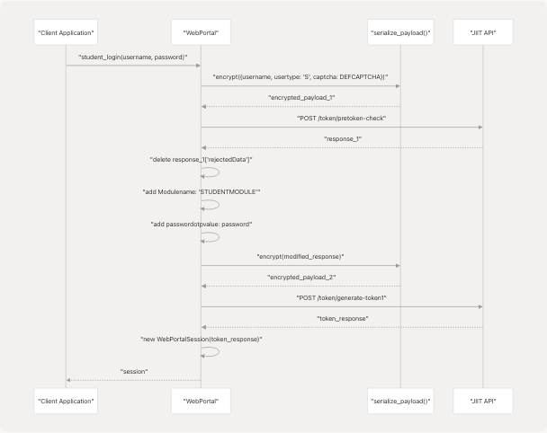
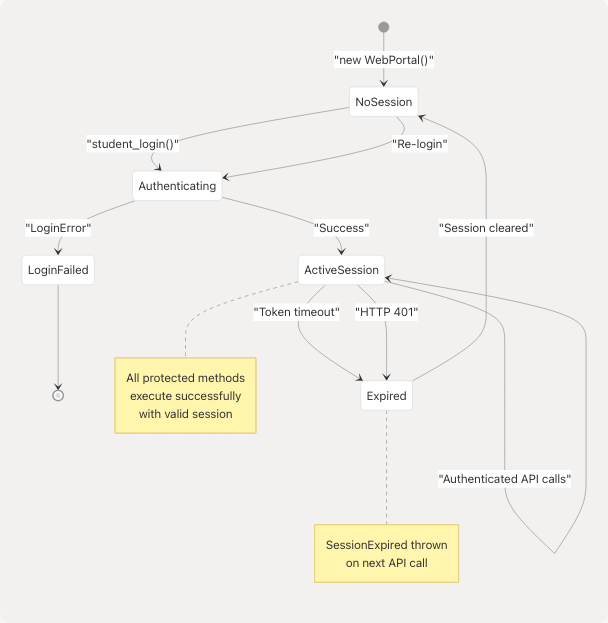

# Authentication and Session Management

Relevant source files

* [README.md](https://github.com/codeblech/jsjiit/blob/d123b782/README.md)
* [src/encryption.js](https://github.com/codeblech/jsjiit/blob/d123b782/src/encryption.js)
* [src/wrapper.js](https://github.com/codeblech/jsjiit/blob/d123b782/src/wrapper.js)

## Purpose and Scope

This document details the authentication mechanisms and session lifecycle management in the jsjiit library. It covers the login flow, CAPTCHA bypass, session token handling, authentication header generation, and the protection of authenticated methods.

For information about the cryptographic primitives used in authentication, see [Encryption and Security](/codeblech/jsjiit/4.2-encryption-and-security). For information about error handling related to authentication failures, see [Error Handling](/codeblech/jsjiit/3.8-error-handling).

---

## Overview

The authentication system implements a two-phase login process that bypasses CAPTCHA validation and establishes a token-based session with the JIIT Web Portal. Once authenticated, all subsequent API requests include authentication headers containing a Bearer token and a dynamically generated LocalName.

**Architecture Diagram: Authentication Components**


```

**Sources:** [src/wrapper.js1-186](https://github.com/codeblech/jsjiit/blob/d123b782/src/wrapper.js#L1-L186) [src/encryption.js43-51](https://github.com/codeblech/jsjiit/blob/d123b782/src/encryption.js#L43-L51) [src/encryption.js91-95](https://github.com/codeblech/jsjiit/blob/d123b782/src/encryption.js#L91-L95)

---

## Login Flow

### Two-Phase Authentication Process

The authentication mechanism consists of two sequential API calls that together establish a valid session.

**Phase 1: Pre-token Check**

The initial phase validates user credentials and CAPTCHA without requiring actual CAPTCHA solving:

```
```
// Endpoint: /token/pretoken-check
let payload = { 
  username: username, 
  usertype: "S", 
  captcha: captcha 
};
```
```

The payload is encrypted using `serialize_payload()` before transmission. The default CAPTCHA values (`DEFCAPTCHA`) are hardcoded constants that bypass the visual CAPTCHA challenge.

**Phase 2: Token Generation**

The second phase uses the response from Phase 1 to generate the authentication token:

```
```
// Endpoint: /token/generate-token1
let payload2 = resp["response"];
delete payload2["rejectedData"];
payload2["Modulename"] = "STUDENTMODULE";
payload2["passwordotpvalue"] = password;
```
```

**Sources:** [src/wrapper.js168-186](https://github.com/codeblech/jsjiit/blob/d123b782/src/wrapper.js#L168-L186) [src/wrapper.js18-20](https://github.com/codeblech/jsjiit/blob/d123b782/src/wrapper.js#L18-L20)

### CAPTCHA Bypass Mechanism

The library bypasses CAPTCHA validation using static credentials stored in the `DEFCAPTCHA` constant:

| Field | Value | Purpose |
| --- | --- | --- |
| `captcha` | `"phw5n"` | CAPTCHA response string |
| `hidden` | `"gmBctEffdSg="` | Hidden validation token |

These values are passed in the initial authentication payload and accepted by the API without requiring user interaction. This mechanism was discovered and implemented by the pyjiit project.

**Sources:** [src/wrapper.js18-20](https://github.com/codeblech/jsjiit/blob/d123b782/src/wrapper.js#L18-L20) [README.md13](https://github.com/codeblech/jsjiit/blob/d123b782/README.md#L13-L13)

### Authentication Sequence Diagram

```

```

**Sources:** [src/wrapper.js168-186](https://github.com/codeblech/jsjiit/blob/d123b782/src/wrapper.js#L168-L186)

---

## WebPortalSession Class

### Session Object Structure

The `WebPortalSession` class encapsulates all session-related data and provides methods for generating authentication headers.

**Class Properties:**

| Property | Type | Source | Description |
| --- | --- | --- | --- |
| `raw_response` | Object | API response | Complete unprocessed response |
| `regdata` | Object | `resp["regdata"]` | Registration data container |
| `institute` | String | `institutelist[0]["label"]` | Institute name |
| `instituteid` | String | `institutelist[0]["value"]` | Institute identifier |
| `memberid` | String | `regdata["memberid"]` | Student member ID |
| `userid` | String | `regdata["userid"]` | User ID |
| `token` | String | `regdata["token"]` | JWT authentication token |
| `expiry` | Date | Decoded from token | Token expiration timestamp |
| `clientid` | String | `regdata["clientid"]` | Client identifier |
| `membertype` | String | `regdata["membertype"]` | Member type (student) |
| `name` | String | `regdata["name"]` | Student name |
| `enrollmentno` | String | `regdata["enrollmentno"]` | Enrollment number |

**Sources:** [src/wrapper.js39-57](https://github.com/codeblech/jsjiit/blob/d123b782/src/wrapper.js#L39-L57)

### Token Structure and Expiry

The authentication token follows the JWT (JSON Web Token) standard. The session expiry is extracted by decoding the token's payload segment:

```
```
// Token format: header.payload.signature
let expiry_timestamp = JSON.parse(atob(this.token.split(".")[1]))["exp"];
this.expiry = new Date(expiry_timestamp * 1000);
```
```

The token's `exp` claim contains a UNIX timestamp (seconds since epoch), which is converted to a JavaScript `Date` object for expiry tracking.

**Sources:** [src/wrapper.js50-51](https://github.com/codeblech/jsjiit/blob/d123b782/src/wrapper.js#L50-L51)

### Authentication Header Generation

The `get_headers()` method generates headers required for authenticated API requests:

```
```
async get_headers() {
  const localname = await generate_local_name();
  return {
    Authorization: `Bearer ${this.token}`,
    LocalName: localname,
  };
}
```
```

**Header Components:**

* **Authorization**: Bearer token for API authentication
* **LocalName**: Dynamically generated encrypted string that includes timestamp information

The `LocalName` header is regenerated for each request and contains:

1. Random character sequence (4 chars)
2. Date sequence (generated from current date)
3. Random suffix (5 chars)

All components are encrypted using AES-CBC before base64 encoding.

**Sources:** [src/wrapper.js63-69](https://github.com/codeblech/jsjiit/blob/d123b782/src/wrapper.js#L63-L69) [src/encryption.js43-51](https://github.com/codeblech/jsjiit/blob/d123b782/src/encryption.js#L43-L51)

---

## Protected Methods and Authentication Decorator

### Authentication Enforcement

All methods that require an active session are protected using the `authenticated()` decorator function:

```
```
function authenticated(method) {
  return function (...args) {
    if (this.session == null) {
      throw new NotLoggedIn();
    }
    return method.apply(this, args);
  };
}
```
```

This decorator wraps protected methods and checks for a valid session before execution. If `this.session` is `null`, it throws a `NotLoggedIn` exception.

**Sources:** [src/wrapper.js679-686](https://github.com/codeblech/jsjiit/blob/d123b782/src/wrapper.js#L679-L686)

### List of Protected Methods

The following methods require authentication and are automatically wrapped with the `authenticated()` decorator:

| Category | Methods |
| --- | --- |
| **Personal Info** | `get_personal_info`, `get_student_bank_info` |
| **Account Management** | `change_password` |
| **Attendance** | `get_attendance_meta`, `get_attendance`, `get_subject_daily_attendance` |
| **Registration** | `get_registered_semesters`, `get_registered_subjects_and_faculties` |
| **Exams** | `get_semesters_for_exam_events`, `get_exam_events`, `get_exam_schedule` |
| **Academic Records** | `get_semesters_for_marks`, `download_marks`, `get_semesters_for_grade_card`, `get_grade_card`, `get_sgpa_cgpa` |
| **Financial** | `get_hostel_details`, `get_fines_msc_charges`, `get_fee_summary` |
| **Other** | `get_subject_choices` |
| **Internal** | `__get_program_id`, `__get_semester_number` |

**Sources:** [src/wrapper.js692-719](https://github.com/codeblech/jsjiit/blob/d123b782/src/wrapper.js#L692-L719)

### Decorator Application

The decorator is applied to all protected methods using JavaScript's prototype modification:

```
```
authenticatedMethods.forEach((methodName) => {
  WebPortal.prototype[methodName] = authenticated(WebPortal.prototype[methodName]);
});
```
```

This pattern ensures consistent authentication checking across all protected operations without code duplication.

**Sources:** [src/wrapper.js717-719](https://github.com/codeblech/jsjiit/blob/d123b782/src/wrapper.js#L717-L719)

---

## Request Authentication Flow

### Internal Request Method

The `__hit()` private method handles all HTTP requests and manages authentication header injection:

**Authentication Flow Diagram:**

```

```

**Sources:** [src/wrapper.js97-158](https://github.com/codeblech/jsjiit/blob/d123b782/src/wrapper.js#L97-L158)

### Header Construction Process

For authenticated requests:

```
```
if (options.authenticated) {
  header = await this.session.get_headers();
} else {
  let localname = await generate_local_name();
  header = { LocalName: localname };
}
```
```

The final request headers always include:

* `Content-Type: application/json`
* `LocalName`: Encrypted timestamp-based identifier
* `Authorization`: Bearer token (only for authenticated requests)

**Sources:** [src/wrapper.js106-118](https://github.com/codeblech/jsjiit/blob/d123b782/src/wrapper.js#L106-L118)

---

## Session Expiry and Error Handling

### Expiry Detection

Session expiry is detected through two mechanisms:

**1. HTTP Status Code Detection:**

```
```
if (response.status === 401) {
  throw new SessionExpired(response.error);
}
```
```

The API returns HTTP 401 when the authentication token has expired or is invalid.

**2. Response Status Field:**

```
```
if (resp.status && resp.status.responseStatus !== "Success") {
  throw new exception(`status:\n${JSON.stringify(resp.status, null, 2)}`);
}
```
```

**Sources:** [src/wrapper.js138-149](https://github.com/codeblech/jsjiit/blob/d123b782/src/wrapper.js#L138-L149)

### Exception Types

| Exception | Thrown When | Location |
| --- | --- | --- |
| `NotLoggedIn` | `session == null` when calling protected method | Decorator function |
| `SessionExpired` | HTTP 401 or non-Success response status | `__hit()` method |
| `LoginError` | Authentication failure during login | `student_login()` |
| `SessionError` | General session-related errors | Various |

**Sources:** [src/wrapper.js1](https://github.com/codeblech/jsjiit/blob/d123b782/src/wrapper.js#L1-L1) [src/exceptions.js](https://github.com/codeblech/jsjiit/blob/d123b782/src/exceptions.js)

### Token Refresh

The library does not implement automatic token refresh. When a session expires, the client must:

1. Catch the `SessionExpired` exception
2. Call `student_login()` again to create a new session
3. Retry the failed operation

**Session Lifecycle Diagram:**

```

```

**Sources:** [src/wrapper.js25-186](https://github.com/codeblech/jsjiit/blob/d123b782/src/wrapper.js#L25-L186)

---

## Integration with Encryption Module

### Payload Encryption

All sensitive request payloads are encrypted before transmission using `serialize_payload()`:

```
```
const payload = await serialize_payload({
  clientid: this.session.clientid,
  instituteid: this.session.instituteid,
  registrationcode: semester.registration_code,
  registrationid: semester.registration_id,
  stynumber: header.stynumber,
});
```
```

The encryption process:

1. JSON stringifies the payload object
2. Encrypts using AES-CBC with date-based key
3. Base64 encodes the encrypted bytes

**Sources:** [src/wrapper.js265-272](https://github.com/codeblech/jsjiit/blob/d123b782/src/wrapper.js#L265-L272) [src/encryption.js91-95](https://github.com/codeblech/jsjiit/blob/d123b782/src/encryption.js#L91-L95)

### LocalName Generation

The `LocalName` header is generated using time-sensitive encryption:

**Component Breakdown:**

```


**Sources:** [src/encryption.js43-51](https://github.com/codeblech/jsjiit/blob/d123b782/src/encryption.js#L43-L51) [src/utils.js](https://github.com/codeblech/jsjiit/blob/d123b782/src/utils.js)

---

## Usage Examples

### Basic Login

```
```
import { WebPortal } from 'jsjiit';

const portal = new WebPortal();
try {
  const session = await portal.student_login('username', 'password');
  console.log('Logged in as:', session.name);
  console.log('Token expires:', session.expiry);
} catch (error) {
  console.error('Login failed:', error);
}
```
```

### Handling Session Expiry

```
```
async function fetchWithRetry(portal, fetchFunc) {
  try {
    return await fetchFunc();
  } catch (error) {
    if (error instanceof SessionExpired) {
      // Re-authenticate
      await portal.student_login('username', 'password');
      // Retry operation
      return await fetchFunc();
    }
    throw error;
  }
}

// Usage
const data = await fetchWithRetry(portal, 
  () => portal.get_attendance_meta()
);
```
```

**Sources:** [README.md32-38](https://github.com/codeblech/jsjiit/blob/d123b782/README.md#L32-L38)

---

## Security Considerations

### Token Storage

The session token is stored in the `WebPortalSession` object in memory. It is never persisted to local storage or cookies, reducing the attack surface for token theft. When the page is closed, the session is destroyed.

### Authentication Header Security

Each request includes:

* **Time-sensitive LocalName**: Changes with each request, preventing replay attacks
* **Bearer token**: Standard JWT format with embedded expiry
* **HTTPS encryption**: All API communications use TLS (port 6011)

### CAPTCHA Bypass Limitations

The static CAPTCHA bypass values may become invalid if the API provider updates their CAPTCHA system. When this occurs, the `student_login()` method will fail with a `LoginError`.

**Sources:** [src/wrapper.js14](https://github.com/codeblech/jsjiit/blob/d123b782/src/wrapper.js#L14-L14) [src/wrapper.js18-20](https://github.com/codeblech/jsjiit/blob/d123b782/src/wrapper.js#L18-L20)