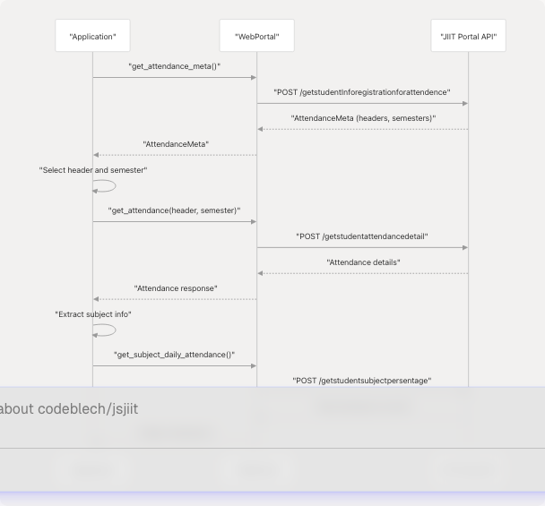

# Attendance Methods

> Source: https://deepwiki.com/codeblech/jsjiit/3.3-attendance-methods

# Attendance Methods

Relevant source files

* [README.md](https://github.com/codeblech/jsjiit/blob/d123b782/README.md)
* [src/attendance.js](https://github.com/codeblech/jsjiit/blob/d123b782/src/attendance.js)
* [src/wrapper.js](https://github.com/codeblech/jsjiit/blob/d123b782/src/wrapper.js)

## Purpose and Scope

This document covers the attendance-related methods exposed by the `WebPortal` class, which enable retrieval of student attendance data from the JIIT Web Portal. These methods provide access to attendance metadata, semester-specific attendance details, and subject-level daily attendance records.

For authentication and session management required before calling these methods, see [Authentication and Session Management](/codeblech/jsjiit/3.2-authentication-and-session-management). For the data model classes returned by these methods, refer to the Data Models section below and [Data Models](/codeblech/jsjiit/3.9-data-models).

---

## Attendance Retrieval Workflow

The attendance retrieval process follows a hierarchical structure where metadata must be retrieved first to obtain the necessary identifiers for more detailed queries.

### Workflow Diagram


```

**Sources:** [src/wrapper.js243-300](https://github.com/codeblech/jsjiit/blob/d123b782/src/wrapper.js#L243-L300) [README.md50-68](https://github.com/codeblech/jsjiit/blob/d123b782/README.md#L50-L68)

---

## Method Reference

### get\_attendance\_meta()

Retrieves attendance metadata including available headers and semesters. This method must be called first to obtain the `AttendanceHeader` and `Semester` objects required by subsequent attendance methods.

#### Signature

```
```
async get_attendance_meta()
```
```

#### Parameters

None.

#### Returns

| Type | Description |
| --- | --- |
| `Promise<AttendanceMeta>` | Object containing lists of attendance headers and semesters |

#### API Endpoint

* **URL:** `/StudentClassAttendance/getstudentInforegistrationforattendence`
* **Method:** POST
* **Authentication:** Required

#### Payload Structure

```
```
{
  clientid: this.session.clientid,
  instituteid: this.session.instituteid,
  membertype: this.session.membertype
}
```
```

#### Implementation Details

The method constructs a payload using session data and sends it to the attendance metadata endpoint. The response is wrapped in an `AttendanceMeta` instance which provides convenient access to headers and semesters.

```

```

**Sources:** [src/wrapper.js243-254](https://github.com/codeblech/jsjiit/blob/d123b782/src/wrapper.js#L243-L254) [src/attendance.js50-76](https://github.com/codeblech/jsjiit/blob/d123b782/src/attendance.js#L50-L76)

---

### get\_attendance()

Retrieves detailed attendance information for a specific semester using the provided header and semester objects.

#### Signature

```
```
async get_attendance(header, semester)
```
```

#### Parameters

| Parameter | Type | Description |
| --- | --- | --- |
| `header` | `AttendanceHeader` | Attendance header obtained from `get_attendance_meta()` |
| `semester` | `Semester` | Semester object obtained from `get_attendance_meta()` |

#### Returns

| Type | Description |
| --- | --- |
| `Promise<Object>` | Attendance details including subject-wise attendance records |

#### Response Structure

The response contains a `studentattendancelist` array where each element represents a subject with the following key fields:

| Field | Description |
| --- | --- |
| `subjectid` | Unique identifier for the subject |
| `individualsubjectcode` | Subject code |
| `Lsubjectcomponentid` | Lecture component ID (if applicable) |
| `Psubjectcomponentid` | Practical component ID (if applicable) |
| `Tsubjectcomponentid` | Tutorial component ID (if applicable) |

#### API Endpoint

* **URL:** `/StudentClassAttendance/getstudentattendancedetail`
* **Method:** POST
* **Authentication:** Required

#### Payload Structure

The payload is encrypted using `serialize_payload()` before transmission:

```
```
{
  clientid: this.session.clientid,
  instituteid: this.session.instituteid,
  registrationcode: semester.registration_code,
  registrationid: semester.registration_id,
  stynumber: header.stynumber
}
```
```

**Sources:** [src/wrapper.js262-277](https://github.com/codeblech/jsjiit/blob/d123b782/src/wrapper.js#L262-L277) [README.md50-56](https://github.com/codeblech/jsjiit/blob/d123b782/README.md#L50-L56)

---

### get\_subject\_daily\_attendance()

Retrieves attendance records for every class of a specific subject within a semester. This provides granular, class-by-class attendance data.

#### Signature

```
```
async get_subject_daily_attendance(semester, subjectid, individualsubjectcode, subjectcomponentids)
```
```

#### Parameters

| Parameter | Type | Description |
| --- | --- | --- |
| `semester` | `Semester` | Semester object |
| `subjectid` | `string` | Subject ID from attendance response |
| `individualsubjectcode` | `string` | Individual subject code from attendance response |
| `subjectcomponentids` | `Array<string>` | Array of component IDs (L/P/T) |

#### Returns

| Type | Description |
| --- | --- |
| `Promise<Object>` | Subject-specific attendance details with daily records |

#### API Endpoint

* **URL:** `/StudentClassAttendance/getstudentsubjectpersentage`
* **Method:** POST
* **Authentication:** Required

#### Payload Structure

The payload is encrypted and includes:

```
```
{
  cmpidkey: subjectcomponentids.map(id => ({ subjectcomponentid: id })),
  clientid: this.session.clientid,
  instituteid: this.session.instituteid,
  registrationcode: semester.registration_code,
  registrationid: semester.registration_id,
  subjectcode: individualsubjectcode,
  subjectid: subjectid
}
```
```

#### Extracting Component IDs

The `subjectcomponentids` array must be constructed by checking which component types exist for the subject:

```
```
const possibleComponentCodes = [
  "Lsubjectcomponentid",  // Lecture
  "Psubjectcomponentid",  // Practical
  "Tsubjectcomponentid"   // Tutorial
];
```
```

**Sources:** [src/wrapper.js287-300](https://github.com/codeblech/jsjiit/blob/d123b782/src/wrapper.js#L287-L300) [README.md57-68](https://github.com/codeblech/jsjiit/blob/d123b782/README.md#L57-L68)

---

## Data Models

### AttendanceHeader

Represents header information for attendance queries.

```

```

| Property | Type | Description |
| --- | --- | --- |
| `branchdesc` | `string` | Branch description (e.g., "Computer Science Engineering") |
| `name` | `string` | Student name |
| `programdesc` | `string` | Program description (e.g., "B.Tech") |
| `stynumber` | `string` | Style number identifier used in API requests |

**Sources:** [src/attendance.js4-27](https://github.com/codeblech/jsjiit/blob/d123b782/src/attendance.js#L4-L27)

---

### Semester

Represents a semester registration.

```

```

| Property | Type | Description |
| --- | --- | --- |
| `registration_code` | `string` | Semester code (e.g., "2023ODD") |
| `registration_id` | `string` | Unique registration identifier |

**Sources:** [src/attendance.js29-48](https://github.com/codeblech/jsjiit/blob/d123b782/src/attendance.js#L29-L48)

---

### AttendanceMeta

Container for attendance metadata including headers and semesters.

```

```

| Property | Type | Description |
| --- | --- | --- |
| `raw_response` | `Object` | Original API response |
| `headers` | `Array<AttendanceHeader>` | List of attendance headers |
| `semesters` | `Array<Semester>` | List of available semesters |

#### Methods

| Method | Returns | Description |
| --- | --- | --- |
| `latest_header()` | `AttendanceHeader` | Returns first (most recent) header |
| `latest_semester()` | `Semester` | Returns first (most recent) semester |

**Sources:** [src/attendance.js50-76](https://github.com/codeblech/jsjiit/blob/d123b782/src/attendance.js#L50-L76)

---

## Complete Usage Example

The following example demonstrates the full workflow for retrieving attendance data:

```
```
// Step 1: Get attendance metadata
const meta = await portal.get_attendance_meta();
const semester = meta.latest_semester();
const header = meta.latest_header();

// Step 2: Get attendance for the semester
const attendance = await portal.get_attendance(header, semester);

// Step 3: Select a subject (e.g., second subject in the list)
const subjectIndex = 1;
const subject = attendance.studentattendancelist[subjectIndex];

// Step 4: Extract subject identifiers
const subjectid = subject.subjectid;
const individualsubjectcode = subject.individualsubjectcode;

// Step 5: Collect all available component IDs
const possibleComponentCodes = [
  "Lsubjectcomponentid",
  "Psubjectcomponentid", 
  "Tsubjectcomponentid"
];

const subjectcomponentids = [];
for (let code of possibleComponentCodes) {
  if (subject[code]) {
    subjectcomponentids.push(subject[code]);
  }
}

// Step 6: Get daily attendance for the subject
const subjectAttendance = await portal.get_subject_daily_attendance(
  semester,
  subjectid,
  individualsubjectcode,
  subjectcomponentids
);
```
```

**Sources:** [README.md50-68](https://github.com/codeblech/jsjiit/blob/d123b782/README.md#L50-L68)

---

## Method Dependencies and Call Graph

```


**Sources:** [src/wrapper.js243-300](https://github.com/codeblech/jsjiit/blob/d123b782/src/wrapper.js#L243-L300) [src/wrapper.js168-186](https://github.com/codeblech/jsjiit/blob/d123b782/src/wrapper.js#L168-L186)

---

## Authentication Requirements

All attendance methods require an authenticated session. They are decorated with the `authenticated` decorator which validates that `this.session` is not null before execution.

| Method | Authentication Required | Decorator Applied |
| --- | --- | --- |
| `get_attendance_meta()` | Yes | Line 696 |
| `get_attendance()` | Yes | Line 697 |
| `get_subject_daily_attendance()` | Yes | Line 698 |

If called without authentication, these methods throw a `NotLoggedIn` exception.

**Sources:** [src/wrapper.js692-719](https://github.com/codeblech/jsjiit/blob/d123b782/src/wrapper.js#L692-L719) [src/exceptions.js](https://github.com/codeblech/jsjiit/blob/d123b782/src/exceptions.js)

---

## Encryption and Security

Both `get_attendance()` and `get_subject_daily_attendance()` use encrypted payloads via the `serialize_payload()` function from the encryption module. This applies AES-CBC encryption to sensitive data before transmission.

For details on the encryption mechanism, see [Encryption and Security](/codeblech/jsjiit/4.2-encryption-and-security).

**Sources:** [src/wrapper.js265-271](https://github.com/codeblech/jsjiit/blob/d123b782/src/wrapper.js#L265-L271) [src/wrapper.js289-297](https://github.com/codeblech/jsjiit/blob/d123b782/src/wrapper.js#L289-L297) [src/encryption.js](https://github.com/codeblech/jsjiit/blob/d123b782/src/encryption.js)

---

## API Endpoint Summary

| Method | Endpoint Path | Encryption Required |
| --- | --- | --- |
| `get_attendance_meta()` | `/StudentClassAttendance/getstudentInforegistrationforattendence` | No |
| `get_attendance()` | `/StudentClassAttendance/getstudentattendancedetail` | Yes |
| `get_subject_daily_attendance()` | `/StudentClassAttendance/getstudentsubjectpersentage` | Yes |

All endpoints are prefixed with the base API URL: `https://webportal.jiit.ac.in:6011/StudentPortalAPI`

**Sources:** [src/wrapper.js14](https://github.com/codeblech/jsjiit/blob/d123b782/src/wrapper.js#L14-L14) [src/wrapper.js244](https://github.com/codeblech/jsjiit/blob/d123b782/src/wrapper.js#L244-L244) [src/wrapper.js263](https://github.com/codeblech/jsjiit/blob/d123b782/src/wrapper.js#L263-L263) [src/wrapper.js288](https://github.com/codeblech/jsjiit/blob/d123b782/src/wrapper.js#L288-L288)