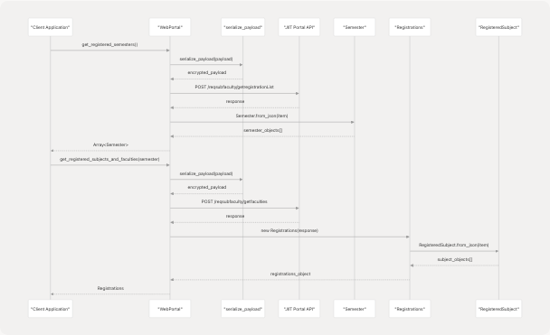
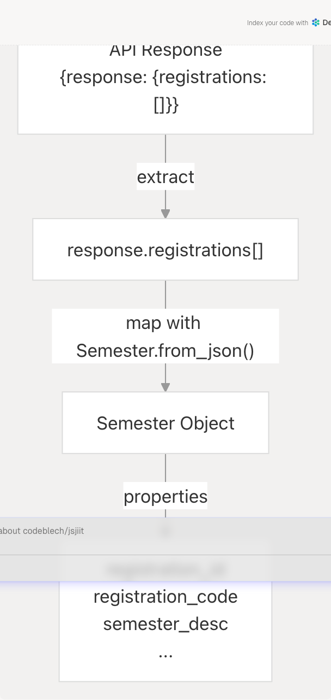
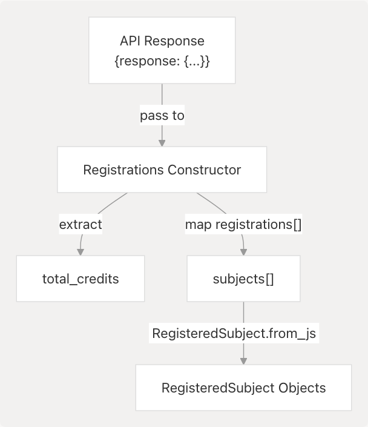

# Registration and Subject Methods

## Purpose and Scope

This document describes the API methods used to retrieve student registration information, including registered subjects, faculty assignments, and semester registrations. These methods allow applications to query which subjects a student is enrolled in for a given semester, along with associated faculty members and credit information.

For authentication and session management, see [Authentication and Session Management](3.2-authentication-and-session-management). For attendance data related to registered subjects, see [Attendance Methods](3.3-attendance-methods). For exam scheduling related to registered subjects, see [Exam and Schedule Methods](3.5-exam-and-schedule-methods).

---

## Overview

The registration API provides two primary methods exposed by the `WebPortal` class:

| Method | Purpose | Returns |
| --- | --- | --- |
| `get_registered_semesters()` | Retrieves list of semesters for which registration data is available | `Array<Semester>` |
| `get_registered_subjects_and_faculties(semester)` | Retrieves detailed subject and faculty information for a specific semester | `Registrations` |

Both methods require an authenticated session and internally use encrypted payload serialization for communication with the JIIT portal API.

**Sources:** [src/wrapper.js306-331](https://github.com/codeblech/jsjiit/blob/d123b782/src/wrapper.js#L306-L331)

---

## Method Reference

### get\_registered\_semesters()

Retrieves the list of semesters for which the authenticated student has registration records available.

**Method Signature:**

```
async get_registered_semesters()
```

**Parameters:** None

**Returns:** `Promise<Array<Semester>>` - Array of `Semester` objects representing available registrations

**Authentication:** Required (enforced via decorator at [src/wrapper.js692-719](https://github.com/codeblech/jsjiit/blob/d123b782/src/wrapper.js#L692-L719))

**API Endpoint:** `/reqsubfaculty/getregistrationList`

**Implementation Details:**

The method constructs a payload containing the student's institute ID and member ID, serializes it using AES-CBC encryption, and sends it to the API endpoint. The response contains a `registrations` array that is mapped to `Semester` objects.

```
// Payload structure
{
  instituteid: this.session.instituteid,
  studentid: this.session.memberid
}
```

**Sources:** [src/wrapper.js306-315](https://github.com/codeblech/jsjiit/blob/d123b782/src/wrapper.js#L306-L315)

---

### get\_registered\_subjects\_and\_faculties(semester)

Retrieves detailed information about all subjects registered for a specific semester, including faculty assignments, credits, and subject components.

**Method Signature:**

```
async get_registered_subjects_and_faculties(semester)
```

**Parameters:**

| Parameter | Type | Description |
| --- | --- | --- |
| `semester` | `Semester` | Semester object obtained from `get_registered_semesters()` |

**Returns:** `Promise<Registrations>` - A `Registrations` object containing subject list and total credits

**Authentication:** Required (enforced via decorator at [src/wrapper.js692-719](https://github.com/codeblech/jsjiit/blob/d123b782/src/wrapper.js#L692-L719))

**API Endpoint:** `/reqsubfaculty/getfaculties`

**Implementation Details:**

The method constructs a payload containing the institute ID, student ID, and registration ID from the provided semester object. The payload is serialized before transmission, and the response is wrapped in a `Registrations` object.

```
// Payload structure
{
  instituteid: this.session.instituteid,
  studentid: this.session.memberid,
  registrationid: semester.registration_id
}
```

**Sources:** [src/wrapper.js322-331](https://github.com/codeblech/jsjiit/blob/d123b782/src/wrapper.js#L322-L331)

---

## Data Models

### RegisteredSubject Class

Represents a single registered subject with its associated metadata.

**Class Definition:** [src/registration.js4-65](https://github.com/codeblech/jsjiit/blob/d123b782/src/registration.js#L4-L65)

**Properties:**

| Property | Type | Description |
| --- | --- | --- |
| `employee_name` | `string` | Name of the assigned faculty member |
| `employee_code` | `string` | Unique code identifying the faculty member |
| `minor_subject` | `string` | Indicates if this is a minor subject |
| `remarks` | `string` | Additional remarks or notes |
| `stytype` | `string` | Study type classification |
| `credits` | `number` | Number of credits for this subject |
| `subject_code` | `string` | Unique subject code |
| `subject_component_code` | `string` | Component code (e.g., lecture, practical, tutorial) |
| `subject_desc` | `string` | Full description of the subject |
| `subject_id` | `string` | Unique identifier for the subject |
| `audtsubject` | `string` | Audit subject flag or information |

**Static Methods:**

* `from_json(resp)` - Constructs a `RegisteredSubject` instance from API response JSON

**Sources:** [src/registration.js4-65](https://github.com/codeblech/jsjiit/blob/d123b782/src/registration.js#L4-L65)

---

### Registrations Class

Aggregates all registered subjects for a semester along with total credit information.

**Class Definition:** [src/registration.js67-77](https://github.com/codeblech/jsjiit/blob/d123b782/src/registration.js#L67-L77)

**Properties:**

| Property | Type | Description |
| --- | --- | --- |
| `raw_response` | `object` | Original API response for reference |
| `total_credits` | `number` | Total credit points for all registered subjects |
| `subjects` | `Array<RegisteredSubject>` | Array of registered subject objects |

**Constructor:**

```
constructor(resp)
```

The constructor automatically maps the `registrations` array from the API response to `RegisteredSubject` objects.

**Sources:** [src/registration.js67-77](https://github.com/codeblech/jsjiit/blob/d123b782/src/registration.js#L67-L77)

---

## API Request Flow



**Diagram: Registration Data Retrieval Sequence**

This diagram illustrates the complete flow from client application request through encryption, API communication, and data model instantiation. Both methods utilize encrypted payloads and return strongly-typed objects.

**Sources:** [src/wrapper.js306-331](https://github.com/codeblech/jsjiit/blob/d123b782/src/wrapper.js#L306-L331) [src/registration.js1-77](https://github.com/codeblech/jsjiit/blob/d123b782/src/registration.js#L1-L77)

---

## Module Dependencies


**Diagram: Registration Module Dependencies**

The registration methods depend on the session object for authentication headers, the encryption module for payload serialization, and the `Semester` class for representing time periods. The `Registrations` class encapsulates an array of `RegisteredSubject` instances.

**Sources:** [src/wrapper.js1-719](https://github.com/codeblech/jsjiit/blob/d123b782/src/wrapper.js#L1-L719) [src/registration.js1-77](https://github.com/codeblech/jsjiit/blob/d123b782/src/registration.js#L1-L77)

---

## Payload Structure and Encryption

Both registration methods utilize encrypted payloads for secure communication with the JIIT portal API.

### get\_registered\_semesters Payload

```
{
  instituteid: string,  // From session.instituteid
  studentid: string     // From session.memberid
}
```

**Encryption:** The payload is serialized using `serialize_payload()` which applies AES-CBC encryption before transmission.

### get\_registered\_subjects\_and\_faculties Payload

```
{
  instituteid: string,     // From session.instituteid
  studentid: string,       // From session.memberid
  registrationid: string   // From semester.registration_id
}
```

**Encryption:** Same serialization process as above.

**Sources:** [src/wrapper.js309-313](https://github.com/codeblech/jsjiit/blob/d123b782/src/wrapper.js#L309-L313) [src/wrapper.js324-328](https://github.com/codeblech/jsjiit/blob/d123b782/src/wrapper.js#L324-L328) [src/encryption.js](https://github.com/codeblech/jsjiit/blob/d123b782/src/encryption.js)

---

## Data Flow Diagram


**Diagram: Registration Method Data Flow**

This flow diagram shows the typical usage pattern where an application first retrieves available semesters, then queries detailed subject information for a selected semester.

**Sources:** [src/wrapper.js306-331](https://github.com/codeblech/jsjiit/blob/d123b782/src/wrapper.js#L306-L331)

---

## Response Structure Mapping

### API Response to Semester Objects



**Diagram: Semester Response Mapping**

Each item in the `registrations` array is transformed into a `Semester` object using the static `from_json()` method.

### API Response to Registrations Object



**Diagram: Registrations Response Mapping**

The `Registrations` constructor processes the API response, extracting total credits and mapping each registration entry to a `RegisteredSubject` object.

**Sources:** [src/registration.js67-77](https://github.com/codeblech/jsjiit/blob/d123b782/src/registration.js#L67-L77) [src/registration.js50-64](https://github.com/codeblech/jsjiit/blob/d123b782/src/registration.js#L50-L64)

---

## Usage Example

The following example demonstrates the typical workflow for retrieving registration information:

```
// From README.md lines 82-84
const portal = new WebPortal();
await portal.student_login('username', 'password');

// Get available semesters
const registeredSems = await portal.get_registered_semesters();
const latestSem = registeredSems[0];

// Get subjects and faculties for latest semester
const registeredSubjects = await portal.get_registered_subjects_and_faculties(latestSem);

// Access data
console.log(`Total Credits: ${registeredSubjects.total_credits}`);
registeredSubjects.subjects.forEach(subject => {
    console.log(`${subject.subject_desc} - ${subject.employee_name} (${subject.credits} credits)`);
});
```

**Sources:** [README.md82-84](https://github.com/codeblech/jsjiit/blob/d123b782/README.md#L82-L84) [src/wrapper.js306-331](https://github.com/codeblech/jsjiit/blob/d123b782/src/wrapper.js#L306-L331) [src/registration.js67-77](https://github.com/codeblech/jsjiit/blob/d123b782/src/registration.js#L67-L77)

---

## Authentication Requirements

Both registration methods require authentication and are wrapped by the `authenticated` decorator:

**Decorator Application:** [src/wrapper.js717-719](https://github.com/codeblech/jsjiit/blob/d123b782/src/wrapper.js#L717-L719)

**Methods in Authenticated List:**

* `get_registered_semesters` (line 699)
* `get_registered_subjects_and_faculties` (line 700)

The decorator checks if `this.session` is null and throws a `NotLoggedIn` exception if the user is not authenticated before executing the method.

**Sources:** [src/wrapper.js679-719](https://github.com/codeblech/jsjiit/blob/d123b782/src/wrapper.js#L679-L719)

---

## Error Handling

### Common Error Scenarios

| Error Type | Condition | Thrown By |
| --- | --- | --- |
| `NotLoggedIn` | Method called before `student_login()` | `authenticated` decorator |
| `SessionExpired` | HTTP 401 response from API | `__hit()` method |
| `APIError` | Non-success response status | `__hit()` method |
| `TypeError` (CORS) | CORS policy blocks request | `__hit()` catch block |

### HTTP Status Codes

* **401**: Session expired, triggers `SessionExpired` exception
* **513**: Portal temporarily unavailable, throws `APIError` with specific message

**Sources:** [src/wrapper.js96-158](https://github.com/codeblech/jsjiit/blob/d123b782/src/wrapper.js#L96-L158) [src/wrapper.js679-686](https://github.com/codeblech/jsjiit/blob/d123b782/src/wrapper.js#L679-L686) [src/exceptions.js](https://github.com/codeblech/jsjiit/blob/d123b782/src/exceptions.js)

---

## Implementation Notes

### Payload Serialization

Both methods use `serialize_payload()` to encrypt request payloads before transmission. This function applies AES-CBC encryption with a dynamically generated key and IV.

**Serialization Call:** [src/wrapper.js309](https://github.com/codeblech/jsjiit/blob/d123b782/src/wrapper.js#L309-L309) [src/wrapper.js324](https://github.com/codeblech/jsjiit/blob/d123b782/src/wrapper.js#L324-L324)

### Authentication Headers

The `__hit()` method automatically attaches authentication headers when `authenticated: true` is specified in the options:

```
{
  Authorization: `Bearer ${this.token}`,
  LocalName: localname
}
```

**Header Generation:** [src/wrapper.js106-112](https://github.com/codeblech/jsjiit/blob/d123b782/src/wrapper.js#L106-L112)

### Semester Parameter

The `get_registered_subjects_and_faculties()` method requires a `Semester` object, which must contain a valid `registration_id` property. This ensures type safety and prevents incorrect parameter passing.

**Sources:** [src/wrapper.js322-331](https://github.com/codeblech/jsjiit/blob/d123b782/src/wrapper.js#L322-L331) [src/attendance.js](https://github.com/codeblech/jsjiit/blob/d123b782/src/attendance.js)
