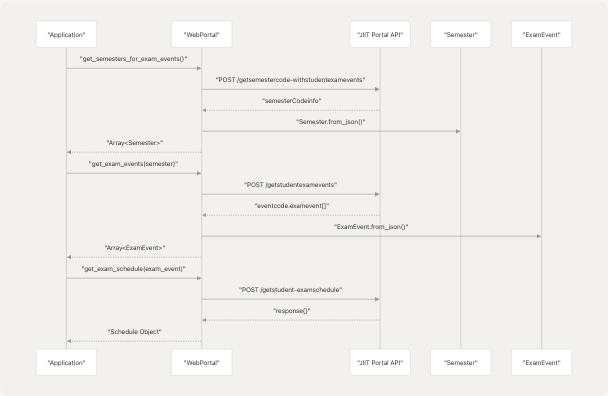
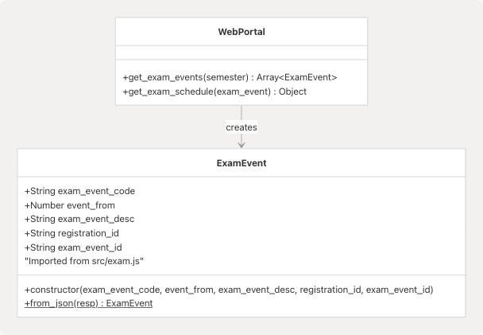
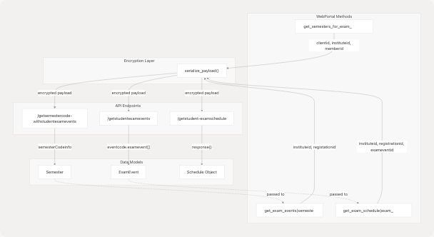

# Exam and Schedule Methods

## Purpose and Scope

This document covers the exam and schedule-related methods in the `WebPortal` class. These methods allow retrieval of exam events, schedules, and venue information from the JIIT web portal. The methods work in a hierarchical flow: first retrieving available semesters with exam data, then getting exam events for a semester, and finally fetching detailed schedules for specific events.

For information about other data retrieval methods, see:

* Attendance data: [Attendance Methods](3.3-attendance-methods)
* Grade and marks data: [Academic Records Methods](3.6-academic-records-methods)
* Registration data: [Registration and Subject Methods](3.4-registration-and-subject-methods)

---

## Overview

The exam and schedule functionality is implemented through three primary methods in the `WebPortal` class and one supporting data model class:

| Method | Purpose | Returns |
| --- | --- | --- |
| `get_semesters_for_exam_events()` | Retrieves semesters that have exam events | `Array<Semester>` |
| `get_exam_events(semester)` | Gets exam events for a specific semester | `Array<ExamEvent>` |
| `get_exam_schedule(exam_event)` | Fetches detailed schedule for an exam event | `Object` |

The `ExamEvent` class ([src/exam.js4-35](https://github.com/codeblech/jsjiit/blob/d123b782/src/exam.js#L4-L35)) encapsulates exam event metadata required for schedule retrieval.

**Sources:** [src/wrapper.js337-379](https://github.com/codeblech/jsjiit/blob/d123b782/src/wrapper.js#L337-L379) [src/exam.js1-36](https://github.com/codeblech/jsjiit/blob/d123b782/src/exam.js#L1-L36) [README.md87-92](https://github.com/codeblech/jsjiit/blob/d123b782/README.md#L87-L92)

---

## Method Call Flow



**Sources:** [src/wrapper.js337-379](https://github.com/codeblech/jsjiit/blob/d123b782/src/wrapper.js#L337-L379) [README.md87-92](https://github.com/codeblech/jsjiit/blob/d123b782/README.md#L87-L92)

---

## Method Reference

### `get_semesters_for_exam_events()`

Retrieves the list of semesters for which exam events are available.

**Signature:**

```
async get_semesters_for_exam_events()
```

**Parameters:** None

**Returns:** `Promise<Array<Semester>>` - Array of semester objects containing exam events

**Implementation Details:**

* Endpoint: `/studentcommonsontroller/getsemestercode-withstudentexamevents` ([src/wrapper.js338](https://github.com/codeblech/jsjiit/blob/d123b782/src/wrapper.js#L338-L338))
* Serializes payload with `clientid`, `instituteid`, and `memberid` ([src/wrapper.js339-343](https://github.com/codeblech/jsjiit/blob/d123b782/src/wrapper.js#L339-L343))
* Maps response array to `Semester` objects using `Semester.from_json()` ([src/wrapper.js346](https://github.com/codeblech/jsjiit/blob/d123b782/src/wrapper.js#L346-L346))
* Requires authentication ([src/wrapper.js701](https://github.com/codeblech/jsjiit/blob/d123b782/src/wrapper.js#L701-L701))

**API Request Payload Structure:**

```
{
  clientid: this.session.clientid,
  instituteid: this.session.instituteid,
  memberid: this.session.memberid
}
```

**Sources:** [src/wrapper.js337-347](https://github.com/codeblech/jsjiit/blob/d123b782/src/wrapper.js#L337-L347)

---

### `get_exam_events(semester)`

Retrieves all exam events (e.g., Mid-term, End-term) for a specific semester.

**Signature:**

```
async get_exam_events(semester)
```

**Parameters:**

| Parameter | Type | Description |
| --- | --- | --- |
| `semester` | `Semester` | Semester object (from `get_semesters_for_exam_events()`) |

**Returns:** `Promise<Array<ExamEvent>>` - Array of exam event objects

**Implementation Details:**

* Endpoint: `/studentcommonsontroller/getstudentexamevents` ([src/wrapper.js355](https://github.com/codeblech/jsjiit/blob/d123b782/src/wrapper.js#L355-L355))
* Uses `registationid` (not a typo - API expects this spelling) from semester ([src/wrapper.js358](https://github.com/codeblech/jsjiit/blob/d123b782/src/wrapper.js#L358-L358))
* Parses response path: `response.eventcode.examevent` ([src/wrapper.js362](https://github.com/codeblech/jsjiit/blob/d123b782/src/wrapper.js#L362-L362))
* Maps each event to `ExamEvent` instances ([src/wrapper.js362](https://github.com/codeblech/jsjiit/blob/d123b782/src/wrapper.js#L362-L362))
* Requires authentication ([src/wrapper.js702](https://github.com/codeblech/jsjiit/blob/d123b782/src/wrapper.js#L702-L702))

**API Request Payload Structure:**

```
{
  instituteid: this.session.instituteid,
  registationid: semester.registration_id  // Note: API typo preserved
}
```

**Sources:** [src/wrapper.js354-363](https://github.com/codeblech/jsjiit/blob/d123b782/src/wrapper.js#L354-L363)

---

### `get_exam_schedule(exam_event)`

Retrieves the detailed exam schedule and venue information for a specific exam event.

**Signature:**

```
async get_exam_schedule(exam_event)
```

**Parameters:**

| Parameter | Type | Description |
| --- | --- | --- |
| `exam_event` | `ExamEvent` | ExamEvent object (from `get_exam_events()`) |

**Returns:** `Promise<Object>` - Raw response object containing schedule details including dates, times, and venues

**Implementation Details:**

* Endpoint: `/studentsttattview/getstudent-examschedule` ([src/wrapper.js371](https://github.com/codeblech/jsjiit/blob/d123b782/src/wrapper.js#L371-L371))
* Requires both `registration_id` and `exameventid` from the ExamEvent ([src/wrapper.js374-375](https://github.com/codeblech/jsjiit/blob/d123b782/src/wrapper.js#L374-L375))
* Returns raw response object without additional processing ([src/wrapper.js378](https://github.com/codeblech/jsjiit/blob/d123b782/src/wrapper.js#L378-L378))
* Requires authentication ([src/wrapper.js703](https://github.com/codeblech/jsjiit/blob/d123b782/src/wrapper.js#L703-L703))

**API Request Payload Structure:**

```
{
  instituteid: this.session.instituteid,
  registrationid: exam_event.registration_id,
  exameventid: exam_event.exam_event_id
}
```

**Sources:** [src/wrapper.js370-379](https://github.com/codeblech/jsjiit/blob/d123b782/src/wrapper.js#L370-L379)

---

## ExamEvent Data Model

The `ExamEvent` class encapsulates exam event metadata required for schedule retrieval.



**Class Properties:**

| Property | Type | Description | Source Field |
| --- | --- | --- | --- |
| `exam_event_code` | `string` | Event code identifier | `exameventcode` |
| `event_from` | `number` | Timestamp for event start | `eventfrom` |
| `exam_event_desc` | `string` | Human-readable event description | `exameventdesc` |
| `registration_id` | `string` | Associated registration ID | `registrationid` |
| `exam_event_id` | `string` | Unique exam event identifier | `exameventid` |

**Static Methods:**

* `from_json(resp)`: Constructs an `ExamEvent` instance from API response JSON ([src/exam.js26-34](https://github.com/codeblech/jsjiit/blob/d123b782/src/exam.js#L26-L34))

**Sources:** [src/exam.js4-35](https://github.com/codeblech/jsjiit/blob/d123b782/src/exam.js#L4-L35)

---

## Data Flow Architecture



**Sources:** [src/wrapper.js337-379](https://github.com/codeblech/jsjiit/blob/d123b782/src/wrapper.js#L337-L379) [src/encryption.js5](https://github.com/codeblech/jsjiit/blob/d123b782/src/encryption.js#L5-L5) [src/exam.js4-35](https://github.com/codeblech/jsjiit/blob/d123b782/src/exam.js#L4-L35)

---

## Complete Usage Example

The following example demonstrates the complete workflow for retrieving exam schedules:

```
// Step 1: Authenticate
const portal = new WebPortal();
await portal.student_login('username', 'password');

// Step 2: Get semesters with exam events
const examSemesters = await portal.get_semesters_for_exam_events();
const latestSemester = examSemesters[0];

// Step 3: Get exam events for the semester
const examEvents = await portal.get_exam_events(latestSemester);

// Step 4: Retrieve schedule for each exam event
for (const event of examEvents) {
    console.log(`Event: ${event.exam_event_desc}`);
    const schedule = await portal.get_exam_schedule(event);
    console.log(schedule);
}
```

**Sources:** [README.md87-92](https://github.com/codeblech/jsjiit/blob/d123b782/README.md#L87-L92) [src/wrapper.js337-379](https://github.com/codeblech/jsjiit/blob/d123b782/src/wrapper.js#L337-L379)

---

## API Endpoint Reference

All exam-related methods use the following base API URL: `https://webportal.jiit.ac.in:6011/StudentPortalAPI` ([src/wrapper.js14](https://github.com/codeblech/jsjiit/blob/d123b782/src/wrapper.js#L14-L14))

| Method | Endpoint Path | Controller |
| --- | --- | --- |
| `get_semesters_for_exam_events()` | `/studentcommonsontroller/getsemestercode-withstudentexamevents` | studentcommonsontroller |
| `get_exam_events()` | `/studentcommonsontroller/getstudentexamevents` | studentcommonsontroller |
| `get_exam_schedule()` | `/studentsttattview/getstudent-examschedule` | studentsttattview |

All requests:

* Use POST method ([src/wrapper.js345](https://github.com/codeblech/jsjiit/blob/d123b782/src/wrapper.js#L345-L345) [src/wrapper.js361](https://github.com/codeblech/jsjiit/blob/d123b782/src/wrapper.js#L361-L361) [src/wrapper.js377](https://github.com/codeblech/jsjiit/blob/d123b782/src/wrapper.js#L377-L377))
* Require authentication tokens ([src/wrapper.js701-703](https://github.com/codeblech/jsjiit/blob/d123b782/src/wrapper.js#L701-L703))
* Use AES-CBC encrypted payloads via `serialize_payload()` ([src/wrapper.js339](https://github.com/codeblech/jsjiit/blob/d123b782/src/wrapper.js#L339-L339) [src/wrapper.js356](https://github.com/codeblech/jsjiit/blob/d123b782/src/wrapper.js#L356-L356) [src/wrapper.js372](https://github.com/codeblech/jsjiit/blob/d123b782/src/wrapper.js#L372-L372))
* Include `LocalName` header for request identification ([src/wrapper.js64-68](https://github.com/codeblech/jsjiit/blob/d123b782/src/wrapper.js#L64-L68))

**Sources:** [src/wrapper.js14](https://github.com/codeblech/jsjiit/blob/d123b782/src/wrapper.js#L14-L14) [src/wrapper.js337-379](https://github.com/codeblech/jsjiit/blob/d123b782/src/wrapper.js#L337-L379) [src/wrapper.js701-703](https://github.com/codeblech/jsjiit/blob/d123b782/src/wrapper.js#L701-L703)

---

## Error Handling

All exam methods inherit the standard error handling behavior from the `WebPortal.__hit()` method:

| Error Type | Scenario | Exception Class |
| --- | --- | --- |
| HTTP 513 | Portal temporarily unavailable | `APIError` |
| HTTP 401 | Session expired | `SessionExpired` |
| Not authenticated | Method called before login | `NotLoggedIn` |
| Invalid response | API returns non-Success status | `APIError` |

For comprehensive error handling documentation, see [Error Handling](3.8-error-handling).

**Sources:** [src/wrapper.js97-158](https://github.com/codeblech/jsjiit/blob/d123b782/src/wrapper.js#L97-L158) [src/wrapper.js679-719](https://github.com/codeblech/jsjiit/blob/d123b782/src/wrapper.js#L679-L719) [src/exceptions.js1-50](https://github.com/codeblech/jsjiit/blob/d123b782/src/exceptions.js#L1-L50)
