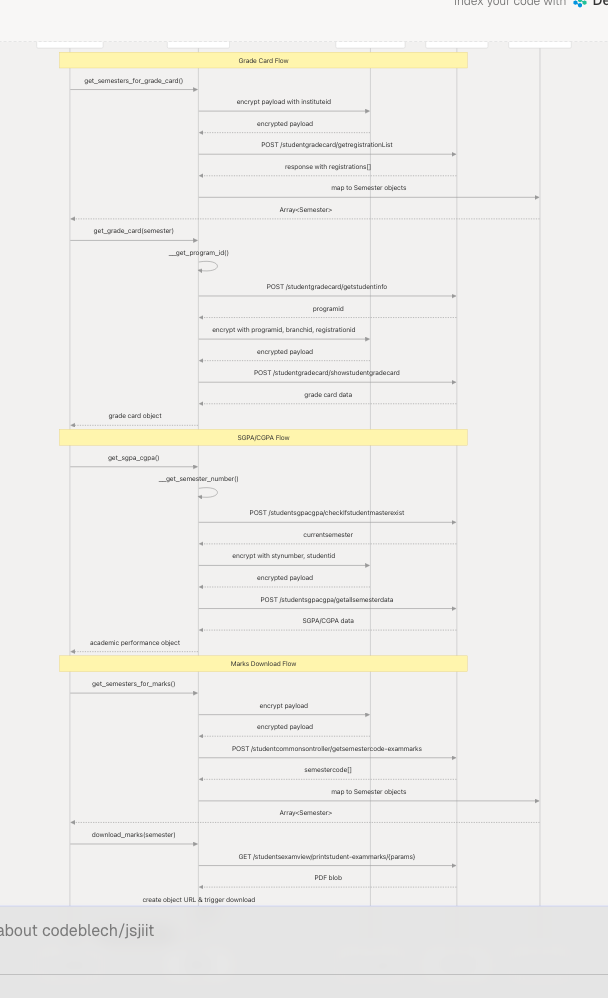

# Academic Records Methods

Relevant source files

* [README.md](https://github.com/codeblech/jsjiit/blob/d123b782/README.md)
* [src/feedback.js](https://github.com/codeblech/jsjiit/blob/d123b782/src/feedback.js)
* [src/wrapper.js](https://github.com/codeblech/jsjiit/blob/d123b782/src/wrapper.js)
* [test.html](https://github.com/codeblech/jsjiit/blob/d123b782/test.html)

## Purpose and Scope

This document provides comprehensive reference documentation for academic record retrieval methods in the jsjiit library. These methods enable programmatic access to student grades, SGPA/CGPA calculations, semester marks, and grade cards from the JIIT Web Portal.

The academic records methods covered here include:

* **Grade card retrieval** for specific semesters
* **SGPA and CGPA** calculation and history
* **Marks download** as PDF documents
* **Semester enumeration** for available academic records

For information about other student data such as attendance and registered subjects, see [Attendance Methods](/codeblech/jsjiit/3.3-attendance-methods) and [Registration and Subject Methods](/codeblech/jsjiit/3.4-registration-and-subject-methods). For session management and authentication requirements, see [Authentication and Session Management](/codeblech/jsjiit/3.2-authentication-and-session-management).

---

## Overview

All academic records methods require an authenticated session and operate on the `WebPortal` class defined in [src/wrapper.js](https://github.com/codeblech/jsjiit/blob/d123b782/src/wrapper.js) These methods interact with various JIIT Web Portal API endpoints to retrieve historical academic performance data.

### Academic Records Method Categories

| Category | Methods | Purpose |
| --- | --- | --- |
| **Grade Cards** | `get_semesters_for_grade_card()` `get_grade_card(semester)` | Retrieve detailed grade cards with subject-wise grades |
| **SGPA/CGPA** | `get_sgpa_cgpa()` | Fetch semester-wise SGPA and cumulative CGPA |
| **Marks** | `get_semesters_for_marks()` `download_marks(semester)` | Download examination marks as PDF documents |
| **Internal Helpers** | `__get_program_id()` `__get_semester_number()` | Private methods used by grade card and SGPA/CGPA methods |

**Sources:** [src/wrapper.js385-509](https://github.com/codeblech/jsjiit/blob/d123b782/src/wrapper.js#L385-L509) [README.md43-79](https://github.com/codeblech/jsjiit/blob/d123b782/README.md#L43-L79)

---

## Method Reference

### Grade Card Methods

#### `get_semesters_for_grade_card()`

Retrieves the list of semesters for which grade cards are available.

**Signature:**

```
```
async get_semesters_for_grade_card(): Promise<Array<Semester>>
```
```

**Returns:** Array of `Semester` objects representing semesters with available grade cards.

**API Endpoint:** `/studentgradecard/getregistrationList`

**Implementation Details:**

* Sends encrypted payload with `instituteid` from the session
* Response contains `registrations` array that is mapped to `Semester` objects
* Each semester object contains `registration_id` needed for `get_grade_card()`

**Example:**

```
```
const gradeCardSems = await portal.get_semesters_for_grade_card();
const latestSem = gradeCardSems[0];
```
```

**Sources:** [src/wrapper.js437-444](https://github.com/codeblech/jsjiit/blob/d123b782/src/wrapper.js#L437-L444) [README.md44-46](https://github.com/codeblech/jsjiit/blob/d123b782/README.md#L44-L46)

---

#### `get_grade_card(semester)`

Retrieves the detailed grade card for a specific semester, including subject-wise grades and performance metrics.

**Signature:**

```
```
async get_grade_card(semester: Semester): Promise<Object>
```
```

**Parameters:**

* `semester` (`Semester`): A semester object obtained from `get_semesters_for_grade_card()`

**Returns:** Object containing grade card data with subject details, grades, and credits.

**API Endpoint:** `/studentgradecard/showstudentgradecard`

**Implementation Details:**

* Internally calls `__get_program_id()` to retrieve the required program identifier
* Sends encrypted payload with:
  + `branchid` from session
  + `instituteid` from session
  + `programid` from helper method
  + `registrationid` from the semester parameter
* Note: `session.branch_id` is referenced but not set in the constructor; this may cause issues in some implementations

**Example:**

```
```
const gradeCardSems = await portal.get_semesters_for_grade_card();
const grades = await portal.get_grade_card(gradeCardSems[0]);
```
```

**Sources:** [src/wrapper.js465-476](https://github.com/codeblech/jsjiit/blob/d123b782/src/wrapper.js#L465-L476) [README.md44-47](https://github.com/codeblech/jsjiit/blob/d123b782/README.md#L44-L47)

---

#### `__get_program_id()` (Private)

Internal helper method that retrieves the student's program ID required for grade card requests.

**Signature:**

```
```
async __get_program_id(): Promise<string>
```
```

**Returns:** String representing the program ID.

**API Endpoint:** `/studentgradecard/getstudentinfo`

**Implementation Details:**

* Sends encrypted payload with `instituteid`
* Extracts `programid` from response
* This method is decorated with the `authenticated` decorator at module level

**Sources:** [src/wrapper.js451-458](https://github.com/codeblech/jsjiit/blob/d123b782/src/wrapper.js#L451-L458) [src/wrapper.js707-719](https://github.com/codeblech/jsjiit/blob/d123b782/src/wrapper.js#L707-L719)

---

### SGPA/CGPA Methods

#### `get_sgpa_cgpa()`

Retrieves semester-wise SGPA (Semester Grade Point Average) and cumulative CGPA (Cumulative Grade Point Average) data for the logged-in student.

**Signature:**

```
```
async get_sgpa_cgpa(): Promise<Object>
```
```

**Returns:** Object containing SGPA and CGPA details for all semesters.

**API Endpoint:** `/studentsgpacgpa/getallsemesterdata`

**Implementation Details:**

* Internally calls `__get_semester_number()` to determine the current semester
* Sends encrypted payload with:
  + `instituteid` from session
  + `studentid` from session
  + `stynumber` from helper method
* Response contains historical semester data with SGPA for each semester and overall CGPA

**Example:**

```
```
const sgpaCgpa = await portal.get_sgpa_cgpa();
console.log(sgpaCgpa);
```
```

**Sources:** [src/wrapper.js499-509](https://github.com/codeblech/jsjiit/blob/d123b782/src/wrapper.js#L499-L509) [README.md71-73](https://github.com/codeblech/jsjiit/blob/d123b782/README.md#L71-L73)

---

#### `__get_semester_number()` (Private)

Internal helper method that retrieves the current semester number for the logged-in student.

**Signature:**

```
```
async __get_semester_number(): Promise<number>
```
```

**Returns:** Number representing the current semester.

**API Endpoint:** `/studentsgpacgpa/checkIfstudentmasterexist`

**Implementation Details:**

* Sends encrypted payload with:
  + `instituteid` from session
  + `studentid` from session (memberid)
  + `name` from session
  + `enrollmentno` from session
* Extracts `currentsemester` from `studentlov` in response
* This method is decorated with the `authenticated` decorator at module level

**Sources:** [src/wrapper.js483-493](https://github.com/codeblech/jsjiit/blob/d123b782/src/wrapper.js#L483-L493) [src/wrapper.js707-719](https://github.com/codeblech/jsjiit/blob/d123b782/src/wrapper.js#L707-L719)

---

### Marks Methods

#### `get_semesters_for_marks()`

Retrieves the list of semesters for which examination marks are available for download.

**Signature:**

```
```
async get_semesters_for_marks(): Promise<Array<Semester>>
```
```

**Returns:** Array of `Semester` objects representing semesters with available marks.

**API Endpoint:** `/studentcommonsontroller/getsemestercode-exammarks`

**Implementation Details:**

* Sends encrypted payload with:
  + `instituteid` from session
  + `studentid` from session (memberid)
* Response contains `semestercode` array that is mapped to `Semester` objects
* Each semester object contains `registration_id` and `registration_code` needed for `download_marks()`

**Example:**

```
```
const marksSems = await portal.get_semesters_for_marks();
const previousSem = marksSems[1];
```
```

**Sources:** [src/wrapper.js385-393](https://github.com/codeblech/jsjiit/blob/d123b782/src/wrapper.js#L385-L393) [README.md76-78](https://github.com/codeblech/jsjiit/blob/d123b782/README.md#L76-L78)

---

#### `download_marks(semester)`

Downloads the examination marks for a specific semester as a PDF file. This method triggers a browser download.

**Signature:**

```
```
async download_marks(semester: Semester): Promise<void>
```
```

**Parameters:**

* `semester` (`Semester`): A semester object obtained from `get_semesters_for_marks()`

**Returns:** Promise that resolves when the download has been initiated (void).

**API Endpoint:** `/studentsexamview/printstudent-exammarks/{instituteid}/{registrationid}/{registrationcode}`

**Implementation Details:**

* Constructs a GET endpoint URL with path parameters:
  + `instituteid` from session
  + `registrationid` from semester parameter
  + `registrationcode` from semester parameter
* Makes authenticated GET request
* Receives PDF blob in response
* Creates temporary object URL and programmatically triggers browser download
* Downloaded file is named `marks_{registration_code}.pdf`
* Cleans up object URL and temporary DOM elements after download

**Throws:** `APIError` on download failure.

**Example:**

```
```
const marksSems = await portal.get_semesters_for_marks();
await portal.download_marks(marksSems[0]);
```
```

**Sources:** [src/wrapper.js400-431](https://github.com/codeblech/jsjiit/blob/d123b782/src/wrapper.js#L400-L431) [README.md76-79](https://github.com/codeblech/jsjiit/blob/d123b782/README.md#L76-L79)

---

## Method Dependency Graph

The following diagram illustrates how academic records methods depend on internal helper methods and the authentication layer:

**Diagram: Academic Records Method Dependencies**


```

**Sources:** [src/wrapper.js385-509](https://github.com/codeblech/jsjiit/blob/d123b782/src/wrapper.js#L385-L509) [src/wrapper.js63-69](https://github.com/codeblech/jsjiit/blob/d123b782/src/wrapper.js#L63-L69) [src/encryption.js](https://github.com/codeblech/jsjiit/blob/d123b782/src/encryption.js)

---

## API Endpoint Mapping

This diagram maps each method to its corresponding JIIT Web Portal API endpoint:

**Diagram: Academic Records API Endpoint Mapping**

```

```

**Sources:** [src/wrapper.js385-509](https://github.com/codeblech/jsjiit/blob/d123b782/src/wrapper.js#L385-L509)

---

## Data Flow Architecture

The following diagram illustrates the complete data flow for academic records retrieval, from method invocation through encryption to API response processing:

**Diagram: Academic Records Data Flow**

```


**Sources:** [src/wrapper.js385-509](https://github.com/codeblech/jsjiit/blob/d123b782/src/wrapper.js#L385-L509) [src/encryption.js](https://github.com/codeblech/jsjiit/blob/d123b782/src/encryption.js) [src/attendance.js](https://github.com/codeblech/jsjiit/blob/d123b782/src/attendance.js)

---

## Payload Structure Reference

### Grade Card Request Payloads

| Method | Payload Fields | Notes |
| --- | --- | --- |
| `get_semesters_for_grade_card()` | `instituteid` | Encrypted payload |
| `__get_program_id()` | `instituteid` | Encrypted payload |
| `get_grade_card()` | `branchid` `instituteid` `programid` `registrationid` | Encrypted payload `branchid` from `session.branch_id` `programid` from helper |

### SGPA/CGPA Request Payloads

| Method | Payload Fields | Notes |
| --- | --- | --- |
| `__get_semester_number()` | `instituteid` `studentid` `name` `enrollmentno` | Encrypted payload All fields from session |
| `get_sgpa_cgpa()` | `instituteid` `studentid` `stynumber` | Encrypted payload `stynumber` from helper |

### Marks Request Payloads

| Method | Payload Fields | Notes |
| --- | --- | --- |
| `get_semesters_for_marks()` | `instituteid` `studentid` | Encrypted payload |
| `download_marks()` | N/A (URL params) | GET request with path params: `/{instituteid}/{registrationid}/{registrationcode}` |

**Sources:** [src/wrapper.js385-509](https://github.com/codeblech/jsjiit/blob/d123b782/src/wrapper.js#L385-L509)

---

## Authentication Requirements

All academic records methods are decorated with the `authenticated` decorator, which enforces that a valid session exists before execution. The decorator is applied at module load time:

```
```
const authenticatedMethods = [
  // ... other methods ...
  "get_semesters_for_marks",
  "download_marks",
  "get_semesters_for_grade_card",
  "__get_program_id",
  "get_grade_card",
  "__get_semester_number",
  "get_sgpa_cgpa",
];

authenticatedMethods.forEach((methodName) => {
  WebPortal.prototype[methodName] = authenticated(WebPortal.prototype[methodName]);
});
```
```

**Throws:** `NotLoggedIn` exception if called before `student_login()`.

**Sources:** [src/wrapper.js692-719](https://github.com/codeblech/jsjiit/blob/d123b782/src/wrapper.js#L692-L719) [src/wrapper.js679-686](https://github.com/codeblech/jsjiit/blob/d123b782/src/wrapper.js#L679-L686)

---

## Usage Examples

### Retrieving Grade Cards

```
```
import { WebPortal } from 'jsjiit';

const portal = new WebPortal();
await portal.student_login('username', 'password');

// Get available semesters
const gradeCardSems = await portal.get_semesters_for_grade_card();

// Get grade card for latest semester
const latestSem = gradeCardSems[0];
const grades = await portal.get_grade_card(latestSem);

console.log(grades);
```
```

### Checking SGPA and CGPA

```
```
// Get all semester SGPA and overall CGPA
const sgpaCgpa = await portal.get_sgpa_cgpa();

console.log('SGPA/CGPA History:', sgpaCgpa);
```
```

### Downloading Examination Marks

```
```
// Get semesters with available marks
const marksSems = await portal.get_semesters_for_marks();

// Download marks for previous semester
const previousSem = marksSems[1];
await portal.download_marks(previousSem);

// Browser download will be triggered automatically
// File will be named: marks_{registration_code}.pdf
```
```

**Sources:** [README.md43-79](https://github.com/codeblech/jsjiit/blob/d123b782/README.md#L43-L79) [test.html72-86](https://github.com/codeblech/jsjiit/blob/d123b782/test.html#L72-L86)

---

## Error Handling

Academic records methods can throw the following exceptions:

| Exception Type | Scenario | Handling |
| --- | --- | --- |
| `NotLoggedIn` | Method called before authentication | Ensure `student_login()` is called first |
| `SessionExpired` | Session token has expired (HTTP 401) | Re-authenticate with `student_login()` |
| `APIError` | Generic API failure or network error | Catch and handle based on error message |
| `TypeError` | CORS errors or network unavailability | JIIT portal may be temporarily unavailable |

All academic records methods use the `__hit()` internal method which provides consistent error handling. For detailed error handling strategies, see [Error Handling](/codeblech/jsjiit/3.8-error-handling).

**Sources:** [src/wrapper.js97-158](https://github.com/codeblech/jsjiit/blob/d123b782/src/wrapper.js#L97-L158) [src/exceptions.js](https://github.com/codeblech/jsjiit/blob/d123b782/src/exceptions.js)

---

## Implementation Notes

### Private Helper Methods

The academic records implementation uses two private helper methods (prefixed with `__`):

1. **`__get_program_id()`** - Required by `get_grade_card()` to construct the correct request payload
2. **`__get_semester_number()`** - Required by `get_sgpa_cgpa()` to identify the current semester context

These methods are marked as authenticated and should not be called directly by client applications.

### Download Mechanism

The `download_marks()` method uses a browser-specific download mechanism:

1. Fetches PDF as blob from API
2. Creates temporary object URL using `window.URL.createObjectURL()`
3. Creates temporary `<a>` element with download attribute
4. Programmatically clicks the element to trigger download
5. Cleans up object URL and DOM element

This approach requires a browser environment and will not work in Node.js or other non-browser JavaScript runtimes.

### Semester Object Usage

Most methods return or accept `Semester` objects, which are defined in [src/attendance.js](https://github.com/codeblech/jsjiit/blob/d123b782/src/attendance.js) The `Semester` class provides:

* `registration_id` - Used in API requests
* `registration_code` - Used in API requests and file naming
* `from_json()` static method for deserialization

**Sources:** [src/wrapper.js400-431](https://github.com/codeblech/jsjiit/blob/d123b782/src/wrapper.js#L400-L431) [src/attendance.js](https://github.com/codeblech/jsjiit/blob/d123b782/src/attendance.js)