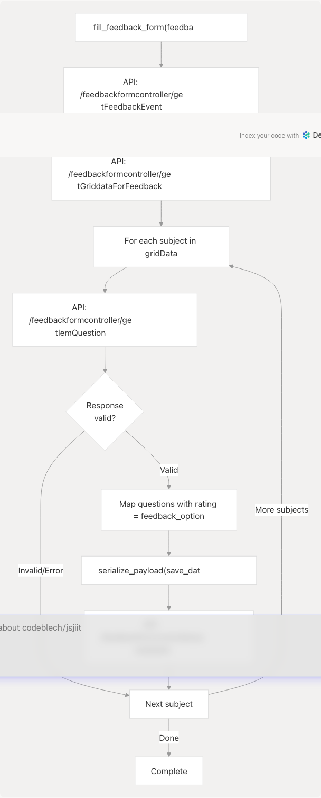

# Feedback and Account Methods

This document covers the account management and feedback submission methods available in the `WebPortal` class. These methods enable users to change their account password and submit automated feedback forms for enrolled courses.

For information about authentication and session lifecycle, see [Authentication and Session Management](/codeblech/jsjiit/3.2-authentication-and-session-management). For other account-related data retrieval methods like personal information, see the respective API reference sections.

## Overview

The jsjiit library provides two primary account-related operations:

| Method | Purpose | Authentication Required |
| --- | --- | --- |
| `change_password()` | Updates the user's portal password | Yes |
| `fill_feedback_form()` | Automatically fills and submits course feedback forms | Yes |

Both methods are defined in the `WebPortal` class and require an active authenticated session.

**Sources:** [src/wrapper.js223-237](https://github.com/codeblech/jsjiit/blob/d123b782/src/wrapper.js#L223-L237) [src/wrapper.js577-670](https://github.com/codeblech/jsjiit/blob/d123b782/src/wrapper.js#L577-L670)

## Method Signatures

### change\_password

```
async change_password(old_password, new_password)
```

Changes the password for the currently logged-in student account.

**Parameters:**

* `old_password` (string): Current password for verification
* `new_password` (string): New password to set

**Returns:** `Promise<Object>` - Response object indicating success or failure

**Throws:** `AccountAPIError` - When password change fails due to incorrect old password, policy violations, or API errors

**Sources:** [src/wrapper.js223-237](https://github.com/codeblech/jsjiit/blob/d123b782/src/wrapper.js#L223-L237)

---

### fill\_feedback\_form

```
async fill_feedback_form(feedback_option)
```

Automatically retrieves all registered courses for the current semester and submits feedback forms with the specified rating for all questions across all subjects.

**Parameters:**

* `feedback_option` (string): Rating value from `FeedbackOptions` enum

**Returns:** `Promise<void>` - Completes when all feedback forms are submitted

**Throws:** `APIError` - On API communication failures

**Sources:** [src/wrapper.js577-670](https://github.com/codeblech/jsjiit/blob/d123b782/src/wrapper.js#L577-L670)

## FeedbackOptions Enumeration

The `FeedbackOptions` object defines valid rating values for feedback form submission. It is a frozen object that acts as an enumeration.

| Constant | Value | Description |
| --- | --- | --- |
| `UNSATISFIED` | `"UNSATISFIED"` | Lowest rating option |
| `SATISFIED` | `"SATISFIED"` | Below average rating |
| `GOOD` | `"GOOD"` | Average rating |
| `VERY_GOOD` | `"VERY_GOOD"` | Above average rating |
| `EXCELLENT` | `"EXCELLENT"` | Highest rating option |

The enumeration is defined in [src/feedback.js1-11](https://github.com/codeblech/jsjiit/blob/d123b782/src/feedback.js#L1-L11) and exported as a frozen object to prevent modification at runtime.

**Sources:** [src/feedback.js1-11](https://github.com/codeblech/jsjiit/blob/d123b782/src/feedback.js#L1-L11)

## Password Change Flow


```

**Implementation Details:**

The `change_password` method constructs a payload containing:

* `membertype`: Retrieved from `this.session.membertype`
* `oldpassword`: The current password for verification
* `newpassword`: The new password to set
* `confirmpassword`: Duplicate of new password for confirmation

The method uses the `/clxuser/changepassword` endpoint and specifies `AccountAPIError` as the exception type for error handling, which is passed to the internal `__hit` method via the `exception` option.

**Sources:** [src/wrapper.js223-237](https://github.com/codeblech/jsjiit/blob/d123b782/src/wrapper.js#L223-L237)

## Feedback Form Submission Flow

The `fill_feedback_form` method implements a complex multi-step process to automate feedback submission for all enrolled courses.



**Sources:** [src/wrapper.js577-670](https://github.com/codeblech/jsjiit/blob/d123b782/src/wrapper.js#L577-L670)

### Feedback Submission Process Details

The feedback submission process consists of the following stages:

#### Stage 1: Retrieve Feedback Event

The method calls the `/feedbackformcontroller/getFeedbackEvent` endpoint to get available feedback events. It selects the latest event from `response.eventList` and extracts:

* `eventcode`: Semester code
* `eventid`: Event identifier
* `eventdescription`: Event description

**Sources:** [src/wrapper.js578-587](https://github.com/codeblech/jsjiit/blob/d123b782/src/wrapper.js#L578-L587)

#### Stage 2: Retrieve Grid Data

Using the `eventid` from Stage 1, the method calls `/feedbackformcontroller/getGriddataForFeedback` with a serialized payload containing:

* `instituteid`
* `studentid`
* `eventid`

The response contains `gridData`, an array of objects representing each enrolled subject-faculty combination.

**Sources:** [src/wrapper.js589-596](https://github.com/codeblech/jsjiit/blob/d123b782/src/wrapper.js#L589-L596)

#### Stage 3: Process Each Subject

For each item in `gridData`, the method constructs a `question_feedback_payload` containing:

| Field | Source |
| --- | --- |
| `instituteid` | `this.session.instituteid` |
| `eventid` | Latest event ID from Stage 1 |
| `eventdescription` | Event description from Stage 1 |
| `facultyid` | `data["employeeid"]` |
| `facultyname` | `data["employeename"]` |
| `registrationid` | `data["registrationid"]` |
| `studentid` | `data["studentid"]` |
| `subjectcode` | `data["subjectcode"]` |
| `subjectcomponentcode` | `data["subjectcomponentcode"]` |
| `subjectcomponentid` | `data["subjectcomponentid"]` |
| `subjectdescription` | `data["subjectdescription"]` |
| `subjectid` | `data["subjectid"]` |

**Sources:** [src/wrapper.js601-616](https://github.com/codeblech/jsjiit/blob/d123b782/src/wrapper.js#L601-L616)

#### Stage 4: Retrieve and Submit Questions

For each subject payload:

1. **Fetch Questions**: Call `/feedbackformcontroller/getIemQuestion` with the payload
2. **Error Handling**: Use try-catch to skip subjects that fail (continue to next iteration)
3. **Validate Response**: Check for `questionList` in response, skip if missing
4. **Map Ratings**: Transform each question object by adding `rating: feedback_option`
5. **Serialize Payload**: Create save payload with `serialize_payload()`
6. **Submit**: POST to `/feedbackformcontroller/savedatalist`

The final save payload structure:

```
{
  instituteid: string,
  studentid: string,
  eventid: string,
  subjectid: string,
  facultyid: string,
  registrationid: string,
  questionid: Array<{...question, rating: feedback_option}>,
  facultycomments: null,
  coursecomments: null
}
```

**Sources:** [src/wrapper.js620-669](https://github.com/codeblech/jsjiit/blob/d123b782/src/wrapper.js#L620-L669)

## Code Entity Mapping

```


**Sources:** [src/wrapper.js223-237](https://github.com/codeblech/jsjiit/blob/d123b782/src/wrapper.js#L223-L237) [src/wrapper.js577-670](https://github.com/codeblech/jsjiit/blob/d123b782/src/wrapper.js#L577-L670) [src/feedback.js1-11](https://github.com/codeblech/jsjiit/blob/d123b782/src/feedback.js#L1-L11)

## Usage Examples

### Changing Password

```
const portal = new WebPortal();
await portal.student_login('username', 'current_password');

try {
  const result = await portal.change_password('current_password', 'new_password');
  console.log('Password changed successfully:', result);
} catch (error) {
  if (error instanceof AccountAPIError) {
    console.error('Failed to change password:', error.message);
  }
}
```

### Submitting Feedback

```
import { WebPortal } from 'jsjiit';
import FeedbackOptions from 'jsjiit/feedback';

const portal = new WebPortal();
await portal.student_login('username', 'password');

// Submit "EXCELLENT" rating for all courses
await portal.fill_feedback_form(FeedbackOptions.EXCELLENT);

// Alternative: use string directly
await portal.fill_feedback_form("VERY_GOOD");
```

**Sources:** [test.html35](https://github.com/codeblech/jsjiit/blob/d123b782/test.html#L35-L35) [README.md33-38](https://github.com/codeblech/jsjiit/blob/d123b782/README.md#L33-L38) [src/feedback.js1-11](https://github.com/codeblech/jsjiit/blob/d123b782/src/feedback.js#L1-L11)

## Error Handling

Both methods implement specific error handling strategies:

### change\_password Errors

The method specifies `AccountAPIError` as the exception type, which is thrown when:

* The old password is incorrect
* The new password violates password policy requirements
* The API endpoint returns a non-Success status
* Network or CORS errors occur

**Sources:** [src/wrapper.js223-237](https://github.com/codeblech/jsjiit/blob/d123b782/src/wrapper.js#L223-L237) [src/exceptions.js1](https://github.com/codeblech/jsjiit/blob/d123b782/src/exceptions.js#L1-L1)

### fill\_feedback\_form Errors

The method implements defensive error handling:

* **Try-Catch Blocks**: Each subject's question retrieval is wrapped in try-catch; errors cause the method to skip that subject and continue
* **Response Validation**: Checks for `questionList` existence before processing; missing data causes the iteration to continue
* **Generic APIError**: Inherits default error handling from `__hit` method
* **Silent Failures**: Individual subject failures do not abort the entire process

**Sources:** [src/wrapper.js621-628](https://github.com/codeblech/jsjiit/blob/d123b782/src/wrapper.js#L621-L628) [src/wrapper.js631-640](https://github.com/codeblech/jsjiit/blob/d123b782/src/wrapper.js#L631-L640)

## Authentication Requirements

Both methods are decorated with the `authenticated` wrapper, which verifies that `this.session` is not null before execution. The methods are listed in the `authenticatedMethods` array at [src/wrapper.js692-715](https://github.com/codeblech/jsjiit/blob/d123b782/src/wrapper.js#L692-L715)

If called without an active session, both methods will throw a `NotLoggedIn` exception before any API calls are made.

**Sources:** [src/wrapper.js679-719](https://github.com/codeblech/jsjiit/blob/d123b782/src/wrapper.js#L679-L719)

## API Endpoint Reference

| Endpoint | Method | Purpose | Payload Serialization |
| --- | --- | --- | --- |
| `/clxuser/changepassword` | POST | Change user password | No (JSON) |
| `/feedbackformcontroller/getFeedbackEvent` | POST | Get available feedback events | No (JSON) |
| `/feedbackformcontroller/getGriddataForFeedback` | POST | Get enrolled subjects for feedback | Yes (AES-CBC) |
| `/feedbackformcontroller/getIemQuestion` | POST | Get feedback questions for subject | No (JSON) |
| `/feedbackformcontroller/savedatalist` | POST | Submit feedback responses | Yes (AES-CBC) |

Note that `fill_feedback_form` uses `serialize_payload()` for the grid data and save data endpoints, indicating these payloads are encrypted using AES-CBC encryption. For details on the encryption mechanism, see [Encryption and Security](/codeblech/jsjiit/4.2-encryption-and-security).

**Sources:** [src/wrapper.js224](https://github.com/codeblech/jsjiit/blob/d123b782/src/wrapper.js#L224-L224) [src/wrapper.js578](https://github.com/codeblech/jsjiit/blob/d123b782/src/wrapper.js#L578-L578) [src/wrapper.js589](https://github.com/codeblech/jsjiit/blob/d123b782/src/wrapper.js#L589-L589) [src/wrapper.js617](https://github.com/codeblech/jsjiit/blob/d123b782/src/wrapper.js#L617-L617) [src/wrapper.js618](https://github.com/codeblech/jsjiit/blob/d123b782/src/wrapper.js#L618-L618)
