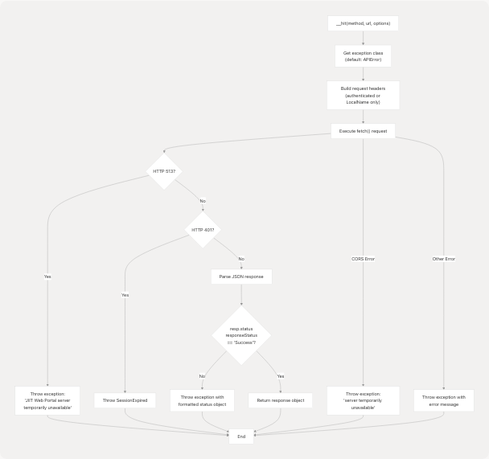
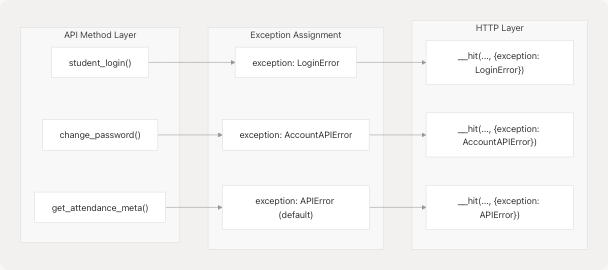
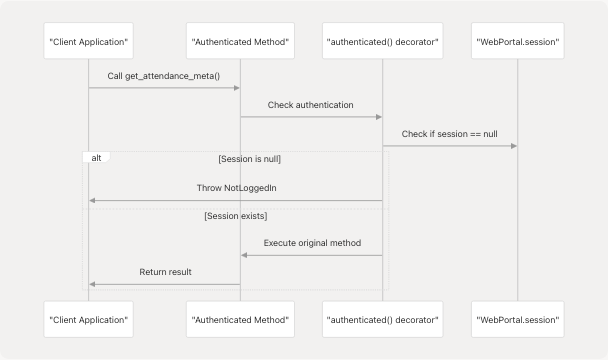

# Error Handling

> Source: https://deepwiki.com/codeblech/jsjiit/3.8-error-handling

# Error Handling

Relevant source files

* [src/exceptions.js](https://github.com/codeblech/jsjiit/blob/d123b782/src/exceptions.js)
* [src/index.js](https://github.com/codeblech/jsjiit/blob/d123b782/src/index.js)
* [src/wrapper.js](https://github.com/codeblech/jsjiit/blob/d123b782/src/wrapper.js)

## Purpose and Scope

This document provides a comprehensive reference for error handling mechanisms in the jsjiit library. It covers the custom exception classes, error scenarios encountered during API interactions, and recommended strategies for handling errors in client applications.

For information about authentication lifecycle and session management, see [Authentication and Session Management](/codeblech/jsjiit/3.2-authentication-and-session-management). For general API reference, see [API Reference](/codeblech/jsjiit/3-api-reference).

---

## Exception Class Hierarchy

The jsjiit library defines six custom exception classes organized in a hierarchical structure. All exceptions extend JavaScript's native `Error` class and provide specialized error handling for different failure scenarios.


```

**Exception Class Hierarchy**: Shows the inheritance structure of all custom exception classes in the library.

**Sources:** [src/exceptions.js1-87](https://github.com/codeblech/jsjiit/blob/d123b782/src/exceptions.js#L1-L87)

---

## Exception Types

The library provides the following exception types, each designed for specific error scenarios:

| Exception Class | Base Class | Purpose | Thrown By |
| --- | --- | --- | --- |
| `APIError` | `Error` | Generic API communication failures, network errors, malformed responses | `__hit()` method, various API methods |
| `LoginError` | `APIError` | Authentication failures, invalid credentials, CAPTCHA errors | `student_login()` |
| `SessionError` | `Error` | Base class for session-related issues | Not thrown directly |
| `SessionExpired` | `SessionError` | JWT token expiration, HTTP 401 responses | `__hit()` when HTTP 401 detected |
| `NotLoggedIn` | `SessionError` | Accessing authenticated methods without active session | `authenticated()` decorator |
| `AccountAPIError` | `Error` | Account management operation failures (e.g., password change) | `change_password()` |

**Sources:** [src/exceptions.js1-87](https://github.com/codeblech/jsjiit/blob/d123b782/src/exceptions.js#L1-L87) [src/wrapper.js1-719](https://github.com/codeblech/jsjiit/blob/d123b782/src/wrapper.js#L1-L719)

---

## Error Detection and Throwing Mechanism

### The `__hit()` Method

The core error handling logic resides in the private `__hit()` method, which processes all HTTP requests and handles various failure scenarios.

```

```

**HTTP Request Error Detection Flow**: Illustrates the error detection logic in the `__hit()` method.

**Sources:** [src/wrapper.js97-158](https://github.com/codeblech/jsjiit/blob/d123b782/src/wrapper.js#L97-L158)

### HTTP Status Code Handling

The `__hit()` method implements specific handling for HTTP status codes:

| HTTP Status | Error Class | Error Message | Line Reference |
| --- | --- | --- | --- |
| 513 | Custom exception (parameter) | "JIIT Web Portal server is temporarily unavailable (HTTP 513). Please try again later." | [src/wrapper.js138-140](https://github.com/codeblech/jsjiit/blob/d123b782/src/wrapper.js#L138-L140) |
| 401 | `SessionExpired` | Uses `response.error` from API | [src/wrapper.js141-143](https://github.com/codeblech/jsjiit/blob/d123b782/src/wrapper.js#L141-L143) |
| CORS Failure | Custom exception (parameter) | "JIIT Web Portal server is temporarily unavailable. Please try again later." | [src/wrapper.js152-155](https://github.com/codeblech/jsjiit/blob/d123b782/src/wrapper.js#L152-L155) |

**Sources:** [src/wrapper.js138-157](https://github.com/codeblech/jsjiit/blob/d123b782/src/wrapper.js#L138-L157)

### Response Status Validation

Beyond HTTP status codes, the library validates the API response's internal status field:

```
```
// From src/wrapper.js:147-149
if (resp.status && resp.status.responseStatus !== "Success") {
  throw new exception(`status:\n${JSON.stringify(resp.status, null, 2)}`);
}
```
```

This catches API-level failures that return HTTP 200 but indicate errors in the response payload.

**Sources:** [src/wrapper.js147-149](https://github.com/codeblech/jsjiit/blob/d123b782/src/wrapper.js#L147-L149)

---

## Custom Exception Assignment

Methods can specify which exception class to throw by passing the `exception` option to `__hit()`:

```

```

**Custom Exception Flow**: Shows how different API methods specify custom exception types for error scenarios.

### Exception Assignment Examples

| Method | Exception Class | Line Reference |
| --- | --- | --- |
| `student_login()` (pretoken check) | `LoginError` | [src/wrapper.js175](https://github.com/codeblech/jsjiit/blob/d123b782/src/wrapper.js#L175-L175) |
| `student_login()` (token generation) | `LoginError` | [src/wrapper.js183](https://github.com/codeblech/jsjiit/blob/d123b782/src/wrapper.js#L183-L183) |
| `change_password()` | `AccountAPIError` | [src/wrapper.js231-235](https://github.com/codeblech/jsjiit/blob/d123b782/src/wrapper.js#L231-L235) |
| All other authenticated methods | `APIError` (default) | [src/wrapper.js98](https://github.com/codeblech/jsjiit/blob/d123b782/src/wrapper.js#L98-L98) |

**Sources:** [src/wrapper.js97-102](https://github.com/codeblech/jsjiit/blob/d123b782/src/wrapper.js#L97-L102) [src/wrapper.js175](https://github.com/codeblech/jsjiit/blob/d123b782/src/wrapper.js#L175-L175) [src/wrapper.js183](https://github.com/codeblech/jsjiit/blob/d123b782/src/wrapper.js#L183-L183) [src/wrapper.js231-235](https://github.com/codeblech/jsjiit/blob/d123b782/src/wrapper.js#L231-L235)

---

## Authentication Enforcement

The library uses a decorator pattern to enforce authentication requirements on protected methods.

### The `authenticated()` Decorator

```

```

**Authentication Decorator Flow**: Demonstrates how the `authenticated()` decorator prevents unauthorized access.

**Sources:** [src/wrapper.js679-686](https://github.com/codeblech/jsjiit/blob/d123b782/src/wrapper.js#L679-L686)

### Protected Methods

The following methods are wrapped with the `authenticated()` decorator and will throw `NotLoggedIn` if called without an active session:

```
```
// From src/wrapper.js:692-715
const authenticatedMethods = [
  "get_personal_info",
  "get_student_bank_info",
  "change_password",
  "get_attendance_meta",
  "get_attendance",
  "get_subject_daily_attendance",
  "get_registered_semesters",
  "get_registered_subjects_and_faculties",
  "get_semesters_for_exam_events",
  "get_exam_events",
  "get_exam_schedule",
  "get_semesters_for_marks",
  "download_marks",
  "get_semesters_for_grade_card",
  "__get_program_id",
  "get_grade_card",
  "__get_semester_number",
  "get_sgpa_cgpa",
  "get_hostel_details",
  "get_fines_msc_charges",
  "get_fee_summary",
  "get_subject_choices",
];
```
```

**Sources:** [src/wrapper.js692-719](https://github.com/codeblech/jsjiit/blob/d123b782/src/wrapper.js#L692-L719)

---

## Error Scenarios and Responses

### Login Failures

**Scenario:** Invalid credentials, server unavailable, or CAPTCHA mismatch

**Exception:** `LoginError`

**Typical Causes:**

* Incorrect username or password
* Invalid CAPTCHA values
* Network connectivity issues
* Server temporarily down (HTTP 513)

**Example Error Message:**

```
status:
{
  "responseStatus": "Failure",
  "responseMessage": "Invalid credentials"
}
```

**Sources:** [src/wrapper.js168-186](https://github.com/codeblech/jsjiit/blob/d123b782/src/wrapper.js#L168-L186)

---

### Session Expiration

**Scenario:** JWT token expires during API call

**Exception:** `SessionExpired`

**Detection:** HTTP 401 response from server

**Token Expiry Information:**
The `WebPortalSession` class parses the JWT token to extract the expiry timestamp:

```
```
// From src/wrapper.js:50-51
let expiry_timestamp = JSON.parse(atob(this.token.split(".")[1]))["exp"];
this.expiry = new Date(expiry_timestamp * 1000);
```
```

Applications can check `session.expiry` to proactively detect upcoming expiration.

**Sources:** [src/wrapper.js50-51](https://github.com/codeblech/jsjiit/blob/d123b782/src/wrapper.js#L50-L51) [src/wrapper.js141-143](https://github.com/codeblech/jsjiit/blob/d123b782/src/wrapper.js#L141-L143)

---

### Unauthenticated Access

**Scenario:** Calling authenticated methods without logging in

**Exception:** `NotLoggedIn`

**Code Location:** [src/wrapper.js679-686](https://github.com/codeblech/jsjiit/blob/d123b782/src/wrapper.js#L679-L686)

**Example:**

```
```
const portal = new WebPortal();
// Attempting to call authenticated method without login
await portal.get_attendance_meta(); // Throws NotLoggedIn
```
```

**Sources:** [src/wrapper.js679-686](https://github.com/codeblech/jsjiit/blob/d123b782/src/wrapper.js#L679-L686)

---

### Account Operation Failures

**Scenario:** Password change fails due to incorrect old password or policy violations

**Exception:** `AccountAPIError`

**Method:** `change_password()`

**Typical Causes:**

* Incorrect current password
* New password doesn't meet policy requirements
* Account locked or disabled

**Sources:** [src/wrapper.js223-237](https://github.com/codeblech/jsjiit/blob/d123b782/src/wrapper.js#L223-L237)

---

### Server Unavailability

**Scenario:** JIIT web portal server is down or unreachable

**Exception:** `APIError` or method-specific exception (e.g., `LoginError`)

**HTTP Status:** 513 or CORS failure

**Error Messages:**

* "JIIT Web Portal server is temporarily unavailable (HTTP 513). Please try again later."
* "JIIT Web Portal server is temporarily unavailable. Please try again later."

**Sources:** [src/wrapper.js138-140](https://github.com/codeblech/jsjiit/blob/d123b782/src/wrapper.js#L138-L140) [src/wrapper.js152-155](https://github.com/codeblech/jsjiit/blob/d123b782/src/wrapper.js#L152-L155)

---

### API Response Failures

**Scenario:** API returns success HTTP status but indicates failure in response payload

**Exception:** Method-specific exception (defaults to `APIError`)

**Detection Logic:**

```
```
// From src/wrapper.js:147-149
if (resp.status && resp.status.responseStatus !== "Success") {
  throw new exception(`status:\n${JSON.stringify(resp.status, null, 2)}`);
}
```
```

**Example Response:**

```
```
{
  "status": {
    "responseStatus": "Failure",
    "responseMessage": "NO APPROVED REQUEST FOUND"
  }
}
```
```

**Sources:** [src/wrapper.js147-149](https://github.com/codeblech/jsjiit/blob/d123b782/src/wrapper.js#L147-L149)

---

## Error Handling Best Practices

### Recommended Pattern

Client applications should implement comprehensive error handling using try-catch blocks with specific exception handling:

```
```
import { WebPortal, LoginError, SessionExpired, NotLoggedIn, APIError } from 'jsjiit';

const portal = new WebPortal();

try {
  const session = await portal.student_login(username, password);
  const attendance = await portal.get_attendance_meta();

} catch (error) {
  if (error instanceof LoginError) {
    // Handle authentication failures
    console.error('Login failed:', error.message);
    // Display login error to user

  } else if (error instanceof SessionExpired) {
    // Handle session expiration
    console.error('Session expired:', error.message);
    // Redirect to login page

  } else if (error instanceof NotLoggedIn) {
    // Handle unauthenticated access
    console.error('Not logged in:', error.message);
    // Redirect to login page

  } else if (error instanceof APIError) {
    // Handle general API errors
    console.error('API error:', error.message);
    // Display generic error message

  } else {
    // Handle unexpected errors
    console.error('Unexpected error:', error);
  }
}
```
```

### Exception Hierarchy Usage

Check exceptions from most specific to most general:

```


**Exception Handling Decision Tree**: Recommended order for catching and handling different exception types.

**Sources:** [src/exceptions.js1-87](https://github.com/codeblech/jsjiit/blob/d123b782/src/exceptions.js#L1-L87) [src/index.js9](https://github.com/codeblech/jsjiit/blob/d123b782/src/index.js#L9-L9)

---

### Proactive Session Management

Applications should monitor session expiry to avoid `SessionExpired` errors:

```
```
const session = await portal.student_login(username, password);

// Check if session will expire soon
const timeUntilExpiry = session.expiry - new Date();
if (timeUntilExpiry < 5 * 60 * 1000) { // Less than 5 minutes
  // Warn user or re-authenticate
}
```
```

**Sources:** [src/wrapper.js49-51](https://github.com/codeblech/jsjiit/blob/d123b782/src/wrapper.js#L49-L51)

---

### Error Message Parsing

For debugging, error messages from API failures contain the full response status object:

```
```
try {
  await portal.get_attendance_meta();
} catch (error) {
  if (error instanceof APIError) {
    console.error('API Error Details:', error.message);
    // Error message contains formatted JSON status object
  }
}
```
```

**Sources:** [src/wrapper.js148](https://github.com/codeblech/jsjiit/blob/d123b782/src/wrapper.js#L148-L148)

---

## Summary Table: Exception Reference

| Exception | Import | Extends | When Thrown | Recommended Action |
| --- | --- | --- | --- | --- |
| `APIError` | `import { APIError } from 'jsjiit'` | `Error` | Network failures, malformed responses, API errors | Log error, show user-friendly message, retry if appropriate |
| `LoginError` | `import { LoginError } from 'jsjiit'` | `APIError` | Authentication failures | Show credential error, allow user to retry login |
| `SessionError` | `import { SessionError } from 'jsjiit'` | `Error` | Base class (not thrown directly) | N/A |
| `SessionExpired` | `import { SessionExpired } from 'jsjiit'` | `SessionError` | HTTP 401, expired JWT | Re-authenticate user, redirect to login |
| `NotLoggedIn` | `import { NotLoggedIn } from 'jsjiit'` | `SessionError` | Calling authenticated methods without session | Redirect to login page |
| `AccountAPIError` | `import { AccountAPIError } from 'jsjiit'` | `Error` | Account operations (password change) | Show specific error, allow retry with corrected input |

**Sources:** [src/exceptions.js1-87](https://github.com/codeblech/jsjiit/blob/d123b782/src/exceptions.js#L1-L87) [src/index.js9-30](https://github.com/codeblech/jsjiit/blob/d123b782/src/index.js#L9-L30)