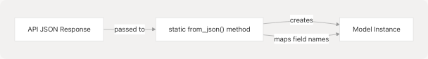
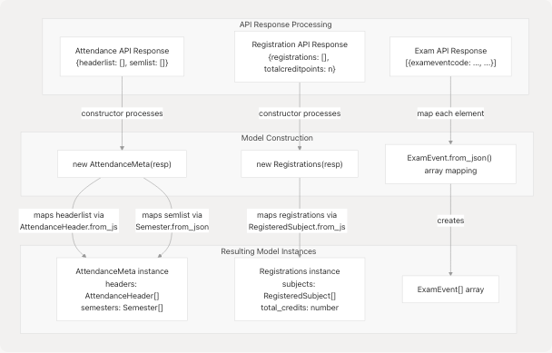

# Data Models

Relevant source files

* [src/attendance.js](https://github.com/codeblech/jsjiit/blob/d123b782/src/attendance.js)
* [src/exam.js](https://github.com/codeblech/jsjiit/blob/d123b782/src/exam.js)
* [src/registration.js](https://github.com/codeblech/jsjiit/blob/d123b782/src/registration.js)
* [src/utils.js](https://github.com/codeblech/jsjiit/blob/d123b782/src/utils.js)

## Purpose and Scope

This page documents the data model classes returned by jsjiit API methods. These classes represent structured data retrieved from the JIIT WebPortal, including attendance records, course registrations, and exam information. Each model class provides typed access to portal data and includes methods for JSON deserialization.

For information about the API methods that return these models, see [Attendance Methods](/codeblech/jsjiit/3.3-attendance-methods), [Registration and Subject Methods](/codeblech/jsjiit/3.4-registration-and-subject-methods), and [Exam and Schedule Methods](/codeblech/jsjiit/3.5-exam-and-schedule-methods). For details on how these models are created during API communication, see [System Architecture Overview](/codeblech/jsjiit/4.1-system-architecture-overview).

---

## Data Model Architecture

The following diagram shows all data model classes in the library and their organizational structure:


```

**Sources:** [src/attendance.js1-76](https://github.com/codeblech/jsjiit/blob/d123b782/src/attendance.js#L1-L76) [src/registration.js1-77](https://github.com/codeblech/jsjiit/blob/d123b782/src/registration.js#L1-L77) [src/exam.js1-35](https://github.com/codeblech/jsjiit/blob/d123b782/src/exam.js#L1-L35)

---

## Attendance Models

### AttendanceHeader

The `AttendanceHeader` class contains student profile information returned by the attendance API. Each header represents a student's basic academic identity.

**Class Definition:** [src/attendance.js4-27](https://github.com/codeblech/jsjiit/blob/d123b782/src/attendance.js#L4-L27)

#### Properties

| Property | Type | Description |
| --- | --- | --- |
| `branchdesc` | `string` | Description of the academic branch (e.g., "Computer Science and Engineering") |
| `name` | `string` | Full name of the student |
| `programdesc` | `string` | Description of the academic program (e.g., "Bachelor of Technology") |
| `stynumber` | `string` | Student type number or identifier |

#### Methods

| Method | Returns | Description |
| --- | --- | --- |
| `static from_json(resp)` | `AttendanceHeader` | Factory method that creates an instance from a JSON object |

**Sources:** [src/attendance.js4-27](https://github.com/codeblech/jsjiit/blob/d123b782/src/attendance.js#L4-L27)

---

### Semester

The `Semester` class represents a single academic semester with its registration identifiers.

**Class Definition:** [src/attendance.js29-48](https://github.com/codeblech/jsjiit/blob/d123b782/src/attendance.js#L29-L48)

#### Properties

| Property | Type | Description |
| --- | --- | --- |
| `registration_code` | `string` | Semester registration code |
| `registration_id` | `string` | Unique identifier for the semester registration |

#### Methods

| Method | Returns | Description |
| --- | --- | --- |
| `static from_json(resp)` | `Semester` | Factory method that creates an instance from a JSON object |

**Sources:** [src/attendance.js29-48](https://github.com/codeblech/jsjiit/blob/d123b782/src/attendance.js#L29-L48)

---

### AttendanceMeta

The `AttendanceMeta` class is a container that aggregates student headers and available semesters. This is the primary data structure returned by attendance metadata queries.

**Class Definition:** [src/attendance.js50-76](https://github.com/codeblech/jsjiit/blob/d123b782/src/attendance.js#L50-L76)

#### Properties

| Property | Type | Description |
| --- | --- | --- |
| `raw_response` | `object` | Original JSON response object from the API |
| `headers` | `AttendanceHeader[]` | Array of attendance headers, typically one per student |
| `semesters` | `Semester[]` | Array of available semesters, ordered from newest to oldest |

#### Methods

| Method | Returns | Description |
| --- | --- | --- |
| `latest_header()` | `AttendanceHeader` | Returns the first (most recent) header from the headers array |
| `latest_semester()` | `Semester` | Returns the first (most recent) semester from the semesters array |

**Sources:** [src/attendance.js50-76](https://github.com/codeblech/jsjiit/blob/d123b782/src/attendance.js#L50-L76)

---

## Registration Models

### RegisteredSubject

The `RegisteredSubject` class represents a single course/subject registration, including faculty information, credits, and subject details.

**Class Definition:** [src/registration.js4-65](https://github.com/codeblech/jsjiit/blob/d123b782/src/registration.js#L4-L65)

#### Properties

| Property | Type | Description |
| --- | --- | --- |
| `employee_name` | `string` | Name of the faculty member teaching the subject |
| `employee_code` | `string` | Unique code identifying the employee/lecturer |
| `minor_subject` | `string` | Indicates if this is a minor subject |
| `remarks` | `string` | Additional remarks or notes |
| `stytype` | `string` | Style type classification |
| `credits` | `number` | Number of credits assigned to this subject |
| `subject_code` | `string` | Unique code identifying the subject |
| `subject_component_code` | `string` | Component code for the subject (e.g., theory, lab) |
| `subject_desc` | `string` | Full description/name of the subject |
| `subject_id` | `string` | Unique identifier for the subject |
| `audtsubject` | `string` | Audit subject information |

#### Methods

| Method | Returns | Description |
| --- | --- | --- |
| `static from_json(resp)` | `RegisteredSubject` | Factory method that creates an instance from a JSON object, mapping API field names to property names |

**Sources:** [src/registration.js4-65](https://github.com/codeblech/jsjiit/blob/d123b782/src/registration.js#L4-L65)

---

### Registrations

The `Registrations` class aggregates all registered subjects for a semester and provides the total credit count.

**Class Definition:** [src/registration.js67-77](https://github.com/codeblech/jsjiit/blob/d123b782/src/registration.js#L67-L77)

#### Properties

| Property | Type | Description |
| --- | --- | --- |
| `raw_response` | `object` | Original JSON response object from the API |
| `total_credits` | `number` | Total credit points for all registered subjects in the semester |
| `subjects` | `RegisteredSubject[]` | Array of all registered subjects |

**Sources:** [src/registration.js67-77](https://github.com/codeblech/jsjiit/blob/d123b782/src/registration.js#L67-L77)

---

## Exam Models

### ExamEvent

The `ExamEvent` class represents a scheduled examination event, including timing and identification information.

**Class Definition:** [src/exam.js4-35](https://github.com/codeblech/jsjiit/blob/d123b782/src/exam.js#L4-L35)

#### Properties

| Property | Type | Description |
| --- | --- | --- |
| `exam_event_code` | `string` | Unique code for the exam event |
| `event_from` | `number` | Timestamp indicating when the exam event starts |
| `exam_event_desc` | `string` | Description of the exam event |
| `registration_id` | `string` | Registration ID associated with this exam |
| `exam_event_id` | `string` | Unique identifier for the exam event |

#### Methods

| Method | Returns | Description |
| --- | --- | --- |
| `static from_json(resp)` | `ExamEvent` | Factory method that creates an instance from a JSON object, mapping API field names to property names |

**Sources:** [src/exam.js4-35](https://github.com/codeblech/jsjiit/blob/d123b782/src/exam.js#L4-L35)

---

## Common Design Patterns

### JSON Deserialization

All data model classes follow a consistent pattern for JSON deserialization using static factory methods:

```

```

The `from_json` static method pattern appears in:

* `AttendanceHeader.from_json()` [src/attendance.js24-26](https://github.com/codeblech/jsjiit/blob/d123b782/src/attendance.js#L24-L26)
* `Semester.from_json()` [src/attendance.js45-47](https://github.com/codeblech/jsjiit/blob/d123b782/src/attendance.js#L45-L47)
* `RegisteredSubject.from_json()` [src/registration.js50-64](https://github.com/codeblech/jsjiit/blob/d123b782/src/registration.js#L50-L64)
* `ExamEvent.from_json()` [src/exam.js26-34](https://github.com/codeblech/jsjiit/blob/d123b782/src/exam.js#L26-L34)

**Sources:** [src/attendance.js24-26](https://github.com/codeblech/jsjiit/blob/d123b782/src/attendance.js#L24-L26) [src/attendance.js45-47](https://github.com/codeblech/jsjiit/blob/d123b782/src/attendance.js#L45-L47) [src/registration.js50-64](https://github.com/codeblech/jsjiit/blob/d123b782/src/registration.js#L50-L64) [src/exam.js26-34](https://github.com/codeblech/jsjiit/blob/d123b782/src/exam.js#L26-L34)

---

### Raw Response Preservation

Container models (`AttendanceMeta` and `Registrations`) preserve the original API response in a `raw_response` property:

| Model | Raw Response Property | Purpose |
| --- | --- | --- |
| `AttendanceMeta` | `raw_response` [src/attendance.js56](https://github.com/codeblech/jsjiit/blob/d123b782/src/attendance.js#L56-L56) | Stores complete API response for attendance metadata |
| `Registrations` | `raw_response` [src/registration.js73](https://github.com/codeblech/jsjiit/blob/d123b782/src/registration.js#L73-L73) | Stores complete API response for registration data |

This pattern allows consumers to access any additional fields not explicitly mapped to properties while still providing convenient access to common fields through typed properties.

**Sources:** [src/attendance.js56](https://github.com/codeblech/jsjiit/blob/d123b782/src/attendance.js#L56-L56) [src/registration.js73](https://github.com/codeblech/jsjiit/blob/d123b782/src/registration.js#L73-L73)

---

## Model Relationships and Data Flow

The following diagram illustrates how data models relate to each other and are constructed from API responses:

```


**Sources:** [src/attendance.js50-76](https://github.com/codeblech/jsjiit/blob/d123b782/src/attendance.js#L50-L76) [src/registration.js67-77](https://github.com/codeblech/jsjiit/blob/d123b782/src/registration.js#L67-L77) [src/exam.js4-35](https://github.com/codeblech/jsjiit/blob/d123b782/src/exam.js#L4-L35)

---

## Field Name Mapping

The data models perform field name transformations from the API's JSON format to JavaScript property names. The following table shows key transformations:

### AttendanceHeader Mapping

| API Field | Model Property | Defined At |
| --- | --- | --- |
| `branchdesc` | `branchdesc` | [src/attendance.js13](https://github.com/codeblech/jsjiit/blob/d123b782/src/attendance.js#L13-L13) |
| `name` | `name` | [src/attendance.js14](https://github.com/codeblech/jsjiit/blob/d123b782/src/attendance.js#L14-L14) |
| `programdesc` | `programdesc` | [src/attendance.js15](https://github.com/codeblech/jsjiit/blob/d123b782/src/attendance.js#L15-L15) |
| `stynumber` | `stynumber` | [src/attendance.js16](https://github.com/codeblech/jsjiit/blob/d123b782/src/attendance.js#L16-L16) |

### Semester Mapping

| API Field | Model Property | Defined At |
| --- | --- | --- |
| `registrationcode` | `registration_code` | [src/attendance.js36](https://github.com/codeblech/jsjiit/blob/d123b782/src/attendance.js#L36-L36) |
| `registrationid` | `registration_id` | [src/attendance.js37](https://github.com/codeblech/jsjiit/blob/d123b782/src/attendance.js#L37-L37) |

### RegisteredSubject Mapping

| API Field | Model Property | Defined At |
| --- | --- | --- |
| `employeename` | `employee_name` | [src/registration.js32](https://github.com/codeblech/jsjiit/blob/d123b782/src/registration.js#L32-L32) |
| `employeecode` | `employee_code` | [src/registration.js33](https://github.com/codeblech/jsjiit/blob/d123b782/src/registration.js#L33-L33) |
| `subjectcode` | `subject_code` | [src/registration.js38](https://github.com/codeblech/jsjiit/blob/d123b782/src/registration.js#L38-L38) |
| `subjectcomponentcode` | `subject_component_code` | [src/registration.js39](https://github.com/codeblech/jsjiit/blob/d123b782/src/registration.js#L39-L39) |
| `subjectdesc` | `subject_desc` | [src/registration.js40](https://github.com/codeblech/jsjiit/blob/d123b782/src/registration.js#L40-L40) |
| `subjectid` | `subject_id` | [src/registration.js41](https://github.com/codeblech/jsjiit/blob/d123b782/src/registration.js#L41-L41) |

### ExamEvent Mapping

| API Field | Model Property | Defined At |
| --- | --- | --- |
| `exameventcode` | `exam_event_code` | [src/exam.js14](https://github.com/codeblech/jsjiit/blob/d123b782/src/exam.js#L14-L14) |
| `eventfrom` | `event_from` | [src/exam.js15](https://github.com/codeblech/jsjiit/blob/d123b782/src/exam.js#L15-L15) |
| `exameventdesc` | `exam_event_desc` | [src/exam.js16](https://github.com/codeblech/jsjiit/blob/d123b782/src/exam.js#L16-L16) |
| `registrationid` | `registration_id` | [src/exam.js17](https://github.com/codeblech/jsjiit/blob/d123b782/src/exam.js#L17-L17) |
| `exameventid` | `exam_event_id` | [src/exam.js18](https://github.com/codeblech/jsjiit/blob/d123b782/src/exam.js#L18-L18) |

**Sources:** [src/attendance.js13-16](https://github.com/codeblech/jsjiit/blob/d123b782/src/attendance.js#L13-L16) [src/attendance.js36-37](https://github.com/codeblech/jsjiit/blob/d123b782/src/attendance.js#L36-L37) [src/registration.js32-41](https://github.com/codeblech/jsjiit/blob/d123b782/src/registration.js#L32-L41) [src/exam.js14-18](https://github.com/codeblech/jsjiit/blob/d123b782/src/exam.js#L14-L18)