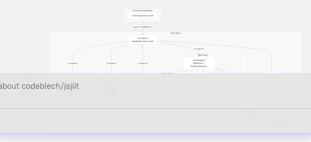
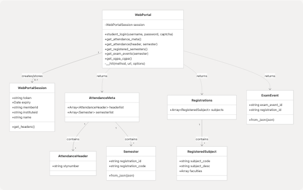
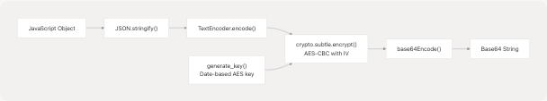
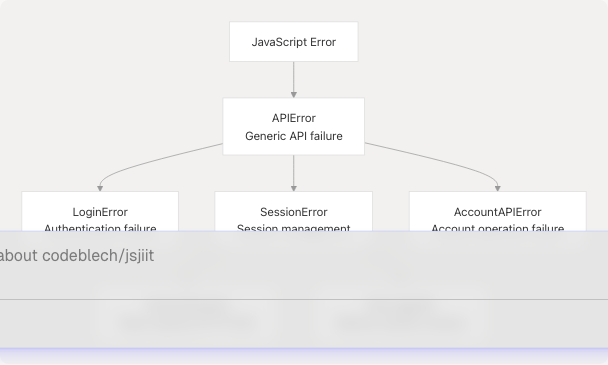

# Architecture and Design

Relevant source files

* [src/encryption.js](https://github.com/codeblech/jsjiit/blob/d123b782/src/encryption.js)
* [src/index.js](https://github.com/codeblech/jsjiit/blob/d123b782/src/index.js)
* [src/wrapper.js](https://github.com/codeblech/jsjiit/blob/d123b782/src/wrapper.js)

## Purpose and Scope

This document provides a comprehensive technical overview of the jsjiit library's internal architecture, design patterns, and implementation details. It focuses on the structural organization of the codebase, the relationships between core components, and the architectural decisions that enable browser-based interaction with the JIIT WebPortal API.

For practical usage information, see [Getting Started](/codeblech/jsjiit/2-getting-started). For detailed API method documentation, see [API Reference](/codeblech/jsjiit/3-api-reference). For information about the build pipeline and artifact generation, see [Build and Distribution](/codeblech/jsjiit/5-build-and-distribution).

---

## Architectural Overview

The jsjiit library implements a **client-server proxy pattern** where the library acts as an intermediary between browser applications and the JIIT WebPortal backend. The architecture consists of three primary layers:

1. **API Surface Layer**: Unified export interface ([src/index.js](https://github.com/codeblech/jsjiit/blob/d123b782/src/index.js))
2. **Portal Interaction Layer**: Session management and HTTP communication ([src/wrapper.js](https://github.com/codeblech/jsjiit/blob/d123b782/src/wrapper.js))
3. **Support Infrastructure**: Cryptography ([src/encryption.js](https://github.com/codeblech/jsjiit/blob/d123b782/src/encryption.js)), domain models, utilities, and error handling

### System Architecture Diagram


```

**Sources**: [src/wrapper.js1-720](https://github.com/codeblech/jsjiit/blob/d123b782/src/wrapper.js#L1-L720) [src/index.js1-32](https://github.com/codeblech/jsjiit/blob/d123b782/src/index.js#L1-L32) [src/encryption.js1-96](https://github.com/codeblech/jsjiit/blob/d123b782/src/encryption.js#L1-L96)

---

## Class Structure and Relationships

The library exposes two primary classes and multiple data model classes. The class hierarchy is intentionally flat, favoring composition over inheritance.

### Core Classes

| Class | Location | Responsibility |
| --- | --- | --- |
| `WebPortal` | [src/wrapper.js75-671](https://github.com/codeblech/jsjiit/blob/d123b782/src/wrapper.js#L75-L671) | Main API orchestrator; manages session lifecycle and provides all public API methods |
| `WebPortalSession` | [src/wrapper.js25-70](https://github.com/codeblech/jsjiit/blob/d123b782/src/wrapper.js#L25-L70) | Immutable session container; stores authentication token and user metadata |
| `AttendanceMeta` | [src/attendance.js](https://github.com/codeblech/jsjiit/blob/d123b782/src/attendance.js) | Container for attendance headers and semester lists |
| `AttendanceHeader` | [src/attendance.js](https://github.com/codeblech/jsjiit/blob/d123b782/src/attendance.js) | Represents attendance metadata with stynumber |
| `Semester` | [src/attendance.js](https://github.com/codeblech/jsjiit/blob/d123b782/src/attendance.js) | Represents academic semester with registration data |
| `RegisteredSubject` | [src/registration.js](https://github.com/codeblech/jsjiit/blob/d123b782/src/registration.js) | Individual subject registration details |
| `Registrations` | [src/registration.js](https://github.com/codeblech/jsjiit/blob/d123b782/src/registration.js) | Collection of registered subjects and faculty |
| `ExamEvent` | [src/exam.js](https://github.com/codeblech/jsjiit/blob/d123b782/src/exam.js) | Exam event metadata |

### Class Relationship Diagram

```

```

**Sources**: [src/wrapper.js25-70](https://github.com/codeblech/jsjiit/blob/d123b782/src/wrapper.js#L25-L70) [src/wrapper.js75-671](https://github.com/codeblech/jsjiit/blob/d123b782/src/wrapper.js#L75-L671)

---

## Module Dependency Graph

The module organization follows a clear dependency hierarchy with no circular dependencies. The `index.js` module serves as a facade, while `wrapper.js` is the central orchestrator.

### Dependency Flow Diagram

```

```

### Import Dependency Table

| Module | Direct Dependencies | Purpose |
| --- | --- | --- |
| `src/index.js` | All modules | Unified export facade |
| `src/wrapper.js` | exceptions, registration, attendance, exam, encryption | Core API implementation |
| `src/encryption.js` | utils | AES-CBC cryptography |
| `src/attendance.js` | None | Data models only |
| `src/registration.js` | None | Data models only |
| `src/exam.js` | None | Data models only |
| `src/exceptions.js` | None | Error definitions only |
| `src/utils.js` | None | Pure utility functions |
| `src/feedback.js` | None | Enum definitions only |

**Sources**: [src/index.js1-32](https://github.com/codeblech/jsjiit/blob/d123b782/src/index.js#L1-L32) [src/wrapper.js1-6](https://github.com/codeblech/jsjiit/blob/d123b782/src/wrapper.js#L1-L6) [src/encryption.js1-2](https://github.com/codeblech/jsjiit/blob/d123b782/src/encryption.js#L1-L2)

---

## Request/Response Lifecycle

Every authenticated API call follows a consistent request/response pattern involving encryption, HTTP communication, and data transformation.

### Request Flow Diagram

```

```

**Sources**: [src/wrapper.js84-158](https://github.com/codeblech/jsjiit/blob/d123b782/src/wrapper.js#L84-L158) [src/wrapper.js679-686](https://github.com/codeblech/jsjiit/blob/d123b782/src/wrapper.js#L679-L686) [src/wrapper.js242-254](https://github.com/codeblech/jsjiit/blob/d123b782/src/wrapper.js#L242-L254)

### HTTP Request Construction

The `__hit()` method at [src/wrapper.js97-158](https://github.com/codeblech/jsjiit/blob/d123b782/src/wrapper.js#L97-L158) is the central HTTP communication primitive. It handles:

1. **Header injection**: Adds `Authorization: Bearer {token}` and `LocalName: {encrypted_name}`
2. **Payload serialization**: Converts `options.json` to JSON string or uses `options.body` directly
3. **Error transformation**: Maps HTTP status codes to custom exceptions
4. **Response validation**: Checks `status.responseStatus === "Success"`

```
```
// Simplified flow from wrapper.js:97-158
async __hit(method, url, options = {}) {
    // 1. Determine exception type
    let exception = options.exception || APIError;

    // 2. Generate headers (authenticated or anonymous)
    let header = options.authenticated 
        ? await this.session.get_headers()
        : { LocalName: await generate_local_name() };

    // 3. Build fetch options
    let fetchOptions = {
        method: method,
        headers: { "Content-Type": "application/json", ...header },
        body: options.json ? JSON.stringify(options.json) : options.body
    };

    // 4. Execute request and validate response
    const response = await fetch(url, fetchOptions);
    if (response.status === 401) throw new SessionExpired();
    const resp = await response.json();
    if (resp.status.responseStatus !== "Success") throw new exception(...);

    return resp;
}
```
```

**Sources**: [src/wrapper.js97-158](https://github.com/codeblech/jsjiit/blob/d123b782/src/wrapper.js#L97-L158)

---

## Authentication Architecture

Authentication is managed through a two-phase login process and enforced via a decorator pattern.

### Authentication Flow

```

```

**Sources**: [src/wrapper.js168-186](https://github.com/codeblech/jsjiit/blob/d123b782/src/wrapper.js#L168-L186)

### Session Token Structure

The `WebPortalSession` class parses the JWT token to extract metadata:

```
```
// From wrapper.js:49-51
this.token = this.regdata["token"];
let expiry_timestamp = JSON.parse(atob(this.token.split(".")[1]))["exp"];
this.expiry = new Date(expiry_timestamp * 1000);
```
```

The token is a standard JWT with three base64-encoded sections (header.payload.signature). The library decodes the payload section to extract the `exp` (expiry) claim.

**Sources**: [src/wrapper.js39-57](https://github.com/codeblech/jsjiit/blob/d123b782/src/wrapper.js#L39-L57)

### Authentication Enforcement Decorator

All protected methods are wrapped with the `authenticated()` decorator at [src/wrapper.js679-686](https://github.com/codeblech/jsjiit/blob/d123b782/src/wrapper.js#L679-L686):

```
```
function authenticated(method) {
  return function (...args) {
    if (this.session == null) {
      throw new NotLoggedIn();
    }
    return method.apply(this, args);
  };
}
```
```

The decorator is applied to 15 methods via iteration at [src/wrapper.js692-719](https://github.com/codeblech/jsjiit/blob/d123b782/src/wrapper.js#L692-L719):

```
```
const authenticatedMethods = [
  "get_personal_info",
  "get_student_bank_info",
  "change_password",
  "get_attendance_meta",
  // ... 10 more methods
];

authenticatedMethods.forEach((methodName) => {
  WebPortal.prototype[methodName] = authenticated(WebPortal.prototype[methodName]);
});
```
```

**Sources**: [src/wrapper.js679-719](https://github.com/codeblech/jsjiit/blob/d123b782/src/wrapper.js#L679-L719)

---

## Encryption and Payload Serialization

All sensitive payloads are encrypted using **AES-CBC** with a date-based key derivation scheme. This is covered in detail in [Encryption and Security](/codeblech/jsjiit/4.2-encryption-and-security), but the architectural integration points are:

### Encryption Integration Points

| Method | Location | Purpose |
| --- | --- | --- |
| `serialize_payload(payload)` | [src/encryption.js91-95](https://github.com/codeblech/jsjiit/blob/d123b782/src/encryption.js#L91-L95) | Encrypts outgoing request payloads |
| `deserialize_payload(payload)` | [src/encryption.js80-84](https://github.com/codeblech/jsjiit/blob/d123b782/src/encryption.js#L80-L84) | Decrypts incoming response payloads (not currently used) |
| `generate_local_name(date)` | [src/encryption.js43-51](https://github.com/codeblech/jsjiit/blob/d123b782/src/encryption.js#L43-L51) | Creates encrypted request header value |
| `generate_key(date)` | [src/encryption.js32-36](https://github.com/codeblech/jsjiit/blob/d123b782/src/encryption.js#L32-L36) | Derives AES key from date sequence |

### Payload Serialization Flow

```

```

**Sources**: [src/encryption.js91-95](https://github.com/codeblech/jsjiit/blob/d123b782/src/encryption.js#L91-L95) [src/encryption.js32-36](https://github.com/codeblech/jsjiit/blob/d123b782/src/encryption.js#L32-L36) [src/encryption.js58-62](https://github.com/codeblech/jsjiit/blob/d123b782/src/encryption.js#L58-L62)

---

## Error Handling Strategy

The library implements a hierarchical exception system with custom error classes for different failure scenarios.

### Exception Hierarchy

```


### Error Usage Mapping

| Exception | Thrown By | Trigger Condition |
| --- | --- | --- |
| `LoginError` | [src/wrapper.js175-183](https://github.com/codeblech/jsjiit/blob/d123b782/src/wrapper.js#L175-L183) | Failed pretoken or token generation |
| `SessionExpired` | [src/wrapper.js142](https://github.com/codeblech/jsjiit/blob/d123b782/src/wrapper.js#L142-L142) | HTTP 401 response |
| `NotLoggedIn` | [src/wrapper.js682](https://github.com/codeblech/jsjiit/blob/d123b782/src/wrapper.js#L682-L682) | Authenticated method called without session |
| `AccountAPIError` | [src/wrapper.js234](https://github.com/codeblech/jsjiit/blob/d123b782/src/wrapper.js#L234-L234) | Password change failure |
| `APIError` | [src/wrapper.js98](https://github.com/codeblech/jsjiit/blob/d123b782/src/wrapper.js#L98-L98) | Default for all other API failures |

**Sources**: [src/exceptions.js](https://github.com/codeblech/jsjiit/blob/d123b782/src/exceptions.js) [src/wrapper.js97-158](https://github.com/codeblech/jsjiit/blob/d123b782/src/wrapper.js#L97-L158)

---

## Design Patterns

The library employs several established design patterns:

### 1. Facade Pattern

The `src/index.js` module implements a facade by re-exporting all public APIs from internal modules:

```
```
// From index.js:13-31
export {
  WebPortal,
  WebPortalSession,
  API,
  DEFCAPTCHA,
  AttendanceHeader,
  Semester,
  AttendanceMeta,
  RegisteredSubject,
  Registrations,
  ExamEvent,
  APIError,
  LoginError,
  // ... more exports
};
```
```

This provides a single import point for consumers: `import { WebPortal } from 'jsjiit'`.

**Sources**: [src/index.js1-32](https://github.com/codeblech/jsjiit/blob/d123b782/src/index.js#L1-L32)

### 2. Decorator Pattern

The `authenticated()` function decorates method prototypes to inject session validation logic:

```
```
// From wrapper.js:679-686
function authenticated(method) {
  return function (...args) {
    if (this.session == null) {
      throw new NotLoggedIn();
    }
    return method.apply(this, args);
  };
}
```
```

Applied at runtime to 15 methods via `forEach` iteration.

**Sources**: [src/wrapper.js679-719](https://github.com/codeblech/jsjiit/blob/d123b782/src/wrapper.js#L679-L719)

### 3. Factory Pattern

Domain model classes use static factory methods for construction from JSON:

```
```
// Pattern used in Semester, ExamEvent
static from_json(json) {
  return new ClassName(json);
}
```
```

This provides a clear API for constructing objects from API responses.

**Sources**: Referenced in [src/wrapper.js314-443](https://github.com/codeblech/jsjiit/blob/d123b782/src/wrapper.js#L314-L443)

### 4. Singleton Session

The `WebPortal` class maintains a single session instance at [src/wrapper.js80](https://github.com/codeblech/jsjiit/blob/d123b782/src/wrapper.js#L80-L80):

```
```
constructor() {
  this.session = null;
}
```
```

Once set via `student_login()`, this session is reused for all subsequent authenticated requests until the instance is destroyed.

**Sources**: [src/wrapper.js79-81](https://github.com/codeblech/jsjiit/blob/d123b782/src/wrapper.js#L79-L81)

---

## API Constants and Configuration

### API Endpoint Constant

The base API URL is defined at [src/wrapper.js14](https://github.com/codeblech/jsjiit/blob/d123b782/src/wrapper.js#L14-L14):

```
```
export const API = "https://webportal.jiit.ac.in:6011/StudentPortalAPI";
```
```

All endpoint paths are concatenated with this base URL.

### CAPTCHA Bypass Default

A hardcoded CAPTCHA value is defined at [src/wrapper.js20](https://github.com/codeblech/jsjiit/blob/d123b782/src/wrapper.js#L20-L20):

```
```
export const DEFCAPTCHA = { captcha: "phw5n", hidden: "gmBctEffdSg=" };
```
```

This allows the library to bypass CAPTCHA validation by default (the portal accepts these values without visual verification).

**Sources**: [src/wrapper.js14-20](https://github.com/codeblech/jsjiit/blob/d123b782/src/wrapper.js#L14-L20)

---

## Cryptographic Constants

### Fixed Initialization Vector

The AES-CBC encryption uses a **hardcoded IV** at [src/encryption.js25](https://github.com/codeblech/jsjiit/blob/d123b782/src/encryption.js#L25-L25):

```
```
const IV = new TextEncoder().encode("dcek9wb8frty1pnm");
```
```

This is a 16-byte constant used for all encryption operations. While not cryptographically ideal (IVs should be unique per encryption), it matches the portal's server-side implementation.

### Key Derivation Formula

The AES key is derived from the current date at [src/encryption.js34](https://github.com/codeblech/jsjiit/blob/d123b782/src/encryption.js#L34-L34):

```
```
const keyData = new TextEncoder().encode("qa8y" + dateSeq + "ty1pn");
```
```

Where `dateSeq` is formatted as `MMDDHHmm` (month, day, hour, minute). This creates a time-based shared secret between client and server.

**Sources**: [src/encryption.js25-36](https://github.com/codeblech/jsjiit/blob/d123b782/src/encryption.js#L25-L36) [src/utils.js](https://github.com/codeblech/jsjiit/blob/d123b782/src/utils.js)

---

## Summary

The jsjiit library architecture is characterized by:

1. **Clear separation of concerns**: Domain models, cryptography, HTTP communication, and error handling are isolated in separate modules
2. **Minimal dependencies**: Only two devDependencies (esbuild, jsdoc) with no runtime dependencies
3. **Flat class hierarchy**: Favors composition over inheritance for simplicity
4. **Decorator-based AOP**: Authentication enforcement via method decoration
5. **Cryptographic abstraction**: All encryption details hidden behind `serialize_payload()` and `generate_local_name()`
6. **Immutable sessions**: `WebPortalSession` objects are created once and never modified
7. **Consistent error handling**: Custom exception hierarchy with specific error types for different failure modes

For implementation details of specific subsystems, see:

* [Encryption and Security](/codeblech/jsjiit/4.2-encryption-and-security) for cryptographic implementation
* [Module Organization](/codeblech/jsjiit/4.3-module-organization) for export strategies and bundling

**Sources**: [src/wrapper.js1-720](https://github.com/codeblech/jsjiit/blob/d123b782/src/wrapper.js#L1-L720) [src/index.js1-32](https://github.com/codeblech/jsjiit/blob/d123b782/src/index.js#L1-L32) [src/encryption.js1-96](https://github.com/codeblech/jsjiit/blob/d123b782/src/encryption.js#L1-L96)