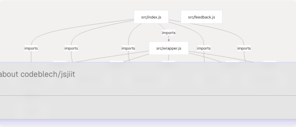
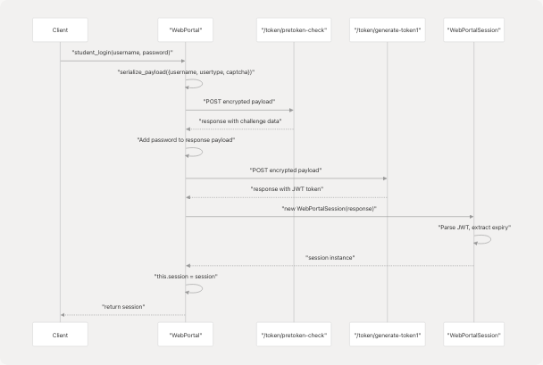
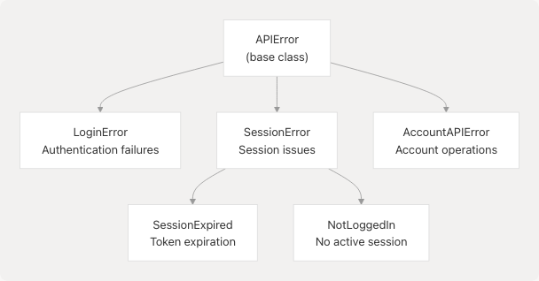
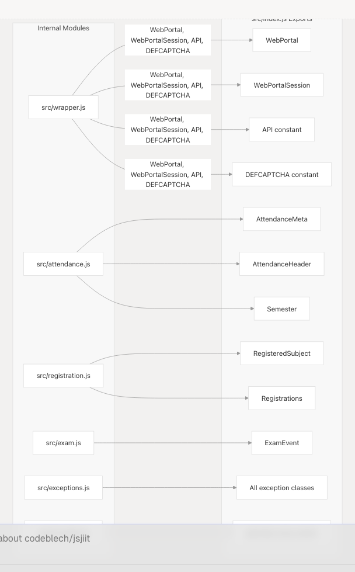

# System Architecture Overview

Relevant source files

* [package.json](https://github.com/codeblech/jsjiit/blob/d123b782/package.json)
* [src/index.js](https://github.com/codeblech/jsjiit/blob/d123b782/src/index.js)
* [src/wrapper.js](https://github.com/codeblech/jsjiit/blob/d123b782/src/wrapper.js)

## Purpose and Scope

This document describes the high-level architecture of the jsjiit library, focusing on the organization of modules, their interactions, and the overall design patterns. It covers the layered structure, core components, data flow patterns, and session management mechanisms.

For details on specific API methods and their usage, see [API Reference](/codeblech/jsjiit/3-api-reference). For information about the encryption mechanisms, see [Encryption and Security](/codeblech/jsjiit/4.2-encryption-and-security). For module export strategies, see [Module Organization](/codeblech/jsjiit/4.3-module-organization).

---

## Layered Architecture

The jsjiit library follows a **three-tier layered architecture** that separates concerns between API communication, domain logic, and public interface exposure.

### Architecture Layers Diagram


```

**Sources:** [src/index.js1-32](https://github.com/codeblech/jsjiit/blob/d123b782/src/index.js#L1-L32) [src/wrapper.js1-720](https://github.com/codeblech/jsjiit/blob/d123b782/src/wrapper.js#L1-L720) [src/encryption.js](https://github.com/codeblech/jsjiit/blob/d123b782/src/encryption.js) [src/attendance.js](https://github.com/codeblech/jsjiit/blob/d123b782/src/attendance.js) [src/registration.js](https://github.com/codeblech/jsjiit/blob/d123b782/src/registration.js) [src/exam.js](https://github.com/codeblech/jsjiit/blob/d123b782/src/exam.js) [src/exceptions.js](https://github.com/codeblech/jsjiit/blob/d123b782/src/exceptions.js)

### Layer Responsibilities

| Layer | Modules | Responsibility |
| --- | --- | --- |
| **Public API Surface** | `src/index.js` | Re-exports all public classes and functions; serves as the single entry point for library consumers |
| **Core Application Logic** | `src/wrapper.js`, `src/encryption.js` | Implements HTTP communication, session management, encryption/decryption, and orchestrates API calls |
| **Domain Models** | `src/attendance.js`, `src/registration.js`, `src/exam.js` | Defines data structures for portal entities; parses API responses into typed objects |
| **Cross-Cutting Concerns** | `src/exceptions.js`, `src/utils.js`, `src/feedback.js` | Provides error handling, utility functions, and enumeration constants used across layers |

**Sources:** [src/index.js1-32](https://github.com/codeblech/jsjiit/blob/d123b782/src/index.js#L1-L32) [src/wrapper.js1-720](https://github.com/codeblech/jsjiit/blob/d123b782/src/wrapper.js#L1-L720)

---

## Core Components

### WebPortal Class

The `WebPortal` class ([src/wrapper.js75-671](https://github.com/codeblech/jsjiit/blob/d123b782/src/wrapper.js#L75-L671)) is the primary orchestrator for all portal interactions. It maintains a reference to the current `WebPortalSession` and provides methods for each portal API endpoint.

**Key Responsibilities:**

* **Authentication:** `student_login()` method ([src/wrapper.js168-186](https://github.com/codeblech/jsjiit/blob/d123b782/src/wrapper.js#L168-L186))
* **HTTP Communication:** `__hit()` internal method ([src/wrapper.js97-158](https://github.com/codeblech/jsjiit/blob/d123b782/src/wrapper.js#L97-L158)) handles all HTTP requests
* **Domain Object Creation:** Instantiates `AttendanceMeta`, `Registrations`, `ExamEvent` objects from API responses
* **Session Lifecycle:** Stores and validates session state

### WebPortalSession Class

The `WebPortalSession` class ([src/wrapper.js25-70](https://github.com/codeblech/jsjiit/blob/d123b782/src/wrapper.js#L25-L70)) encapsulates authenticated session state.

**Key Properties:**

| Property | Description | Source |
| --- | --- | --- |
| `token` | JWT authentication token | [src/wrapper.js49](https://github.com/codeblech/jsjiit/blob/d123b782/src/wrapper.js#L49-L49) |
| `expiry` | Parsed token expiration timestamp | [src/wrapper.js50-51](https://github.com/codeblech/jsjiit/blob/d123b782/src/wrapper.js#L50-L51) |
| `memberid` | Student identifier | [src/wrapper.js46](https://github.com/codeblech/jsjiit/blob/d123b782/src/wrapper.js#L46-L46) |
| `instituteid` | Institute identifier | [src/wrapper.js45](https://github.com/codeblech/jsjiit/blob/d123b782/src/wrapper.js#L45-L45) |
| `enrollmentno` | Student enrollment number | [src/wrapper.js56](https://github.com/codeblech/jsjiit/blob/d123b782/src/wrapper.js#L56-L56) |

**Methods:**

* `get_headers()` ([src/wrapper.js63-69](https://github.com/codeblech/jsjiit/blob/d123b782/src/wrapper.js#L63-L69)): Generates authentication headers including JWT token and `LocalName` for each request

**Sources:** [src/wrapper.js25-70](https://github.com/codeblech/jsjiit/blob/d123b782/src/wrapper.js#L25-L70)

### Authentication Decorator Pattern

The library uses a decorator pattern to enforce authentication requirements on methods. The `authenticated()` function ([src/wrapper.js679-686](https://github.com/codeblech/jsjiit/blob/d123b782/src/wrapper.js#L679-L686)) wraps methods that require an active session.

```

```

**Implementation:**

* Decorated methods list: [src/wrapper.js692-715](https://github.com/codeblech/jsjiit/blob/d123b782/src/wrapper.js#L692-L715)
* Decorator application: [src/wrapper.js717-719](https://github.com/codeblech/jsjiit/blob/d123b782/src/wrapper.js#L717-L719)

**Sources:** [src/wrapper.js679-719](https://github.com/codeblech/jsjiit/blob/d123b782/src/wrapper.js#L679-L719)

---

## Module Dependency Graph

This diagram maps the actual import relationships between source modules.

```

```

**Import Details:**

| File | Imports | Line Reference |
| --- | --- | --- |
| `src/index.js` | All public modules | [src/index.js5-10](https://github.com/codeblech/jsjiit/blob/d123b782/src/index.js#L5-L10) |
| `src/wrapper.js` | `exceptions`, `registration`, `attendance`, `exam`, `encryption` | [src/wrapper.js1-5](https://github.com/codeblech/jsjiit/blob/d123b782/src/wrapper.js#L1-L5) |
| `src/encryption.js` | `utils` | (assumed from diagram) |

**Sources:** [src/index.js1-32](https://github.com/codeblech/jsjiit/blob/d123b782/src/index.js#L1-L32) [src/wrapper.js1-5](https://github.com/codeblech/jsjiit/blob/d123b782/src/wrapper.js#L1-L5)

---

## Request/Response Flow Architecture

### API Communication Flow

```

```

**Sources:** [src/wrapper.js97-158](https://github.com/codeblech/jsjiit/blob/d123b782/src/wrapper.js#L97-L158) [src/wrapper.js242-254](https://github.com/codeblech/jsjiit/blob/d123b782/src/wrapper.js#L242-L254) [src/wrapper.js63-69](https://github.com/codeblech/jsjiit/blob/d123b782/src/wrapper.js#L63-L69)

### HTTP Request Method: `__hit()`

The `__hit()` method ([src/wrapper.js97-158](https://github.com/codeblech/jsjiit/blob/d123b782/src/wrapper.js#L97-L158)) is the centralized HTTP communication handler.

**Parameters:**

| Parameter | Type | Purpose |
| --- | --- | --- |
| `method` | string | HTTP method (GET, POST) |
| `url` | string | Full API endpoint URL |
| `options.headers` | Object | Additional headers |
| `options.json` | Object | JSON payload (auto-stringified) |
| `options.body` | string | Raw body payload |
| `options.authenticated` | boolean | Whether to include session headers |
| `options.exception` | Error | Custom exception class to throw |

**Error Handling:**

* HTTP 513: Portal temporarily unavailable ([src/wrapper.js138-140](https://github.com/codeblech/jsjiit/blob/d123b782/src/wrapper.js#L138-L140))
* HTTP 401: Session expired ([src/wrapper.js141-143](https://github.com/codeblech/jsjiit/blob/d123b782/src/wrapper.js#L141-L143))
* Non-success status: Throws custom exception ([src/wrapper.js147-149](https://github.com/codeblech/jsjiit/blob/d123b782/src/wrapper.js#L147-L149))
* CORS errors: Detected and wrapped ([src/wrapper.js152-155](https://github.com/codeblech/jsjiit/blob/d123b782/src/wrapper.js#L152-L155))

**Sources:** [src/wrapper.js97-158](https://github.com/codeblech/jsjiit/blob/d123b782/src/wrapper.js#L97-L158)

---

## Session Management Architecture

### Login Flow

```

```

**Implementation Details:**

1. **Pre-token Check:** [src/wrapper.js169-175](https://github.com/codeblech/jsjiit/blob/d123b782/src/wrapper.js#L169-L175) - Validates username and CAPTCHA
2. **Token Generation:** [src/wrapper.js177-183](https://github.com/codeblech/jsjiit/blob/d123b782/src/wrapper.js#L177-L183) - Exchanges password for JWT
3. **Session Creation:** [src/wrapper.js184-185](https://github.com/codeblech/jsjiit/blob/d123b782/src/wrapper.js#L184-L185) - Stores session in `this.session`
4. **Token Parsing:** [src/wrapper.js50-51](https://github.com/codeblech/jsjiit/blob/d123b782/src/wrapper.js#L50-L51) - Extracts expiry from JWT payload

**CAPTCHA Bypass:**
The library uses a default CAPTCHA value ([src/wrapper.js20](https://github.com/codeblech/jsjiit/blob/d123b782/src/wrapper.js#L20-L20)) that bypasses CAPTCHA validation:

```
```
export const DEFCAPTCHA = { captcha: "phw5n", hidden: "gmBctEffdSg=" };
```
```

**Sources:** [src/wrapper.js168-186](https://github.com/codeblech/jsjiit/blob/d123b782/src/wrapper.js#L168-L186) [src/wrapper.js20](https://github.com/codeblech/jsjiit/blob/d123b782/src/wrapper.js#L20-L20) [src/wrapper.js39-57](https://github.com/codeblech/jsjiit/blob/d123b782/src/wrapper.js#L39-L57)

### Session State Management

```

```

**Session Validation:**

* The `authenticated()` decorator ([src/wrapper.js679-686](https://github.com/codeblech/jsjiit/blob/d123b782/src/wrapper.js#L679-L686)) checks `this.session == null`
* Throws `NotLoggedIn` exception if no session exists
* Applied to all data retrieval methods ([src/wrapper.js692-715](https://github.com/codeblech/jsjiit/blob/d123b782/src/wrapper.js#L692-L715))

**Sources:** [src/wrapper.js75-82](https://github.com/codeblech/jsjiit/blob/d123b782/src/wrapper.js#L75-L82) [src/wrapper.js679-719](https://github.com/codeblech/jsjiit/blob/d123b782/src/wrapper.js#L679-L719)

---

## Error Handling Architecture

### Exception Hierarchy

```

```

**Exception Types:** All defined in [src/exceptions.js](https://github.com/codeblech/jsjiit/blob/d123b782/src/exceptions.js)

| Exception | When Thrown | Throwing Location |
| --- | --- | --- |
| `LoginError` | Authentication fails | [src/wrapper.js175](https://github.com/codeblech/jsjiit/blob/d123b782/src/wrapper.js#L175-L175) [src/wrapper.js183](https://github.com/codeblech/jsjiit/blob/d123b782/src/wrapper.js#L183-L183) |
| `SessionExpired` | HTTP 401 received | [src/wrapper.js142](https://github.com/codeblech/jsjiit/blob/d123b782/src/wrapper.js#L142-L142) |
| `NotLoggedIn` | Method called without session | [src/wrapper.js682](https://github.com/codeblech/jsjiit/blob/d123b782/src/wrapper.js#L682-L682) |
| `AccountAPIError` | Account operations fail | [src/wrapper.js234](https://github.com/codeblech/jsjiit/blob/d123b782/src/wrapper.js#L234-L234) |
| `APIError` | Generic API failures | [src/wrapper.js98](https://github.com/codeblech/jsjiit/blob/d123b782/src/wrapper.js#L98-L98) [src/wrapper.js156](https://github.com/codeblech/jsjiit/blob/d123b782/src/wrapper.js#L156-L156) |

**Sources:** [src/exceptions.js](https://github.com/codeblech/jsjiit/blob/d123b782/src/exceptions.js) [src/wrapper.js1](https://github.com/codeblech/jsjiit/blob/d123b782/src/wrapper.js#L1-L1) [src/wrapper.js97-158](https://github.com/codeblech/jsjiit/blob/d123b782/src/wrapper.js#L97-L158)

### Error Propagation Pattern

The `__hit()` method accepts an `exception` parameter to customize error types:

```
```
// Example from change_password method
const resp = await this.__hit("POST", API + ENDPOINT, {
  json: payload,
  authenticated: true,
  exception: AccountAPIError,  // Custom exception type
});
```
```

**Reference:** [src/wrapper.js231-236](https://github.com/codeblech/jsjiit/blob/d123b782/src/wrapper.js#L231-L236)

**Sources:** [src/wrapper.js97-102](https://github.com/codeblech/jsjiit/blob/d123b782/src/wrapper.js#L97-L102) [src/wrapper.js231-236](https://github.com/codeblech/jsjiit/blob/d123b782/src/wrapper.js#L231-L236)

---

## API Endpoint Constants

### Base Configuration

The library defines two critical constants in [src/wrapper.js](https://github.com/codeblech/jsjiit/blob/d123b782/src/wrapper.js):

| Constant | Value | Purpose |
| --- | --- | --- |
| `API` | `"https://webportal.jiit.ac.in:6011/StudentPortalAPI"` | Base URL for all API endpoints ([src/wrapper.js14](https://github.com/codeblech/jsjiit/blob/d123b782/src/wrapper.js#L14-L14)) |
| `DEFCAPTCHA` | `{captcha: "phw5n", hidden: "gmBctEffdSg="}` | Default CAPTCHA bypass values ([src/wrapper.js20](https://github.com/codeblech/jsjiit/blob/d123b782/src/wrapper.js#L20-L20)) |

### Endpoint Organization

Endpoints are defined inline within each method as relative paths appended to the `API` constant:

```
```
const ENDPOINT = "/StudentClassAttendance/getstudentInforegistrationforattendence";
const resp = await this.__hit("POST", API + ENDPOINT, {...});
```
```

**Example Endpoints:**

* Authentication: `/token/pretoken-check`, `/token/generate-token1` ([src/wrapper.js169-170](https://github.com/codeblech/jsjiit/blob/d123b782/src/wrapper.js#L169-L170))
* Attendance: `/StudentClassAttendance/getstudentInforegistrationforattendence` ([src/wrapper.js244](https://github.com/codeblech/jsjiit/blob/d123b782/src/wrapper.js#L244-L244))
* Registration: `/reqsubfaculty/getregistrationList` ([src/wrapper.js307](https://github.com/codeblech/jsjiit/blob/d123b782/src/wrapper.js#L307-L307))
* Exams: `/studentcommonsontroller/getstudentexamevents` ([src/wrapper.js355](https://github.com/codeblech/jsjiit/blob/d123b782/src/wrapper.js#L355-L355))

**Sources:** [src/wrapper.js14](https://github.com/codeblech/jsjiit/blob/d123b782/src/wrapper.js#L14-L14) [src/wrapper.js20](https://github.com/codeblech/jsjiit/blob/d123b782/src/wrapper.js#L20-L20) [src/wrapper.js169-670](https://github.com/codeblech/jsjiit/blob/d123b782/src/wrapper.js#L169-L670)

---

## Public API Export Strategy

The `src/index.js` module ([src/index.js1-32](https://github.com/codeblech/jsjiit/blob/d123b782/src/index.js#L1-L32)) serves as a **facade** that re-exports all public APIs from internal modules.

### Export Mapping

```


**Import/Export Pattern:**

* Line [src/index.js5](https://github.com/codeblech/jsjiit/blob/d123b782/src/index.js#L5-L5): Import from `wrapper.js`
* Line [src/index.js6](https://github.com/codeblech/jsjiit/blob/d123b782/src/index.js#L6-L6): Import from `attendance.js`
* Line [src/index.js7](https://github.com/codeblech/jsjiit/blob/d123b782/src/index.js#L7-L7): Import from `registration.js`
* Line [src/index.js8](https://github.com/codeblech/jsjiit/blob/d123b782/src/index.js#L8-L8): Import from `exam.js`
* Line [src/index.js9](https://github.com/codeblech/jsjiit/blob/d123b782/src/index.js#L9-L9): Import from `exceptions.js`
* Line [src/index.js10](https://github.com/codeblech/jsjiit/blob/d123b782/src/index.js#L10-L10): Import from `encryption.js`
* Lines [src/index.js13-31](https://github.com/codeblech/jsjiit/blob/d123b782/src/index.js#L13-L31): Re-export all imports

**Sources:** [src/index.js1-32](https://github.com/codeblech/jsjiit/blob/d123b782/src/index.js#L1-L32)

---

## Build Configuration Integration

The architecture is reflected in the build configuration ([package.json](https://github.com/codeblech/jsjiit/blob/d123b782/package.json)).

### Module Entry Points

| Field | Value | Purpose |
| --- | --- | --- |
| `main` | `"src/index.js"` | CommonJS entry point ([package.json5](https://github.com/codeblech/jsjiit/blob/d123b782/package.json#L5-L5)) |
| `module` | `"dist/jsjiit.esm.js"` | ES Module entry point ([package.json6](https://github.com/codeblech/jsjiit/blob/d123b782/package.json#L6-L6)) |
| `browser` | `"dist/jsjiit.esm.js"` | Browser-specific entry ([package.json7](https://github.com/codeblech/jsjiit/blob/d123b782/package.json#L7-L7)) |
| `exports.import` | `"./dist/jsjiit.esm.js"` | ESM import resolution ([package.json23](https://github.com/codeblech/jsjiit/blob/d123b782/package.json#L23-L23)) |

### Bundled Files

The `files` array ([package.json26-29](https://github.com/codeblech/jsjiit/blob/d123b782/package.json#L26-L29)) specifies which directories are included in the npm package:

* `dist/` - Built bundles
* `src/` - Source code for sourcemap resolution

**Sources:** [package.json1-61](https://github.com/codeblech/jsjiit/blob/d123b782/package.json#L1-L61)