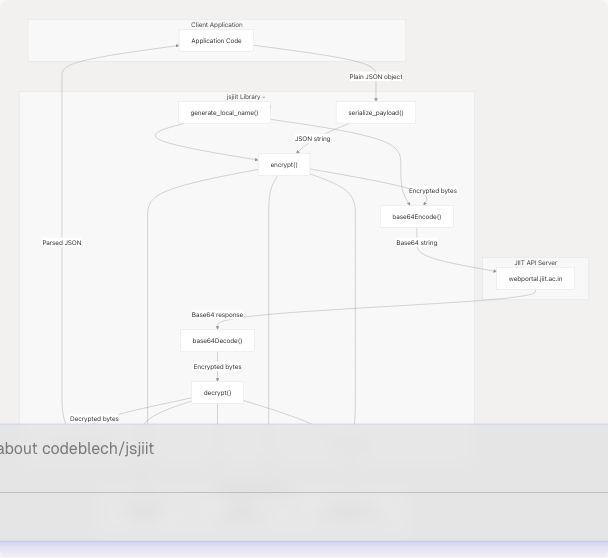
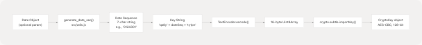
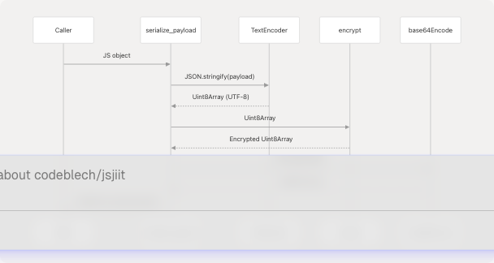
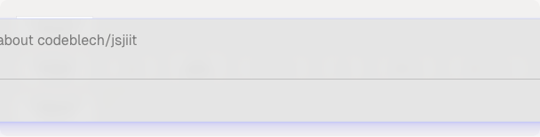
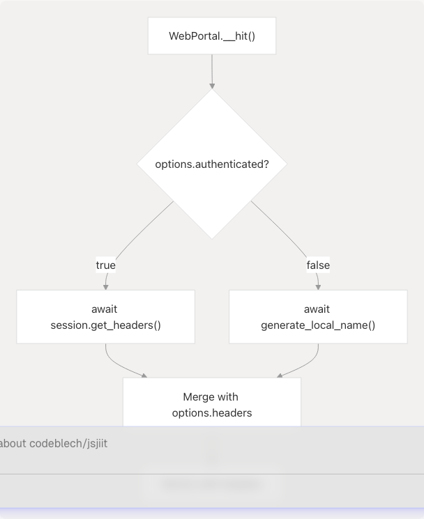

# Encryption and Security

## Purpose and Scope

This document explains the encryption and security mechanisms used by the jsjiit library to securely communicate with the JIIT WebPortal API. It covers the AES-CBC encryption implementation, payload serialization/deserialization, cryptographic key generation, and how these components integrate into the API communication flow.

For information about how the encrypted payloads are used in actual API methods, see [API Reference](3-api-reference). For details on the overall system architecture, see [System Architecture Overview](4.1-system-architecture-overview).

## Overview of Security Architecture

The jsjiit library implements a symmetric encryption scheme using AES-CBC (Advanced Encryption Standard in Cipher Block Chaining mode) to protect API request and response payloads. All security-critical operations are centralized in the `src/encryption.js` module, which provides functions for encryption, decryption, key generation, and payload serialization.



**Sources:** [src/encryption.js1-96](https://github.com/codeblech/jsjiit/blob/d123b782/src/encryption.js#L1-L96) [src/wrapper.js5](https://github.com/codeblech/jsjiit/blob/d123b782/src/wrapper.js#L5-L5)

## Cryptographic Primitives

### AES-CBC Configuration

The library uses the Web Crypto API to implement AES-CBC encryption with the following configuration:

| Parameter | Value | Location |
| --- | --- | --- |
| Algorithm | AES-CBC | `window.crypto.subtle` operations |
| Key Size | 128 bits (16 bytes) | Derived from 16-character string |
| Initialization Vector | `dcek9wb8frty1pnm` (16 bytes) | Constant defined in [src/encryption.js25](https://github.com/codeblech/jsjiit/blob/d123b782/src/encryption.js#L25-L25) |
| Block Size | 128 bits | AES standard |
| Mode | CBC (Cipher Block Chaining) | Specified in encrypt/decrypt calls |

The initialization vector (IV) is a fixed 16-byte constant:

```
const IV = new TextEncoder().encode("dcek9wb8frty1pnm");
```

**Sources:** [src/encryption.js24-25](https://github.com/codeblech/jsjiit/blob/d123b782/src/encryption.js#L24-L25) [src/encryption.js58-62](https://github.com/codeblech/jsjiit/blob/d123b782/src/encryption.js#L58-L62) [src/encryption.js69-73](https://github.com/codeblech/jsjiit/blob/d123b782/src/encryption.js#L69-L73)

### Date-Based Key Generation

The AES encryption key is dynamically generated based on the current date using the `generate_key()` function. This implements a time-synchronized key rotation scheme.



The `generate_date_seq()` function from `src/utils.js` creates a 7-character string from date components:

| Position | Component | Example |
| --- | --- | --- |
| 0 | First digit of day (01-31) | `0` from `01` |
| 1 | First digit of month (01-12) | `1` from `12` |
| 2 | First digit of year (YY) | `2` from `24` |
| 3 | Weekday (0-6) | `3` (Wednesday) |
| 4 | Second digit of day | `1` from `01` |
| 5 | Second digit of month | `2` from `12` |
| 6 | Second digit of year | `4` from `24` |

The final key is constructed as: `"qa8y" + dateSeq + "ty1pn"` (16 characters total).

**Sources:** [src/encryption.js28-36](https://github.com/codeblech/jsjiit/blob/d123b782/src/encryption.js#L28-L36) [src/utils.js14-24](https://github.com/codeblech/jsjiit/blob/d123b782/src/utils.js#L14-L24)

## Core Encryption Functions

### encrypt() and decrypt()

The `encrypt()` and `decrypt()` functions provide low-level AES-CBC encryption using the Web Crypto API.


Both functions are asynchronous and return Promises that resolve to `Uint8Array` objects.

**Sources:** [src/encryption.js54-73](https://github.com/codeblech/jsjiit/blob/d123b782/src/encryption.js#L54-L73)

## Payload Serialization and Deserialization

The library provides high-level functions for converting JavaScript objects to encrypted base64 strings and vice versa.

### serialize\_payload()

The `serialize_payload()` function transforms a JavaScript object into an encrypted, base64-encoded string ready for transmission.



**Sources:** [src/encryption.js87-95](https://github.com/codeblech/jsjiit/blob/d123b782/src/encryption.js#L87-L95)

### deserialize\_payload()

The `deserialize_payload()` function reverses the serialization process, decrypting and parsing base64-encoded API responses.


**Sources:** [src/encryption.js76-84](https://github.com/codeblech/jsjiit/blob/d123b782/src/encryption.js#L76-L84)

## LocalName Header Generation

The `generate_local_name()` function creates an encrypted identifier used in the `LocalName` HTTP header for API requests. This provides an additional layer of request authentication.

### LocalName Structure



The function generates a 16-character string composed of:

* 4 random alphanumeric characters (prefix)
* 7-character date sequence (middle)
* 5 random alphanumeric characters (suffix)

This string is then encrypted and base64-encoded for use in request headers.

**Sources:** [src/encryption.js39-51](https://github.com/codeblech/jsjiit/blob/d123b782/src/encryption.js#L39-L51) [src/utils.js27-41](https://github.com/codeblech/jsjiit/blob/d123b782/src/utils.js#L27-L41)

## Integration with API Communication

### Usage in WebPortalSession

The `WebPortalSession` class uses `generate_local_name()` to create authentication headers for API requests.


**Sources:** [src/wrapper.js59-69](https://github.com/codeblech/jsjiit/blob/d123b782/src/wrapper.js#L59-L69) [src/encryption.js39-51](https://github.com/codeblech/jsjiit/blob/d123b782/src/encryption.js#L39-L51)

### Usage in API Requests

The `WebPortal.__hit()` method uses both authenticated and unauthenticated request patterns, both requiring the `LocalName` header.

| Request Type | Headers Required | LocalName Source |
| --- | --- | --- |
| Authenticated | `Authorization`, `LocalName` | `session.get_headers()` |
| Unauthenticated | `LocalName` only | Direct call to `generate_local_name()` |



**Sources:** [src/wrapper.js97-158](https://github.com/codeblech/jsjiit/blob/d123b782/src/wrapper.js#L97-L158) [src/wrapper.js104-112](https://github.com/codeblech/jsjiit/blob/d123b782/src/wrapper.js#L104-L112)

### Payload Encryption in API Methods

Many API methods encrypt their request payloads using `serialize_payload()` before sending them to the server. The following table shows which methods use encrypted payloads:

| Method | Endpoint | Payload Encryption | Line Reference |
| --- | --- | --- | --- |
| `student_login()` | `/token/pretoken-check` | Yes | [src/wrapper.js173](https://github.com/codeblech/jsjiit/blob/d123b782/src/wrapper.js#L173-L173) |
| `student_login()` | `/token/generate-token1` | Yes | [src/wrapper.js181](https://github.com/codeblech/jsjiit/blob/d123b782/src/wrapper.js#L181-L181) |
| `get_attendance()` | `/getstudentattendancedetail` | Yes | [src/wrapper.js265](https://github.com/codeblech/jsjiit/blob/d123b782/src/wrapper.js#L265-L265) |
| `get_subject_daily_attendance()` | `/getstudentsubjectpersentage` | Yes | [src/wrapper.js289](https://github.com/codeblech/jsjiit/blob/d123b782/src/wrapper.js#L289-L289) |
| `get_registered_semesters()` | `/getregistrationList` | Yes | [src/wrapper.js309](https://github.com/codeblech/jsjiit/blob/d123b782/src/wrapper.js#L309-L309) |
| `get_registered_subjects_and_faculties()` | `/getfaculties` | Yes | [src/wrapper.js324](https://github.com/codeblech/jsjiit/blob/d123b782/src/wrapper.js#L324-L324) |
| `get_semesters_for_exam_events()` | `/getsemestercode-withstudentexamevents` | Yes | [src/wrapper.js339](https://github.com/codeblech/jsjiit/blob/d123b782/src/wrapper.js#L339-L339) |
| `get_exam_events()` | `/getstudentexamevents` | Yes | [src/wrapper.js356](https://github.com/codeblech/jsjiit/blob/d123b782/src/wrapper.js#L356-L356) |
| `get_exam_schedule()` | `/getstudent-examschedule` | Yes | [src/wrapper.js372](https://github.com/codeblech/jsjiit/blob/d123b782/src/wrapper.js#L372-L372) |
| `get_personal_info()` | `/getstudent-personalinformation` | No | [src/wrapper.js198](https://github.com/codeblech/jsjiit/blob/d123b782/src/wrapper.js#L198-L198) |
| `change_password()` | `/changepassword` | No | [src/wrapper.js231](https://github.com/codeblech/jsjiit/blob/d123b782/src/wrapper.js#L231-L231) |

**Sources:** [src/wrapper.js168-558](https://github.com/codeblech/jsjiit/blob/d123b782/src/wrapper.js#L168-L558)

## Base64 Encoding Utilities

The library provides base64 encoding and decoding functions optimized for `Uint8Array` data types.

### base64Encode()

Converts binary data (`Uint8Array`) to a base64 string using the browser's `btoa()` function.

```
// Implementation: src/encryption.js:11-13
export function base64Encode(data) {
  return btoa(String.fromCharCode.apply(null, new Uint8Array(data)));
}
```

**Sources:** [src/encryption.js7-13](https://github.com/codeblech/jsjiit/blob/d123b782/src/encryption.js#L7-L13)

### base64Decode()

Converts a base64 string back to binary data (`Uint8Array`) using the browser's `atob()` function.

```
// Implementation: src/encryption.js:20-22
export function base64Decode(data) {
  return Uint8Array.from(atob(data), (c) => c.charCodeAt(0));
}
```

**Sources:** [src/encryption.js15-22](https://github.com/codeblech/jsjiit/blob/d123b782/src/encryption.js#L15-L22)

## Security Considerations

### Key Rotation Mechanism

The date-based key generation provides automatic daily key rotation. Since `generate_key()` derives the encryption key from the current date, both the client and server must be synchronized to the same date for successful decryption.


This means that encrypted payloads are only valid for the day they were created, providing temporal security boundaries.

**Sources:** [src/encryption.js28-36](https://github.com/codeblech/jsjiit/blob/d123b782/src/encryption.js#L28-L36) [src/utils.js14-24](https://github.com/codeblech/jsjiit/blob/d123b782/src/utils.js#L14-L24)

### Fixed Initialization Vector

The library uses a fixed IV (`dcek9wb8frty1pnm`) for all encryption operations. While not cryptographically ideal (unique IVs per encryption are recommended for CBC mode), this is a design constraint imposed by the JIIT API's decryption expectations.

**Warning:** The fixed IV means that identical plaintexts encrypted on the same day will produce identical ciphertexts, potentially leaking information. However, the inclusion of random sequences in payloads (via `generate_local_name()`) mitigates this to some extent.

**Sources:** [src/encryption.js24-25](https://github.com/codeblech/jsjiit/blob/d123b782/src/encryption.js#L24-L25)

### Web Crypto API Dependency

All cryptographic operations rely on the browser's Web Crypto API (`window.crypto.subtle`), which provides:

* Hardware-accelerated encryption when available
* Secure key storage (keys never exposed as raw bytes)
* Standards-compliant AES-CBC implementation

The library will fail in environments without Web Crypto API support (e.g., insecure HTTP contexts, older browsers).

**Sources:** [src/encryption.js35](https://github.com/codeblech/jsjiit/blob/d123b782/src/encryption.js#L35-L35) [src/encryption.js60](https://github.com/codeblech/jsjiit/blob/d123b782/src/encryption.js#L60-L60) [src/encryption.js71](https://github.com/codeblech/jsjiit/blob/d123b782/src/encryption.js#L71-L71)
