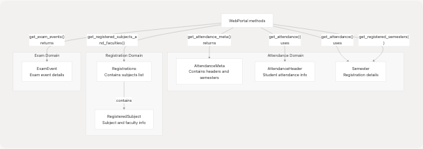

# Module Organization

> Source: https://deepwiki.com/codeblech/jsjiit/4.3-module-organization

# Module Organization

Relevant source files

* [package.json](https://github.com/codeblech/jsjiit/blob/d123b782/package.json)
* [src/index.js](https://github.com/codeblech/jsjiit/blob/d123b782/src/index.js)
* [src/wrapper.js](https://github.com/codeblech/jsjiit/blob/d123b782/src/wrapper.js)

This document explains how the jsjiit library's source code is organized into modules, their individual responsibilities, and how they interact to form a cohesive public API. It covers the module structure within the `src/` directory, the dependency relationships between modules, and the export strategy that presents a unified interface to library consumers.

For information about the build system that processes these modules into distribution artifacts, see [Build System](/codeblech/jsjiit/5.1-build-system). For details on the runtime architecture and data flow, see [System Architecture Overview](/codeblech/jsjiit/4.1-system-architecture-overview).

---

## Overview

The jsjiit library follows a modular architecture with clear separation of concerns. All source code resides in the `src/` directory and is organized into specialized modules:

| Module Category | Files | Primary Responsibility |
| --- | --- | --- |
| **Public API** | `index.js` | Unified export interface and facade |
| **Core Logic** | `wrapper.js` | Portal interaction, session management, API orchestration |
| **Cryptography** | `encryption.js` | AES-CBC encryption, payload serialization |
| **Domain Models** | `attendance.js`, `registration.js`, `exam.js` | Data structures and type definitions |
| **Error Handling** | `exceptions.js` | Custom error classes |
| **Utilities** | `utils.js`, `feedback.js` | Helper functions and enumerations |

**Sources:** [package.json1-61](https://github.com/codeblech/jsjiit/blob/d123b782/package.json#L1-L61) [src/index.js1-31](https://github.com/codeblech/jsjiit/blob/d123b782/src/index.js#L1-L31) [src/wrapper.js1-720](https://github.com/codeblech/jsjiit/blob/d123b782/src/wrapper.js#L1-L720)

---

## Module Structure Diagram

**Diagram: Source Module Organization and Dependencies**


```

**Sources:** [src/index.js4-31](https://github.com/codeblech/jsjiit/blob/d123b782/src/index.js#L4-L31) [src/wrapper.js1-6](https://github.com/codeblech/jsjiit/blob/d123b782/src/wrapper.js#L1-L6)

---

## Public API Module

### src/index.js

The `src/index.js` module serves as the single entry point for the entire library, implementing the **Facade Pattern**. It imports all public classes, functions, and constants from individual modules and re-exports them as a unified API surface.

**Diagram: Public API Exports**

```

```

The module exports the following entities:

| Category | Exports | Source Module |
| --- | --- | --- |
| **Core Classes** | `WebPortal`, `WebPortalSession` | `wrapper.js` |
| **Constants** | `API`, `DEFCAPTCHA` | `wrapper.js` |
| **Attendance Models** | `AttendanceHeader`, `Semester`, `AttendanceMeta` | `attendance.js` |
| **Registration Models** | `RegisteredSubject`, `Registrations` | `registration.js` |
| **Exam Models** | `ExamEvent` | `exam.js` |
| **Error Classes** | `APIError`, `LoginError`, `SessionError`, `SessionExpired`, `AccountAPIError`, `NotLoggedIn` | `exceptions.js` |
| **Utilities** | `generate_local_name` | `encryption.js` |

**Sources:** [src/index.js4-31](https://github.com/codeblech/jsjiit/blob/d123b782/src/index.js#L4-L31) [package.json5-8](https://github.com/codeblech/jsjiit/blob/d123b782/package.json#L5-L8)

---

## Core Layer Modules

### src/wrapper.js

The `src/wrapper.js` module is the most complex and central module in the library, containing the primary business logic for portal interaction.

**Key Components:**

#### Constants

* **`API`** [src/wrapper.js14](https://github.com/codeblech/jsjiit/blob/d123b782/src/wrapper.js#L14-L14) - Base API endpoint URL: `"https://webportal.jiit.ac.in:6011/StudentPortalAPI"`
* **`DEFCAPTCHA`** [src/wrapper.js20](https://github.com/codeblech/jsjiit/blob/d123b782/src/wrapper.js#L20-L20) - Default CAPTCHA values for login: `{ captcha: "phw5n", hidden: "gmBctEffdSg=" }`

#### Classes

**`WebPortalSession`** [src/wrapper.js25-70](https://github.com/codeblech/jsjiit/blob/d123b782/src/wrapper.js#L25-L70)

* Represents an authenticated session with the portal
* Stores session metadata: `token`, `expiry`, `memberid`, `userid`, `instituteid`, etc.
* Provides `get_headers()` method [src/wrapper.js63-69](https://github.com/codeblech/jsjiit/blob/d123b782/src/wrapper.js#L63-L69) for generating authenticated request headers

**`WebPortal`** [src/wrapper.js75-671](https://github.com/codeblech/jsjiit/blob/d123b782/src/wrapper.js#L75-L671)

* Main class for API interaction
* Contains 30+ public methods for various portal operations
* Implements authentication decorator pattern [src/wrapper.js679-719](https://github.com/codeblech/jsjiit/blob/d123b782/src/wrapper.js#L679-L719)

**Diagram: WebPortal Method Categories**

```

```

**Internal Methods:**

* **`__hit()`** [src/wrapper.js97-158](https://github.com/codeblech/jsjiit/blob/d123b782/src/wrapper.js#L97-L158) - Private method for making HTTP requests, handles authentication headers, error handling, and response validation
* **`__get_program_id()`** [src/wrapper.js451-458](https://github.com/codeblech/jsjiit/blob/d123b782/src/wrapper.js#L451-L458) - Private helper for grade card operations
* **`__get_semester_number()`** [src/wrapper.js483-493](https://github.com/codeblech/jsjiit/blob/d123b782/src/wrapper.js#L483-L493) - Private helper for SGPA/CGPA operations

**Authentication Decorator:**
The module implements a decorator pattern [src/wrapper.js679-719](https://github.com/codeblech/jsjiit/blob/d123b782/src/wrapper.js#L679-L719) that automatically checks authentication status before executing protected methods. The `authenticatedMethods` array [src/wrapper.js692-715](https://github.com/codeblech/jsjiit/blob/d123b782/src/wrapper.js#L692-L715) lists all methods requiring authentication, and the decorator is applied to each via prototype modification.

**Sources:** [src/wrapper.js1-720](https://github.com/codeblech/jsjiit/blob/d123b782/src/wrapper.js#L1-L720)

---

### src/encryption.js

The `src/encryption.js` module handles cryptographic operations required for secure communication with the JIIT portal API.

**Key Functions:**

| Function | Purpose | Return Type |
| --- | --- | --- |
| `generate_local_name()` | Generates random sequence for `LocalName` header | `Promise<string>` |
| `serialize_payload(payload)` | Encrypts payload using AES-CBC | `Promise<string>` |
| `deserialize_payload(encrypted)` | Decrypts response using AES-CBC | `Promise<Object>` |

The encryption module is a critical dependency of `wrapper.js`, used in methods like:

* `get_attendance()` [src/wrapper.js265-271](https://github.com/codeblech/jsjiit/blob/d123b782/src/wrapper.js#L265-L271) - Encrypts attendance request payload
* `get_registered_semesters()` [src/wrapper.js309-312](https://github.com/codeblech/jsjiit/blob/d123b782/src/wrapper.js#L309-L312) - Encrypts semester list request
* `get_exam_events()` [src/wrapper.js356-359](https://github.com/codeblech/jsjiit/blob/d123b782/src/wrapper.js#L356-L359) - Encrypts exam event request

For detailed cryptographic implementation, see [Encryption and Security](/codeblech/jsjiit/4.2-encryption-and-security).

**Sources:** [src/wrapper.js5](https://github.com/codeblech/jsjiit/blob/d123b782/src/wrapper.js#L5-L5) [src/index.js10](https://github.com/codeblech/jsjiit/blob/d123b782/src/index.js#L10-L10)

---

## Domain Model Layer

The domain model layer consists of classes that represent data structures returned by the portal API. These classes provide structured access to API responses and type safety.

**Diagram: Domain Model Dependencies**

```

```

### src/attendance.js

Defines attendance-related data structures:

* **`AttendanceHeader`** - Represents student attendance header information with properties like `stynumber`
* **`Semester`** - Represents a semester with `registration_id`, `registration_code`, and factory method `from_json()`
* **`AttendanceMeta`** - Container class combining attendance headers and semester lists

**Sources:** [src/attendance.js1](https://github.com/codeblech/jsjiit/blob/d123b782/src/attendance.js#L1-LNaN) [src/wrapper.js3](https://github.com/codeblech/jsjiit/blob/d123b782/src/wrapper.js#L3-L3) [src/index.js6](https://github.com/codeblech/jsjiit/blob/d123b782/src/index.js#L6-L6)

### src/registration.js

Defines registration-related data structures:

* **`RegisteredSubject`** - Represents a subject with faculty assignment, subject codes, and component IDs
* **`Registrations`** - Container class holding lists of `RegisteredSubject` instances

**Sources:** [src/registration.js1](https://github.com/codeblech/jsjiit/blob/d123b782/src/registration.js#L1-LNaN) [src/wrapper.js2](https://github.com/codeblech/jsjiit/blob/d123b782/src/wrapper.js#L2-L2) [src/index.js7](https://github.com/codeblech/jsjiit/blob/d123b782/src/index.js#L7-L7)

### src/exam.js

Defines exam-related data structures:

* **`ExamEvent`** - Represents an exam event with properties like `exam_event_id` and `registration_id`, includes factory method `from_json()`

**Sources:** [src/exam.js1](https://github.com/codeblech/jsjiit/blob/d123b782/src/exam.js#L1-LNaN) [src/wrapper.js4](https://github.com/codeblech/jsjiit/blob/d123b782/src/wrapper.js#L4-L4) [src/index.js8](https://github.com/codeblech/jsjiit/blob/d123b782/src/index.js#L8-L8)

---

## Support Layer Modules

### src/exceptions.js

Defines custom error classes for error handling throughout the library. All error classes extend the base `Error` class.

**Error Hierarchy:**

| Error Class | Usage Context |
| --- | --- |
| `APIError` | Generic API errors, base class for specific errors |
| `LoginError` | Authentication failures during `student_login()` |
| `SessionError` | Session management errors |
| `SessionExpired` | Token expiration (HTTP 401) |
| `NotLoggedIn` | Attempted authenticated operation without login |
| `AccountAPIError` | Account-related operation failures (e.g., password change) |

The `wrapper.js` module throws these exceptions in various contexts:

* `LoginError` [src/wrapper.js175](https://github.com/codeblech/jsjiit/blob/d123b782/src/wrapper.js#L175-L175) - During login operations
* `SessionExpired` [src/wrapper.js142](https://github.com/codeblech/jsjiit/blob/d123b782/src/wrapper.js#L142-L142) - On HTTP 401 responses
* `AccountAPIError` [src/wrapper.js234](https://github.com/codeblech/jsjiit/blob/d123b782/src/wrapper.js#L234-L234) - During password change
* Generic `APIError` [src/wrapper.js98](https://github.com/codeblech/jsjiit/blob/d123b782/src/wrapper.js#L98-L98) - Default exception for API errors

**Sources:** [src/exceptions.js1](https://github.com/codeblech/jsjiit/blob/d123b782/src/exceptions.js#L1-LNaN) [src/wrapper.js1](https://github.com/codeblech/jsjiit/blob/d123b782/src/wrapper.js#L1-L1) [src/index.js9](https://github.com/codeblech/jsjiit/blob/d123b782/src/index.js#L9-L9)

### src/utils.js

Contains utility functions for date manipulation and random sequence generation. This module is imported by `wrapper.js` but not re-exported in `index.js`, making it an internal utility module.

**Sources:** [src/wrapper.js5](https://github.com/codeblech/jsjiit/blob/d123b782/src/wrapper.js#L5-L5)

### src/feedback.js

Defines the `FeedbackOptions` enumeration used by the `fill_feedback_form()` method [src/wrapper.js577-670](https://github.com/codeblech/jsjiit/blob/d123b782/src/wrapper.js#L577-L670) to specify feedback ratings.

**Sources:** [src/wrapper.js577-670](https://github.com/codeblech/jsjiit/blob/d123b782/src/wrapper.js#L577-L670)

---

## Module Import/Export Strategy

**Diagram: Import/Export Flow**

```

```

### Export Pattern

The library uses a **centralized export pattern** where:

1. **Individual modules** define and export their own entities
2. **`src/index.js`** imports all public entities
3. **`src/index.js`** re-exports them as a unified API
4. **Consumers** import only from the main entry point

This pattern provides:

* **Abstraction**: Internal module structure is hidden from consumers
* **Simplicity**: Single import point for all functionality
* **Flexibility**: Internal refactoring doesn't break consumer code
* **Tree-shaking**: Build tools can eliminate unused exports

**Sources:** [src/index.js1-31](https://github.com/codeblech/jsjiit/blob/d123b782/src/index.js#L1-L31) [package.json5](https://github.com/codeblech/jsjiit/blob/d123b782/package.json#L5-L5)

---

## Module Resolution and Entry Points

The `package.json` defines multiple entry points for different consumption scenarios:

**Diagram: Package Entry Points**

```

```

### Entry Point Definitions

| Field | Value | Purpose |
| --- | --- | --- |
| `main` | `src/index.js` | Legacy/fallback entry point |
| `module` | `dist/jsjiit.esm.js` | ES module hint for bundlers |
| `browser` | `dist/jsjiit.esm.js` | Browser-specific build |
| `exports.import` | `dist/jsjiit.esm.js` | Modern ES module import |
| `exports.require` | `dist/jsjiit.esm.js` | CommonJS require (same as import) |

The `files` field [package.json26-29](https://github.com/codeblech/jsjiit/blob/d123b782/package.json#L26-L29) specifies that both `dist` and `src` directories are included in the published package, allowing consumers to:

* Use pre-built bundles from `dist/` for production
* Access source files from `src/` for debugging or custom builds

**Sources:** [package.json5-29](https://github.com/codeblech/jsjiit/blob/d123b782/package.json#L5-L29)

---

## Build Process Integration

The module organization supports the build pipeline defined in `build.mjs` (see [Build System](/codeblech/jsjiit/5.1-build-system)):

1. **Source modules** in `src/` are written as ES modules with JSDoc comments
2. **Build script** processes `src/index.js` as the entry point
3. **esbuild** bundles all dependencies into `dist/jsjiit.esm.js` and `dist/jsjiit.min.esm.js`
4. **JSDoc** generates documentation from source modules
5. **npm package** includes both `src/` (source) and `dist/` (bundles)

**Diagram: Build Process Module Flow**

```


The `prepare` script [package.json16](https://github.com/codeblech/jsjiit/blob/d123b782/package.json#L16-L16) ensures bundles are built automatically before package publishing, while the `docs` script [package.json14](https://github.com/codeblech/jsjiit/blob/d123b782/package.json#L14-L14) generates documentation from module comments.

**Sources:** [package.json12-16](https://github.com/codeblech/jsjiit/blob/d123b782/package.json#L12-L16) [build.mjs1](https://github.com/codeblech/jsjiit/blob/d123b782/build.mjs#L1-LNaN) [jsdoc.conf.json1](https://github.com/codeblech/jsjiit/blob/d123b782/jsdoc.conf.json#L1-LNaN)

---

## Module Design Principles

The jsjiit module organization follows several key design principles:

### 1. Single Responsibility

Each module has a clearly defined purpose:

* `wrapper.js` - Portal interaction logic only
* `encryption.js` - Cryptographic operations only
* Domain model files - Data structure definitions only
* `exceptions.js` - Error definitions only

### 2. Dependency Direction

Dependencies flow in one direction:

```
Consumers → index.js → wrapper.js → {encryption.js, models, exceptions}
```

No circular dependencies exist between modules.

### 3. Abstraction Layers

* **Public API** (`index.js`) - Consumer-facing facade
* **Business Logic** (`wrapper.js`) - Portal interaction orchestration
* **Domain Models** - Data representation
* **Technical Services** (`encryption.js`, `exceptions.js`) - Cross-cutting concerns

### 4. Encapsulation

* Private methods use `__` prefix (e.g., `__hit()`, `__get_program_id()`)
* Internal utilities (`utils.js`) are not exported in public API
* Implementation details hidden behind class interfaces

**Sources:** [src/wrapper.js97](https://github.com/codeblech/jsjiit/blob/d123b782/src/wrapper.js#L97-L97) [src/wrapper.js451](https://github.com/codeblech/jsjiit/blob/d123b782/src/wrapper.js#L451-L451) [src/index.js1-31](https://github.com/codeblech/jsjiit/blob/d123b782/src/index.js#L1-L31)