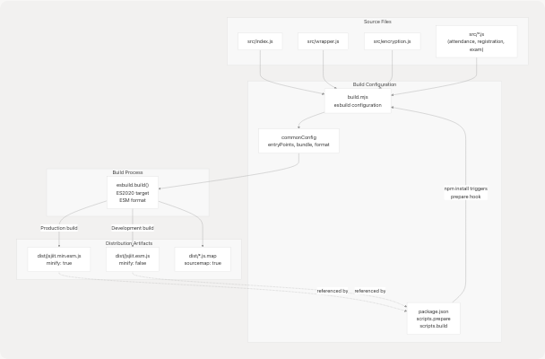
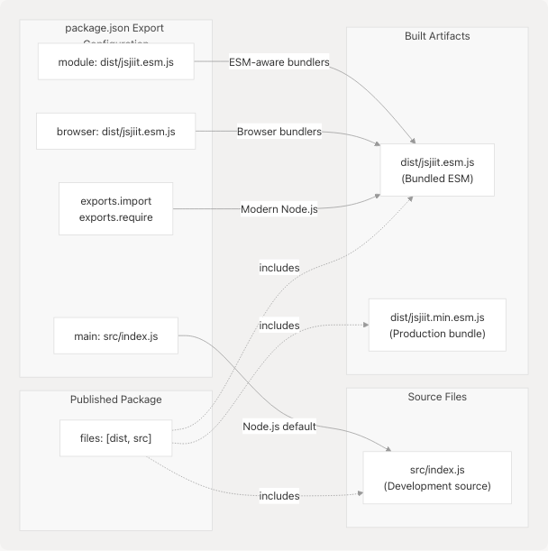
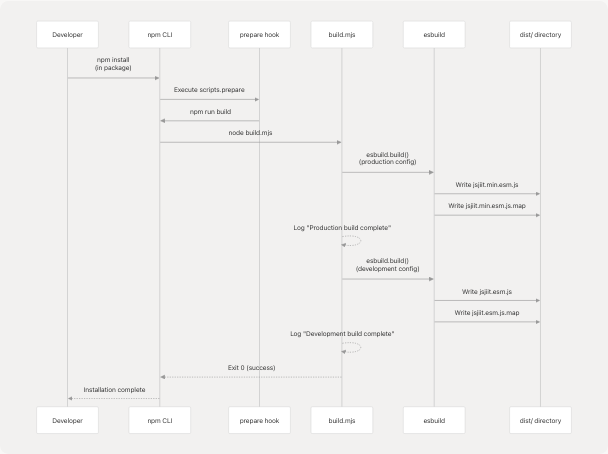

# Build and Distribution

This document provides a comprehensive overview of the build system and distribution pipeline for the jsjiit library. It covers how source code is transformed into distributable artifacts, packaged for npm, and made available through various consumption channels.

For detailed information about the build script implementation, see [Build System](5.1-build-system). For package metadata and configuration, see [Package Configuration](5.2-package-configuration). For dependency management details, see [Dependency Management](5.3-dependency-management).

---

## Overview

The jsjiit library uses an automated build and distribution pipeline that transforms ES module source code into browser-compatible bundles. The system produces two distribution artifacts: a minified production bundle and an unminified development bundle, both in ESM format with source maps.

| Artifact | Purpose | Minified | Source Maps |
| --- | --- | --- | --- |
| `dist/jsjiit.min.esm.js` | Production deployment | Yes | Yes |
| `dist/jsjiit.esm.js` | Development/debugging | No | Yes |

The build process is triggered automatically during package installation via the npm `prepare` lifecycle hook, ensuring that consumers always receive pre-built artifacts.

**Sources:** [package.json1-61](https://github.com/codeblech/jsjiit/blob/d123b782/package.json#L1-L61) [build.mjs1-37](https://github.com/codeblech/jsjiit/blob/d123b782/build.mjs#L1-L37)

---

## Build Pipeline Architecture

The following diagram illustrates the complete build and distribution flow from source code to consumable artifacts:



**Build Script Execution Flow**

The [build.mjs11-34](https://github.com/codeblech/jsjiit/blob/d123b782/build.mjs#L11-L34) script executes two sequential builds:

1. **Production Build** [build.mjs14-18](https://github.com/codeblech/jsjiit/blob/d123b782/build.mjs#L14-L18): Creates `dist/jsjiit.min.esm.js` with `minify: true`
2. **Development Build** [build.mjs22-26](https://github.com/codeblech/jsjiit/blob/d123b782/build.mjs#L22-L26): Creates `dist/jsjiit.esm.js` with `minify: false`

Both builds share common configuration defined in [build.mjs3-9](https://github.com/codeblech/jsjiit/blob/d123b782/build.mjs#L3-L9):

| Configuration | Value | Purpose |
| --- | --- | --- |
| `entryPoints` | `["src/index.js"]` | Single entry point that imports all modules |
| `bundle` | `true` | Bundles all dependencies into single file |
| `format` | `"esm"` | ES modules format for browser compatibility |
| `sourcemap` | `true` | Generates debug source maps |
| `target` | `["es2020"]` | Browser compatibility target |

**Sources:** [build.mjs1-37](https://github.com/codeblech/jsjiit/blob/d123b782/build.mjs#L1-L37) [package.json15-16](https://github.com/codeblech/jsjiit/blob/d123b782/package.json#L15-L16)

---

## Package Structure and Exports

The package defines multiple entry points to support different consumption patterns. This diagram shows the relationship between package.json export configurations and the actual files:



**Export Resolution Strategy**

The [package.json5-25](https://github.com/codeblech/jsjiit/blob/d123b782/package.json#L5-L25) defines a multi-layered export strategy:

| Field | Value | Consumer Type |
| --- | --- | --- |
| `main` | `"src/index.js"` | Legacy Node.js, direct source access |
| `module` | `"dist/jsjiit.esm.js"` | Bundlers with ESM support (Webpack, Rollup) |
| `browser` | `"dist/jsjiit.esm.js"` | Browser-specific bundlers |
| `exports.import` | `"./dist/jsjiit.esm.js"` | Modern Node.js with ESM support |
| `exports.require` | `"./dist/jsjiit.esm.js"` | CommonJS consumers (limited) |

**Sources:** [package.json5-8](https://github.com/codeblech/jsjiit/blob/d123b782/package.json#L5-L8) [package.json22-25](https://github.com/codeblech/jsjiit/blob/d123b782/package.json#L22-L25) [package.json26-29](https://github.com/codeblech/jsjiit/blob/d123b782/package.json#L26-L29)

---

## Distribution Channels

The library is distributed through multiple channels to maximize accessibility:


**Distribution Targets**

1. **npm Registry**: Primary distribution channel via `npm publish`

   * Package name: `jsjiit` [package.json2](https://github.com/codeblech/jsjiit/blob/d123b782/package.json#L2-L2)
   * Current version: `0.0.23` [package.json3](https://github.com/codeblech/jsjiit/blob/d123b782/package.json#L3-L3)
   * Included files: `["dist", "src"]` [package.json26-29](https://github.com/codeblech/jsjiit/blob/d123b782/package.json#L26-L29)
2. **CDN (jsdelivr)**: Automatic mirroring from npm

   * No additional configuration required
   * Provides direct browser imports via URL
3. **GitHub Repository**: Source code and development files

   * Repository: `git+https://github.com/codeblech/jsjiit.git` [package.json18-21](https://github.com/codeblech/jsjiit/blob/d123b782/package.json#L18-L21)
   * Not a distribution channel, but used for development and issues

**Sources:** [package.json2-3](https://github.com/codeblech/jsjiit/blob/d123b782/package.json#L2-L3) [package.json18-21](https://github.com/codeblech/jsjiit/blob/d123b782/package.json#L18-L21) [package.json26-29](https://github.com/codeblech/jsjiit/blob/d123b782/package.json#L26-L29)

---

## Automated Build Lifecycle

The build system integrates with npm's lifecycle hooks to ensure artifacts are always up-to-date:



**Lifecycle Hook Chain**

The [package.json12-16](https://github.com/codeblech/jsjiit/blob/d123b782/package.json#L12-L16) defines the script chain:

```
{
  "scripts": {
    "build": "node build.mjs",
    "prepare": "npm run build"
  }
}
```

**Execution Order:**

1. **User Action**: `npm install` in the jsjiit package directory
2. **Automatic Trigger**: npm executes the `prepare` script [package.json16](https://github.com/codeblech/jsjiit/blob/d123b782/package.json#L16-L16)
3. **Build Invocation**: `prepare` calls `npm run build` which executes `node build.mjs` [package.json15](https://github.com/codeblech/jsjiit/blob/d123b782/package.json#L15-L15)
4. **Bundle Generation**: [build.mjs11-36](https://github.com/codeblech/jsjiit/blob/d123b782/build.mjs#L11-L36) runs both production and development builds
5. **Completion**: Build artifacts are ready in `dist/` directory

This ensures that:

* Developers always have fresh builds after dependency updates
* Published packages include pre-built artifacts
* Contributors don't need to manually run build commands

**Sources:** [package.json12-16](https://github.com/codeblech/jsjiit/blob/d123b782/package.json#L12-L16) [build.mjs11-36](https://github.com/codeblech/jsjiit/blob/d123b782/build.mjs#L11-L36)

---

## Build Artifact Details

The build process generates the following files in the `dist/` directory:

| File | Size Characteristics | Purpose |
| --- | --- | --- |
| `jsjiit.min.esm.js` | Minified, no whitespace | Production deployment |
| `jsjiit.min.esm.js.map` | Base64 source mappings | Production debugging |
| `jsjiit.esm.js` | Unminified, formatted | Development/debugging |
| `jsjiit.esm.js.map` | Base64 source mappings | Development debugging |

**Bundle Characteristics:**

* **Format**: ES Module (ESM) with `export` statements [build.mjs6](https://github.com/codeblech/jsjiit/blob/d123b782/build.mjs#L6-L6)
* **Target**: ES2020 syntax [build.mjs8](https://github.com/codeblech/jsjiit/blob/d123b782/build.mjs#L8-L8)
* **Entry Point**: `src/index.js` [build.mjs4](https://github.com/codeblech/jsjiit/blob/d123b782/build.mjs#L4-L4)
* **Bundling**: All source modules bundled into single file [build.mjs5](https://github.com/codeblech/jsjiit/blob/d123b782/build.mjs#L5-L5)
* **Source Maps**: Inline references to `.map` files [build.mjs7](https://github.com/codeblech/jsjiit/blob/d123b782/build.mjs#L7-L7)

The minified bundle uses aggressive optimizations including:

* Variable name mangling
* Whitespace removal
* Dead code elimination
* Tree shaking of unused exports

The development bundle preserves:

* Original variable names
* Readable formatting
* Comments (where appropriate)
* Logical code structure

**Sources:** [build.mjs3-9](https://github.com/codeblech/jsjiit/blob/d123b782/build.mjs#L3-L9) [build.mjs14-26](https://github.com/codeblech/jsjiit/blob/d123b782/build.mjs#L14-L26)

---

## Package Metadata

The [package.json1-61](https://github.com/codeblech/jsjiit/blob/d123b782/package.json#L1-L61) contains essential metadata for npm registry listing and package discovery:

| Field | Value | Purpose |
| --- | --- | --- |
| `name` | `"jsjiit"` | Package identifier on npm |
| `version` | `"0.0.23"` | Semantic version number |
| `description` | Browser-compatible JIIT API | Package summary |
| `author` | `"codeblech"` | Package maintainer |
| `license` | `"ISC"` | Open source license |
| `type` | `"module"` | Package uses ES modules |

**Keywords for Discoverability** [package.json30-50](https://github.com/codeblech/jsjiit/blob/d123b782/package.json#L30-L50):

The package includes 19 keywords targeting various search terms related to JIIT, Jaypee, portal access, and attendance tracking. These improve npm search visibility and help users discover the library.

**Repository Links** [package.json18-21](https://github.com/codeblech/jsjiit/blob/d123b782/package.json#L18-L21):

* Repository: `https://github.com/codeblech/jsjiit.git`
* Issues: `https://github.com/codeblech/jsjiit/issues`
* Homepage: `https://github.com/codeblech/jsjiit#readme`

**Sources:** [package.json1-56](https://github.com/codeblech/jsjiit/blob/d123b782/package.json#L1-L56)

---

## Version Management

The package version is centrally defined in [package.json3](https://github.com/codeblech/jsjiit/blob/d123b782/package.json#L3-L3) and must be manually updated before each release. Both [package.json3](https://github.com/codeblech/jsjiit/blob/d123b782/package.json#L3-L3) and [package-lock.json3](https://github.com/codeblech/jsjiit/blob/d123b782/package-lock.json#L3-L3) maintain version synchronization.

**Current Version**: `0.0.23`

The version follows semantic versioning (MAJOR.MINOR.PATCH) conventions, though as indicated by the `0.0.x` prefix, the library is still in initial development phase where breaking changes may occur between releases.

**Sources:** [package.json3](https://github.com/codeblech/jsjiit/blob/d123b782/package.json#L3-L3) [package-lock.json1-4](https://github.com/codeblech/jsjiit/blob/d123b782/package-lock.json#L1-L4)
