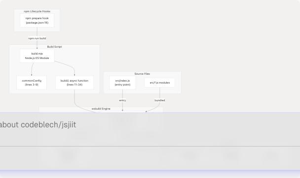
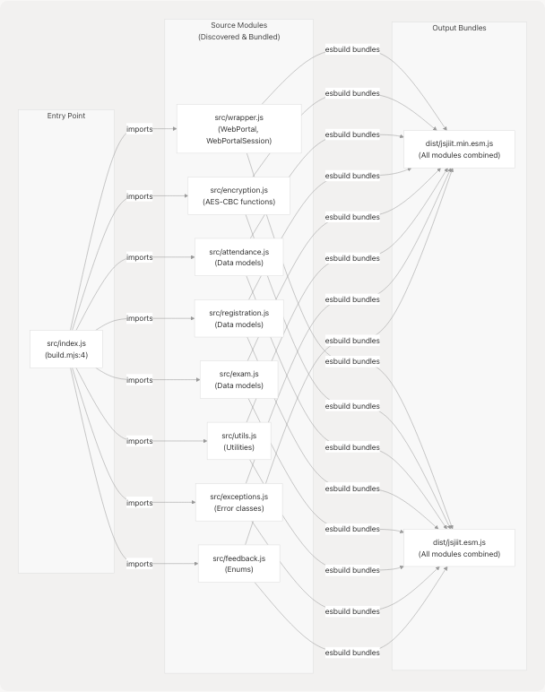

# Build System

> Source: https://deepwiki.com/codeblech/jsjiit/5.1-build-system

# Build System

Relevant source files

* [build.mjs](https://github.com/codeblech/jsjiit/blob/d123b782/build.mjs)
* [package-lock.json](https://github.com/codeblech/jsjiit/blob/d123b782/package-lock.json)
* [package.json](https://github.com/codeblech/jsjiit/blob/d123b782/package.json)

## Purpose and Scope

This document describes the esbuild-based build system used to transform the jsjiit library source code into distributable ES module bundles. The build system generates both production (minified) and development (unminified) builds with source maps for debugging. For information about package structure and npm publishing configuration, see [Package Configuration](/codeblech/jsjiit/5.2-package-configuration). For documentation generation, see [JSDoc Configuration](/codeblech/jsjiit/6.1-jsdoc-configuration).

**Sources:** [package.json1-61](https://github.com/codeblech/jsjiit/blob/d123b782/package.json#L1-L61) [build.mjs1-37](https://github.com/codeblech/jsjiit/blob/d123b782/build.mjs#L1-L37)

---

## Build System Architecture

The jsjiit build system uses esbuild as its sole build tool, configured through a Node.js script that executes two parallel build configurations. The system is triggered automatically during npm package preparation.

### Build Tool Chain


```

**Sources:** [build.mjs1-37](https://github.com/codeblech/jsjiit/blob/d123b782/build.mjs#L1-L37) [package.json12-16](https://github.com/codeblech/jsjiit/blob/d123b782/package.json#L12-L16) [package.json58](https://github.com/codeblech/jsjiit/blob/d123b782/package.json#L58-L58)

---

## Build Configuration

The build configuration is defined in `build.mjs` through the `commonConfig` object, which contains shared settings used by both production and development builds.

### Common Configuration Object

| Configuration Key | Value | Purpose |
| --- | --- | --- |
| `entryPoints` | `["src/index.js"]` | Single entry point that imports all library modules |
| `bundle` | `true` | Bundle all dependencies and imports into single output files |
| `format` | `"esm"` | Output ES module format for modern browsers |
| `sourcemap` | `true` | Generate source map files for debugging |
| `target` | `["es2020"]` | Target ES2020 browser compatibility level |

**Sources:** [build.mjs3-9](https://github.com/codeblech/jsjiit/blob/d123b782/build.mjs#L3-L9)

### Build-Specific Configurations

The `build()` function executes two separate esbuild build operations with different output configurations:

#### Production Build Configuration

```
```
{
  ...commonConfig,
  outfile: "dist/jsjiit.min.esm.js",
  minify: true
}
```
```

* **Minification:** Code is minified, removing whitespace, shortening variable names, and applying optimizations
* **Output:** `dist/jsjiit.min.esm.js` for production use via CDN

**Sources:** [build.mjs14-18](https://github.com/codeblech/jsjiit/blob/d123b782/build.mjs#L14-L18)

#### Development Build Configuration

```
```
{
  ...commonConfig,
  outfile: "dist/jsjiit.esm.js",
  minify: false
}
```
```

* **Minification:** Disabled to preserve readability
* **Output:** `dist/jsjiit.esm.js` for debugging and development

**Sources:** [build.mjs22-26](https://github.com/codeblech/jsjiit/blob/d123b782/build.mjs#L22-L26)

---

## Build Execution Flow

The build process follows a sequential execution pattern that produces both output bundles in a single run.

```

```

**Sources:** [build.mjs11-36](https://github.com/codeblech/jsjiit/blob/d123b782/build.mjs#L11-L36) [package.json15-16](https://github.com/codeblech/jsjiit/blob/d123b782/package.json#L15-L16)

---

## Entry Point and Module Resolution

The build system uses `src/index.js` as the single entry point, which esbuild then traverses to discover and bundle all dependencies.

### Module Bundling Strategy

```

```

**Sources:** [build.mjs4](https://github.com/codeblech/jsjiit/blob/d123b782/build.mjs#L4-L4) [package.json5](https://github.com/codeblech/jsjiit/blob/d123b782/package.json#L5-L5)

---

## Output Artifacts

The build system generates three types of output files in the `dist/` directory for each build configuration.

### Output File Structure

| File | Type | Size | Purpose |
| --- | --- | --- | --- |
| `dist/jsjiit.min.esm.js` | Production Bundle | Minimal | CDN distribution, production imports |
| `dist/jsjiit.min.esm.js.map` | Source Map | Mapping data | Debug production issues |
| `dist/jsjiit.esm.js` | Development Bundle | Readable | Local development, debugging |
| `dist/jsjiit.esm.js.map` | Source Map | Mapping data | Debug development issues |

**Sources:** [build.mjs16](https://github.com/codeblech/jsjiit/blob/d123b782/build.mjs#L16-L16) [build.mjs24](https://github.com/codeblech/jsjiit/blob/d123b782/build.mjs#L24-L24) [build.mjs7](https://github.com/codeblech/jsjiit/blob/d123b782/build.mjs#L7-L7)

### Source Map Generation

Source maps are generated for both builds via the `sourcemap: true` configuration. These files enable browser developer tools to map bundled code back to original source files.

**Configuration:** [build.mjs7](https://github.com/codeblech/jsjiit/blob/d123b782/build.mjs#L7-L7)

---

## npm Lifecycle Integration

The build system integrates with npm's lifecycle hooks to ensure bundles are always up-to-date before package publishing.

### npm Scripts Configuration

```


**Sources:** [package.json15-16](https://github.com/codeblech/jsjiit/blob/d123b782/package.json#L15-L16)

### Build Script Execution

The `prepare` lifecycle hook ensures the build executes:

* **Before npm publish:** Guarantees published package contains latest bundles
* **After npm install:** Ensures development environment has built artifacts

Manual builds can be triggered via `npm run build`, which directly executes `node build.mjs`.

**Sources:** [package.json16](https://github.com/codeblech/jsjiit/blob/d123b782/package.json#L16-L16)

---

## esbuild Dependency

The build system depends on esbuild version 0.24.0, which requires Node.js >=18.

### esbuild Platform Support

esbuild includes 24 optional platform-specific binary packages for cross-platform compatibility:

* **Darwin:** `@esbuild/darwin-arm64`, `@esbuild/darwin-x64`
* **Linux:** `@esbuild/linux-arm`, `@esbuild/linux-arm64`, `@esbuild/linux-ia32`, `@esbuild/linux-loong64`, `@esbuild/linux-mips64el`, `@esbuild/linux-ppc64`, `@esbuild/linux-riscv64`, `@esbuild/linux-s390x`, `@esbuild/linux-x64`
* **Windows:** `@esbuild/win32-arm64`, `@esbuild/win32-ia32`, `@esbuild/win32-x64`
* **FreeBSD:** `@esbuild/freebsd-arm64`, `@esbuild/freebsd-x64`
* **NetBSD:** `@esbuild/netbsd-x64`
* **OpenBSD:** `@esbuild/openbsd-arm64`, `@esbuild/openbsd-x64`
* **Android:** `@esbuild/android-arm`, `@esbuild/android-arm64`, `@esbuild/android-x64`
* **AIX:** `@esbuild/aix-ppc64`
* **SunOS:** `@esbuild/sunos-x64`

Only the platform-specific binary matching the host system is installed during `npm install`, keeping installation size minimal.

**Sources:** [package.json58](https://github.com/codeblech/jsjiit/blob/d123b782/package.json#L58-L58) [package-lock.json66-473](https://github.com/codeblech/jsjiit/blob/d123b782/package-lock.json#L66-L473)

---

## Error Handling

The build script implements error handling to ensure build failures are properly reported and cause npm operations to fail.

### Build Error Flow

```
```
try {
  // Production build
  await esbuild.build({...});
  console.log("✅ Production build complete");

  // Development build
  await esbuild.build({...});
  console.log("✅ Development build complete");

  console.log("🎉 All builds completed successfully!");
} catch (error) {
  console.error("❌ Build failed:", error);
  process.exit(1);
}
```
```

**Error Behavior:**

* Catches esbuild exceptions from either build
* Logs error details to stderr
* Exits with code 1 to signal failure to npm
* Prevents package publishing if build fails

**Sources:** [build.mjs12-33](https://github.com/codeblech/jsjiit/blob/d123b782/build.mjs#L12-L33)

---

## Build Target and Format

The build system targets modern browsers with specific format requirements:

### Target Specification

* **ES Version:** `es2020` - Targets browsers supporting ECMAScript 2020 features
* **Module Format:** `esm` - ES modules with `import`/`export` syntax
* **Browser Compatibility:** Modern browsers with native ES module support

This configuration ensures the library:

* Works in all modern browsers without transpilation
* Uses native module loading mechanisms
* Maintains small bundle sizes through modern syntax
* Provides optimal runtime performance

**Sources:** [build.mjs8](https://github.com/codeblech/jsjiit/blob/d123b782/build.mjs#L8-L8) [build.mjs6](https://github.com/codeblech/jsjiit/blob/d123b782/build.mjs#L6-L6)

---

## Package Exports Configuration

The build system outputs align with the package.json exports configuration to ensure proper module resolution:

### Module Resolution Mapping

| package.json Field | Value | Build Output |
| --- | --- | --- |
| `module` | `dist/jsjiit.esm.js` | [build.mjs24](https://github.com/codeblech/jsjiit/blob/d123b782/build.mjs#L24-L24) |
| `browser` | `dist/jsjiit.esm.js` | [build.mjs24](https://github.com/codeblech/jsjiit/blob/d123b782/build.mjs#L24-L24) |
| `exports.import` | `dist/jsjiit.esm.js` | [build.mjs24](https://github.com/codeblech/jsjiit/blob/d123b782/build.mjs#L24-L24) |
| `exports.require` | `dist/jsjiit.esm.js` | [build.mjs24](https://github.com/codeblech/jsjiit/blob/d123b782/build.mjs#L24-L24) |

**Note:** All exports point to the unminified development bundle (`dist/jsjiit.esm.js`). The minified production bundle (`dist/jsjiit.min.esm.js`) is intended for CDN usage via jsdelivr, not npm imports.

**Sources:** [package.json6-8](https://github.com/codeblech/jsjiit/blob/d123b782/package.json#L6-L8) [package.json22-25](https://github.com/codeblech/jsjiit/blob/d123b782/package.json#L22-L25)