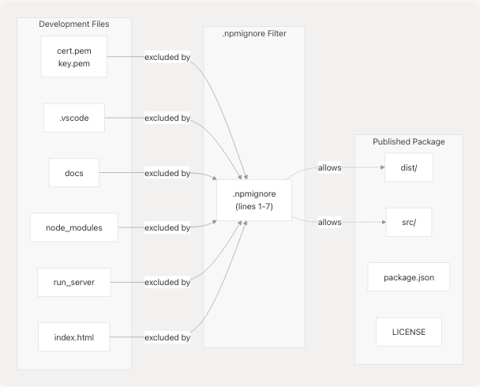
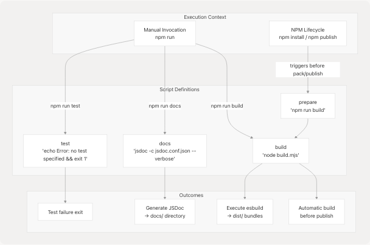

# Package Configuration

## Purpose and Scope

This document provides a comprehensive technical reference for the npm package configuration of jsjiit, focusing on [package.json1-62](https://github.com/codeblech/jsjiit/blob/d123b782/package.json#L1-L62) structure, module resolution strategy, distribution settings, and file inclusion policies. For information about the build process that these configurations trigger, see [Build System](5.1-build-system). For details on the development dependencies themselves (esbuild, jsdoc), see [Dependency Management](5.3-dependency-management).

---

## Package Identity and Metadata

The package is identified as `jsjiit` at version `0.0.23` with ISC licensing. The package description explicitly highlights the CAPTCHA bypass capability as a key differentiator.

### Core Package Fields

| Field | Value | Purpose |
| --- | --- | --- |
| `name` | `"jsjiit"` | npm registry identifier |
| `version` | `"0.0.23"` | Semantic version number |
| `license` | `"ISC"` | Open source license type |
| `author` | `"codeblech"` | Package maintainer |
| `description` | Browser-compatible JIIT WebPortal API | Package purpose and key feature |

**Sources:** [package.json2-4](https://github.com/codeblech/jsjiit/blob/d123b782/package.json#L2-L4) [package.json51-52](https://github.com/codeblech/jsjiit/blob/d123b782/package.json#L51-L52)

---

## Module System Configuration

The package is configured as an ES module with multiple entry points to support different consumption patterns (npm import, CDN usage, direct browser usage).

### Entry Point Resolution Strategy


**Module Configuration Details:**

The `"type": "module"` field at [package.json8](https://github.com/codeblech/jsjiit/blob/d123b782/package.json#L8-L8) signals to Node.js that all `.js` files should be treated as ES modules rather than CommonJS. This enables native import/export syntax throughout the codebase.

The `exports` field at [package.json22-25](https://github.com/codeblech/jsjiit/blob/d123b782/package.json#L22-L25) provides explicit control over package entry points:

```
"exports": {
  "import": "./dist/jsjiit.esm.js",
  "require": "./dist/jsjiit.esm.js"
}
```

Both `import` and `require` conditions resolve to the same built artifact, indicating the package supports dual-mode consumption while always serving the ES module bundle.

**Sources:** [package.json5-8](https://github.com/codeblech/jsjiit/blob/d123b782/package.json#L5-L8) [package.json22-25](https://github.com/codeblech/jsjiit/blob/d123b782/package.json#L22-L25)

---

## Package Distribution Strategy

### Included Files

The `files` field at [package.json26-29](https://github.com/codeblech/jsjiit/blob/d123b782/package.json#L26-L29) explicitly whitelists directories for npm publication:

| Directory | Contents | Purpose |
| --- | --- | --- |
| `dist/` | Built bundles (`jsjiit.esm.js`, `jsjiit.min.esm.js`) | Production artifacts for consumption |
| `src/` | Source JavaScript modules | Allow source map resolution and direct source access |

### Excluded Files via .npmignore

The `.npmignore` file excludes development-only assets:



**Rationale for Exclusions:**

* `cert.pem` and `key.pem`: HTTPS development certificates, security-sensitive
* `.vscode`: Editor-specific configuration
* `docs`: Generated documentation hosted separately on GitHub Pages
* `node_modules`: Dependencies should be resolved by consumers
* `run_server`: Local development HTTPS server script
* `index.html`: Test harness for local development

**Sources:** [package.json26-29](https://github.com/codeblech/jsjiit/blob/d123b782/package.json#L26-L29) [.npmignore1-7](https://github.com/codeblech/jsjiit/blob/d123b782/.npmignore#L1-L7)

---

## NPM Scripts Configuration

The package defines five npm scripts that orchestrate development and publication workflows:



### Script-by-Script Analysis

| Script | Command | Trigger | Purpose |
| --- | --- | --- | --- |
| `test` | `echo "Error: no test specified" && exit 1` | Manual only | Placeholder indicating no automated tests |
| `docs` | `jsdoc -c jsdoc.conf.json --verbose` | Manual only | Generate API documentation |
| `build` | `node build.mjs` | Manual or via `prepare` | Compile source to distribution bundles |
| `prepare` | `npm run build` | **Automatic** before `npm publish` | Ensure fresh build before distribution |

**Prepare Script Significance:**

The `prepare` script at [package.json16](https://github.com/codeblech/jsjiit/blob/d123b782/package.json#L16-L16) is a special npm lifecycle hook that executes automatically before:

* `npm publish`
* `npm pack`
* Local `npm install` (without flags)

This ensures that `dist/` artifacts are always regenerated from source before package publication, preventing stale or manually-edited bundles from being distributed.

**Sources:** [package.json12-16](https://github.com/codeblech/jsjiit/blob/d123b782/package.json#L12-L16)

---

## Repository and Distribution Metadata

### Repository Configuration


The `repository`, `bugs`, and `homepage` fields at [package.json18-21](https://github.com/codeblech/jsjiit/blob/d123b782/package.json#L18-L21) and [package.json53-56](https://github.com/codeblech/jsjiit/blob/d123b782/package.json#L53-L56) provide npm registry integration with GitHub, enabling automated links from the npm package page to source code, issue tracking, and documentation.

**Sources:** [package.json18-21](https://github.com/codeblech/jsjiit/blob/d123b782/package.json#L18-L21) [package.json53-56](https://github.com/codeblech/jsjiit/blob/d123b782/package.json#L53-L56)

---

## Search Optimization Keywords

The package includes 19 keywords at [package.json30-50](https://github.com/codeblech/jsjiit/blob/d123b782/package.json#L30-L50) for npm registry search discoverability:

### Keyword Strategy Analysis


**Keyword Categories:**

1. **Institution Identifiers** (lines 31-34): Variations of "JIIT" to capture different search patterns
2. **Library Identifiers** (lines 35-36): Reference to Python predecessor (`pyjiit`) and current package
3. **Domain Terms** (lines 37-39): Portal-related terminology
4. **Core Feature** (lines 40-44): Attendance tracking with hyphenation variants
5. **Composite Terms** (lines 45-50): Institution + feature combinations

The extensive keyword list employs a strategy of:

* **Typo tolerance**: Multiple spellings (jaypee, jpee, jayp)
* **Ecosystem awareness**: Including `pyjiit` to capture users migrating from Python
* **Permutation coverage**: Various orderings of "attendance-api-web" to match different search phrase constructions

**Sources:** [package.json30-50](https://github.com/codeblech/jsjiit/blob/d123b782/package.json#L30-L50)

---

## Dependency Configuration

### Development Dependencies

The package declares exactly two development dependencies at [package.json57-60](https://github.com/codeblech/jsjiit/blob/d123b782/package.json#L57-L60):

| Dependency | Version | Purpose |
| --- | --- | --- |
| `esbuild` | `0.24.0` | JavaScript bundler for creating distribution artifacts |
| `jsdoc` | `^4.0.4` | Documentation generator for API reference |

### Dependency Version Strategies


**Version Pinning Rationale:**

* **esbuild `0.24.0`** (exact): Locked to specific version because bundler behavior directly affects distributed code. Version changes could alter output characteristics (bundle size, transpilation, minification), impacting end users.
* **jsdoc `^4.0.4`** (caret range): Allows minor and patch updates within version 4.x. Documentation generation changes are less critical since docs are hosted separately and don't affect runtime behavior.

**Sources:** [package.json57-60](https://github.com/codeblech/jsjiit/blob/d123b782/package.json#L57-L60)

---

## Package Lock File Structure

The `package-lock.json` file at [package-lock.json1-793](https://github.com/codeblech/jsjiit/blob/d123b782/package-lock.json#L1-L793) provides deterministic dependency resolution across environments.

### Lock File Key Attributes


### Lock File Version Significance

The `lockfileVersion: 3` at [package-lock.json4](https://github.com/codeblech/jsjiit/blob/d123b782/package-lock.json#L4-L4) indicates npm v7+ format, which:

* Stores both `requires` and `dependencies` for backwards compatibility
* Uses content addressing for package integrity
* Supports workspace features (not utilized in this package)

### Optional Dependencies: Platform-Specific Binaries

esbuild declares 24 optional dependencies at [package-lock.json565-590](https://github.com/codeblech/jsjiit/blob/d123b782/package-lock.json#L565-L590) one for each supported platform:

| Platform | Architecture | Package Name |
| --- | --- | --- |
| AIX | ppc64 | `@esbuild/aix-ppc64` |
| Android | arm, arm64, x64 | `@esbuild/android-*` |
| Darwin (macOS) | arm64, x64 | `@esbuild/darwin-*` |
| FreeBSD | arm64, x64 | `@esbuild/freebsd-*` |
| Linux | arm, arm64, ia32, loong64, mips64el, ppc64, riscv64, s390x, x64 | `@esbuild/linux-*` |
| NetBSD | x64 | `@esbuild/netbsd-x64` |
| OpenBSD | arm64, x64 | `@esbuild/openbsd-*` |
| SunOS | x64 | `@esbuild/sunos-x64` |
| Windows | arm64, ia32, x64 | `@esbuild/win32-*` |

During installation, npm/yarn automatically installs only the binary matching the current platform, reducing installation size and time.

### JSDoc Transitive Dependency Tree

The jsdoc package at [package-lock.json619-648](https://github.com/codeblech/jsjiit/blob/d123b782/package-lock.json#L619-L648) brings in a substantial dependency tree:


**Sources:** [package-lock.json1-793](https://github.com/codeblech/jsjiit/blob/d123b782/package-lock.json#L1-L793)

---

## Configuration Interaction with Build Pipeline

The package configuration fields integrate tightly with the build system (see [Build System](5.1-build-system) for details):


**Key Integration Points:**

1. **Automatic Build Invocation**: `prepare` script ensures builds run before publication
2. **File Filtering**: `files` array combined with `.npmignore` determines tarball contents
3. **Entry Point Resolution**: `exports`, `main`, `module`, `browser` fields guide consumers to `dist/` artifacts
4. **Type Declaration**: `"type": "module"` enables ES module syntax in build scripts and source

**Sources:** [package.json8](https://github.com/codeblech/jsjiit/blob/d123b782/package.json#L8-L8) [package.json12-16](https://github.com/codeblech/jsjiit/blob/d123b782/package.json#L12-L16) [package.json22-29](https://github.com/codeblech/jsjiit/blob/d123b782/package.json#L22-L29) [.npmignore1-7](https://github.com/codeblech/jsjiit/blob/d123b782/.npmignore#L1-L7)

---

## Package Configuration Summary

The jsjiit package configuration implements a modern npm package structure with:

* **Dual entry strategy**: Source (`src/index.js`) for development, built bundles (`dist/*.esm.js`) for consumption
* **ES module-first design**: All entry points resolve to ES modules
* **Automated build safety**: `prepare` hook prevents publishing unbundled code
* **Selective file distribution**: Only `dist/` and `src/` directories published to npm
* **Development-time exclusions**: Certificates, docs, test files filtered via `.npmignore`
* **Platform-aware dependencies**: Optional esbuild binaries for cross-platform support
* **Search optimization**: 19 keywords covering institution, domain, and feature terms
* **Deterministic installations**: Lock file version 3 with content-addressed integrity

This configuration supports the library's browser-first design while maintaining compatibility with Node.js environments and enabling CDN distribution through proper module field declarations.
