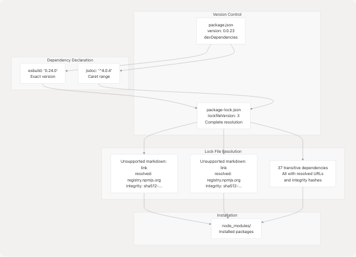
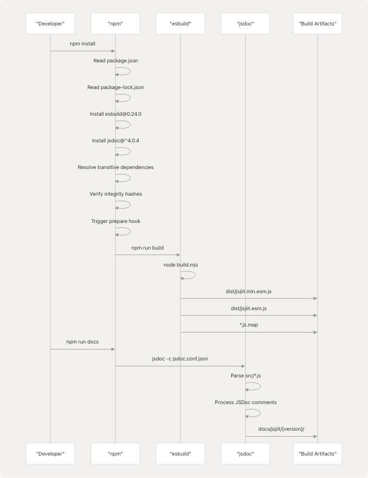

# Dependency Management

## Purpose and Scope

This document explains the dependency management strategy for the jsjiit project, covering development dependencies, version locking mechanisms, and platform-specific binary handling. The jsjiit library has **no runtime dependencies** - it is a pure JavaScript library that bundles all necessary code. All dependencies listed in [package.json57-60](https://github.com/codeblech/jsjiit/blob/d123b782/package.json#L57-L60) are `devDependencies` used exclusively during development, build, and documentation generation.

For information about the build system that uses these dependencies, see [Build System](5.1-build-system). For package configuration details, see [Package Configuration](5.2-package-configuration).

---

## Development Dependencies Overview

The project maintains exactly two direct development dependencies, both specified in [package.json57-60](https://github.com/codeblech/jsjiit/blob/d123b782/package.json#L57-L60):

| Package | Version | Purpose | Primary Usage |
| --- | --- | --- | --- |
| `esbuild` | 0.24.0 | JavaScript bundler and minifier | Build system ([build.mjs1](https://github.com/codeblech/jsjiit/blob/d123b782/build.mjs#L1-L1)) |
| `jsdoc` | ^4.0.4 | API documentation generator | Documentation generation ([package.json14](https://github.com/codeblech/jsjiit/blob/d123b782/package.json#L14-L14)) |

This minimal dependency footprint reduces maintenance burden and potential security vulnerabilities while providing all necessary tooling for development and distribution.

**Sources:** [package.json57-60](https://github.com/codeblech/jsjiit/blob/d123b782/package.json#L57-L60)

---

## esbuild: Build System Dependency

### Overview

The `esbuild` package serves as the project's build system, transforming source code from [src/](https://github.com/codeblech/jsjiit/blob/d123b782/src/) into distributable bundles in [dist/](https://github.com/codeblech/jsjiit/blob/d123b782/dist/) Version 0.24.0 is pinned exactly (no semantic versioning prefix) to ensure consistent build outputs across environments.


**Sources:** [package.json58](https://github.com/codeblech/jsjiit/blob/d123b782/package.json#L58-L58) [build.mjs1-36](https://github.com/codeblech/jsjiit/blob/d123b782/build.mjs#L1-L36)

### Platform-Specific Binaries

esbuild distributes 24 optional platform-specific native binaries as separate npm packages. These are listed as `optionalDependencies` in [package-lock.json565-590](https://github.com/codeblech/jsjiit/blob/d123b782/package-lock.json#L565-L590) During installation, npm automatically installs only the binary matching the host platform, reducing installation size and time.


All platform binaries are marked as `optional: true` in [package-lock.json66-473](https://github.com/codeblech/jsjiit/blob/d123b782/package-lock.json#L66-L473) ensuring installation succeeds even if a specific platform binary is unavailable. Each binary requires Node.js >= 18, enforced via the `engines` field in their respective package definitions.

**Sources:** [package-lock.json552-591](https://github.com/codeblech/jsjiit/blob/d123b782/package-lock.json#L552-L591) [package-lock.json66-473](https://github.com/codeblech/jsjiit/blob/d123b782/package-lock.json#L66-L473)

### Build System Integration

The `esbuild` dependency is invoked programmatically in [build.mjs1](https://github.com/codeblech/jsjiit/blob/d123b782/build.mjs#L1-L1) rather than through a CLI script. The build script imports esbuild as an ES module and calls `esbuild.build()` with configuration objects defined at [build.mjs3-9](https://github.com/codeblech/jsjiit/blob/d123b782/build.mjs#L3-L9)

Key configuration parameters passed to esbuild:

* `entryPoints: ["src/index.js"]` - Single entry file that imports all modules
* `bundle: true` - Combine all source files into single output
* `format: "esm"` - Output ES module format
* `sourcemap: true` - Generate debugging source maps
* `target: ["es2020"]` - Target ES2020 browser compatibility
* `minify: true/false` - Controls production vs development builds

The build script is triggered automatically via the `prepare` script in [package.json16](https://github.com/codeblech/jsjiit/blob/d123b782/package.json#L16-L16) which runs before package publication.

**Sources:** [build.mjs1-36](https://github.com/codeblech/jsjiit/blob/d123b782/build.mjs#L1-L36) [package.json15-16](https://github.com/codeblech/jsjiit/blob/d123b782/package.json#L15-L16)

---

## jsdoc: Documentation Generator

### Overview

The `jsdoc` package generates API documentation from inline JSDoc comments in source files. Version ^4.0.4 allows patch and minor version updates while preventing breaking changes from major version bumps.


**Sources:** [package.json14](https://github.com/codeblech/jsjiit/blob/d123b782/package.json#L14-L14) [package.json58-60](https://github.com/codeblech/jsjiit/blob/d123b782/package.json#L58-L60)

### Dependency Tree

Unlike esbuild which has minimal dependencies, jsdoc brings a substantial transitive dependency tree due to its features (Markdown parsing, Babel JavaScript parsing, template rendering). The complete dependency tree as locked in [package-lock.json619-648](https://github.com/codeblech/jsjiit/blob/d123b782/package-lock.json#L619-L648) includes:

**Core Dependencies:**

* `@babel/parser` ^7.20.15 - JavaScript parser for analyzing code structure
* `@babel/types` 7.26.0 - AST type definitions used by parser
* `@jsdoc/salty` ^0.2.1 - Utilities for JSDoc processing
* `catharsis` ^0.9.0 - Type expression parser for JSDoc annotations

**Markdown Processing:**

* `markdown-it` ^14.1.0 - Main Markdown parser
* `markdown-it-anchor` ^8.6.7 - Auto-generates heading anchors
* `marked` ^4.0.10 - Alternative Markdown processor
* `linkify-it` 5.0.0 - URL detection and linking
* `mdurl` 2.0.0 - URL parsing for Markdown

**Output Generation:**

* `js2xmlparser` ^4.0.2 - Converts JavaScript to XML/HTML
* `xmlcreate` 2.0.4 - XML document creation

**Utilities:**

* `bluebird` ^3.7.2 - Promise library for async operations
* `escape-string-regexp` ^2.0.0 - String escaping utilities
* `klaw` ^3.0.0 - File system walker
* `mkdirp` ^1.0.4 - Recursive directory creation
* `requizzle` ^0.2.3 - Enhanced require() functionality
* `strip-json-comments` ^3.1.0 - JSON comment removal
* `underscore` ~1.13.2 - Utility functions
* `lodash` ^4.17.21 - Modern utility library

**Sources:** [package-lock.json619-791](https://github.com/codeblech/jsjiit/blob/d123b782/package-lock.json#L619-L791)

---

## Dependency Version Locking

### package-lock.json Structure

The project uses npm's lockfile version 3 format ([package-lock.json4](https://github.com/codeblech/jsjiit/blob/d123b782/package-lock.json#L4-L4)), which provides complete dependency resolution information. This ensures deterministic installations across different environments and time periods.



**Sources:** [package.json1-61](https://github.com/codeblech/jsjiit/blob/d123b782/package.json#L1-L61) [package-lock.json1-793](https://github.com/codeblech/jsjiit/blob/d123b782/package-lock.json#L1-L793)

### Integrity Hashing

Every package in the lock file includes a SHA-512 integrity hash (e.g., [package-lock.json555](https://github.com/codeblech/jsjiit/blob/d123b782/package-lock.json#L555-L555) for esbuild). npm verifies these hashes during installation to detect tampering or corruption. This cryptographic verification ensures the exact code that was tested during development is what gets deployed in production builds.

Example integrity verification for esbuild:

```
"integrity": "sha512-FuLPevChGDshgSicjisSooU0cemp/sGXR841D5LHMB7mTVOmsEHcAxaH3irL53+8YDIeVNQEySh4DaYU/iuPqQ=="
```

**Sources:** [package-lock.json555](https://github.com/codeblech/jsjiit/blob/d123b782/package-lock.json#L555-L555)

### Semantic Versioning Strategy

| Dependency | Specifier | Meaning | Rationale |
| --- | --- | --- | --- |
| esbuild | `0.24.0` | Exact version | Build outputs must be deterministic; no automatic updates |
| jsdoc | `^4.0.4` | Compatible with 4.x | Documentation generation is less sensitive to version changes |

The esbuild version is pinned exactly because different bundler versions can produce different output artifacts, potentially breaking downstream consumers. The jsdoc version uses caret range (`^`) allowing minor and patch updates that typically only fix bugs or add non-breaking features.

**Sources:** [package.json58-59](https://github.com/codeblech/jsjiit/blob/d123b782/package.json#L58-L59)

---

## Node.js Version Requirements

### Project Requirements

The jsjiit package itself has no explicit Node.js version requirement in [package.json](https://github.com/codeblech/jsjiit/blob/d123b782/package.json) but both build tools impose requirements:

* **esbuild**: Requires Node.js >= 18 ([package-lock.json562-564](https://github.com/codeblech/jsjiit/blob/d123b782/package-lock.json#L562-L564))
* **jsdoc**: Requires Node.js >= 12.0.0 ([package-lock.json645-647](https://github.com/codeblech/jsjiit/blob/d123b782/package-lock.json#L645-L647))

The effective minimum Node.js version for development is **18.0.0** due to esbuild's requirement.

### Platform Binary Requirements

All 24 esbuild platform-specific binaries consistently require Node.js >= 18. This is enforced in their individual package definitions (e.g., [package-lock.json79-81](https://github.com/codeblech/jsjiit/blob/d123b782/package-lock.json#L79-L81) for AIX, [package-lock.json97-98](https://github.com/codeblech/jsjiit/blob/d123b782/package-lock.json#L97-L98) for Android ARM, etc.).

**Sources:** [package-lock.json562-564](https://github.com/codeblech/jsjiit/blob/d123b782/package-lock.json#L562-L564) [package-lock.json645-647](https://github.com/codeblech/jsjiit/blob/d123b782/package-lock.json#L645-L647) [package-lock.json79-81](https://github.com/codeblech/jsjiit/blob/d123b782/package-lock.json#L79-L81)

---

## Dependency Installation

### Installation Commands

```
# Install all dependencies (production + development)
npm install

# Install only development dependencies
npm install --only=dev

# Install with exact versions from lock file
npm ci
```

The `npm ci` command is recommended for CI/CD environments as it performs a clean installation using the lock file, ensuring complete reproducibility.

**Sources:** [package-lock.json1-793](https://github.com/codeblech/jsjiit/blob/d123b782/package-lock.json#L1-L793)

### Prepare Hook

The `prepare` script defined in [package.json16](https://github.com/codeblech/jsjiit/blob/d123b782/package.json#L16-L16) runs automatically after `npm install`:

```
"prepare": "npm run build"
```

This ensures the [dist/](https://github.com/codeblech/jsjiit/blob/d123b782/dist/) directory is always populated with fresh builds whenever dependencies are installed, particularly important before publishing to npm.

**Sources:** [package.json16](https://github.com/codeblech/jsjiit/blob/d123b782/package.json#L16-L16)

---

## Dependency Usage in Build Pipeline



**Sources:** [package.json12-16](https://github.com/codeblech/jsjiit/blob/d123b782/package.json#L12-L16) [build.mjs1-36](https://github.com/codeblech/jsjiit/blob/d123b782/build.mjs#L1-L36)

---

## Managing Dependency Updates

### Checking for Updates

```
# Check for outdated dependencies
npm outdated

# View available updates
npm update --dry-run
```

### Updating Dependencies

When updating dependencies, follow these steps:

1. **Review Changelog**: Check release notes for breaking changes
2. **Update package.json**: Modify version specifier if needed
3. **Regenerate Lock File**: Run `npm install` to update [package-lock.json](https://github.com/codeblech/jsjiit/blob/d123b782/package-lock.json)
4. **Test Builds**: Verify `npm run build` produces correct output
5. **Test Documentation**: Verify `npm run docs` generates valid documentation
6. **Commit Both Files**: Commit both [package.json](https://github.com/codeblech/jsjiit/blob/d123b782/package.json) and [package-lock.json](https://github.com/codeblech/jsjiit/blob/d123b782/package-lock.json) together

**Sources:** [package.json57-60](https://github.com/codeblech/jsjiit/blob/d123b782/package.json#L57-L60) [package-lock.json1-793](https://github.com/codeblech/jsjiit/blob/d123b782/package-lock.json#L1-L793)

---

## Summary

The jsjiit dependency strategy emphasizes:

1. **Zero Runtime Dependencies**: The distributed library is self-contained
2. **Minimal Development Dependencies**: Only two direct dependencies (esbuild, jsdoc)
3. **Exact Version Pinning**: esbuild version is locked for reproducible builds
4. **Comprehensive Locking**: All 39 total dependencies tracked in lockfile with integrity hashes
5. **Platform Optimization**: esbuild's optional dependencies reduce installation overhead
6. **Automated Builds**: Prepare hook ensures artifacts are always up-to-date

This approach balances developer convenience with build reproducibility and minimal security surface area.

**Sources:** [package.json1-61](https://github.com/codeblech/jsjiit/blob/d123b782/package.json#L1-L61) [package-lock.json1-793](https://github.com/codeblech/jsjiit/blob/d123b782/package-lock.json#L1-L793) [build.mjs1-36](https://github.com/codeblech/jsjiit/blob/d123b782/build.mjs#L1-L36)
