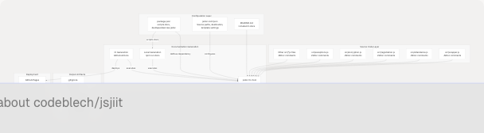

# Documentation System

> Source: https://deepwiki.com/codeblech/jsjiit/6-documentation-system

# Documentation System

Relevant source files

* [.github/workflows/jsdoc-build.yaml](https://github.com/codeblech/jsjiit/blob/d123b782/.github/workflows/jsdoc-build.yaml)
* [.gitignore](https://github.com/codeblech/jsjiit/blob/d123b782/.gitignore)
* [jsdoc.conf.json](https://github.com/codeblech/jsjiit/blob/d123b782/jsdoc.conf.json)
* [package.json](https://github.com/codeblech/jsjiit/blob/d123b782/package.json)

## Purpose and Scope

This document describes the documentation generation and deployment infrastructure for the jsjiit library. It covers how JSDoc is configured to extract API documentation from source code comments, how the `docs` npm script generates HTML documentation locally, and how the GitHub Actions workflow automatically builds and deploys versioned documentation to GitHub Pages on every push to the main branch.

For information about the build system that creates distributable bundles, see [Build System](/codeblech/jsjiit/5.1-build-system). For package configuration details, see [Package Configuration](/codeblech/jsjiit/5.2-package-configuration).

**Sources:** [package.json1-61](https://github.com/codeblech/jsjiit/blob/d123b782/package.json#L1-L61) [jsdoc.conf.json1-25](https://github.com/codeblech/jsjiit/blob/d123b782/jsdoc.conf.json#L1-L25) [.github/workflows/jsdoc-build.yaml1-28](https://github.com/codeblech/jsjiit/blob/d123b782/.github/workflows/jsdoc-build.yaml#L1-L28)

---

## Documentation Architecture Overview

The jsjiit documentation system uses JSDoc as its core documentation generator. JSDoc extracts specially-formatted comments from JavaScript source files and transforms them into browsable HTML documentation. The system consists of three main components: the JSDoc tool configuration, local documentation generation via npm scripts, and automated deployment via GitHub Actions.


```

**Diagram: Documentation System Architecture**

The documentation system processes JSDoc-annotated source files from the `src/` directory along with `README.md` and `package.json` metadata. The `jsdoc.conf.json` file controls input sources, output destination, and presentation settings. Documentation can be generated locally via `npm run docs` or automatically through GitHub Actions, with the CI pipeline deploying versioned documentation to GitHub Pages.

**Sources:** [package.json12-16](https://github.com/codeblech/jsjiit/blob/d123b782/package.json#L12-L16) [jsdoc.conf.json1-25](https://github.com/codeblech/jsjiit/blob/d123b782/jsdoc.conf.json#L1-L25) [.github/workflows/jsdoc-build.yaml1-28](https://github.com/codeblech/jsjiit/blob/d123b782/.github/workflows/jsdoc-build.yaml#L1-L28) [.gitignore1-6](https://github.com/codeblech/jsjiit/blob/d123b782/.gitignore#L1-L6)

---

## JSDoc Configuration

The `jsdoc.conf.json` file provides the core configuration for documentation generation. This JSON configuration file specifies which source files to process, where to output the generated documentation, and how to format the output.

### Configuration Structure

| Configuration Section | Purpose | Key Settings |
| --- | --- | --- |
| `source` | Defines input files and patterns | `include`, `exclude`, file patterns |
| `opts` | Controls generation behavior | `destination`, `recurse` flag |
| `tags` | JSDoc tag handling | `allowUnknownTags` |
| `templates` | Output formatting options | `cleverLinks`, `monospaceLinks` |

**Sources:** [jsdoc.conf.json1-25](https://github.com/codeblech/jsjiit/blob/d123b782/jsdoc.conf.json#L1-L25)

### Source Configuration

The `source.include` array specifies which files and directories JSDoc should process:

```
```
"include": [
    "src",
    "package.json",
    "README.md"
]
```
```

This configuration instructs JSDoc to:

1. Recursively process all JavaScript files in the `src/` directory
2. Extract metadata from `package.json` (name, version, description)
3. Include `README.md` content as the documentation homepage

The `source.includePattern` uses the regular expression `.+\\.js(doc|x)?$` to match `.js`, `.jsdoc`, and `.jsx` files, while `source.excludePattern` `(^|\\/|\\\\)_` ignores files starting with underscore.

**Sources:** [jsdoc.conf.json2-13](https://github.com/codeblech/jsjiit/blob/d123b782/jsdoc.conf.json#L2-L13)

### Output Configuration

The `opts` section controls where and how documentation is generated:

```
```
"opts": {
    "destination": "./docs",
    "recurse": true
}
```
```

The `destination` path `./docs` specifies the output directory. When combined with the GitHub Actions workflow's versioning logic, documentation is written to `./docs/jsjiit/{version}/` where `{version}` is extracted from `package.json`.

The `recurse: true` flag ensures JSDoc processes subdirectories within the `src/` directory.

**Sources:** [jsdoc.conf.json14-17](https://github.com/codeblech/jsjiit/blob/d123b782/jsdoc.conf.json#L14-L17)

### Template Configuration

The `templates` section controls how JSDoc formats the generated HTML:

```
```
"templates": {
    "cleverLinks": true,
    "monospaceLinks": true
}
```
```

* `cleverLinks`: Automatically creates hyperlinks between related API documentation pages
* `monospaceLinks`: Renders code links in monospace font for visual distinction

**Sources:** [jsdoc.conf.json21-24](https://github.com/codeblech/jsjiit/blob/d123b782/jsdoc.conf.json#L21-L24)

---

## Local Documentation Generation

The `package.json` file defines an npm script for local documentation generation:

```
```
"scripts": {
    "docs": "jsdoc -c jsdoc.conf.json --verbose"
}
```
```

Developers can generate documentation locally by running:

```
```
npm run docs
```
```

This command executes the `jsdoc` CLI with the following flags:

* `-c jsdoc.conf.json`: Specifies the configuration file
* `--verbose`: Outputs detailed generation progress

```

```

**Diagram: Local Documentation Generation Flow**

The local generation process reads the configuration from `jsdoc.conf.json`, parses all source files in `src/`, extracts JSDoc comments describing classes, functions, and parameters, and outputs static HTML documentation to the `./docs/` directory.

**Sources:** [package.json14](https://github.com/codeblech/jsjiit/blob/d123b782/package.json#L14-L14) [jsdoc.conf.json1-25](https://github.com/codeblech/jsjiit/blob/d123b782/jsdoc.conf.json#L1-L25)

### JSDoc as Development Dependency

The `jsdoc` package is listed as a development dependency in `package.json`:

```
```
"devDependencies": {
    "esbuild": "0.24.0",
    "jsdoc": "^4.0.4"
}
```
```

This ensures that when developers run `npm install`, the JSDoc tool and its dependencies (including Babel parser and Markdown parsers) are installed in `node_modules/`.

**Sources:** [package.json57-60](https://github.com/codeblech/jsjiit/blob/d123b782/package.json#L57-L60)

---

## Automated Documentation Deployment

The GitHub Actions workflow automates documentation generation and deployment on every push to the `main` branch. The workflow is defined in `.github/workflows/jsdoc-build.yaml`.

### Workflow Trigger

```
```
on:
  push:
    branches: ["main"]
```
```

The workflow executes only when code is pushed to the `main` branch, ensuring that documentation stays synchronized with the latest stable codebase.

**Sources:** [.github/workflows/jsdoc-build.yaml1-4](https://github.com/codeblech/jsjiit/blob/d123b782/.github/workflows/jsdoc-build.yaml#L1-L4)

### Workflow Permissions

```
```
jobs:
  build:
    permissions:
      contents: write
    runs-on: ubuntu-latest
```
```

The workflow requires `contents: write` permission to push generated documentation to the `gh-pages` branch. It runs on the latest Ubuntu runner provided by GitHub Actions.

**Sources:** [.github/workflows/jsdoc-build.yaml6-10](https://github.com/codeblech/jsjiit/blob/d123b782/.github/workflows/jsdoc-build.yaml#L6-L10)

### Workflow Steps

```


**Diagram: GitHub Actions Documentation Workflow**

The workflow consists of four sequential steps that extract the version, generate documentation, and deploy it to GitHub Pages.

**Sources:** [.github/workflows/jsdoc-build.yaml11-27](https://github.com/codeblech/jsjiit/blob/d123b782/.github/workflows/jsdoc-build.yaml#L11-L27)

### Step 1: Repository Checkout

```
```
- name: Checkout repository
  uses: actions/checkout@v2
```
```

This step clones the repository code into the GitHub Actions runner environment, making source files and configuration available for subsequent steps.

**Sources:** [.github/workflows/jsdoc-build.yaml12-13](https://github.com/codeblech/jsjiit/blob/d123b782/.github/workflows/jsdoc-build.yaml#L12-L13)

### Step 2: Version Extraction

```
```
- name: Get package version
  id: get_version
  run: echo "version=$(node -p "require('./package.json').version")" >> $GITHUB_OUTPUT
```
```

This step extracts the `version` field from `package.json` using Node.js and stores it as a workflow output variable named `version`. This variable is later used to create version-specific documentation directories.

For example, if `package.json` contains `"version": "0.0.23"`, the output variable `steps.get_version.outputs.version` will equal `"0.0.23"`.

**Sources:** [.github/workflows/jsdoc-build.yaml14-16](https://github.com/codeblech/jsjiit/blob/d123b782/.github/workflows/jsdoc-build.yaml#L14-L16) [package.json3](https://github.com/codeblech/jsjiit/blob/d123b782/package.json#L3-L3)

### Step 3: Documentation Generation

```
```
- name: Build docs
  uses: andstor/jsdoc-action@v1
  with:
    recurse: true
    config_file: jsdoc.conf.json
```
```

This step uses the `andstor/jsdoc-action` GitHub Action to execute JSDoc. The action:

* Installs the `jsdoc` package if not already present
* Runs `jsdoc` with the configuration specified in `jsdoc.conf.json`
* Sets `recurse: true` to ensure subdirectories are processed

The generated documentation is written to `./docs/` based on the `destination` setting in `jsdoc.conf.json`.

**Sources:** [.github/workflows/jsdoc-build.yaml17-21](https://github.com/codeblech/jsjiit/blob/d123b782/.github/workflows/jsdoc-build.yaml#L17-L21) [jsdoc.conf.json14-17](https://github.com/codeblech/jsjiit/blob/d123b782/jsdoc.conf.json#L14-L17)

### Step 4: GitHub Pages Deployment

```
```
- name: Deploy to GitHub Pages
  uses: peaceiris/actions-gh-pages@v3
  with:
    github_token: ${{ secrets.GITHUB_TOKEN }}
    publish_dir: ./docs/jsjiit/${{ steps.get_version.outputs.version }}
```
```

This step deploys the generated documentation to GitHub Pages using the `peaceiris/actions-gh-pages` action. Key parameters:

* `github_token`: Uses the automatically provided `GITHUB_TOKEN` secret for authentication
* `publish_dir`: Specifies the exact directory to publish, incorporating the extracted version number

For version `0.0.23`, the publish directory would be `./docs/jsjiit/0.0.23`, meaning documentation for each version is preserved at its own URL path.

**Sources:** [.github/workflows/jsdoc-build.yaml22-26](https://github.com/codeblech/jsjiit/blob/d123b782/.github/workflows/jsdoc-build.yaml#L22-L26)

---

## Documentation Versioning Strategy

The documentation system implements version-specific documentation preservation. Each published version of the library maintains its own documentation snapshot accessible via a versioned URL path.

### Version-Based Directory Structure

```
docs/
└── jsjiit/
    ├── 0.0.21/
    │   ├── index.html
    │   └── ...
    ├── 0.0.22/
    │   ├── index.html
    │   └── ...
    └── 0.0.23/
        ├── index.html
        └── ...
```

This structure ensures that:

1. Documentation for older versions remains accessible
2. Breaking API changes are clearly separated by version
3. Users can reference documentation matching their installed version

The version number is dynamically extracted during the GitHub Actions workflow from `package.json:3`, ensuring documentation versions automatically match package versions.

**Sources:** [.github/workflows/jsdoc-build.yaml14-26](https://github.com/codeblech/jsjiit/blob/d123b782/.github/workflows/jsdoc-build.yaml#L14-L26) [package.json3](https://github.com/codeblech/jsjiit/blob/d123b782/package.json#L3-L3)

---

## Integration with Version Control

The `.gitignore` file explicitly excludes the `docs/` directory from version control:

```
docs
```

This exclusion is intentional and serves multiple purposes:

1. **Prevents Repository Bloat**: Generated HTML documentation can be large and would unnecessarily increase repository size
2. **Avoids Merge Conflicts**: Documentation is automatically regenerated on each deployment, so committing it would create frequent merge conflicts
3. **Single Source of Truth**: Source code JSDoc comments are the canonical documentation source; generated HTML is a build artifact
4. **Separate Deployment Branch**: Documentation is deployed to the `gh-pages` branch, not the `main` branch

The documentation directory structure (`./docs/jsjiit/{version}/`) is only created during the GitHub Actions workflow execution and is deployed directly to GitHub Pages without being committed to the main branch.

**Sources:** [.gitignore2](https://github.com/codeblech/jsjiit/blob/d123b782/.gitignore#L2-L2) [.github/workflows/jsdoc-build.yaml26](https://github.com/codeblech/jsjiit/blob/d123b782/.github/workflows/jsdoc-build.yaml#L26-L26)

---

## Documentation Content Sources

The JSDoc tool processes multiple types of content to build comprehensive API documentation:

### Source Code JSDoc Comments

All JavaScript files in the `src/` directory contain JSDoc comment blocks that document:

* Class definitions and constructors
* Method signatures, parameters, and return types
* Property types and descriptions
* Function behavior and side effects
* Example usage code

Example JSDoc comment structure (not actual code, but representing typical format):

```
```
/**
 * Description of the function
 * @param {Type} paramName - Parameter description
 * @returns {ReturnType} Return value description
 * @throws {ExceptionType} When this error occurs
 */
```
```

**Sources:** [jsdoc.conf.json3-5](https://github.com/codeblech/jsjiit/blob/d123b782/jsdoc.conf.json#L3-L5)

### Package Metadata

The `package.json` file provides top-level documentation metadata:

* `name`: Library name displayed in documentation header
* `version`: Version number shown in documentation
* `description`: Summary text on the documentation homepage
* `repository`: Link to source code repository
* `author`: Author information
* `license`: License type

**Sources:** [jsdoc.conf.json5](https://github.com/codeblech/jsjiit/blob/d123b782/jsdoc.conf.json#L5-L5) [package.json2-52](https://github.com/codeblech/jsjiit/blob/d123b782/package.json#L2-L52)

### README Content

The `README.md` file is included in the generated documentation as the homepage content. This provides:

* High-level library overview
* Installation instructions
* Quick start examples
* Links to repository and issue tracker

**Sources:** [jsdoc.conf.json6](https://github.com/codeblech/jsjiit/blob/d123b782/jsdoc.conf.json#L6-L6)

---

## Documentation Generation Summary

The jsjiit documentation system provides a fully automated pipeline for maintaining API documentation synchronized with source code:

| Component | Role | Automation Level |
| --- | --- | --- |
| JSDoc comments in `src/` | Define API documentation content | Manual (written by developers) |
| `jsdoc.conf.json` | Configure documentation generation | Manual (updated rarely) |
| `npm run docs` | Generate documentation locally | Manual (developer-initiated) |
| GitHub Actions workflow | Generate and deploy on push | Fully automated |
| GitHub Pages | Host versioned documentation | Fully automated |

The system ensures that documentation is always up-to-date with the `main` branch, provides version-specific documentation for library users, and separates documentation build artifacts from source code version control.

**Sources:** [package.json14](https://github.com/codeblech/jsjiit/blob/d123b782/package.json#L14-L14) [jsdoc.conf.json1-25](https://github.com/codeblech/jsjiit/blob/d123b782/jsdoc.conf.json#L1-L25) [.github/workflows/jsdoc-build.yaml1-28](https://github.com/codeblech/jsjiit/blob/d123b782/.github/workflows/jsdoc-build.yaml#L1-L28) [.gitignore2](https://github.com/codeblech/jsjiit/blob/d123b782/.gitignore#L2-L2)