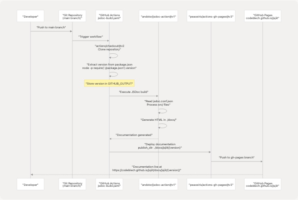
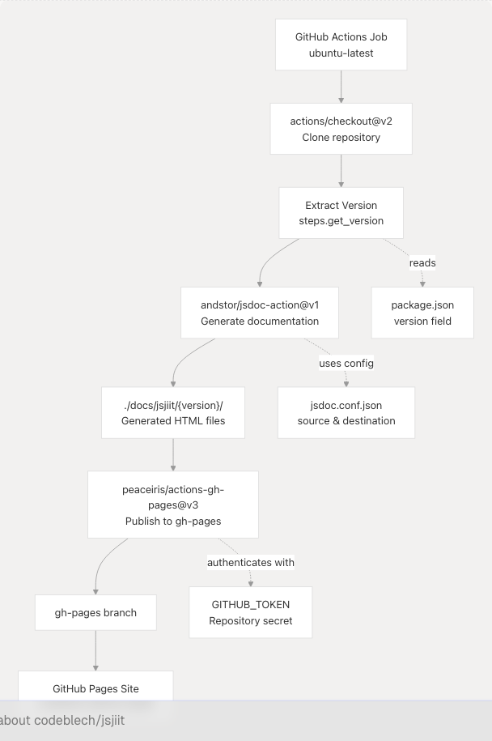
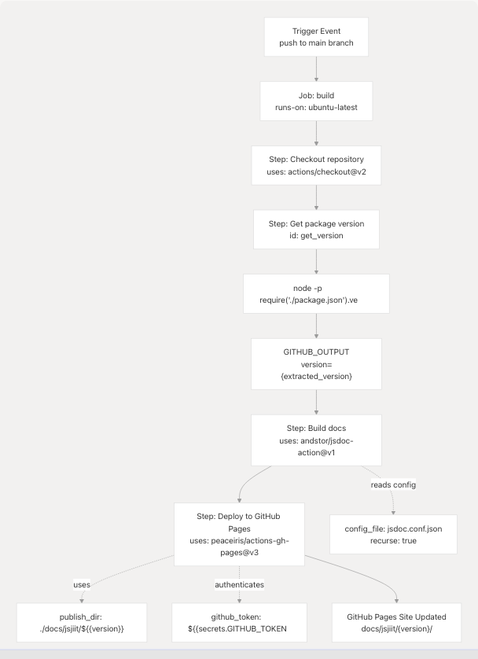

# Automated Documentation Deployment

> Source: https://deepwiki.com/codeblech/jsjiit/6.2-automated-documentation-deployment

# Automated Documentation Deployment

Relevant source files

* [.github/workflows/jsdoc-build.yaml](https://github.com/codeblech/jsjiit/blob/d123b782/.github/workflows/jsdoc-build.yaml)
* [.gitignore](https://github.com/codeblech/jsjiit/blob/d123b782/.gitignore)
* [jsdoc.conf.json](https://github.com/codeblech/jsjiit/blob/d123b782/jsdoc.conf.json)
* [package.json](https://github.com/codeblech/jsjiit/blob/d123b782/package.json)

## Purpose and Scope

This document describes the automated CI/CD pipeline that generates API documentation from source code and deploys it to GitHub Pages. The system uses GitHub Actions to execute the JSDoc documentation generator and publish versioned documentation on every push to the main branch.

For information about JSDoc configuration and documentation generation settings, see [JSDoc Configuration](/codeblech/jsjiit/6.1-jsdoc-configuration). For the overall documentation system architecture, see [Documentation System](/codeblech/jsjiit/6-documentation-system).

---

## Overview

The automated documentation deployment system consists of a GitHub Actions workflow that:

1. Triggers on pushes to the main branch
2. Extracts the current package version from `package.json`
3. Generates HTML documentation using JSDoc
4. Deploys the versioned documentation to GitHub Pages

The generated documentation is version-specific and published to `https://codeblech.github.io/jsjiit/docs/jsjiit/{version}/`, where `{version}` corresponds to the version defined in `package.json`.

**Sources:** [.github/workflows/jsdoc-build.yaml1-27](https://github.com/codeblech/jsjiit/blob/d123b782/.github/workflows/jsdoc-build.yaml#L1-L27) [package.json2-3](https://github.com/codeblech/jsjiit/blob/d123b782/package.json#L2-L3)

---

## Automation Pipeline Architecture

The following diagram illustrates the complete automated documentation deployment pipeline:


```

**Sources:** [.github/workflows/jsdoc-build.yaml1-27](https://github.com/codeblech/jsjiit/blob/d123b782/.github/workflows/jsdoc-build.yaml#L1-L27)

---

## Workflow Configuration

The automation is defined in `.github/workflows/jsdoc-build.yaml` and configured to run on specific events and with specific permissions.

### Trigger Configuration

The workflow is triggered on pushes to the main branch:

[.github/workflows/jsdoc-build.yaml1-4](https://github.com/codeblech/jsjiit/blob/d123b782/.github/workflows/jsdoc-build.yaml#L1-L4)

This ensures documentation is rebuilt and deployed whenever changes are merged to the main branch.

### Permissions

The workflow requires write permissions to the repository contents to deploy to GitHub Pages:

[.github/workflows/jsdoc-build.yaml8-9](https://github.com/codeblech/jsjiit/blob/d123b782/.github/workflows/jsdoc-build.yaml#L8-L9)

### Runtime Environment

The workflow runs on the latest Ubuntu runner provided by GitHub Actions:

[.github/workflows/jsdoc-build.yaml10](https://github.com/codeblech/jsjiit/blob/d123b782/.github/workflows/jsdoc-build.yaml#L10-L10)

**Sources:** [.github/workflows/jsdoc-build.yaml1-10](https://github.com/codeblech/jsjiit/blob/d123b782/.github/workflows/jsdoc-build.yaml#L1-L10)

---

## Build Process Steps

The build job consists of four sequential steps that checkout code, extract version information, generate documentation, and deploy to GitHub Pages.

### Step 1: Repository Checkout

The first step clones the repository to the GitHub Actions runner:

[.github/workflows/jsdoc-build.yaml12-13](https://github.com/codeblech/jsjiit/blob/d123b782/.github/workflows/jsdoc-build.yaml#L12-L13)

This uses the `actions/checkout@v2` action to retrieve the full repository contents.

### Step 2: Version Extraction

The workflow extracts the current package version from `package.json` using Node.js:

[.github/workflows/jsdoc-build.yaml14-16](https://github.com/codeblech/jsjiit/blob/d123b782/.github/workflows/jsdoc-build.yaml#L14-L16)

The version is extracted by executing `node -p "require('./package.json').version"` and storing it in the `GITHUB_OUTPUT` environment file. This allows subsequent steps to reference the version via `${{ steps.get_version.outputs.version }}`.

### Step 3: Documentation Generation

The JSDoc documentation is generated using the `andstor/jsdoc-action@v1` action:

[.github/workflows/jsdoc-build.yaml17-21](https://github.com/codeblech/jsjiit/blob/d123b782/.github/workflows/jsdoc-build.yaml#L17-L21)

The action uses the JSDoc configuration file at [jsdoc.conf.json1-25](https://github.com/codeblech/jsjiit/blob/d123b782/jsdoc.conf.json#L1-L25) and processes source files recursively. The generated documentation is output to `./docs/` as specified in the JSDoc configuration.

### Step 4: GitHub Pages Deployment

The final step deploys the generated documentation to GitHub Pages:

[.github/workflows/jsdoc-build.yaml22-26](https://github.com/codeblech/jsjiit/blob/d123b782/.github/workflows/jsdoc-build.yaml#L22-L26)

The `peaceiris/actions-gh-pages@v3` action publishes the versioned documentation directory (`./docs/jsjiit/{version}`) to the `gh-pages` branch using the `GITHUB_TOKEN` secret for authentication.

**Sources:** [.github/workflows/jsdoc-build.yaml12-26](https://github.com/codeblech/jsjiit/blob/d123b782/.github/workflows/jsdoc-build.yaml#L12-L26)

---

## Deployment Mechanism

The following diagram shows how the deployment action interacts with GitHub's infrastructure:

```

```

**Sources:** [.github/workflows/jsdoc-build.yaml1-27](https://github.com/codeblech/jsjiit/blob/d123b782/.github/workflows/jsdoc-build.yaml#L1-L27) [package.json3](https://github.com/codeblech/jsjiit/blob/d123b782/package.json#L3-L3) [jsdoc.conf.json14-16](https://github.com/codeblech/jsjiit/blob/d123b782/jsdoc.conf.json#L14-L16)

---

## Versioned Documentation Structure

The deployment creates a versioned documentation structure that allows multiple versions of the documentation to coexist.

### Version-Specific Publishing

The publish directory is dynamically constructed using the extracted version:

[.github/workflows/jsdoc-build.yaml26](https://github.com/codeblech/jsjiit/blob/d123b782/.github/workflows/jsdoc-build.yaml#L26-L26)

This results in documentation being published to a version-specific path. For example, if `package.json` defines version `0.0.23`, the documentation is published to:

```
./docs/jsjiit/0.0.23/
```

### Documentation URL Pattern

The resulting GitHub Pages URL follows the pattern:

```
https://codeblech.github.io/jsjiit/docs/jsjiit/{version}/index.html
```

Where `{version}` is replaced with the actual version number from `package.json`.

### Benefits of Versioned Documentation

| Benefit | Description |
| --- | --- |
| **Version Preservation** | Historical documentation for older versions remains accessible |
| **Parallel Development** | Documentation for pre-release versions can exist alongside stable versions |
| **URL Stability** | Version-specific URLs never change, providing stable reference links |
| **Deployment Safety** | New documentation doesn't overwrite previous versions |

**Sources:** [.github/workflows/jsdoc-build.yaml26](https://github.com/codeblech/jsjiit/blob/d123b782/.github/workflows/jsdoc-build.yaml#L26-L26) [package.json3](https://github.com/codeblech/jsjiit/blob/d123b782/package.json#L3-L3)

---

## Integration with Package Management

The documentation deployment is integrated with the package publishing workflow through version synchronization.

### Version Source of Truth

The `package.json` serves as the single source of truth for version information:

[package.json3](https://github.com/codeblech/jsjiit/blob/d123b782/package.json#L3-L3)

This version is used by:

* npm package publishing
* Documentation deployment path
* JSDoc metadata generation

### Documentation Script

While the automated deployment uses GitHub Actions, developers can generate documentation locally using the npm script:

[package.json14](https://github.com/codeblech/jsjiit/blob/d123b782/package.json#L14-L14)

This script runs JSDoc with the same configuration file used by the GitHub Actions workflow, ensuring consistency between local and deployed documentation.

### Git Ignore Configuration

The locally generated documentation directory is excluded from version control:

[.gitignore2](https://github.com/codeblech/jsjiit/blob/d123b782/.gitignore#L2-L2)

This prevents committing generated documentation to the repository, as it is automatically generated and deployed by GitHub Actions.

**Sources:** [package.json3-14](https://github.com/codeblech/jsjiit/blob/d123b782/package.json#L3-L14) [.gitignore2](https://github.com/codeblech/jsjiit/blob/d123b782/.gitignore#L2-L2)

---

## Workflow Execution Flow

The following diagram maps the workflow steps to specific code entities and configuration files:

```


**Sources:** [.github/workflows/jsdoc-build.yaml1-27](https://github.com/codeblech/jsjiit/blob/d123b782/.github/workflows/jsdoc-build.yaml#L1-L27) [jsdoc.conf.json1-25](https://github.com/codeblech/jsjiit/blob/d123b782/jsdoc.conf.json#L1-L25)

---

## Error Handling and Permissions

The workflow includes several mechanisms to ensure reliable documentation deployment.

### Required Permissions

The workflow explicitly requests `contents: write` permission:

[.github/workflows/jsdoc-build.yaml8-9](https://github.com/codeblech/jsjiit/blob/d123b782/.github/workflows/jsdoc-build.yaml#L8-L9)

This permission is required for the `peaceiris/actions-gh-pages@v3` action to push to the `gh-pages` branch.

### Authentication

The deployment step uses the built-in `GITHUB_TOKEN` secret:

[.github/workflows/jsdoc-build.yaml25](https://github.com/codeblech/jsjiit/blob/d123b782/.github/workflows/jsdoc-build.yaml#L25-L25)

This token is automatically provided by GitHub Actions and has the necessary permissions to deploy to GitHub Pages when `contents: write` is specified.

### Workflow Failures

If any step fails, the workflow stops execution and reports the failure. Common failure scenarios include:

| Scenario | Cause | Resolution |
| --- | --- | --- |
| **Version extraction fails** | Invalid `package.json` syntax | Fix JSON syntax in `package.json` |
| **JSDoc build fails** | Invalid JSDoc comments or configuration | Fix JSDoc annotations in source files |
| **Deployment fails** | Insufficient permissions | Verify `contents: write` permission is set |
| **Missing configuration** | `jsdoc.conf.json` not found | Ensure configuration file exists in repository root |

**Sources:** [.github/workflows/jsdoc-build.yaml8-25](https://github.com/codeblech/jsjiit/blob/d123b782/.github/workflows/jsdoc-build.yaml#L8-L25)

---

## Summary

The automated documentation deployment system provides a fully automated pipeline that:

1. **Triggers automatically** on pushes to the main branch
2. **Extracts version** dynamically from `package.json`
3. **Generates documentation** using JSDoc with the configuration defined in `jsdoc.conf.json`
4. **Deploys to GitHub Pages** in a version-specific directory structure
5. **Requires no manual intervention** after initial setup

This automation ensures documentation remains synchronized with the codebase, provides version-specific documentation URLs, and eliminates manual deployment tasks.

**Sources:** [.github/workflows/jsdoc-build.yaml1-27](https://github.com/codeblech/jsjiit/blob/d123b782/.github/workflows/jsdoc-build.yaml#L1-L27) [package.json3-14](https://github.com/codeblech/jsjiit/blob/d123b782/package.json#L3-L14) [jsdoc.conf.json1-25](https://github.com/codeblech/jsjiit/blob/d123b782/jsdoc.conf.json#L1-L25) [.gitignore2](https://github.com/codeblech/jsjiit/blob/d123b782/.gitignore#L2-L2)