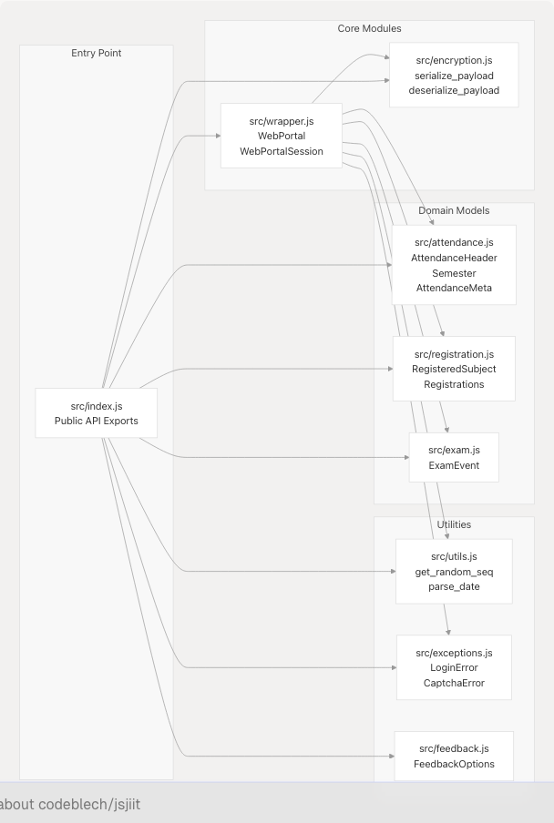

# Development Guide

> Source: https://deepwiki.com/codeblech/jsjiit/7-development-guide

# Development Guide

Relevant source files

* [package.json](https://github.com/codeblech/jsjiit/blob/d123b782/package.json)
* [run\_server](https://github.com/codeblech/jsjiit/blob/d123b782/run_server)
* [src/feedback.js](https://github.com/codeblech/jsjiit/blob/d123b782/src/feedback.js)
* [test.html](https://github.com/codeblech/jsjiit/blob/d123b782/test.html)

## Purpose and Scope

This guide is intended for developers who want to contribute to, modify, or extend the jsjiit library. It covers the complete development workflow from initial setup through testing and release.

For information about using the library in your application, see [Getting Started](/codeblech/jsjiit/2-getting-started). For details about the build system architecture, see [Build and Distribution](/codeblech/jsjiit/5-build-and-distribution). For documentation generation specifics, see [Documentation System](/codeblech/jsjiit/6-documentation-system).

---

## Prerequisites

Before beginning development, ensure you have the following installed:

| Requirement | Version | Purpose |
| --- | --- | --- |
| Node.js | ≥18.0.0 | Required by esbuild and development scripts |
| npm | ≥8.0.0 | Package management and script execution |
| Python 3 | Any recent | Running the local HTTPS test server |
| OpenSSL | Any recent | Certificate generation for HTTPS server |
| Git | Any recent | Version control |

The project uses ES modules exclusively, as indicated by `"type": "module"` in [package.json8](https://github.com/codeblech/jsjiit/blob/d123b782/package.json#L8-L8)

**Sources:** [package.json1-62](https://github.com/codeblech/jsjiit/blob/d123b782/package.json#L1-L62) [run\_server1-24](https://github.com/codeblech/jsjiit/blob/d123b782/run_server#L1-L24)

---

## Development Workflow Overview


```

**Diagram: Complete development workflow from setup to deployment**

This workflow represents the iterative development cycle. The edit-test loop is typically executed multiple times before building and committing changes.

**Sources:** [package.json12-16](https://github.com/codeblech/jsjiit/blob/d123b782/package.json#L12-L16) [test.html1-92](https://github.com/codeblech/jsjiit/blob/d123b782/test.html#L1-L92) [run\_server1-24](https://github.com/codeblech/jsjiit/blob/d123b782/run_server#L1-L24)

---

## Local Development Environment Setup

### 1. Clone the Repository

```
```
git clone https://github.com/codeblech/jsjiit.git
cd jsjiit
```
```

### 2. Install Dependencies

```
```
npm install
```
```

This installs the development dependencies defined in [package.json57-60](https://github.com/codeblech/jsjiit/blob/d123b782/package.json#L57-L60):

* `esbuild@0.24.0` - Bundler for creating distribution files
* `jsdoc@4.0.4` - Documentation generator

### 3. Directory Structure

After installation, the repository structure is:

```
jsjiit/
├── src/               # Source code (committed to git)
│   ├── index.js      # Main entry point and public API
│   ├── wrapper.js    # WebPortal and WebPortalSession classes
│   ├── encryption.js # AES-CBC cryptography layer
│   ├── attendance.js # Attendance domain models
│   ├── registration.js # Registration domain models
│   ├── exam.js       # Exam domain models
│   ├── exceptions.js # Custom error classes
│   ├── utils.js      # Utility functions
│   └── feedback.js   # FeedbackOptions enum
├── dist/             # Generated bundles (gitignored, created by build)
├── docs/             # Generated documentation (gitignored)
├── node_modules/     # Dependencies (gitignored)
├── test.html         # Manual testing interface
├── run_server        # HTTPS server script
├── build.mjs         # Build script
├── jsdoc.conf.json   # JSDoc configuration
└── package.json      # Project metadata and scripts
```

The `dist/` and `docs/` directories are generated during the build process and excluded from version control but included in npm packages (dist only).

**Sources:** [package.json9-11](https://github.com/codeblech/jsjiit/blob/d123b782/package.json#L9-L11) [package.json26-29](https://github.com/codeblech/jsjiit/blob/d123b782/package.json#L26-L29)

---

## Running the Local Test Environment

### Starting the HTTPS Server

The jsjiit library requires HTTPS to interact with the JIIT WebPortal (due to CORS and secure context requirements). Use the provided test server:

```
```
./run_server
```
```

This script ([run\_server1-24](https://github.com/codeblech/jsjiit/blob/d123b782/run_server#L1-L24)):

1. Generates a self-signed SSL certificate using OpenSSL ([run\_server12](https://github.com/codeblech/jsjiit/blob/d123b782/run_server#L12-L12))
2. Creates `cert.pem` and `key.pem` files in the current directory
3. Starts an HTTPS server on `https://localhost:8000` ([run\_server16](https://github.com/codeblech/jsjiit/blob/d123b782/run_server#L16-L16))

**Output:**

```
Generating Self-Signed Certificates... done
Server running on https://localhost:8000
```

### Using test.html

Open `https://localhost:8000/test.html` in your browser. You will need to accept the self-signed certificate warning.

The test interface ([test.html10-15](https://github.com/codeblech/jsjiit/blob/d123b782/test.html#L10-L15)):

* Provides username and password input fields
* Includes a submit button that triggers the `main()` function
* Imports the library directly from source: [test.html20](https://github.com/codeblech/jsjiit/blob/d123b782/test.html#L20-L20)

```
```
import { WebPortal, LoginError } from "./src/index.js"
```
```

This direct source import allows testing changes immediately without rebuilding.

**Sources:** [run\_server1-24](https://github.com/codeblech/jsjiit/blob/d123b782/run_server#L1-L24) [test.html1-92](https://github.com/codeblech/jsjiit/blob/d123b782/test.html#L1-L92)

---

## Testing Your Changes

### Manual Testing Workflow

```

```

**Diagram: Testing cycle showing immediate feedback without rebuild**

### Modifying test.html

The test file includes commented examples of all major API methods ([test.html36-86](https://github.com/codeblech/jsjiit/blob/d123b782/test.html#L36-L86)):

```
```
// Example: Testing attendance retrieval
const meta = await w.get_attendance_meta()
let sem = meta.semesters[1];
let header = meta.latest_header();
let attendance = await w.get_attendance(header, sem);
console.log(attendance);
```
```

Uncomment and modify these sections to test specific functionality. Add your own test cases as needed.

### Console Output Inspection

All test results are logged to the browser console. Use browser DevTools to:

* Inspect returned data structures
* Verify API call sequences
* Debug error conditions
* Check network requests in the Network tab

**Sources:** [test.html17-89](https://github.com/codeblech/jsjiit/blob/d123b782/test.html#L17-L89)

---

## Working with Source Code

### Module Organization

```

```

**Diagram: Source module dependency graph showing code entities**

### Adding New Functionality

When adding features:

1. **Determine the appropriate module** based on the dependency graph above
2. **Add JSDoc comments** for all public APIs (required for documentation generation)
3. **Export from src/index.js** if the functionality is public-facing
4. **Test using test.html** before building

### Example: Adding a New Enum

Reference [src/feedback.js1-12](https://github.com/codeblech/jsjiit/blob/d123b782/src/feedback.js#L1-L12) for the pattern:

```
```
const MyEnum = {
  OPTION_A: "OPTION_A",
  OPTION_B: "OPTION_B",
};

Object.freeze(MyEnum);

export default MyEnum;
```
```

**Sources:** [src/feedback.js1-12](https://github.com/codeblech/jsjiit/blob/d123b782/src/feedback.js#L1-L12)

---

## Building the Library

### Running the Build

```
```
npm run build
```
```

This executes the `build` script defined in [package.json15](https://github.com/codeblech/jsjiit/blob/d123b782/package.json#L15-L15) which runs `node build.mjs`.

### Build Output

The build process creates two bundles in the `dist/` directory:

| File | Purpose | Minified | Source Maps |
| --- | --- | --- | --- |
| `jsjiit.min.esm.js` | Production bundle | Yes | Yes (.map file) |
| `jsjiit.esm.js` | Development bundle | No | Yes (.map file) |

### Build Configuration

The `build.mjs` script uses esbuild with these key settings:

* **Format:** ESM (ES modules)
* **Target:** ES2020 (modern browsers)
* **Platform:** Browser
* **Entry point:** [package.json5](https://github.com/codeblech/jsjiit/blob/d123b782/package.json#L5-L5) (`src/index.js`)
* **Output:** Both minified and non-minified versions

### npm Prepare Hook

The build automatically runs before publishing due to the `prepare` script in [package.json16](https://github.com/codeblech/jsjiit/blob/d123b782/package.json#L16-L16):

```
```
"prepare": "npm run build"
```
```

This ensures the `dist/` directory is always up-to-date when publishing to npm.

**Sources:** [package.json12-16](https://github.com/codeblech/jsjiit/blob/d123b782/package.json#L12-L16)

---

## Generating Documentation

### Running JSDoc

```
```
npm run docs
```
```

This executes the `docs` script ([package.json14](https://github.com/codeblech/jsjiit/blob/d123b782/package.json#L14-L14)), which runs:

```
```
jsdoc -c jsdoc.conf.json --verbose
```
```

### Documentation Output

Generated documentation is placed in `./docs/jsjiit/{version}/` where `{version}` is extracted from [package.json3](https://github.com/codeblech/jsjiit/blob/d123b782/package.json#L3-L3)

### JSDoc Comments

All public APIs must include JSDoc comments. Example structure:

```
```
/**
 * Brief description of the function.
 * 
 * @param {string} paramName - Parameter description
 * @returns {Promise<Object>} Return value description
 * @throws {ErrorType} Error condition description
 */
async function myFunction(paramName) {
  // implementation
}
```
```

For detailed JSDoc configuration, see [JSDoc Configuration](/codeblech/jsjiit/6.1-jsdoc-configuration).

**Sources:** [package.json14](https://github.com/codeblech/jsjiit/blob/d123b782/package.json#L14-L14)

---

## Release Process

### Version Management

```

```

**Diagram: Release pipeline from version bump to distribution**

### Step-by-Step Release

1. **Update version** in [package.json3](https://github.com/codeblech/jsjiit/blob/d123b782/package.json#L3-L3)
   ```
   # Manual edit or use npm version
   npm version patch  # 0.0.23 -> 0.0.24
   npm version minor  # 0.0.23 -> 0.1.0
   npm version major  # 0.0.23 -> 1.0.0
   ```
   ```
2. **Commit and tag**

   ```
   ```
   git add package.json
   git commit -m "Bump version to 0.0.24"
   git tag v0.0.24
   ```
   ```
3. **Push to repository**

   ```
   ```
   git push origin main --tags
   ```
   ```
4. **Publish to npm**

   ```
   ```
   npm publish
   ```
   ```

   The `prepare` hook ([package.json16](https://github.com/codeblech/jsjiit/blob/d123b782/package.json#L16-L16)) automatically builds the library before publishing.

### Automated Processes

Once pushed to GitHub:

* **GitHub Actions** automatically builds and deploys documentation to GitHub Pages (see [Automated Documentation Deployment](/codeblech/jsjiit/6.2-automated-documentation-deployment))
* **npm registry** makes the package available at `https://www.npmjs.com/package/jsjiit`
* **jsdelivr CDN** automatically mirrors the package from npm within minutes

### Package Files

Only specific files are published to npm, as defined by the `files` field in [package.json26-29](https://github.com/codeblech/jsjiit/blob/d123b782/package.json#L26-L29):

* `dist/` - Built bundles
* `src/` - Source code

Test files, certificates, and other development artifacts are excluded.

**Sources:** [package.json16](https://github.com/codeblech/jsjiit/blob/d123b782/package.json#L16-L16) [package.json26-29](https://github.com/codeblech/jsjiit/blob/d123b782/package.json#L26-L29)

---

## Development Best Practices

### Code Style

* Use **ES modules** syntax (`import`/`export`)
* Target **ES2020** for modern browser compatibility
* Add **JSDoc comments** to all exported functions and classes
* Use **consistent naming conventions** (camelCase for functions, PascalCase for classes)

### Testing Checklist

Before committing changes:

* Test authentication with valid credentials
* Test error handling with invalid credentials
* Verify all modified API methods return expected data structures
* Check browser console for errors
* Run `npm run build` successfully
* Run `npm run docs` successfully (if JSDoc comments changed)
* Verify no TypeScript/import errors in browser console

### Common Pitfalls

| Issue | Cause | Solution |
| --- | --- | --- |
| Import errors in browser | File path case sensitivity | Use exact case in imports |
| CORS errors | Not using HTTPS | Use `run_server` script |
| Build fails | Syntax errors in source | Check console output, fix errors |
| JSDoc generation fails | Invalid JSDoc syntax | Validate JSDoc comments |
| Certificate warnings | Self-signed cert | Normal for local dev, accept warning |

**Sources:** [package.json8](https://github.com/codeblech/jsjiit/blob/d123b782/package.json#L8-L8) [test.html20](https://github.com/codeblech/jsjiit/blob/d123b782/test.html#L20-L20) [run\_server1-24](https://github.com/codeblech/jsjiit/blob/d123b782/run_server#L1-L24)

---

## Troubleshooting

### Server Won't Start

**Problem:** `./run_server` fails with permission error

**Solution:**

```
```
chmod +x run_server
./run_server
```
```

### Browser Can't Load Modules

**Problem:** `Uncaught SyntaxError: Cannot use import statement outside a module`

**Solution:** Ensure you're accessing via HTTPS server, not `file://` protocol. The library uses ES modules which require HTTP(S).

### Build Fails

**Problem:** `npm run build` produces errors

**Solution:**

1. Verify Node.js version: `node --version` (should be ≥18)
2. Reinstall dependencies: `rm -rf node_modules && npm install`
3. Check for syntax errors in source files

### Documentation Not Generating

**Problem:** `npm run docs` fails

**Solution:**

1. Ensure all JSDoc comments are syntactically valid
2. Check `jsdoc.conf.json` for configuration errors
3. Verify `node_modules/jsdoc` exists

**Sources:** [run\_server1-24](https://github.com/codeblech/jsjiit/blob/d123b782/run_server#L1-L24) [package.json57-60](https://github.com/codeblech/jsjiit/blob/d123b782/package.json#L57-L60)

---

## Quick Reference

### Essential Commands

| Command | Purpose |
| --- | --- |
| `npm install` | Install dependencies |
| `./run_server` | Start local HTTPS test server |
| `npm run build` | Build distribution bundles |
| `npm run docs` | Generate API documentation |
| `npm run prepare` | Run build (auto-runs before publish) |

### Key Files for Development

| File | Purpose | Should Edit |
| --- | --- | --- |
| `src/index.js` | Public API exports | Yes - when adding public APIs |
| `src/wrapper.js` | Main implementation | Yes - core functionality |
| `test.html` | Testing interface | Yes - for testing |
| `build.mjs` | Build configuration | Rarely |
| `package.json` | Project metadata | Yes - for versions/scripts |
| `jsdoc.conf.json` | Documentation config | Rarely |

### Package Configuration Reference

From [package.json1-62](https://github.com/codeblech/jsjiit/blob/d123b782/package.json#L1-L62):

* **Entry points:** `main` (Node.js), `module`/`browser` (bundlers)
* **Exports:** Specifies `dist/jsjiit.esm.js` for both import and require
* **Type:** `"module"` - enables ES module syntax throughout
* **DevDependencies:** esbuild (bundler), jsdoc (docs generator)

**Sources:** [package.json1-62](https://github.com/codeblech/jsjiit/blob/d123b782/package.json#L1-L62) [test.html1-92](https://github.com/codeblech/jsjiit/blob/d123b782/test.html#L1-L92) [run\_server1-24](https://github.com/codeblech/jsjiit/blob/d123b782/run_server#L1-L24)