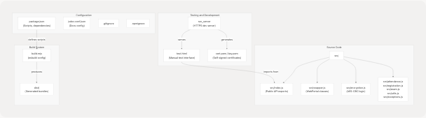
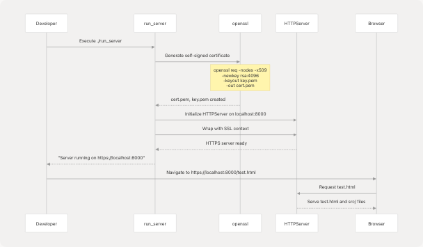

# Local Development Setup

Relevant source files

* [package.json](https://github.com/codeblech/jsjiit/blob/d123b782/package.json)
* [run\_server](https://github.com/codeblech/jsjiit/blob/d123b782/run_server)
* [src/feedback.js](https://github.com/codeblech/jsjiit/blob/d123b782/src/feedback.js)
* [test.html](https://github.com/codeblech/jsjiit/blob/d123b782/test.html)

## Purpose and Scope

This document covers the setup and configuration of a local development environment for contributing to the jsjiit library. It explains how to clone the repository, install dependencies, run the local HTTPS test server, and test changes during development.

For information about building distributable artifacts and releasing new versions, see [Build and Release Process](/codeblech/jsjiit/7.3-build-and-release-process). For details on the testing methodology and validation strategies, see [Testing and Validation](/codeblech/jsjiit/7.2-testing-and-validation).

---

## Prerequisites

The jsjiit development environment requires the following tools:

| Tool | Minimum Version | Purpose |
| --- | --- | --- |
| Node.js | 18.x or higher | Required by esbuild and jsdoc |
| npm | 7.x or higher | Dependency management and script execution |
| Python | 3.x | Required for `run_server` HTTPS development server |
| OpenSSL | Any recent version | Certificate generation for local HTTPS |
| Git | Any recent version | Version control |

Sources: [package.json1-61](https://github.com/codeblech/jsjiit/blob/d123b782/package.json#L1-L61) [run\_server1-24](https://github.com/codeblech/jsjiit/blob/d123b782/run_server#L1-L24)

---

## Initial Repository Setup

### Cloning the Repository

```
```
git clone https://github.com/codeblech/jsjiit.git
cd jsjiit
```
```

### Installing Dependencies

The project uses npm to manage development dependencies. Install them by running:

```
```
npm install
```
```

This command installs the dependencies defined in [package.json57-60](https://github.com/codeblech/jsjiit/blob/d123b782/package.json#L57-L60):

* `esbuild@0.24.0` - Build system for bundling ES modules
* `jsdoc@^4.0.4` - Documentation generation tool

The `prepare` script defined in [package.json16](https://github.com/codeblech/jsjiit/blob/d123b782/package.json#L16-L16) automatically runs `npm run build` after dependency installation, creating the initial `dist/` directory with bundled artifacts.

Sources: [package.json57-60](https://github.com/codeblech/jsjiit/blob/d123b782/package.json#L57-L60) [package.json12-16](https://github.com/codeblech/jsjiit/blob/d123b782/package.json#L12-L16)

---

## Project Structure for Development

Understanding the repository structure is essential for effective development:


```

**Key Development Files:**

* **`src/`** - All library source code that gets bundled and published
* **`test.html`** - Interactive test page for manual validation
* **`run_server`** - Python script for local HTTPS server
* **`build.mjs`** - Build script using esbuild

Sources: [package.json1-61](https://github.com/codeblech/jsjiit/blob/d123b782/package.json#L1-L61) [test.html1-92](https://github.com/codeblech/jsjiit/blob/d123b782/test.html#L1-L92) [run\_server1-24](https://github.com/codeblech/jsjiit/blob/d123b782/run_server#L1-L24)

---

## Running the Local HTTPS Development Server

The JIIT WebPortal API requires HTTPS for security features including Secure Context APIs. The `run_server` script provides a local HTTPS server for testing.

### Starting the Development Server

Execute the Python script from the repository root:

```
```
./run_server
```
```

Or if the script is not executable:

```
```
python run_server
```
```

### Server Initialization Process

```

```

The server performs these operations (from [run\_server11-23](https://github.com/codeblech/jsjiit/blob/d123b782/run_server#L11-L23)):

1. Generates self-signed SSL certificates using OpenSSL
2. Creates `cert.pem` and `key.pem` files in the current directory
3. Starts an HTTPS server on `localhost:8000`
4. Serves all files from the current directory

**Certificate Warning:** Browsers will display a security warning for self-signed certificates. This is expected. Accept the warning to proceed with local testing.

Sources: [run\_server1-24](https://github.com/codeblech/jsjiit/blob/d123b782/run_server#L1-L24)

---

## Using test.html for Local Testing

The `test.html` file provides an interactive interface for testing library functionality during development.

### Structure of test.html

The test file contains:

| Component | Location | Purpose |
| --- | --- | --- |
| Login Form | [test.html11-15](https://github.com/codeblech/jsjiit/blob/d123b782/test.html#L11-L15) | Username and password input fields |
| Submit Button | [test.html15](https://github.com/codeblech/jsjiit/blob/d123b782/test.html#L15-L15) | Triggers `main()` function |
| Import Statement | [test.html20](https://github.com/codeblech/jsjiit/blob/d123b782/test.html#L20-L20) | Imports from local `src/index.js` |
| Test Function | [test.html21-88](https://github.com/codeblech/jsjiit/blob/d123b782/test.html#L21-L88) | Contains test scenarios |

### Local Development Import Configuration

The test file imports directly from source code during development:

```
```
// Local development (default)
import { WebPortal, LoginError } from "./src/index.js"

// CDN testing (commented out)
// import { WebPortal, LoginError } from "https://cdn.jsdelivr.net/npm/jsjiit@0.0.17/dist/jsjiit.esm.js";
```
```

This configuration in [test.html18-20](https://github.com/codeblech/jsjiit/blob/d123b782/test.html#L18-L20) allows testing changes immediately without rebuilding the bundle.

### Example Test Workflow

```

```

### Testing Different API Methods

The `test.html` file includes commented examples for testing various API methods. Uncomment sections in [test.html36-86](https://github.com/codeblech/jsjiit/blob/d123b782/test.html#L36-L86) to test specific functionality:

* **Attendance:** Lines 36-42
* **Daily Attendance:** Lines 44-55
* **Registrations:** Lines 57-60
* **Exams:** Lines 62-69
* **Grades:** Lines 72-86

Sources: [test.html1-92](https://github.com/codeblech/jsjiit/blob/d123b782/test.html#L1-L92)

---

## Development Workflow

### Standard Development Cycle

```

```

### Key npm Scripts

The [package.json12-16](https://github.com/codeblech/jsjiit/blob/d123b782/package.json#L12-L16) file defines these development scripts:

| Script | Command | Purpose |
| --- | --- | --- |
| `npm run build` | `node build.mjs` | Bundles source code using esbuild |
| `npm run docs` | `jsdoc -c jsdoc.conf.json --verbose` | Generates API documentation |
| `npm run prepare` | `npm run build` | Automatically runs on `npm install` |

### Building During Development

To validate that your changes will build correctly:

```
```
npm run build
```
```

This executes `build.mjs` which:

1. Uses esbuild to bundle `src/index.js`
2. Generates `dist/jsjiit.esm.js` (development bundle)
3. Generates `dist/jsjiit.min.esm.js` (production bundle)
4. Creates source maps for debugging

Sources: [package.json12-16](https://github.com/codeblech/jsjiit/blob/d123b782/package.json#L12-L16)

---

## File Modification and Hot Reloading

### Files to Edit

Development typically involves modifying these files in `src/`:

```


### No Hot Reload

The development server does **not** support hot module reloading. After editing source files:

1. Save your changes
2. Manually refresh the browser (F5 or Ctrl+R)
3. Re-enter test credentials if testing requires authentication

Sources: [package.json5](https://github.com/codeblech/jsjiit/blob/d123b782/package.json#L5-L5) [src/feedback.js1-12](https://github.com/codeblech/jsjiit/blob/d123b782/src/feedback.js#L1-L12)

---

## Certificate Management

### Generated Certificate Files

The `run_server` script generates two certificate files:

| File | Purpose | Validity |
| --- | --- | --- |
| `cert.pem` | SSL certificate | 365 days |
| `key.pem` | Private key | 365 days |

These files are created in the repository root and are excluded from version control by `.gitignore`.

### Certificate Regeneration

Certificates are regenerated each time `run_server` executes. The generation command from [run\_server12](https://github.com/codeblech/jsjiit/blob/d123b782/run_server#L12-L12):

```
```
openssl req -nodes -x509 -newkey rsa:4096 -keyout key.pem -out cert.pem -days 365 -subj /CN=mylocalhost
```
```

**Security Note:** These certificates are for local development only and should never be used in production.

Sources: [run\_server11-13](https://github.com/codeblech/jsjiit/blob/d123b782/run_server#L11-L13)

---

## Environment Variables and Configuration

The jsjiit library does not require environment variables for local development. All configuration is embedded in source code or derived from the JIIT WebPortal API.

### Configuration Files

| File | Purpose | Modification Needed? |
| --- | --- | --- |
| `package.json` | Project metadata, scripts, dependencies | Rarely |
| `jsdoc.conf.json` | Documentation generation config | No |
| `.gitignore` | Version control exclusions | No |
| `.npmignore` | npm package exclusions | No |

Sources: [package.json1-61](https://github.com/codeblech/jsjiit/blob/d123b782/package.json#L1-L61)

---

## Common Development Tasks

### Testing a Specific API Method

1. Start the development server
2. Open `test.html` in your browser
3. Locate the relevant test code in [test.html21-88](https://github.com/codeblech/jsjiit/blob/d123b782/test.html#L21-L88)
4. Uncomment the section you want to test
5. Enter credentials and click Submit
6. Check browser console for results

### Adding a New Source File

1. Create the new file in `src/`
2. Add exports to `src/index.js`
3. Refresh `test.html` to test the new functionality
4. Run `npm run build` to verify the bundle includes your changes

### Debugging with Source Maps

When using the built bundles, source maps enable debugging:

1. Build with `npm run build`
2. Import from `dist/jsjiit.esm.js` instead of `src/index.js` in test.html
3. Browser developer tools will map to original source files

Sources: [package.json5](https://github.com/codeblech/jsjiit/blob/d123b782/package.json#L5-L5) [test.html20](https://github.com/codeblech/jsjiit/blob/d123b782/test.html#L20-L20)

---

## Troubleshooting Common Issues

### HTTPS Certificate Errors

**Problem:** Browser refuses to load `test.html` due to certificate warning.

**Solution:**

* Click "Advanced" in the browser warning
* Select "Proceed to localhost (unsafe)"
* This is safe for local development

### Module Import Errors

**Problem:** Browser console shows "Failed to resolve module specifier".

**Solution:**

* Verify the development server is running
* Check that import path in `test.html` is `"./src/index.js"`
* Ensure file paths use forward slashes, not backslashes

### CORS Errors with JIIT Portal

**Problem:** CORS errors when calling JIIT WebPortal APIs.

**Solution:**

* CORS is expected and handled by the library
* The library uses appropriate headers and encryption
* Ensure you're testing with HTTPS, not HTTP

### Build Failures

**Problem:** `npm run build` fails with errors.

**Solution:**

* Verify Node.js version is 18.x or higher
* Delete `node_modules/` and `package-lock.json`
* Run `npm install` again
* Check for syntax errors in source files

Sources: [run\_server22](https://github.com/codeblech/jsjiit/blob/d123b782/run_server#L22-L22) [test.html20](https://github.com/codeblech/jsjiit/blob/d123b782/test.html#L20-L20) [package.json15](https://github.com/codeblech/jsjiit/blob/d123b782/package.json#L15-L15)

---

## Next Steps

After setting up your local development environment:

* **Testing:** See [Testing and Validation](/codeblech/jsjiit/7.2-testing-and-validation) for comprehensive testing strategies
* **Building:** See [Build and Release Process](/codeblech/jsjiit/7.3-build-and-release-process) for creating distribution artifacts
* **Architecture:** See [System Architecture Overview](/codeblech/jsjiit/4.1-system-architecture-overview) to understand the codebase structure
* **API Reference:** See [API Reference](/codeblech/jsjiit/3-api-reference) for detailed documentation of all methods

Sources: [package.json1-61](https://github.com/codeblech/jsjiit/blob/d123b782/package.json#L1-L61) [test.html1-92](https://github.com/codeblech/jsjiit/blob/d123b782/test.html#L1-L92) [run\_server1-24](https://github.com/codeblech/jsjiit/blob/d123b782/run_server#L1-L24)