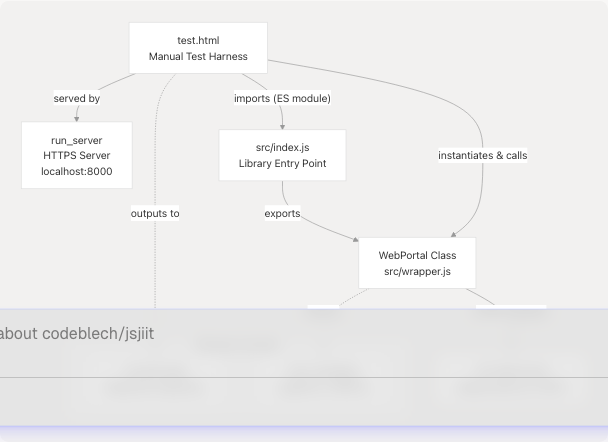
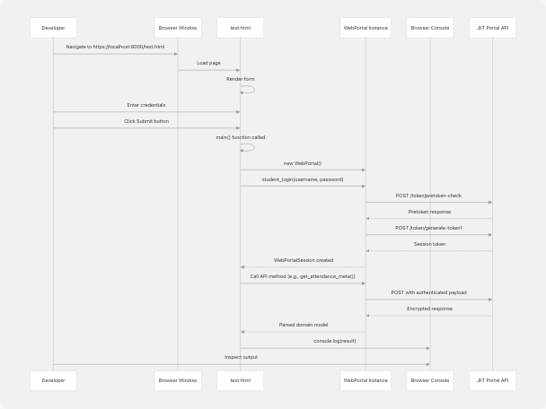

# Testing and Validation

> Source: https://deepwiki.com/codeblech/jsjiit/7.2-testing-and-validation

# Testing and Validation

Relevant source files

* [README.md](https://github.com/codeblech/jsjiit/blob/d123b782/README.md)
* [src/feedback.js](https://github.com/codeblech/jsjiit/blob/d123b782/src/feedback.js)
* [src/wrapper.js](https://github.com/codeblech/jsjiit/blob/d123b782/src/wrapper.js)
* [test.html](https://github.com/codeblech/jsjiit/blob/d123b782/test.html)

## Purpose and Scope

This document describes the manual testing and validation approach used in the jsjiit library. The primary testing mechanism is [test.html1-92](https://github.com/codeblech/jsjiit/blob/d123b782/test.html#L1-L92) which provides an interactive HTML interface for validating library functionality against the live JIIT Web Portal API.

This page covers the structure and usage of the testing infrastructure, manual testing workflows, and validation patterns. For information about setting up the local development environment and running the test server, see [Local Development Setup](/codeblech/jsjiit/7.1-local-development-setup). For information about the build verification process before releases, see [Build and Release Process](/codeblech/jsjiit/7.3-build-and-release-process).

**Sources:** [test.html1-92](https://github.com/codeblech/jsjiit/blob/d123b782/test.html#L1-L92) [README.md19-96](https://github.com/codeblech/jsjiit/blob/d123b782/README.md#L19-L96)

---

## Testing Infrastructure Overview

The jsjiit library uses a manual testing approach centered around a single HTML file that serves as an interactive test harness. This approach is suitable for the library's nature as a browser-based API wrapper that requires live credentials and interaction with external systems.

### Test Harness Architecture


```

**Diagram: Testing infrastructure showing the relationship between test.html, the library source, and the JIIT portal**

The test harness imports the library directly from source rather than from the built distribution bundle, enabling rapid iteration during development without requiring a rebuild step after each change.

**Sources:** [test.html17-20](https://github.com/codeblech/jsjiit/blob/d123b782/test.html#L17-L20) [test.html21-89](https://github.com/codeblech/jsjiit/blob/d123b782/test.html#L21-L89)

### Test HTML Structure

The test interface consists of three main components:

| Component | Purpose | Code Reference |
| --- | --- | --- |
| **HTML Form** | Provides username/password input fields | [test.html11-15](https://github.com/codeblech/jsjiit/blob/d123b782/test.html#L11-L15) |
| **Submit Button** | Triggers the main test function | [test.html15](https://github.com/codeblech/jsjiit/blob/d123b782/test.html#L15-L15) |
| **Module Script** | Imports library and defines test logic | [test.html17-89](https://github.com/codeblech/jsjiit/blob/d123b782/test.html#L17-L89) |

The module script at [test.html17-89](https://github.com/codeblech/jsjiit/blob/d123b782/test.html#L17-L89) contains:

* ES module import statement for `WebPortal` and `LoginError`
* Global `main()` function attached to `window` object
* Test code for various API methods (mostly commented out)

**Sources:** [test.html1-92](https://github.com/codeblech/jsjiit/blob/d123b782/test.html#L1-L92)

---

## Manual Testing Workflow

### Test Execution Process

```

```

**Diagram: Sequence of interactions during a typical test session**

**Sources:** [test.html21-89](https://github.com/codeblech/jsjiit/blob/d123b782/test.html#L21-L89) [src/wrapper.js168-186](https://github.com/codeblech/jsjiit/blob/d123b782/src/wrapper.js#L168-L186)

### Step-by-Step Testing Process

1. **Start Local Server**

   ```
   ```
   ./run_server
   ```
   ```

   This serves the repository at `https://localhost:8000` using HTTPS (required for module imports and CORS).
2. **Open Test Page**
   Navigate to `https://localhost:8000/test.html` in a browser.
3. **Enter Credentials**
   Input valid JIIT portal credentials in the form fields at [test.html11-14](https://github.com/codeblech/jsjiit/blob/d123b782/test.html#L11-L14)
4. **Modify Test Code**
   Edit the `main()` function at [test.html21-89](https://github.com/codeblech/jsjiit/blob/d123b782/test.html#L21-L89) to uncomment the API methods you want to test.
5. **Execute Tests**
   Click the Submit button to run the test code.
6. **Inspect Results**
   Open the browser's Developer Console to view:

   * Logged responses from `console.log()` statements
   * Error messages and stack traces
   * Network requests in the Network tab

**Sources:** [test.html1-92](https://github.com/codeblech/jsjiit/blob/d123b782/test.html#L1-L92) [README.md19-96](https://github.com/codeblech/jsjiit/blob/d123b782/README.md#L19-L96)

---

## Testing API Methods

### Authentication Testing

The authentication flow is the foundation for all other tests. The test harness demonstrates proper error handling for login failures:

```
```
// From test.html:25-34
try {
  await w.student_login(user.value, pass.value);
} catch (e) {
  if (e instanceof LoginError) {
    console.log("handling login error");
    console.log(e);
    return;
  }
}
```
```

**Key validation points:**

* Login succeeds with valid credentials
* `LoginError` is thrown for invalid credentials
* Session token is properly stored in `w.session`
* Session expiry time is correctly calculated

**Sources:** [test.html25-34](https://github.com/codeblech/jsjiit/blob/d123b782/test.html#L25-L34) [src/wrapper.js168-186](https://github.com/codeblech/jsjiit/blob/d123b782/src/wrapper.js#L168-L186)

### Attendance Methods Testing

The test file demonstrates the complete workflow for testing attendance-related methods:

```
```
// From test.html:36-42 (commented examples)
const meta = await w.get_attendance_meta()
let sem = meta.semesters[1];
let header = meta.latest_header();
let attendance = await w.get_attendance(header, sem);
```
```

**Validation checklist:**

* `AttendanceMeta` object contains valid semesters and headers
* `latest_semester()` and `latest_header()` methods return appropriate objects
* Attendance response contains `studentattendancelist` array
* Individual subject attendance data is complete

For detailed daily attendance testing:

```
```
// From test.html:44-55
let subjectIndex = 1;
let subjectid = attendance["studentattendancelist"][subjectIndex]["subjectid"];
let subjectcomponentids = [];
// Extract component IDs for L/P/T components
let subjectAttendance = await w.get_subject_daily_attendance(...);
```
```

**Sources:** [test.html36-55](https://github.com/codeblech/jsjiit/blob/d123b782/test.html#L36-L55) [src/wrapper.js243-300](https://github.com/codeblech/jsjiit/blob/d123b782/src/wrapper.js#L243-L300)

### Registration and Subject Testing

```
```
// From test.html:57-60
let registerdSems = await w.get_registered_semesters();
let latestSem = registerdSems[0];
let registeredSubjects = await w.get_registered_subjects_and_faculties(latestSem);
```
```

**Validation points:**

* `get_registered_semesters()` returns array of `Semester` objects
* Each semester has valid `registration_id` and `registration_code`
* `Registrations` object contains valid faculty and subject data

**Sources:** [test.html57-60](https://github.com/codeblech/jsjiit/blob/d123b782/test.html#L57-L60) [src/wrapper.js306-331](https://github.com/codeblech/jsjiit/blob/d123b782/src/wrapper.js#L306-L331)

### Exam Schedule Testing

```
```
// From test.html:62-69
let examSems = await w.get_semesters_for_exam_events();
let examEvents = await w.get_exam_events(examSems[0]);
let examSchedule = await w.get_exam_schedule(examEvents[0]);
```
```

**Validation points:**

* Exam events are returned as `ExamEvent` objects
* Schedule data includes venue and timing information

**Sources:** [test.html62-69](https://github.com/codeblech/jsjiit/blob/d123b782/test.html#L62-L69) [src/wrapper.js337-379](https://github.com/codeblech/jsjiit/blob/d123b782/src/wrapper.js#L337-L379)

### Academic Records Testing

```
```
// From test.html:72-78
let gradeCardSems = await w.get_semesters_for_grade_card();
let gradeCard = await w.get_grade_card(gradeCardSems[0]);
let sgpaCgpa = await w.get_sgpa_cgpa();
```
```

**Validation points:**

* Grade card contains complete subject-wise grades
* SGPA/CGPA values are properly formatted numbers
* Historical semester data is accessible

**Sources:** [test.html72-78](https://github.com/codeblech/jsjiit/blob/d123b782/test.html#L72-L78) [src/wrapper.js437-509](https://github.com/codeblech/jsjiit/blob/d123b782/src/wrapper.js#L437-L509)

---

## Method Testing Coverage Matrix

The following table maps test scenarios to the WebPortal methods being validated:

| Category | Method | Test Location | Validation Type |
| --- | --- | --- | --- |
| **Authentication** | `student_login()` | [test.html26](https://github.com/codeblech/jsjiit/blob/d123b782/test.html#L26-L26) | Error handling, session creation |
| **Personal Data** | `get_personal_info()` | [test.html80-81](https://github.com/codeblech/jsjiit/blob/d123b782/test.html#L80-L81) | Response structure |
| **Attendance** | `get_attendance_meta()` | [test.html36](https://github.com/codeblech/jsjiit/blob/d123b782/test.html#L36-L36) | `AttendanceMeta` object structure |
| **Attendance** | `get_attendance()` | [test.html41](https://github.com/codeblech/jsjiit/blob/d123b782/test.html#L41-L41) | Attendance data array |
| **Attendance** | `get_subject_daily_attendance()` | [test.html54](https://github.com/codeblech/jsjiit/blob/d123b782/test.html#L54-L54) | Daily breakdown data |
| **Registration** | `get_registered_semesters()` | [test.html57](https://github.com/codeblech/jsjiit/blob/d123b782/test.html#L57-L57) | `Semester` array |
| **Registration** | `get_registered_subjects_and_faculties()` | [test.html59](https://github.com/codeblech/jsjiit/blob/d123b782/test.html#L59-L59) | `Registrations` object |
| **Exams** | `get_semesters_for_exam_events()` | [test.html62](https://github.com/codeblech/jsjiit/blob/d123b782/test.html#L62-L62) | Semester list |
| **Exams** | `get_exam_events()` | [test.html66](https://github.com/codeblech/jsjiit/blob/d123b782/test.html#L66-L66) | `ExamEvent` array |
| **Exams** | `get_exam_schedule()` | [test.html68](https://github.com/codeblech/jsjiit/blob/d123b782/test.html#L68-L68) | Schedule details |
| **Grades** | `get_semesters_for_grade_card()` | [test.html72](https://github.com/codeblech/jsjiit/blob/d123b782/test.html#L72-L72) | Available semesters |
| **Grades** | `get_grade_card()` | [test.html74](https://github.com/codeblech/jsjiit/blob/d123b782/test.html#L74-L74) | Grade card data |
| **Grades** | `get_sgpa_cgpa()` | [test.html77](https://github.com/codeblech/jsjiit/blob/d123b782/test.html#L77-L77) | SGPA/CGPA values |
| **Marks** | `get_semesters_for_marks()` | [test.html83](https://github.com/codeblech/jsjiit/blob/d123b782/test.html#L83-L83) | Available semesters |
| **Marks** | `download_marks()` | [test.html85](https://github.com/codeblech/jsjiit/blob/d123b782/test.html#L85-L85) | PDF download trigger |
| **Feedback** | `fill_feedback_form()` | [test.html35](https://github.com/codeblech/jsjiit/blob/d123b782/test.html#L35-L35) | Form submission flow |

**Sources:** [test.html21-89](https://github.com/codeblech/jsjiit/blob/d123b782/test.html#L21-L89) [src/wrapper.js1-720](https://github.com/codeblech/jsjiit/blob/d123b782/src/wrapper.js#L1-L720)

---

## Validation Patterns

### Error Handling Validation

The test harness demonstrates proper exception handling patterns:

```


**Diagram: Exception handling flow in test scenarios**

**Exception types to validate:**

| Exception Class | When Thrown | Validation Method |
| --- | --- | --- |
| `LoginError` | Invalid credentials or login API failure | [test.html28-32](https://github.com/codeblech/jsjiit/blob/d123b782/test.html#L28-L32) |
| `SessionExpired` | HTTP 401 response | [src/wrapper.js141-143](https://github.com/codeblech/jsjiit/blob/d123b782/src/wrapper.js#L141-L143) |
| `APIError` | Generic API errors, network failures | [src/wrapper.js98-157](https://github.com/codeblech/jsjiit/blob/d123b782/src/wrapper.js#L98-L157) |
| `AccountAPIError` | Password change failures | [src/wrapper.js221-237](https://github.com/codeblech/jsjiit/blob/d123b782/src/wrapper.js#L221-L237) |

**Sources:** [test.html25-34](https://github.com/codeblech/jsjiit/blob/d123b782/test.html#L25-L34) [src/wrapper.js98-157](https://github.com/codeblech/jsjiit/blob/d123b782/src/wrapper.js#L98-L157) [src/exceptions.js1-60](https://github.com/codeblech/jsjiit/blob/d123b782/src/exceptions.js#L1-L60)

### Response Structure Validation

Each API method returns specific data structures that should be validated:

**Attendance Meta Validation:**

```
```
const meta = await w.get_attendance_meta();
// Validate: meta.semesters is array
// Validate: meta.headers is array
// Validate: meta.latest_semester() returns Semester
// Validate: meta.latest_header() returns AttendanceHeader
```
```

**Semester Object Validation:**

```
```
let sem = meta.latest_semester();
// Validate: sem.registration_id exists
// Validate: sem.registration_code exists
// Validate: sem.stynumber exists
```
```

**Sources:** [test.html36-42](https://github.com/codeblech/jsjiit/blob/d123b782/test.html#L36-L42) [src/attendance.js1-100](https://github.com/codeblech/jsjiit/blob/d123b782/src/attendance.js#L1-L100)

### Encryption Payload Validation

Several methods use encrypted payloads via `serialize_payload()`. To validate encryption is working:

1. Check browser Network tab for POST requests
2. Verify request body is not plain JSON but encrypted string
3. Confirm responses are properly decrypted
4. Validate `LocalName` header is present in all requests

**Methods using encryption:**

* `student_login()` - [src/wrapper.js173-181](https://github.com/codeblech/jsjiit/blob/d123b782/src/wrapper.js#L173-L181)
* `get_attendance()` - [src/wrapper.js265-271](https://github.com/codeblech/jsjiit/blob/d123b782/src/wrapper.js#L265-L271)
* `get_subject_daily_attendance()` - [src/wrapper.js289-297](https://github.com/codeblech/jsjiit/blob/d123b782/src/wrapper.js#L289-L297)
* All methods returning domain models

**Sources:** [src/wrapper.js168-186](https://github.com/codeblech/jsjiit/blob/d123b782/src/wrapper.js#L168-L186) [src/encryption.js1-80](https://github.com/codeblech/jsjiit/blob/d123b782/src/encryption.js#L1-L80)

---

## Testing Best Practices

### Iterative Testing Approach

1. **Test Authentication First:** Always verify login works before testing other methods.
2. **Comment/Uncomment Test Blocks:** The test file uses commented sections to organize different test scenarios. Uncomment only the methods you want to test to reduce console noise.
3. **Inspect Network Traffic:** Use browser DevTools Network tab to verify:

   * Correct endpoints are being called
   * Request headers include `Authorization` and `LocalName`
   * Response status codes are 200
   * No CORS errors occur
4. **Verify Console Output:** All test code uses `console.log()` to output results. Check for:

   * Expected data structures
   * Complete response objects
   * No undefined or null values where data is expected

**Sources:** [test.html21-89](https://github.com/codeblech/jsjiit/blob/d123b782/test.html#L21-L89) [src/wrapper.js104-157](https://github.com/codeblech/jsjiit/blob/d123b782/src/wrapper.js#L104-L157)

### Common Validation Scenarios

**Testing Feedback Form Submission:**

```
```
// From test.html:35
await w.fill_feedback_form("EXCELLENT");
```
```

This tests the complete feedback workflow:

1. Fetches current semester feedback events
2. Retrieves grid data for subjects
3. Gets questions for each subject
4. Submits ratings for all questions

Valid feedback options are defined in [src/feedback.js1-11](https://github.com/codeblech/jsjiit/blob/d123b782/src/feedback.js#L1-L11):

* `"UNSATISFIED"`
* `"SATISFIED"`
* `"GOOD"`
* `"VERY_GOOD"`
* `"EXCELLENT"`

**Testing File Downloads:**

```
```
await w.download_marks(semester);
```
```

Validates that:

* PDF blob is received
* File download is triggered automatically
* Filename follows pattern `marks_{registration_code}.pdf`

**Sources:** [test.html35](https://github.com/codeblech/jsjiit/blob/d123b782/test.html#L35-L35) [src/feedback.js1-11](https://github.com/codeblech/jsjiit/blob/d123b782/src/feedback.js#L1-L11) [src/wrapper.js400-431](https://github.com/codeblech/jsjiit/blob/d123b782/src/wrapper.js#L400-L431) [src/wrapper.js577-670](https://github.com/codeblech/jsjiit/blob/d123b782/src/wrapper.js#L577-L670)

---

## Test Data Considerations

### Live API Testing Limitations

The jsjiit library tests against the live JIIT Web Portal API, which has several implications:

**Data Availability:**

* Semester data varies by academic calendar
* Some endpoints may return empty results outside specific time periods
* Exam schedules are only available before exam events
* Feedback forms have limited availability windows

**Authentication Requirements:**

* Valid student credentials required for all authenticated methods
* Session tokens expire (typically after 1 hour)
* Re-login required after session expiry

**Rate Limiting:**

* No explicit rate limits documented, but excessive testing may trigger blocks
* Test responsibly to avoid impacting live portal performance

**Sources:** [src/wrapper.js14-20](https://github.com/codeblech/jsjiit/blob/d123b782/src/wrapper.js#L14-L20) [src/wrapper.js39-57](https://github.com/codeblech/jsjiit/blob/d123b782/src/wrapper.js#L39-L57)

---

## Extending Test Coverage

### Adding New Test Scenarios

To test a new API method or scenario:

1. **Locate the method in wrapper.js:** Find the method implementation in [src/wrapper.js75-720](https://github.com/codeblech/jsjiit/blob/d123b782/src/wrapper.js#L75-L720)
2. **Add test code to test.html:** Insert a new test block in the `main()` function at [test.html21-89](https://github.com/codeblech/jsjiit/blob/d123b782/test.html#L21-L89)
3. **Follow existing patterns:**

   ```
   ```
   // Uncomment to test
   // const result = await w.new_method();
   // console.log(result);
   ```
   ```
4. **Document validation criteria:** Add console logs to verify expected data structure
5. **Test error scenarios:** Try invalid inputs to ensure proper exception handling

**Sources:** [test.html21-89](https://github.com/codeblech/jsjiit/blob/d123b782/test.html#L21-L89) [src/wrapper.js75-720](https://github.com/codeblech/jsjiit/blob/d123b782/src/wrapper.js#L75-L720)

### Testing Authenticated Method Decorator

All methods requiring authentication are wrapped with the `authenticated()` decorator at [src/wrapper.js679-686](https://github.com/codeblech/jsjiit/blob/d123b782/src/wrapper.js#L679-L686) To validate this:

1. Call an authenticated method without logging in
2. Verify `NotLoggedIn` exception is thrown
3. Check that the method list at [src/wrapper.js692-715](https://github.com/codeblech/jsjiit/blob/d123b782/src/wrapper.js#L692-L715) includes the method

**Sources:** [src/wrapper.js679-719](https://github.com/codeblech/jsjiit/blob/d123b782/src/wrapper.js#L679-L719)

---

## Summary

The jsjiit library uses a manual testing approach centered around [test.html1-92](https://github.com/codeblech/jsjiit/blob/d123b782/test.html#L1-L92) which serves as an interactive test harness for validating API functionality against the live JIIT portal. This approach is appropriate given the library's nature as a browser-based API wrapper requiring real credentials and external system interaction.

Key testing capabilities:

* Direct source import for rapid iteration
* Comprehensive error handling validation
* Manual verification of all API methods
* Real-time inspection via browser DevTools
* Flexible test scenario composition through commented code blocks

For automated build verification and release testing, see [Build and Release Process](/codeblech/jsjiit/7.3-build-and-release-process).

**Sources:** [test.html1-92](https://github.com/codeblech/jsjiit/blob/d123b782/test.html#L1-L92) [src/wrapper.js1-720](https://github.com/codeblech/jsjiit/blob/d123b782/src/wrapper.js#L1-L720) [README.md19-96](https://github.com/codeblech/jsjiit/blob/d123b782/README.md#L19-L96)