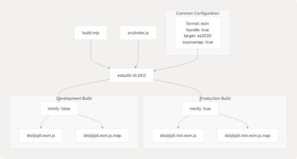
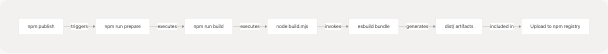
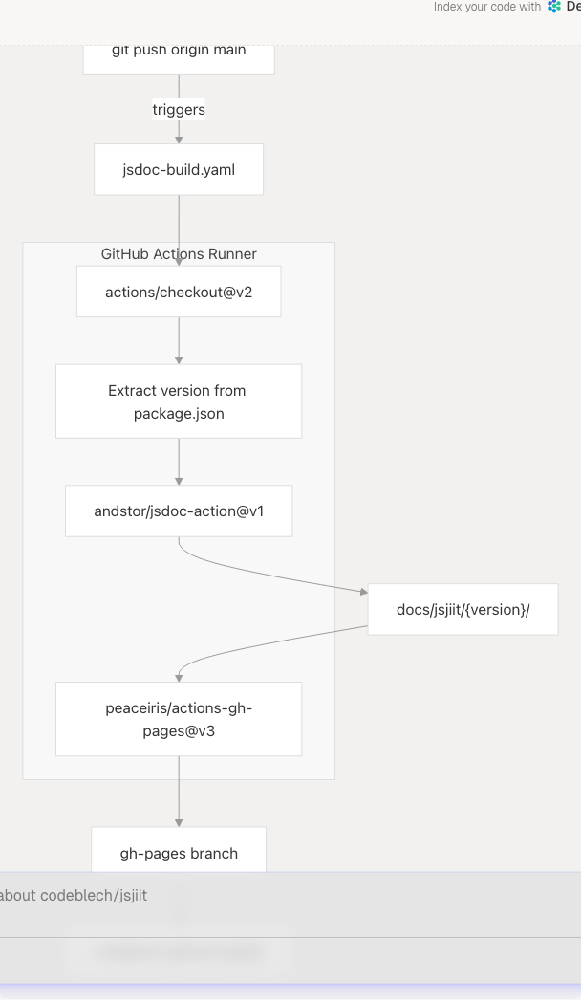

# Build and Release Process

## Purpose and Scope

This document provides a comprehensive guide for building, testing, and releasing new versions of the jsjiit library. It covers the complete workflow from local build validation through npm package publication and automated documentation deployment.

For detailed information about the build system architecture, see [Build System](5.1-build-system). For package.json configuration details, see [Package Configuration](5.2-package-configuration). For documentation deployment specifics, see [Automated Documentation Deployment](6.2-automated-documentation-deployment).

---

## Build Process Overview

The jsjiit library uses a dual-bundle build strategy powered by `esbuild`, producing both minified production and unminified development artifacts.

### Build Script Execution

The build process is initiated through npm scripts defined in [package.json12-16](https://github.com/codeblech/jsjiit/blob/d123b782/package.json#L12-L16):

| Script | Command | Trigger | Purpose |
| --- | --- | --- | --- |
| `npm run build` | `node build.mjs` | Manual | Explicit build invocation |
| `npm run prepare` | `npm run build` | Automatic | Pre-publish build hook |

The `prepare` script is automatically executed by npm before package publication, ensuring published packages always contain up-to-date build artifacts.

**Sources:** [package.json12-16](https://github.com/codeblech/jsjiit/blob/d123b782/package.json#L12-L16)

---

### Build Configuration and Output

The [build.mjs1-36](https://github.com/codeblech/jsjiit/blob/d123b782/build.mjs#L1-L36) script orchestrates two parallel esbuild operations:



**Build Artifacts Generated:**

| File | Size | Minified | Source Map | Purpose |
| --- | --- | --- | --- | --- |
| `dist/jsjiit.min.esm.js` | Optimized | Yes | Yes | Production CDN distribution |
| `dist/jsjiit.esm.js` | Readable | No | Yes | Development debugging |
| `*.js.map` | - | - | - | Stack trace resolution |

The build configuration in [build.mjs3-9](https://github.com/codeblech/jsjiit/blob/d123b782/build.mjs#L3-L9) specifies:

* **Entry point:** `src/index.js` (unified export interface)
* **Bundle mode:** `bundle: true` (all dependencies included)
* **Module format:** `esm` (ES module output)
* **Target:** `es2020` (browser compatibility baseline)
* **Source maps:** `sourcemap: true` (debugging support)

**Sources:** [build.mjs1-36](https://github.com/codeblech/jsjiit/blob/d123b782/build.mjs#L1-L36) [package.json6-7](https://github.com/codeblech/jsjiit/blob/d123b782/package.json#L6-L7)

---

## Pre-Release Checklist

Before initiating a release, complete the following validation steps:

### 1. Local Build Validation

```
# Clean previous build artifacts
rm -rf dist/

# Execute build
npm run build

# Verify build output
ls -lh dist/
```

Expected console output from [build.mjs19-29](https://github.com/codeblech/jsjiit/blob/d123b782/build.mjs#L19-L29):

```
✅ Production build complete
✅ Development build complete
🎉 All builds completed successfully!
```

### 2. Build Artifact Verification

Verify the following files exist and contain valid JavaScript:

* `dist/jsjiit.min.esm.js` - Should be minified, single-line
* `dist/jsjiit.esm.js` - Should be readable, multi-line
* `dist/jsjiit.min.esm.js.map` - Source map for production
* `dist/jsjiit.esm.js.map` - Source map for development

### 3. Local Testing

Test the built artifacts using the local development server (see [Local Development Setup](7.1-local-development-setup)):

```
# Start HTTPS server
./run_server

# Open test.html in browser at https://localhost:8000/test.html
# Verify all functionality works with built artifacts
```

### 4. Documentation Build Verification

```
# Generate documentation locally
npm run docs

# Verify documentation output
ls -lh docs/jsjiit/
```

**Sources:** [build.mjs11-36](https://github.com/codeblech/jsjiit/blob/d123b782/build.mjs#L11-L36) [package.json12-16](https://github.com/codeblech/jsjiit/blob/d123b782/package.json#L12-L16)

---

## Version Management

### Semantic Versioning

The jsjiit library follows semantic versioning (`MAJOR.MINOR.PATCH`):

* **MAJOR:** Breaking API changes
* **MINOR:** New features, backward compatible
* **PATCH:** Bug fixes, backward compatible

### Version Update Process

1. **Update package.json:**

   ```
   ```
   npm version patch  # For bug fixes (0.0.23 → 0.0.24)
   npm version minor  # For new features (0.0.23 → 0.1.0)
   npm version major  # For breaking changes (0.0.23 → 1.0.0)
   ```
   ```
2. **Verify version consistency:**

   The version in [package.json3](https://github.com/codeblech/jsjiit/blob/d123b782/package.json#L3-L3) must be updated. This version is used by:

   * npm package registry metadata
   * GitHub Actions documentation deployment [.github/workflows/jsdoc-build.yaml14-16](https://github.com/codeblech/jsjiit/blob/d123b782/.github/workflows/jsdoc-build.yaml#L14-L16)
   * CDN version paths (`https://cdn.jsdelivr.net/npm/jsjiit@0.0.23/...`)
3. **Commit version bump:**

   ```
   ```
   git add package.json package-lock.json
   git commit -m "Bump version to 0.0.24"
   ```
   ```

**Sources:** [package.json3](https://github.com/codeblech/jsjiit/blob/d123b782/package.json#L3-L3) [.github/workflows/jsdoc-build.yaml14-16](https://github.com/codeblech/jsjiit/blob/d123b782/.github/workflows/jsdoc-build.yaml#L14-L16)

---

## Release Workflow

The complete release workflow integrates local builds, git operations, npm publishing, and automated deployments.


### Step-by-Step Release Process

#### 1. Prepare Release Branch

```
# Ensure working directory is clean
git status

# Ensure on main branch
git checkout main
git pull origin main
```

#### 2. Version Bump

```
# Update version (creates commit and tag automatically with --no-git-tag-version=false)
npm version patch -m "Release v%s"

# Or manually:
# 1. Edit package.json line 3
# 2. npm install (updates package-lock.json)
# 3. git commit -am "Bump version to 0.0.24"
# 4. git tag v0.0.24
```

#### 3. Push to GitHub

```
# Push commits
git push origin main

# Push tags
git push origin --tags
```

This triggers the GitHub Actions workflow defined in [.github/workflows/jsdoc-build.yaml1-27](https://github.com/codeblech/jsjiit/blob/d123b782/.github/workflows/jsdoc-build.yaml#L1-L27)

#### 4. Publish to npm

```
# Dry run to verify package contents
npm pack
tar -tzf jsjiit-0.0.24.tgz

# Publish to npm registry
npm publish
```

The `prepare` script in [package.json16](https://github.com/codeblech/jsjiit/blob/d123b782/package.json#L16-L16) ensures `npm run build` executes automatically during publication.

#### 5. Verify Package Contents

The published package includes only files specified in [package.json26-29](https://github.com/codeblech/jsjiit/blob/d123b782/package.json#L26-L29):

```
"files": [
  "dist",
  "src"
]
```

Files excluded by [.gitignore1-6](https://github.com/codeblech/jsjiit/blob/d123b782/.gitignore#L1-L6) and `.npmignore` are not published.

**Sources:** [package.json3](https://github.com/codeblech/jsjiit/blob/d123b782/package.json#L3-L3) [package.json12-16](https://github.com/codeblech/jsjiit/blob/d123b782/package.json#L12-L16) [package.json26-29](https://github.com/codeblech/jsjiit/blob/d123b782/package.json#L26-L29) [.github/workflows/jsdoc-build.yaml1-27](https://github.com/codeblech/jsjiit/blob/d123b782/.github/workflows/jsdoc-build.yaml#L1-L27)

---

## Automated Processes

### Prepare Hook Automation

The `prepare` script in [package.json16](https://github.com/codeblech/jsjiit/blob/d123b782/package.json#L16-L16) provides automatic build execution:



This ensures:

* **No stale artifacts:** Build always runs before publish
* **No manual build step:** Developers cannot forget to build
* **Consistent output:** Same build process every time

**Sources:** [package.json15-16](https://github.com/codeblech/jsjiit/blob/d123b782/package.json#L15-L16) [build.mjs11-36](https://github.com/codeblech/jsjiit/blob/d123b782/build.mjs#L11-L36)

---

### Documentation Deployment Automation

The GitHub Actions workflow in [.github/workflows/jsdoc-build.yaml1-27](https://github.com/codeblech/jsjiit/blob/d123b782/.github/workflows/jsdoc-build.yaml#L1-L27) automatically deploys documentation on every push to `main`:



**Workflow Steps:**

1. **Checkout** [.github/workflows/jsdoc-build.yaml12-13](https://github.com/codeblech/jsjiit/blob/d123b782/.github/workflows/jsdoc-build.yaml#L12-L13): Clone repository
2. **Extract Version** [.github/workflows/jsdoc-build.yaml14-16](https://github.com/codeblech/jsjiit/blob/d123b782/.github/workflows/jsdoc-build.yaml#L14-L16): Read version from `package.json`
3. **Build Documentation** [.github/workflows/jsdoc-build.yaml17-21](https://github.com/codeblech/jsjiit/blob/d123b782/.github/workflows/jsdoc-build.yaml#L17-L21): Execute JSDoc with `jsdoc.conf.json`
4. **Deploy** [.github/workflows/jsdoc-build.yaml22-26](https://github.com/codeblech/jsjiit/blob/d123b782/.github/workflows/jsdoc-build.yaml#L22-L26): Publish to `gh-pages` branch at versioned path

**Sources:** [.github/workflows/jsdoc-build.yaml1-27](https://github.com/codeblech/jsjiit/blob/d123b782/.github/workflows/jsdoc-build.yaml#L1-L27)

---

### CDN Mirroring

The jsdelivr CDN automatically mirrors published npm packages:

| Distribution Point | URL Pattern | Update Latency |
| --- | --- | --- |
| npm Registry | `https://registry.npmjs.org/jsjiit` | Immediate |
| jsdelivr CDN | `https://cdn.jsdelivr.net/npm/jsjiit@0.0.23/dist/jsjiit.min.esm.js` | ~5 minutes |
| GitHub Pages | `https://codeblech.github.io/jsjiit/0.0.23/` | ~2 minutes |

**Sources:** [package.json6-7](https://github.com/codeblech/jsjiit/blob/d123b782/package.json#L6-L7) [package.json22-25](https://github.com/codeblech/jsjiit/blob/d123b782/package.json#L22-L25)

---

## Post-Release Verification

After completing the release workflow, verify successful deployment across all distribution channels:

### 1. npm Registry Verification

```
# Check published version
npm view jsjiit version

# Verify package metadata
npm view jsjiit

# Install from registry
npm install jsjiit@0.0.24
```

### 2. CDN Availability Check

Verify jsdelivr CDN serves the new version:

```
# Production bundle
curl -I https://cdn.jsdelivr.net/npm/jsjiit@0.0.24/dist/jsjiit.min.esm.js

# Development bundle
curl -I https://cdn.jsdelivr.net/npm/jsjiit@0.0.24/dist/jsjiit.esm.js
```

Expected response: `HTTP/2 200`

### 3. Documentation Deployment Verification

1. Navigate to GitHub Actions tab: `https://github.com/codeblech/jsjiit/actions`
2. Verify `jsdoc-build` workflow completed successfully
3. Check documentation URL: `https://codeblech.github.io/jsjiit/0.0.24/`

### 4. Functional Testing

```
<!-- Test CDN import -->
<script type="module">
  import { WebPortal } from 'https://cdn.jsdelivr.net/npm/jsjiit@0.0.24/dist/jsjiit.min.esm.js';
  console.log('✅ CDN import successful');
</script>
```

**Sources:** [package.json3](https://github.com/codeblech/jsjiit/blob/d123b782/package.json#L3-L3) [.github/workflows/jsdoc-build.yaml22-26](https://github.com/codeblech/jsjiit/blob/d123b782/.github/workflows/jsdoc-build.yaml#L22-L26)

---

## Rollback Procedures

If issues are discovered post-release:

### 1. npm Package Deprecation

```
# Deprecate specific version
npm deprecate jsjiit@0.0.24 "Critical bug - use 0.0.23 instead"

# Users will see warning when installing
```

### 2. Documentation Rollback

```
# Revert gh-pages branch
git checkout gh-pages
git revert <commit-hash>
git push origin gh-pages
```

### 3. Hotfix Release

For critical fixes:

```
# Create hotfix branch
git checkout -b hotfix/0.0.25

# Fix issue, test thoroughly
npm version patch
npm publish

# Merge back to main
git checkout main
git merge hotfix/0.0.25
git push origin main
```

**Sources:** [package.json3](https://github.com/codeblech/jsjiit/blob/d123b782/package.json#L3-L3)

---

## Build System File Dependencies

The build and release process relies on the following files:


**File Purposes:**

| File | Role | Modified On |
| --- | --- | --- |
| [package.json1-61](https://github.com/codeblech/jsjiit/blob/d123b782/package.json#L1-L61) | Project metadata, version, scripts | Every release |
| [build.mjs1-36](https://github.com/codeblech/jsjiit/blob/d123b782/build.mjs#L1-L36) | Build orchestration logic | Rarely |
| [.github/workflows/jsdoc-build.yaml1-27](https://github.com/codeblech/jsjiit/blob/d123b782/.github/workflows/jsdoc-build.yaml#L1-L27) | CI/CD automation | Rarely |
| [.gitignore1-6](https://github.com/codeblech/jsjiit/blob/d123b782/.gitignore#L1-L6) | Git exclusions | Rarely |

**Sources:** [package.json1-61](https://github.com/codeblech/jsjiit/blob/d123b782/package.json#L1-L61) [build.mjs1-36](https://github.com/codeblech/jsjiit/blob/d123b782/build.mjs#L1-L36) [.github/workflows/jsdoc-build.yaml1-27](https://github.com/codeblech/jsjiit/blob/d123b782/.github/workflows/jsdoc-build.yaml#L1-L27) [.gitignore1-6](https://github.com/codeblech/jsjiit/blob/d123b782/.gitignore#L1-L6)

---

## Release Checklist Summary

**Pre-Release:**

* Local build completes without errors (`npm run build`)
* All tests pass in test.html (see [Testing and Validation](7.2-testing-and-validation))
* Version bumped in package.json
* Changelog updated (if applicable)
* Git working directory clean

**Release:**

* Committed version bump to main branch
* Tagged release (`git tag v0.0.X`)
* Pushed to GitHub (`git push origin main --tags`)
* Published to npm (`npm publish`)

**Post-Release:**

* npm package available (`npm view jsjiit@0.0.X`)
* CDN serves new version (jsdelivr)
* Documentation deployed to GitHub Pages
* GitHub Actions workflow succeeded
* Functional import test passes

**Sources:** [package.json12-16](https://github.com/codeblech/jsjiit/blob/d123b782/package.json#L12-L16) [.github/workflows/jsdoc-build.yaml1-27](https://github.com/codeblech/jsjiit/blob/d123b782/.github/workflows/jsdoc-build.yaml#L1-L27)
