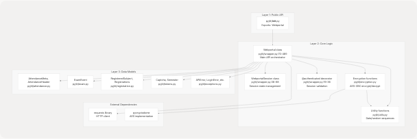
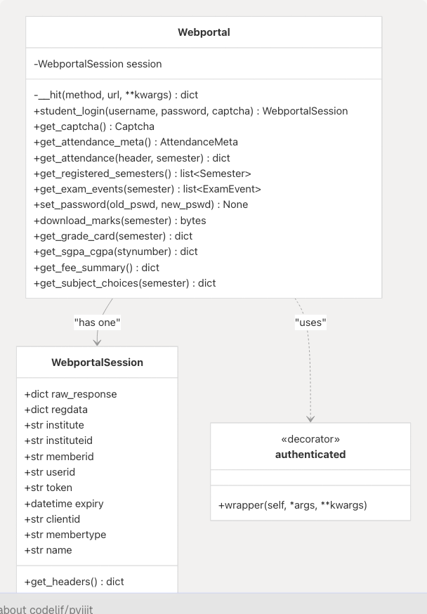
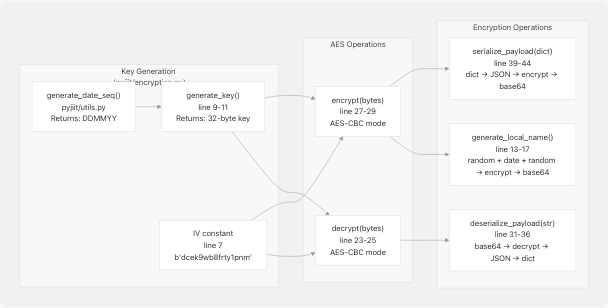
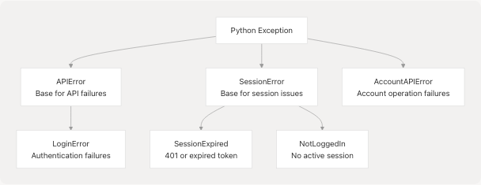
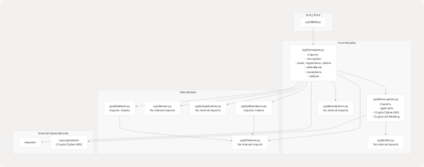

# System Architecture

- [pyjiit/encryption.py](https://github.com/codelif/pyjiit/blob/0fe02955/pyjiit/encryption.py)
- [pyjiit/exam.py](https://github.com/codelif/pyjiit/blob/0fe02955/pyjiit/exam.py)
- [pyjiit/registration.py](https://github.com/codelif/pyjiit/blob/0fe02955/pyjiit/registration.py)
- [pyjiit/wrapper.py](https://github.com/codelif/pyjiit/blob/0fe02955/pyjiit/wrapper.py)
- [pyproject.toml](https://github.com/codelif/pyjiit/blob/0fe02955/pyproject.toml)

## Purpose and Scope

This document describes the high-level architecture of the pyjiit library, including its layered structure, core components, and how they interact to provide a Python API client for the JIIT Webportal system. It focuses on the organization of modules, the flow of data through the system, and the relationships between major components.

For detailed information about the encryption implementation, see [Security and Encryption](4-security-and-encryption). For installation and basic usage, see [Getting Started](2-getting-started). For complete API method documentation, see [Core API Reference](3-core-api-reference).

## Architectural Overview

The pyjiit library follows a **three-layer architecture** that cleanly separates concerns:



**Sources:** [pyjiit/wrapper.py1-489](https://github.com/codelif/pyjiit/blob/0fe02955/pyjiit/wrapper.py#L1-L489) [pyjiit/encryption.py1-50](https://github.com/codelif/pyjiit/blob/0fe02955/pyjiit/encryption.py#L1-L50) [pyjiit/\_\_init\_\_.py](https://github.com/codelif/pyjiit/blob/0fe02955/pyjiit/__init__.py)

| Layer              | Responsibility                                     | Key Files                                                                              |
| ------------------ | -------------------------------------------------- | -------------------------------------------------------------------------------------- |
| **Public API**     | Exports single entry point (`Webportal`)           | `pyjiit/__init__.py`                                                                   |
| **Core Logic**     | HTTP communication, encryption, session management | `pyjiit/wrapper.py`, `pyjiit/encryption.py`, `pyjiit/utils.py`                         |
| **Data Models**    | Structured representations of API responses        | `pyjiit/attendance.py`, `pyjiit/exam.py`, `pyjiit/registration.py`, `pyjiit/tokens.py` |
| **Error Handling** | Exception hierarchy for specific error cases       | `pyjiit/exceptions.py`                                                                 |

## Core Components

### Webportal Class

The `Webportal` class defined in [pyjiit/wrapper.py70-489](https://github.com/codelif/pyjiit/blob/0fe02955/pyjiit/wrapper.py#L70-L489) is the central orchestrator. It provides all public methods for interacting with the JIIT Webportal API.

**Key characteristics:**

- **Stateful**: Maintains a `self.session` attribute of type `WebportalSession`
- **Method categories**: Authentication, attendance, exams, registrations, marks, account management
- **Internal HTTP handler**: Private `__hit` method [pyjiit/wrapper.py82-108](https://github.com/codelif/pyjiit/blob/0fe02955/pyjiit/wrapper.py#L82-L108) centralizes all HTTP requests
- **Decorator-based access control**: `@authenticated` decorator [pyjiit/wrapper.py19-36](https://github.com/codelif/pyjiit/blob/0fe02955/pyjiit/wrapper.py#L19-L36) validates session state before method execution



**Sources:** [pyjiit/wrapper.py70-489](https://github.com/codelif/pyjiit/blob/0fe02955/pyjiit/wrapper.py#L70-L489) [pyjiit/wrapper.py38-68](https://github.com/codelif/pyjiit/blob/0fe02955/pyjiit/wrapper.py#L38-L68) [pyjiit/wrapper.py19-36](https://github.com/codelif/pyjiit/blob/0fe02955/pyjiit/wrapper.py#L19-L36)

### WebportalSession Class

The `WebportalSession` class [pyjiit/wrapper.py38-68](https://github.com/codelif/pyjiit/blob/0fe02955/pyjiit/wrapper.py#L38-L68) encapsulates all session state after successful authentication.

**Session attributes extracted from login response:**

- `token`: JWT token parsed to extract expiry timestamp
- `instituteid`, `memberid`, `clientid`: Required in most API payloads
- `membertype`: Student identifier ("S")
- `regdata`: Raw registration data from authentication

**Key method:**

- `get_headers()` [pyjiit/wrapper.py61-68](https://github.com/codelif/pyjiit/blob/0fe02955/pyjiit/wrapper.py#L61-L68): Returns `Authorization` header with Bearer token and `LocalName` header for every authenticated request

**Sources:** [pyjiit/wrapper.py38-68](https://github.com/codelif/pyjiit/blob/0fe02955/pyjiit/wrapper.py#L38-L68)

### Encryption Module

The encryption module [pyjiit/encryption.py1-50](https://github.com/codelif/pyjiit/blob/0fe02955/pyjiit/encryption.py#L1-L50) implements all cryptographic operations required for communication with JIIT Webportal.



**Sources:** [pyjiit/encryption.py1-50](https://github.com/codelif/pyjiit/blob/0fe02955/pyjiit/encryption.py#L1-L50)

**Key functions:**

| Function                       | Purpose                                          | Returns |
| ------------------------------ | ------------------------------------------------ | ------- |
| `generate_key()`               | Creates 32-byte AES key from daily date sequence | `bytes` |
| `encrypt(data)`                | AES-CBC encryption with padding                  | `bytes` |
| `decrypt(data)`                | AES-CBC decryption with unpadding                | `bytes` |
| `serialize_payload(payload)`   | Converts dict to encrypted base64 string         | `str`   |
| `deserialize_payload(payload)` | Converts encrypted base64 to dict                | `dict`  |
| `generate_local_name()`        | Creates encrypted header value                   | `str`   |

**Critical implementation details:**

- **Daily key rotation**: Key changes at 00:00 IST via `generate_date_seq()` from `pyjiit.utils`
- **Fixed IV**: Constant `b"dcek9wb8frty1pnm"` [pyjiit/encryption.py7](https://github.com/codelif/pyjiit/blob/0fe02955/pyjiit/encryption.py#L7-L7)
- **Key composition**: `"qa8y" + date_seq + "ty1pn"` [pyjiit/encryption.py11](https://github.com/codelif/pyjiit/blob/0fe02955/pyjiit/encryption.py#L11-L11)

**Sources:** [pyjiit/encryption.py7-44](https://github.com/codelif/pyjiit/blob/0fe02955/pyjiit/encryption.py#L7-L44)

### Data Models

Data model classes provide structured representations of API responses. All models are defined as dataclasses or classes with `from_json()` factory methods.


**Sources:** [pyjiit/exam.py1-24](https://github.com/codelif/pyjiit/blob/0fe02955/pyjiit/exam.py#L1-L24) [pyjiit/registration.py1-44](https://github.com/codelif/pyjiit/blob/0fe02955/pyjiit/registration.py#L1-L44) [pyjiit/attendance.py](https://github.com/codelif/pyjiit/blob/0fe02955/pyjiit/attendance.py) [pyjiit/tokens.py](https://github.com/codelif/pyjiit/blob/0fe02955/pyjiit/tokens.py)

| Model Class         | File                           | Purpose                                                 |
| ------------------- | ------------------------------ | ------------------------------------------------------- |
| `ExamEvent`         | `pyjiit/exam.py`               | Represents exam event metadata                          |
| `RegisteredSubject` | `pyjiit/registration.py:4-32`  | Individual subject registration with faculty info       |
| `Registrations`     | `pyjiit/registration.py:36-43` | Container for all registered subjects and total credits |
| `AttendanceMeta`    | `pyjiit/attendance.py`         | Metadata for attendance queries (headers and semesters) |
| `AttendanceHeader`  | `pyjiit/attendance.py`         | Student identification for attendance                   |
| `Semester`          | `pyjiit/tokens.py`             | Semester/registration identification                    |
| `Captcha`           | `pyjiit/tokens.py`             | CAPTCHA challenge and response                          |

### Exception Hierarchy

The library defines a hierarchy of custom exceptions in `pyjiit/exceptions.py` for precise error handling.



**Sources:** [pyjiit/wrapper.py8](https://github.com/codelif/pyjiit/blob/0fe02955/pyjiit/wrapper.py#L8-L8) (import statement), [pyjiit/exceptions.py](https://github.com/codelif/pyjiit/blob/0fe02955/pyjiit/exceptions.py)

**Usage in code:**

- `LoginError`: Raised by `student_login()` [pyjiit/wrapper.py111-143](https://github.com/codelif/pyjiit/blob/0fe02955/pyjiit/wrapper.py#L111-L143)
- `NotLoggedIn`: Raised by `@authenticated` decorator when `self.session is None` [pyjiit/wrapper.py26-27](https://github.com/codelif/pyjiit/blob/0fe02955/pyjiit/wrapper.py#L26-L27)
- `SessionExpired`: Raised by `__hit()` on HTTP 401 status [pyjiit/wrapper.py102-103](https://github.com/codelif/pyjiit/blob/0fe02955/pyjiit/wrapper.py#L102-L103)
- `AccountAPIError`: Raised by `set_password()` [pyjiit/wrapper.py214-230](https://github.com/codelif/pyjiit/blob/0fe02955/pyjiit/wrapper.py#L214-L230)
- `APIError`: Default exception for generic API failures [pyjiit/wrapper.py83-106](https://github.com/codelif/pyjiit/blob/0fe02955/pyjiit/wrapper.py#L83-L106)

## Request/Response Flow

Every API call follows a standardized pattern through the internal `__hit()` method.

### Flow Diagram: Authenticated API Call


**Sources:** [pyjiit/wrapper.py82-108](https://github.com/codelif/pyjiit/blob/0fe02955/pyjiit/wrapper.py#L82-L108) [pyjiit/wrapper.py19-36](https://github.com/codelif/pyjiit/blob/0fe02955/pyjiit/wrapper.py#L19-L36) [pyjiit/encryption.py39-44](https://github.com/codelif/pyjiit/blob/0fe02955/pyjiit/encryption.py#L39-L44)

### The \_\_hit() Method

The `__hit()` method [pyjiit/wrapper.py82-108](https://github.com/codelif/pyjiit/blob/0fe02955/pyjiit/wrapper.py#L82-L108) is the central HTTP request handler with the following responsibilities:

**1. Header Management:**

- Adds `LocalName` header to all requests [pyjiit/wrapper.py93](https://github.com/codelif/pyjiit/blob/0fe02955/pyjiit/wrapper.py#L93-L93)
- Adds `Authorization` header for authenticated requests [pyjiit/wrapper.py90](https://github.com/codelif/pyjiit/blob/0fe02955/pyjiit/wrapper.py#L90-L90)

**2. Error Handling:**

- Detects HTTP 401 → raises `SessionExpired` [pyjiit/wrapper.py102-103](https://github.com/codelif/pyjiit/blob/0fe02955/pyjiit/wrapper.py#L102-L103)
- Detects API-level failures → raises custom exception [pyjiit/wrapper.py105-106](https://github.com/codelif/pyjiit/blob/0fe02955/pyjiit/wrapper.py#L105-L106)

**3. Extensibility:**

- Accepts custom exception types via `exception` kwarg [pyjiit/wrapper.py83-87](https://github.com/codelif/pyjiit/blob/0fe02955/pyjiit/wrapper.py#L83-L87)
- Forwards all kwargs to `requests.request()` [pyjiit/wrapper.py101](https://github.com/codelif/pyjiit/blob/0fe02955/pyjiit/wrapper.py#L101-L101)

**Sources:** [pyjiit/wrapper.py82-108](https://github.com/codelif/pyjiit/blob/0fe02955/pyjiit/wrapper.py#L82-L108)

## Module Dependencies

The following diagram shows compile-time dependencies between modules:



**Sources:** [pyjiit/wrapper.py1-14](https://github.com/codelif/pyjiit/blob/0fe02955/pyjiit/wrapper.py#L1-L14) [pyjiit/encryption.py1-5](https://github.com/codelif/pyjiit/blob/0fe02955/pyjiit/encryption.py#L1-L5)

### Dependency Table

| Module                   | Direct Dependencies                                                                               | Purpose                              |
| ------------------------ | ------------------------------------------------------------------------------------------------- | ------------------------------------ |
| `pyjiit/__init__.py`     | `wrapper`                                                                                         | Exports `Webportal` class only       |
| `pyjiit/wrapper.py`      | `encryption`, `exam`, `registration`, `tokens`, `attendance`, `exceptions`, `default`, `requests` | Orchestrates all functionality       |
| `pyjiit/encryption.py`   | `pyjiit.utils`, `pycryptodome`                                                                    | Cryptographic operations             |
| `pyjiit/exam.py`         | None                                                                                              | Self-contained data model            |
| `pyjiit/registration.py` | None                                                                                              | Self-contained data model            |
| `pyjiit/tokens.py`       | None                                                                                              | Self-contained data model            |
| `pyjiit/attendance.py`   | `tokens`                                                                                          | Uses `Semester` class                |
| `pyjiit/exceptions.py`   | None                                                                                              | Self-contained exception definitions |
| `pyjiit/utils.py`        | None                                                                                              | Self-contained utility functions     |

**Sources:** [pyjiit/wrapper.py1-14](https://github.com/codelif/pyjiit/blob/0fe02955/pyjiit/wrapper.py#L1-L14) [pyjiit/encryption.py1-5](https://github.com/codelif/pyjiit/blob/0fe02955/pyjiit/encryption.py#L1-L5)

## Design Patterns

### 1. Decorator Pattern: @authenticated

The `@authenticated` decorator [pyjiit/wrapper.py19-36](https://github.com/codelif/pyjiit/blob/0fe02955/pyjiit/wrapper.py#L19-L36) enforces preconditions on methods that require an active session:

```
@authenticated
def get_attendance_meta(self): # Method body only executes if self.session is not None
```

**Applied to:** `get_attendance_meta()`, `get_attendance()`, `get_registered_semesters()`, `get_exam_events()`, `set_password()`, `download_marks()`, `get_grade_card()`, `get_sgpa_cgpa()`, `get_fee_summary()`, `get_subject_choices()`, and others.

**Sources:** [pyjiit/wrapper.py19-36](https://github.com/codelif/pyjiit/blob/0fe02955/pyjiit/wrapper.py#L19-L36) [pyjiit/wrapper.py156](https://github.com/codelif/pyjiit/blob/0fe02955/pyjiit/wrapper.py#L156-L156) [pyjiit/wrapper.py172](https://github.com/codelif/pyjiit/blob/0fe02955/pyjiit/wrapper.py#L172-L172)

### 2. Factory Pattern: from_json()

Data model classes use static factory methods to construct instances from API responses:

```

@staticmethod
def from_json(resp: dict):
return ExamEvent(
resp["exameventcode"],
resp["eventfrom"],
resp["exameventdesc"],
resp["registrationid"],
resp["exameventid"]
)

```

**Used by:** `ExamEvent` [pyjiit/exam.py13-20](https://github.com/codelif/pyjiit/blob/0fe02955/pyjiit/exam.py#L13-L20) `RegisteredSubject` [pyjiit/registration.py18-32](https://github.com/codelif/pyjiit/blob/0fe02955/pyjiit/registration.py#L18-L32) `Semester`, `Captcha`

**Sources:** [pyjiit/exam.py13-20](https://github.com/codelif/pyjiit/blob/0fe02955/pyjiit/exam.py#L13-L20) [pyjiit/registration.py18-32](https://github.com/codelif/pyjiit/blob/0fe02955/pyjiit/registration.py#L18-L32)

### 3. Centralized Error Handling

The `__hit()` method centralizes HTTP communication and error detection, allowing individual methods to specify custom exceptions via the `exception` parameter:

```

resp = self.\_\_hit("POST", API+endpoint, data=payload, exception=LoginError)

```

**Sources:** [pyjiit/wrapper.py82-108](https://github.com/codelif/pyjiit/blob/0fe02955/pyjiit/wrapper.py#L82-L108) [pyjiit/wrapper.py130](https://github.com/codelif/pyjiit/blob/0fe02955/pyjiit/wrapper.py#L130-L130)

### 4. Encapsulation of External API

The constant `API = "https://webportal.jiit.ac.in:6011/StudentPortalAPI"` [pyjiit/wrapper.py17](https://github.com/codelif/pyjiit/blob/0fe02955/pyjiit/wrapper.py#L17-L17) combined with endpoint strings creates complete URLs. This centralizes the base URL configuration.

**Sources:** [pyjiit/wrapper.py17](https://github.com/codelif/pyjiit/blob/0fe02955/pyjiit/wrapper.py#L17-L17)

## External Dependencies

The library has minimal runtime dependencies defined in [pyproject.toml9-12](https://github.com/codelif/pyjiit/blob/0fe02955/pyproject.toml#L9-L12):

| Dependency     | Version Constraint | Purpose                           |
| -------------- | ------------------ | --------------------------------- |
| `requests`     | `>=2.32.3,<3.0.0`  | HTTP client for API communication |
| `pycryptodome` | `>=3.22.0,<4.0.0`  | AES encryption implementation     |

**Additional documentation dependencies** (not included in runtime): `sphinx` and `furo` for documentation generation [pyproject.toml19-21](https://github.com/codelif/pyjiit/blob/0fe02955/pyproject.toml#L19-L21)

**Sources:** [pyproject.toml9-12](https://github.com/codelif/pyjiit/blob/0fe02955/pyproject.toml#L9-L12) [pyproject.toml19-21](https://github.com/codelif/pyjiit/blob/0fe02955/pyproject.toml#L19-L21)
