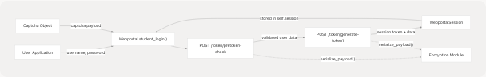
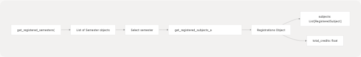
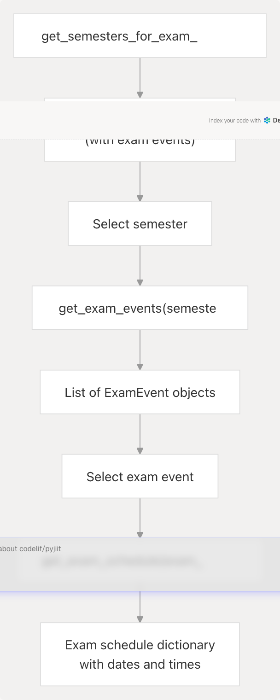
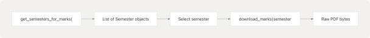
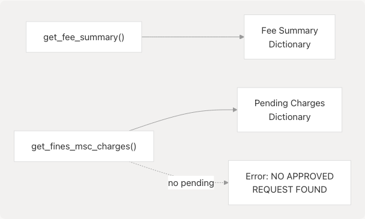
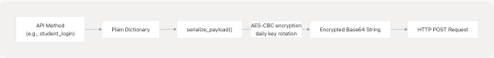
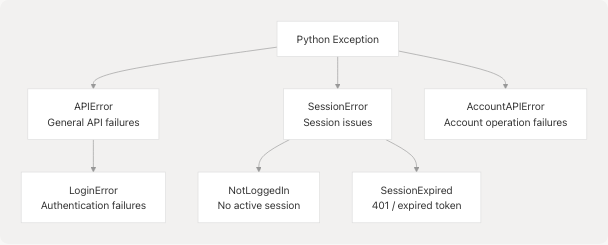
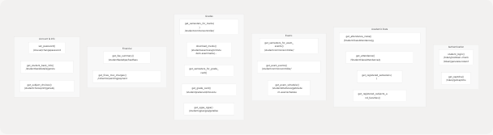

# Key Features

- [README.rst](https://github.com/codelif/pyjiit/blob/0fe02955/README.rst)
- [docs/usage.rst](https://github.com/codelif/pyjiit/blob/0fe02955/docs/usage.rst)
- [pyjiit/exam.py](https://github.com/codelif/pyjiit/blob/0fe02955/pyjiit/exam.py)
- [pyjiit/registration.py](https://github.com/codelif/pyjiit/blob/0fe02955/pyjiit/registration.py)
- [pyjiit/wrapper.py](https://github.com/codelif/pyjiit/blob/0fe02955/pyjiit/wrapper.py)

This page provides a comprehensive overview of pyjiit's capabilities and features. It describes what the library can do, organized by functional area. For implementation details of individual features, see the [Core API Reference](/codelif/pyjiit/3-core-api-reference). For understanding the underlying architecture, see [System Architecture](/codelif/pyjiit/1.1-system-architecture).

---

## Feature Overview

pyjiit provides programmatic access to the JIIT Webportal through a Python API. The library exposes functionality through the `Webportal` class, which acts as the main interface to all webportal operations. Features are organized into several functional areas:

| **Feature Category**   | **Capabilities**                          | **Key Methods**                                           |
| ---------------------- | ----------------------------------------- | --------------------------------------------------------- |
| **Authentication**     | Login, session management, token handling | `student_login`, `get_captcha`                            |
| **Academic Data**      | Attendance, registrations, exam schedules | `get_attendance`, `get_registered_subjects_and_faculties` |
| **Marks & Grades**     | Exam results, grade cards, SGPA/CGPA      | `download_marks`, `get_grade_card`, `get_sgpa_cgpa`       |
| **Student Info**       | Bank details, session data                | `get_student_bank_info`                                   |
| **Financial**          | Fees, fines, pending payments             | `get_fee_summary`, `get_fines_msc_charges`                |
| **Account Management** | Password changes, captcha                 | `set_password`, `get_captcha`                             |
| **Security**           | Encrypted payloads, secure headers        | Automatic via encryption module                           |
| **Error Handling**     | Type-safe exceptions                      | `APIError`, `LoginError`, `SessionExpired`, `NotLoggedIn` |

**Sources:** [pyjiit/wrapper.py1-489](https://github.com/codelif/pyjiit/blob/0fe02955/pyjiit/wrapper.py#L1-L489) [README.rst9-17](https://github.com/codelif/pyjiit/blob/0fe02955/README.rst#L9-L17)

---

## Authentication and Session Management

### Login System

The library implements a **two-phase authentication flow** that mirrors the JIIT Webportal's security model. Authentication requires three components:

1. **Username** - Student enrollment number
2. **Password** - Webportal password
3. **Captcha** - Captcha verification object

**Sources:** [pyjiit/wrapper.py111-143](https://github.com/codelif/pyjiit/blob/0fe02955/pyjiit/wrapper.py#L111-L143) [docs/usage.rst30-53](https://github.com/codelif/pyjiit/blob/0fe02955/docs/usage.rst#L30-L53)

### Session Object

Upon successful login, a `WebportalSession` object is created and stored in `Webportal.session`. This object contains:

| **Attribute** | **Description**                             | **Source Location** |
| ------------- | ------------------------------------------- | ------------------- |
| `token`       | JWT bearer token for authenticated requests | Line 53             |
| `expiry`      | Token expiration timestamp                  | Lines 54-55         |
| `instituteid` | Institute identifier (e.g., "128")          | Line 48             |
| `memberid`    | Student member ID                           | Line 49             |
| `clientid`    | Client identifier (e.g., "JAYPEE")          | Line 57             |
| `name`        | Student name                                | Line 59             |
| `userid`      | User ID                                     | Line 51             |

The session automatically provides authentication headers via the `get_headers()` method, which includes the bearer token and a dynamically generated `LocalName` header for each request.

**Sources:** [pyjiit/wrapper.py38-68](https://github.com/codelif/pyjiit/blob/0fe02955/pyjiit/wrapper.py#L38-L68)

### Protected Method Decorator

The `@authenticated` decorator enforces session requirements for protected methods:

This ensures that methods requiring authentication cannot be called before `student_login()` is invoked, providing early error detection.

**Sources:** [pyjiit/wrapper.py19-36](https://github.com/codelif/pyjiit/blob/0fe02955/pyjiit/wrapper.py#L19-L36)

### Captcha Handling

The library provides two mechanisms for captcha verification:

1. **Dynamic captcha generation** via `get_captcha()` - returns a `Captcha` object with base64-encoded image
2. **Static captcha** via `pyjiit.default.CAPTCHA` - pre-solved captcha that works due to the webportal's captcha implementation not being IP-bound

**Sources:** [pyjiit/wrapper.py145-154](https://github.com/codelif/pyjiit/blob/0fe02955/pyjiit/wrapper.py#L145-L154) [pyjiit/default.py1-10](https://github.com/codelif/pyjiit/blob/0fe02955/pyjiit/default.py#L1-L10) [docs/usage.rst49-52](https://github.com/codelif/pyjiit/blob/0fe02955/docs/usage.rst#L49-L52)

---

## Academic Data Retrieval

### Attendance Management

Attendance queries follow a **two-step metadata-then-data pattern**:

**Key Methods:**

- **`get_attendance_meta()`** - Returns `AttendanceMeta` with available headers and semesters

  - Endpoint: `/StudentClassAttendance/getstudentInforegistrationforattendence`
  - Contains `headers` list and `semesters` list
  - Helper methods: `latest_header()`, `latest_semester()`

- **`get_attendance(header, semester)`** - Returns detailed attendance data

  - Endpoint: `/StudentClassAttendance/getstudentattendancedetail`
  - Uses encrypted payload serialization
  - **Note:** Response time typically exceeds 10 seconds due to server processing

**Sources:** [pyjiit/wrapper.py173-211](https://github.com/codelif/pyjiit/blob/0fe02955/pyjiit/wrapper.py#L173-L211) [docs/usage.rst71-108](https://github.com/codelif/pyjiit/blob/0fe02955/docs/usage.rst#L71-L108)

### Subject Registration Data

**Key Methods:**

- **`get_registered_semesters()`** - Returns list of `Semester` objects representing all registered semesters

  - Endpoint: `/reqsubfaculty/getregistrationList`
  - Each semester has `registration_id` and `registration_code`

- **`get_registered_subjects_and_faculties(semester)`** - Returns `Registrations` object containing:

  - `subjects` - List of `RegisteredSubject` objects with faculty, credits, subject details
  - `total_credits` - Total course credits for the semester
  - Endpoint: `/reqsubfaculty/getfaculties`

**Data Model:** Each `RegisteredSubject` includes `employee_name`, `subject_code`, `subject_desc`, `credits`, `subject_component_code` (e.g., "L" for lecture, "T" for tutorial), and registration status.

**Sources:** [pyjiit/wrapper.py233-269](https://github.com/codelif/pyjiit/blob/0fe02955/pyjiit/wrapper.py#L233-L269) [pyjiit/registration.py1-44](https://github.com/codelif/pyjiit/blob/0fe02955/pyjiit/registration.py#L1-L44) [docs/usage.rst111-133](https://github.com/codelif/pyjiit/blob/0fe02955/docs/usage.rst#L111-L133)

### Exam Events and Schedules

**Key Methods:**

- **`get_semesters_for_exam_events()`** - Returns semesters that have exam events

  - Endpoint: `/studentcommonsontroller/getsemestercode-withstudentexamevents`

- **`get_exam_events(semester)`** - Returns list of `ExamEvent` objects for a semester

  - Endpoint: `/studentcommonsontroller/getstudentexamevents`
  - Each event has `exam_event_code`, `exam_event_desc`, `exam_event_id`

- **`get_exam_schedule(exam_event)`** - Returns detailed schedule for an exam event

  - Endpoint: `/studentsttattview/getstudent-examschedule`

**Sources:** [pyjiit/wrapper.py273-328](https://github.com/codelif/pyjiit/blob/0fe02955/pyjiit/wrapper.py#L273-L328) [pyjiit/exam.py1-24](https://github.com/codelif/pyjiit/blob/0fe02955/pyjiit/exam.py#L1-L24)

---

## Marks and Grade Management

### Marks Retrieval

**Key Methods:**

- **`get_semesters_for_marks()`** - Returns semesters with available marks

  - Endpoint: `/studentcommonsontroller/getsemestercode-exammarks`

- **`download_marks(semester)`** - Downloads marks PDF

  - Endpoint: `/studentsexamview/printstudent-exammarks/{instituteid}/{registration_id}/{registration_code}`
  - Returns raw PDF content as bytes (not JSON response)
  - Direct HTTP GET with streaming

**Sources:** [pyjiit/wrapper.py331-367](https://github.com/codelif/pyjiit/blob/0fe02955/pyjiit/wrapper.py#L331-L367)

### Grade Card and GPA

**Key Methods:**

- **`get_semesters_for_grade_card()`** - Returns semesters with available grade cards

  - Endpoint: `/studentgradecard/getregistrationList`

- **`get_grade_card(semester)`** - Returns grade card data

  - Internally calls `__get_program_and_branch_id()` first
  - Endpoint: `/studentgradecard/showstudentgradecard`

- **`get_sgpa_cgpa(stynumber=0)`** - Returns SGPA and CGPA data

  - `stynumber` parameter specifies semester number (0 for all)
  - Endpoint: `/studentsgpacgpa/getallsemesterdata`

**Sources:** [pyjiit/wrapper.py370-438](https://github.com/codelif/pyjiit/blob/0fe02955/pyjiit/wrapper.py#L370-L438)

---

## Financial Information

### Fee and Fine Queries

**Key Methods:**

- **`get_fee_summary()`** - Returns complete fee summary

  - Endpoint: `/studentfeeledger/loadfeesummary`
  - Provides overview of all fee transactions

- **`get_fines_msc_charges()`** - Returns pending fines and miscellaneous charges

  - Endpoint: `/collectionpendingpayments/getpendingpaymentsdata`
  - **Note:** Returns "NO APPROVED REQUEST FOUND" error when no pending payments exist
  - Application should handle this as a normal case, not an error

**Sources:** [pyjiit/wrapper.py441-470](https://github.com/codelif/pyjiit/blob/0fe02955/pyjiit/wrapper.py#L441-L470)

---

## Additional Features

### Subject Choices

- **`get_subject_choices(semester)`** - Returns subject preference/choice data
  - Endpoint: `/studentchoiceprint/getsubjectpreference`
  - Includes allocated subjects marked with `subjectrunning == "Y"`

**Sources:** [pyjiit/wrapper.py473-488](https://github.com/codelif/pyjiit/blob/0fe02955/pyjiit/wrapper.py#L473-L488)

### Student Bank Information

- **`get_student_bank_info()`** - Returns student's registered bank details
  - Endpoint: `/studentbankdetails/getstudentbankinfo`
  - Requires authentication

**Sources:** [pyjiit/wrapper.py157-170](https://github.com/codelif/pyjiit/blob/0fe02955/pyjiit/wrapper.py#L157-L170)

### Account Management

- **`set_password(old_pswd, new_pswd)`** - Changes webportal password
  - Endpoint: `/clxuser/changepassword`
  - Raises `AccountAPIError` on failure
  - Requires both old and new password confirmation

**Sources:** [pyjiit/wrapper.py214-229](https://github.com/codelif/pyjiit/blob/0fe02955/pyjiit/wrapper.py#L214-L229) [docs/usage.rst55-68](https://github.com/codelif/pyjiit/blob/0fe02955/docs/usage.rst#L55-L68)

---

## Security Features

### Automatic Payload Encryption

All sensitive API requests automatically use encrypted payloads via the encryption module:

**Key Security Mechanisms:**

1. **Daily Key Rotation** - Encryption key changes at 00:00 IST daily
2. **LocalName Header** - Unique per-request obfuscation header
3. **AES-CBC Encryption** - All sensitive payloads encrypted before transmission
4. **Automatic Serialization** - Methods like `student_login`, `get_attendance`, `get_registered_semesters` automatically serialize payloads

For detailed security implementation, see [Security and Encryption](/codelif/pyjiit/4-security-and-encryption).

**Sources:** [pyjiit/wrapper.py3-14](https://github.com/codelif/pyjiit/blob/0fe02955/pyjiit/wrapper.py#L3-L14) [pyjiit/wrapper.py128-137](https://github.com/codelif/pyjiit/blob/0fe02955/pyjiit/wrapper.py#L128-L137) [pyjiit/wrapper.py207-208](https://github.com/codelif/pyjiit/blob/0fe02955/pyjiit/wrapper.py#L207-L208)

---

## Exception Handling

### Exception Hierarchy

pyjiit provides fine-grained exception types for different error scenarios:

### Exception Usage by Feature

| **Method**                   | **Primary Exception** | **Trigger Condition**                         |
| ---------------------------- | --------------------- | --------------------------------------------- |
| `student_login`              | `LoginError`          | Invalid credentials or authentication failure |
| `set_password`               | `AccountAPIError`     | Password change rejection                     |
| All `@authenticated` methods | `NotLoggedIn`         | Called before `student_login()`               |
| All authenticated requests   | `SessionExpired`      | HTTP 401 or expired token                     |
| All methods                  | `APIError`            | Generic API response errors                   |

**Error Detection:** The internal `__hit()` method centralizes error checking:

- HTTP 401 status → `SessionExpired`
- `responseStatus != "Success"` → Custom exception (specified by caller) or `APIError`

For detailed exception documentation, see [Exception Handling](/codelif/pyjiit/3.4-exception-handling).

**Sources:** [pyjiit/wrapper.py82-108](https://github.com/codelif/pyjiit/blob/0fe02955/pyjiit/wrapper.py#L82-L108) [pyjiit/exceptions.py1-31](https://github.com/codelif/pyjiit/blob/0fe02955/pyjiit/exceptions.py#L1-L31) [docs/usage.rst138-142](https://github.com/codelif/pyjiit/blob/0fe02955/docs/usage.rst#L138-L142)

---

## Feature Map by Endpoint

This diagram maps major features to their corresponding Webportal methods and API endpoints:

**Sources:** [pyjiit/wrapper.py1-489](https://github.com/codelif/pyjiit/blob/0fe02955/pyjiit/wrapper.py#L1-L489)
