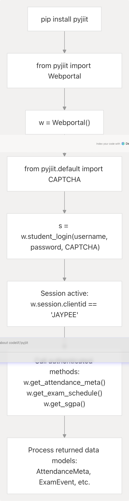
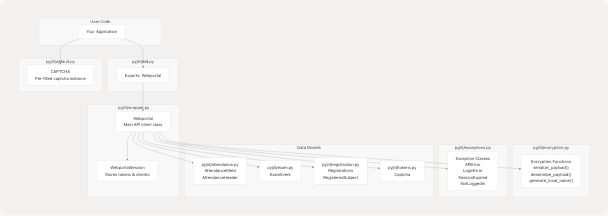

# Getting Started

- [docs/usage.rst](https://github.com/codelif/pyjiit/blob/0fe02955/docs/usage.rst)
- [poetry.lock](https://github.com/codelif/pyjiit/blob/0fe02955/poetry.lock)
- [pyproject.toml](https://github.com/codelif/pyjiit/blob/0fe02955/pyproject.toml)

This page provides an overview of how to install pyjiit, understand its core components, and make your first API calls to the JIIT Webportal. It introduces the basic workflow and concepts needed to use the library effectively.

For detailed installation instructions and dependency management, see [Installation](/codelif/pyjiit/2.1-installation). For a comprehensive walkthrough with complete code examples, see [Quick Start Guide](/codelif/pyjiit/2.2-quick-start-guide). For in-depth coverage of the authentication process, see [Authentication Flow](/codelif/pyjiit/2.3-authentication-flow).

---

## Overview

The pyjiit library provides a Python interface to the JIIT Webportal APIs, enabling programmatic access to student information including attendance, exam schedules, registration data, and account management. The library handles the complex encryption requirements of the webportal API automatically.

**What you'll accomplish in this section:**

| Goal                           | Description                                                  |
| ------------------------------ | ------------------------------------------------------------ |
| **Install the library**        | Set up pyjiit using pip with proper dependencies             |
| **Understand core components** | Learn about `Webportal`, `WebportalSession`, and data models |
| **Authenticate**               | Log in using credentials and obtain a session                |
| **Make API calls**             | Retrieve student data such as attendance or exam schedules   |
| **Handle errors**              | Understand the exception hierarchy for proper error handling |

---

## Prerequisites

Before installing pyjiit, ensure your system meets the following requirements:

| Requirement               | Specification                                       |
| ------------------------- | --------------------------------------------------- |
| **Python version**        | >= 3.9                                              |
| **Core dependencies**     | `requests` (>=2.32.3), `pycryptodome` (>=3.22.0)    |
| **Internet connectivity** | Required for API calls to webportal.jiit.ac.in:6011 |

The library uses Poetry for dependency management, but end users install via pip from PyPI.

**Sources:** [pyproject.toml8-12](https://github.com/codelif/pyjiit/blob/0fe02955/pyproject.toml#L8-L12)

---

## Installation Overview

Install pyjiit from PyPI using pip:

```
pip install pyjiit
```

This installs the library and its two core dependencies:

- **`requests`**: HTTP client for API communication
- **`pycryptodome`**: AES-CBC encryption for secure payload transmission

The package is distributed through PyPI and can be installed in any Python 3.9+ environment. For detailed installation options, virtual environment setup, and troubleshooting, see [Installation](/codelif/pyjiit/2.1-installation).

**Sources:** [docs/usage.rst6-13](https://github.com/codelif/pyjiit/blob/0fe02955/docs/usage.rst#L6-L13) [pyproject.toml1-12](https://github.com/codelif/pyjiit/blob/0fe02955/pyproject.toml#L1-L12)

---

## Basic Usage Workflow

The following diagram illustrates the typical workflow from installation to making authenticated API calls:

### User Journey: Installation to First API Call



**Sources:** [docs/usage.rst16-44](https://github.com/codelif/pyjiit/blob/0fe02955/docs/usage.rst#L16-L44)

---

## Your First API Call

Here's a minimal working example demonstrating the core workflow:

```

from pyjiit import Webportal
from pyjiit.default import CAPTCHA

# Step 1: Instantiate the Webportal client

w = Webportal()

# Step 2: Authenticate with credentials

session = w.student_login(
username="your_enrollment_number",
password="your_password",
captcha=CAPTCHA # Pre-filled captcha object
)

# Step 3: Verify session is active

print(f"Client ID: {w.session.clientid}") # Output: JAYPEE

# Step 4: Make an authenticated API call

meta = w.get_attendance_meta()
print(f"Available semesters: {[s.value for s in meta.semesters]}")

```

This example demonstrates:

1. **Instantiation**: Creating a `Webportal` instance at [pyjiit/wrapper.py157-164](https://github.com/codelif/pyjiit/blob/0fe02955/pyjiit/wrapper.py#L157-L164)
2. **Authentication**: Calling `student_login()` which returns a `WebportalSession` at [pyjiit/wrapper.py166-246](https://github.com/codelif/pyjiit/blob/0fe02955/pyjiit/wrapper.py#L166-L246)
3. **Session verification**: Accessing the `session` attribute populated after login
4. **Data retrieval**: Calling authenticated methods that return structured data models

**Sources:** [docs/usage.rst30-44](https://github.com/codelif/pyjiit/blob/0fe02955/docs/usage.rst#L30-L44) [docs/usage.rst71-108](https://github.com/codelif/pyjiit/blob/0fe02955/docs/usage.rst#L71-L108)

---

## Core Components and Their Roles

Understanding the key classes and modules helps you navigate the library effectively:

### Component Architecture Map



**Key Classes:**

| Class/Module            | Location                                                                                                  | Purpose                                                   |
| ----------------------- | --------------------------------------------------------------------------------------------------------- | --------------------------------------------------------- |
| `Webportal`             | [pyjiit/wrapper.py157-803](https://github.com/codelif/pyjiit/blob/0fe02955/pyjiit/wrapper.py#L157-L803)   | Main API client; orchestrates all operations              |
| `WebportalSession`      | [pyjiit/wrapper.py50-155](https://github.com/codelif/pyjiit/blob/0fe02955/pyjiit/wrapper.py#L50-L155)     | Manages authentication state, tokens, and session data    |
| `serialize_payload()`   | [pyjiit/encryption.py49-61](https://github.com/codelif/pyjiit/blob/0fe02955/pyjiit/encryption.py#L49-L61) | Encrypts request payloads before sending to API           |
| `deserialize_payload()` | [pyjiit/encryption.py64-76](https://github.com/codelif/pyjiit/blob/0fe02955/pyjiit/encryption.py#L64-L76) | Decrypts API responses                                    |
| `AttendanceMeta`        | [pyjiit/attendance.py23-70](https://github.com/codelif/pyjiit/blob/0fe02955/pyjiit/attendance.py#L23-L70) | Represents attendance metadata with headers and semesters |
| `ExamEvent`             | [pyjiit/exam.py4-17](https://github.com/codelif/pyjiit/blob/0fe02955/pyjiit/exam.py#L4-L17)               | Represents individual exam schedule entries               |
| `CAPTCHA`               | [pyjiit/default.py5-10](https://github.com/codelif/pyjiit/blob/0fe02955/pyjiit/default.py#L5-L10)         | Pre-filled captcha object for authentication              |

**Sources:** [pyproject.toml1-12](https://github.com/codelif/pyjiit/blob/0fe02955/pyproject.toml#L1-L12) [docs/usage.rst19-28](https://github.com/codelif/pyjiit/blob/0fe02955/docs/usage.rst#L19-L28)

---

## Key Concepts

### Sessions and Authentication

Authentication in pyjiit involves a two-phase process:

1. **Pre-token check**: Validates credentials and captcha
2. **Token generation**: Creates session tokens and establishes connection

After successful authentication, the `Webportal.session` attribute contains a `WebportalSession` instance with:

- `clientid`: Institution identifier (typically `"JAYPEE"`)
- `token`: Authentication token for subsequent requests
- `refreshToken`: Token for session renewal

All authenticated methods use the `@authenticated` decorator to verify an active session before execution.

**See [Authentication Flow](/codelif/pyjiit/2.3-authentication-flow) for detailed coverage of the authentication process.**

### Encrypted Communication

All API requests and responses are encrypted using AES-CBC with daily key rotation:

- **Encryption key**: Generated daily at 00:00 IST using `generate_key()` at [pyjiit/encryption.py28-35](https://github.com/codelif/pyjiit/blob/0fe02955/pyjiit/encryption.py#L28-L35)
- **IV (Initialization Vector)**: Fixed value `b'dcek9wb8frty1pnm'` at [pyjiit/encryption.py26](https://github.com/codelif/pyjiit/blob/0fe02955/pyjiit/encryption.py#L26-L26)
- **LocalName header**: Unique per-request identifier at [pyjiit/encryption.py79-95](https://github.com/codelif/pyjiit/blob/0fe02955/pyjiit/encryption.py#L79-L95)

The encryption is transparent to users; all serialization/deserialization happens automatically within the `Webportal` class.

### Data Models

API responses are parsed into typed data model objects for structured access:

```

# Example: Attendance metadata
meta = w.get_attendance_meta()
# Returns: AttendanceMeta instance with .headers and .semesters attributes

# Example: Exam schedule
exams = w.get_exam_schedule()
# Returns: List[ExamEvent] with .subject_code, .exam_date, etc.

```

Each data model provides convenient methods like `latest_header()` and `latest_semester()` for common operations.

### Exception Handling

The library defines a hierarchy of exceptions for fine-grained error handling:

```
from pyjiit.exceptions import LoginError, SessionExpired, NotLoggedIn

try:
    session = w.student_login(username, password, captcha)
except LoginError as e:
    print(f"Authentication failed: {e}")

try:
    attendance = w.get_attendance(header, semester)
except SessionExpired:
    # Re-authenticate
    w.student_login(username, password, captcha)
except NotLoggedIn:
    # Login required before this call
    w.student_login(username, password, captcha)
```

**For comprehensive exception documentation, see [Exception Handling](/codelif/pyjiit/3.4-exception-handling).**

**Sources:** [docs/usage.rst138-142](https://github.com/codelif/pyjiit/blob/0fe02955/docs/usage.rst#L138-L142) [pyjiit/exceptions.py1-34](https://github.com/codelif/pyjiit/blob/0fe02955/pyjiit/exceptions.py#L1-L34)

---

## Method Categories

The `Webportal` class provides methods organized by functionality:

| Category                 | Example Methods                                    | Authentication Required                 |
| ------------------------ | -------------------------------------------------- | --------------------------------------- |
| **Authentication**       | `student_login()`, `set_password()`                | No (for login) / Yes (for set_password) |
| **Attendance**           | `get_attendance_meta()`, `get_attendance()`        | Yes                                     |
| **Exams**                | `get_exam_schedule()`, `get_exam_grade_history()`  | Yes                                     |
| **Registration**         | `get_registered_subjects_and_faculties()`          | Yes                                     |
| **Academic Performance** | `get_sgpa()`, `get_cgpa()`                         | Yes                                     |
| **Student Information**  | `get_student_bank_info()`, `get_parents_details()` | Yes                                     |

All authenticated methods will raise `NotLoggedIn` if called before `student_login()`.

**Sources:** [pyjiit/wrapper.py157-803](https://github.com/codelif/pyjiit/blob/0fe02955/pyjiit/wrapper.py#L157-L803)

---

## Quick Reference: Common Operations

### Retrieve Attendance

```
meta = w.get_attendance_meta()
header = meta.latest_header()
semester = meta.latest_semester()
attendance_data = w.get_attendance(header, semester)
```

**Note:** The `get_attendance()` call may take >10 seconds due to server-side processing.

### Get Exam Schedule

```
exams = w.get_exam_schedule()
for exam in exams:
    print(f"{exam.subject_desc}: {exam.exam_date} at {exam.exam_time}")
```

### Get Registered Subjects

```
semesters = w.get_registered_semesters()
registrations = w.get_registered_subjects_and_faculties(semesters[0])
print(f"Total credits: {registrations.total_credits}")
for subject in registrations.subjects:
    print(f"{subject.subject_code}: {subject.subject_desc}")
```

**Sources:** [docs/usage.rst71-133](https://github.com/codelif/pyjiit/blob/0fe02955/docs/usage.rst#L71-L133)

---

## Next Steps

Now that you understand the basic workflow, proceed to:

- **[Installation](/codelif/pyjiit/2.1-installation)** - Detailed installation instructions, virtual environments, and dependency management
- **[Quick Start Guide](/codelif/pyjiit/2.2-quick-start-guide)** - Complete walkthrough with multiple examples and best practices
- **[Authentication Flow](/codelif/pyjiit/2.3-authentication-flow)** - Deep dive into the two-phase authentication process and session management

For comprehensive API documentation, see:

- **[Webportal Class](/codelif/pyjiit/3.1-webportal-class)** - Complete method reference
- **[Data Models](/codelif/pyjiit/3.3-data-models)** - Detailed documentation of all data structures
- **[Exception Handling](/codelif/pyjiit/3.4-exception-handling)** - Exception hierarchy and error handling patterns

**Sources:** [docs/usage.rst1-145](https://github.com/codelif/pyjiit/blob/0fe02955/docs/usage.rst#L1-L145) [pyproject.toml1-28](https://github.com/codelif/pyjiit/blob/0fe02955/pyproject.toml#L1-L28)
