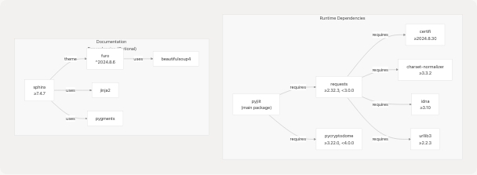
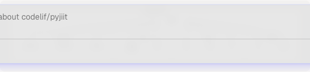

# Installation

- [README.rst](https://github.com/codelif/pyjiit/blob/0fe02955/README.rst)
- [poetry.lock](https://github.com/codelif/pyjiit/blob/0fe02955/poetry.lock)
- [pyproject.toml](https://github.com/codelif/pyjiit/blob/0fe02955/pyproject.toml)

This page explains how to install pyjiit on your system, including system requirements, installation methods, and dependency management. For information about using pyjiit after installation, see [Quick Start Guide](2.2-quick-start-guide). For details about the build system and contributing, see [Build System and Dependencies](5.2-build-system-and-dependencies).

---

## System Requirements

**Python Version**

pyjiit requires Python 3.9 or higher. This requirement is specified in [pyproject.toml8](https://github.com/codelif/pyjiit/blob/0fe02955/pyproject.toml#L8-L8) and enforced during installation.

| Requirement | Version | Source                                                                                  |
| ----------- | ------- | --------------------------------------------------------------------------------------- |
| Python      | ≥ 3.9   | [pyproject.toml8](https://github.com/codelif/pyjiit/blob/0fe02955/pyproject.toml#L8-L8) |

**Operating System**

pyjiit is platform-independent and runs on:

- Linux (all distributions)
- macOS (10.9+)
- Windows (32-bit and 64-bit)

The underlying dependencies (requests, pycryptodome) provide pre-built wheels for all major platforms, as evidenced by the multiple platform-specific builds in [poetry.lock1-714](https://github.com/codelif/pyjiit/blob/0fe02955/poetry.lock#L1-L714)

**Sources:** [pyproject.toml8](https://github.com/codelif/pyjiit/blob/0fe02955/pyproject.toml#L8-L8) [poetry.lock1-714](https://github.com/codelif/pyjiit/blob/0fe02955/poetry.lock#L1-L714)

---

## Installation via pip

### Standard Installation

The recommended installation method for end users is via pip from PyPI:

```
pip install pyjiit
```

This installs the latest stable release with all required runtime dependencies. The package is published to PyPI as `pyjiit` (see [pyproject.toml2](https://github.com/codelif/pyjiit/blob/0fe02955/pyproject.toml#L2-L2)).

### Installing a Specific Version

To install a specific version (e.g., the current version `0.1.0a8`):

```
pip install pyjiit==0.1.0a8
```

The version identifier is defined in [pyproject.toml3](https://github.com/codelif/pyjiit/blob/0fe02955/pyproject.toml#L3-L3)

### Upgrade Existing Installation

To upgrade to the latest version:

```
pip install --upgrade pyjiit
```

**Sources:** [pyproject.toml2-3](https://github.com/codelif/pyjiit/blob/0fe02955/pyproject.toml#L2-L3) [README.rst1-5](https://github.com/codelif/pyjiit/blob/0fe02955/README.rst#L1-L5)

---

## Installation via Poetry (Development)

### Prerequisites

Install Poetry if you haven't already:

```
pip install poetry
```

### Clone and Install

For development or contributing to pyjiit:

```
# Clone the repository
git clone https://github.com/codelif/pyjiit
cd pyjiit

# Install dependencies
poetry install
```

This creates a virtual environment and installs all dependencies locked in [poetry.lock1-714](https://github.com/codelif/pyjiit/blob/0fe02955/poetry.lock#L1-L714)

### Install with Documentation Dependencies

To build documentation locally, include the `docs` dependency group:

```
poetry install --with docs
```

This installs additional packages like Sphinx and Furo defined in [pyproject.toml19-21](https://github.com/codelif/pyjiit/blob/0fe02955/pyproject.toml#L19-L21)

**Sources:** [pyproject.toml19-21](https://github.com/codelif/pyjiit/blob/0fe02955/pyproject.toml#L19-L21) [poetry.lock1-714](https://github.com/codelif/pyjiit/blob/0fe02955/poetry.lock#L1-L714)

---

## Dependency Overview

### Dependency Tree Structure



**Sources:** [pyproject.toml9-12](https://github.com/codelif/pyjiit/blob/0fe02955/pyproject.toml#L9-L12) [pyproject.toml19-21](https://github.com/codelif/pyjiit/blob/0fe02955/pyproject.toml#L19-L21) [poetry.lock416-435](https://github.com/codelif/pyjiit/blob/0fe02955/poetry.lock#L416-L435)

### Runtime Dependencies

These are installed automatically with pyjiit:

| Package          | Version Constraint | Purpose                                  |
| ---------------- | ------------------ | ---------------------------------------- |
| **requests**     | ≥2.32.3, <3.0.0    | HTTP client for API communication        |
| **pycryptodome** | ≥3.22.0, <4.0.0    | AES encryption for payload serialization |

The version constraints are specified in [pyproject.toml9-12](https://github.com/codelif/pyjiit/blob/0fe02955/pyproject.toml#L9-L12)

#### Why pycryptodome (Not pycrypto)

The dependency explicitly uses `pycryptodome` rather than the older `pycrypto`. The `pycryptodome` package is a maintained fork that provides:

- Active security updates
- Python 3.9+ compatibility
- Pre-built wheels for all platforms

As noted in [README.rst34](https://github.com/codelif/pyjiit/blob/0fe02955/README.rst#L34-L34) this is an "explicit" choice "for very interesting reasons" — likely referring to the fact that the original `pycrypto` is unmaintained and has known security vulnerabilities.

**Sources:** [pyproject.toml9-12](https://github.com/codelif/pyjiit/blob/0fe02955/pyproject.toml#L9-L12) [README.rst30-37](https://github.com/codelif/pyjiit/blob/0fe02955/README.rst#L30-L37)

### Transitive Dependencies

The `requests` library brings in several transitive dependencies (automatically installed):

| Package              | Version    | Purpose                        |
| -------------------- | ---------- | ------------------------------ |
| `certifi`            | ≥2024.8.30 | Mozilla CA bundle for SSL/TLS  |
| `charset-normalizer` | ≥3.3.2     | Character encoding detection   |
| `idna`               | ≥3.10      | Internationalized domain names |
| `urllib3`            | ≥2.2.3     | HTTP connection pooling        |

These are documented in [poetry.lock416-435](https://github.com/codelif/pyjiit/blob/0fe02955/poetry.lock#L416-L435) and [poetry.lock54-163](https://github.com/codelif/pyjiit/blob/0fe02955/poetry.lock#L54-L163)

**Sources:** [poetry.lock54-163](https://github.com/codelif/pyjiit/blob/0fe02955/poetry.lock#L54-L163) [poetry.lock416-435](https://github.com/codelif/pyjiit/blob/0fe02955/poetry.lock#L416-L435)

### Documentation Dependencies (Optional)

These are only needed for building documentation and are not installed by default:

| Package  | Version   | Purpose                 |
| -------- | --------- | ----------------------- |
| `sphinx` | ≥7.4.7    | Documentation generator |
| `furo`   | ^2024.8.6 | Modern Sphinx theme     |

Defined in the `docs` dependency group at [pyproject.toml19-21](https://github.com/codelif/pyjiit/blob/0fe02955/pyproject.toml#L19-L21)

**Sources:** [pyproject.toml19-21](https://github.com/codelif/pyjiit/blob/0fe02955/pyproject.toml#L19-L21) [poetry.lock462-496](https://github.com/codelif/pyjiit/blob/0fe02955/poetry.lock#L462-L496)

---

## Dependency Installation Flow

### pip Installation Process

**Sources:** [pyproject.toml9-12](https://github.com/codelif/pyjiit/blob/0fe02955/pyproject.toml#L9-L12)

### Poetry Installation Process


**Sources:** [poetry.lock1-714](https://github.com/codelif/pyjiit/blob/0fe02955/poetry.lock#L1-L714) [pyproject.toml19-21](https://github.com/codelif/pyjiit/blob/0fe02955/pyproject.toml#L19-L21)

---

## Platform-Specific Wheels

The `pycryptodome` and `requests` dependencies provide pre-compiled wheels for multiple platforms, ensuring fast installation without requiring C compilers:

### pycryptodome Platform Coverage



The wheel files are enumerated in [poetry.lock362-398](https://github.com/codelif/pyjiit/blob/0fe02955/poetry.lock#L362-L398) covering all major platforms and architectures.

**Sources:** [poetry.lock362-398](https://github.com/codelif/pyjiit/blob/0fe02955/poetry.lock#L362-L398)

---

## Verifying Installation

### Check Installed Version

After installation, verify that pyjiit is correctly installed:

```

python -c "import pyjiit; print(pyjiit.__version__)"

```

This should print the installed version (e.g., `0.1.0a8`).

### Check Dependencies

Verify that required dependencies are available:

```
python -c "import requests; import Crypto; print('Dependencies OK')"
```

Note: `pycryptodome` is imported as `Crypto` (the namespace it provides).

### List All Dependencies

To see all installed packages related to pyjiit:

```
pip show pyjiit

```

Or with Poetry:

```
poetry show --tree
```

**Sources:** [pyproject.toml2-3](https://github.com/codelif/pyjiit/blob/0fe02955/pyproject.toml#L2-L3)

---

## Dependency Locking

### Understanding poetry.lock

The [poetry.lock1-714](https://github.com/codelif/pyjiit/blob/0fe02955/poetry.lock#L1-L714) file locks all dependencies to exact versions with SHA256 hashes. This ensures:

1. **Reproducible Builds**: Same dependencies across all installations
2. **Security**: Hashes verify package integrity
3. **Stability**: No unexpected version updates

Example lock entry structure from [poetry.lock362-398](https://github.com/codelif/pyjiit/blob/0fe02955/poetry.lock#L362-L398):

```
[[package]]
name = "pycryptodome"
version = "3.22.0"
description = "Cryptographic library for Python"
files = [
    {file = "pycryptodome-3.22.0-...", hash = "sha256:..."},
    ...
]

```

### Lock File Maintenance

The lock file is automatically generated by Poetry and should be committed to version control. It is regenerated when:

- Dependencies are added/removed in `pyproject.toml`
- `poetry update` is run

**Sources:** [poetry.lock1-714](https://github.com/codelif/pyjiit/blob/0fe02955/poetry.lock#L1-L714) [poetry.lock710-713](https://github.com/codelif/pyjiit/blob/0fe02955/poetry.lock#L710-L713)

---

## Build System Configuration

The package uses Poetry as its build backend, configured in [pyproject.toml23-25](https://github.com/codelif/pyjiit/blob/0fe02955/pyproject.toml#L23-L25):

```
[build-system]
requires = ["poetry-core"]
build-backend = "poetry.core.masonry.api"
```

This configuration:

- Uses `poetry-core` (lightweight build backend)
- Implements PEP 517 build standards
- Enables `pip install` from source

When you run `pip install pyjiit`, pip automatically uses this build backend if installing from source rather than a wheel.

**Sources:** [pyproject.toml23-25](https://github.com/codelif/pyjiit/blob/0fe02955/pyproject.toml#L23-L25)

---

## Package Metadata

The package metadata defined in [pyproject.toml1-17](https://github.com/codelif/pyjiit/blob/0fe02955/pyproject.toml#L1-L17) includes:

| Field                  | Value                                                      |
| ---------------------- | ---------------------------------------------------------- |
| **Name**               | pyjiit                                                     |
| **Version**            | 0.1.0a8                                                    |
| **Description**        | Python wrapper for JIIT webportal                          |
| **License**            | MIT License                                                |
| **Author**             | Harsh Sharma ([harsh@codelif.in](mailto:harsh@codelif.in)) |
| **Python Requirement** | ≥3.9                                                       |
| **Homepage**           | <https://github.com/codelif/pyjiit>                        |
| **Issues**             | <https://github.com/codelif/pyjiit/issues>                 |

This metadata is used by:

- PyPI for package listing
- `pip show pyjiit` command
- Documentation generators

**Sources:** [pyproject.toml1-17](https://github.com/codelif/pyjiit/blob/0fe02955/pyproject.toml#L1-L17)

---

## Troubleshooting Installation

### Common Issues

**Issue: "Could not find a version that satisfies the requirement"**

Ensure you're using Python 3.9 or higher:

```
python --version

```

**Issue: "No module named 'Crypto'"**

The `pycryptodome` package wasn't installed correctly. Reinstall:

```
pip uninstall pycryptodome pycrypto
pip install pycryptodome
```

**Issue: Poetry installation hangs**

Clear Poetry cache and retry:

```
poetry cache clear pypi --all
poetry install
```

### Platform-Specific Notes

**Windows**: Some older Python installations may require Visual C++ Build Tools if wheels aren't available. However, `pycryptodome` provides pre-built wheels for Windows at [poetry.lock383-384](https://github.com/codelif/pyjiit/blob/0fe02955/poetry.lock#L383-L384)

**macOS**: Universal2 wheels (supporting both Intel and Apple Silicon) are available at [poetry.lock375-376](https://github.com/codelif/pyjiit/blob/0fe02955/poetry.lock#L375-L376)

**Linux (musl)**: For Alpine Linux and other musl-based distributions, dedicated wheels are available at [poetry.lock380-382](https://github.com/codelif/pyjiit/blob/0fe02955/poetry.lock#L380-L382)

**Sources:** [poetry.lock375-398](https://github.com/codelif/pyjiit/blob/0fe02955/poetry.lock#L375-L398)

---

## Next Steps

After successful installation:

1. **Quick Start**: See [Quick Start Guide](2.2-quick-start-guide) for your first API calls
2. **Authentication**: Learn about the login flow in [Authentication Flow](2.3-authentication-flow)
3. **API Reference**: Explore available methods in [Webportal Class](3.1-webportal-class)

For development setup and testing, see [Testing and Development Workflow](5.3-testing-and-development-workflow).

**Sources:** [README.rst1-47](https://github.com/codelif/pyjiit/blob/0fe02955/README.rst#L1-L47) [pyproject.toml1-28](https://github.com/codelif/pyjiit/blob/0fe02955/pyproject.toml#L1-L28)
