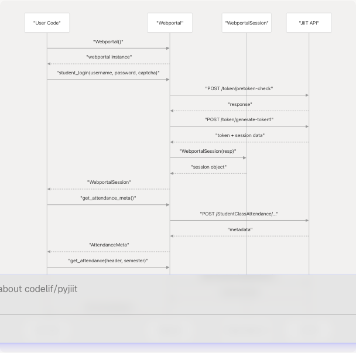

# Quick Start Guide

> Source: https://deepwiki.com/codelif/pyjiit/2.2-quick-start-guide

# Quick Start Guide

Relevant source files

* [docs/usage.rst](https://github.com/codelif/pyjiit/blob/0fe02955/docs/usage.rst)
* [pyjiit/default.py](https://github.com/codelif/pyjiit/blob/0fe02955/pyjiit/default.py)
* [pyjiit/exam.py](https://github.com/codelif/pyjiit/blob/0fe02955/pyjiit/exam.py)
* [pyjiit/registration.py](https://github.com/codelif/pyjiit/blob/0fe02955/pyjiit/registration.py)
* [pyjiit/tokens.py](https://github.com/codelif/pyjiit/blob/0fe02955/pyjiit/tokens.py)
* [pyjiit/wrapper.py](https://github.com/codelif/pyjiit/blob/0fe02955/pyjiit/wrapper.py)

## Purpose and Scope

This guide provides a practical walkthrough for using pyjiit: instantiating the library, authenticating with the JIIT Webportal, and making your first API calls to retrieve student data.

For installation instructions, see [Installation](/codelif/pyjiit/2.1-installation). For detailed authentication mechanics, see [Authentication Flow](/codelif/pyjiit/2.3-authentication-flow). For comprehensive API documentation, see [Core API Reference](/codelif/pyjiit/3-core-api-reference).

## Basic Workflow Overview

The typical pyjiit workflow consists of three steps:

1. **Instantiate** the `Webportal` class
2. **Authenticate** using `student_login()` with credentials and captcha
3. **Query data** using authenticated methods

The following diagram illustrates this workflow with actual method names:


```

Sources: [pyjiit/wrapper.py70-211](https://github.com/codelif/pyjiit/blob/0fe02955/pyjiit/wrapper.py#L70-L211) [docs/usage.rst16-108](https://github.com/codelif/pyjiit/blob/0fe02955/docs/usage.rst#L16-L108)

## Your First API Call

### Step 1: Import and Instantiate

Import the `Webportal` class and create an instance:

```
```
from pyjiit import Webportal

w = Webportal()
```
```

The `Webportal` class [pyjiit/wrapper.py70-78](https://github.com/codelif/pyjiit/blob/0fe02955/pyjiit/wrapper.py#L70-L78) is the main entry point. Upon instantiation, the `session` attribute is initialized to `None` until authentication succeeds.

Sources: [pyjiit/wrapper.py70-78](https://github.com/codelif/pyjiit/blob/0fe02955/pyjiit/wrapper.py#L70-L78) [docs/usage.rst16-27](https://github.com/codelif/pyjiit/blob/0fe02955/docs/usage.rst#L16-L27)

### Step 2: Authenticate

Authentication requires username, password, and a `Captcha` object. For development, use the pre-filled `CAPTCHA` constant:

```
```
from pyjiit import Webportal
from pyjiit.default import CAPTCHA

w = Webportal()
session = w.student_login("your_username", "your_password", CAPTCHA)

# Session is stored in w.session
print(w.session.clientid)  # Output: "JAYPEE"
print(w.session.name)      # Output: Student's full name
```
```

The `student_login()` method [pyjiit/wrapper.py111-143](https://github.com/codelif/pyjiit/blob/0fe02955/pyjiit/wrapper.py#L111-L143) performs two-phase authentication:

1. **Pretoken check**: Verifies credentials via `/token/pretoken-check`
2. **Token generation**: Obtains session token via `/token/generate-token1`
3. **Session creation**: Returns `WebportalSession` with authentication data

The `CAPTCHA` object from [pyjiit/default.py4-8](https://github.com/codelif/pyjiit/blob/0fe02955/pyjiit/default.py#L4-L8) bypasses the captcha requirement. This works because the JIIT webportal does not tie captcha validation to session state.

Sources: [pyjiit/wrapper.py111-143](https://github.com/codelif/pyjiit/blob/0fe02955/pyjiit/wrapper.py#L111-L143) [pyjiit/default.py4-8](https://github.com/codelif/pyjiit/blob/0fe02955/pyjiit/default.py#L4-L8) [docs/usage.rst30-53](https://github.com/codelif/pyjiit/blob/0fe02955/docs/usage.rst#L30-L53)

### Step 3: Access Session Information

The `WebportalSession` object [pyjiit/wrapper.py38-68](https://github.com/codelif/pyjiit/blob/0fe02955/pyjiit/wrapper.py#L38-L68) provides user and authentication data:

| Attribute | Description | Example |
| --- | --- | --- |
| `clientid` | Institution identifier | `"JAYPEE"` |
| `memberid` | Student ID | `"12345678"` |
| `token` | JWT authentication token | `"eyJhb..."` |
| `name` | Student full name | `"STUDENT NAME"` |
| `instituteid` | Institute identifier | `"JYPINST001"` |
| `expiry` | Token expiration datetime | `datetime(2024, ...)` |

Sources: [pyjiit/wrapper.py38-68](https://github.com/codelif/pyjiit/blob/0fe02955/pyjiit/wrapper.py#L38-L68)

## Fetching Student Data

### Example: Retrieving Attendance

Attendance requires two API calls: metadata retrieval, then actual attendance data:

```
```
from pyjiit import Webportal
from pyjiit.default import CAPTCHA

# Authenticate
w = Webportal()
w.student_login("username", "password", CAPTCHA)

# Step 1: Get attendance metadata
meta = w.get_attendance_meta()

# Step 2: Select header and semester
header = meta.latest_header()
semester = meta.latest_semester()

# Step 3: Fetch attendance data (may take >10 seconds)
attendance = w.get_attendance(header, semester)

# Structure:
# {
#   'currentSem': '1',
#   'studentattendancelist': [
#     {
#       'LTpercantage': 83.3,
#       'Lpercentage': 92.9,
#       'subjectcode': 'SUBJECT123',
#       ...
#     },
#     ...
#   ]
# }
```
```

**Method Details:**

* `get_attendance_meta()` [pyjiit/wrapper.py172-188](https://github.com/codelif/pyjiit/blob/0fe02955/pyjiit/wrapper.py#L172-L188) returns `AttendanceMeta` containing:
  + `headers`: List of `AttendanceHeader` objects (course identifiers)
  + `semesters`: List of `Semester` objects
* `get_attendance()` [pyjiit/wrapper.py190-211](https://github.com/codelif/pyjiit/blob/0fe02955/pyjiit/wrapper.py#L190-L211) accepts `AttendanceHeader` and `Semester`, returns dictionary with attendance records

**Performance Note**: The `get_attendance()` call may take over 10 seconds due to server-side processing [docs/usage.rst105-107](https://github.com/codelif/pyjiit/blob/0fe02955/docs/usage.rst#L105-L107)

Sources: [pyjiit/wrapper.py172-211](https://github.com/codelif/pyjiit/blob/0fe02955/pyjiit/wrapper.py#L172-L211) [docs/usage.rst71-108](https://github.com/codelif/pyjiit/blob/0fe02955/docs/usage.rst#L71-L108)

### Example: Retrieving Registered Subjects

Fetch subjects and faculty information for a semester:

```
```
# Get list of registered semesters
semesters = w.get_registered_semesters()

# Select latest semester
latest_sem = semesters[0]

# Get registered subjects
registrations = w.get_registered_subjects_and_faculties(latest_sem)

# Access subject details
for subject in registrations.subjects:
    print(f"{subject.subject_code}: {subject.subject_desc}")
    print(f"  Faculty: {subject.employee_name}")
    print(f"  Credits: {subject.credits}")

# Get total credits
print(f"Total credits: {registrations.total_credits}")
```
```

**Method Details:**

* `get_registered_semesters()` [pyjiit/wrapper.py232-249](https://github.com/codelif/pyjiit/blob/0fe02955/pyjiit/wrapper.py#L232-L249) returns list of `Semester` objects
* `get_registered_subjects_and_faculties()` [pyjiit/wrapper.py251-269](https://github.com/codelif/pyjiit/blob/0fe02955/pyjiit/wrapper.py#L251-L269) returns `Registrations` object [pyjiit/registration.py36-42](https://github.com/codelif/pyjiit/blob/0fe02955/pyjiit/registration.py#L36-L42) containing:
  + `subjects`: List of `RegisteredSubject` objects with faculty/course details
  + `total_credits`: Total credit points

Sources: [pyjiit/wrapper.py232-269](https://github.com/codelif/pyjiit/blob/0fe02955/pyjiit/wrapper.py#L232-L269) [pyjiit/registration.py1-43](https://github.com/codelif/pyjiit/blob/0fe02955/pyjiit/registration.py#L1-L43) [docs/usage.rst111-137](https://github.com/codelif/pyjiit/blob/0fe02955/docs/usage.rst#L111-L137)

## Key Classes and Data Models

The following diagram maps the primary classes used in typical workflows:

```

```

Sources: [pyjiit/wrapper.py70-143](https://github.com/codelif/pyjiit/blob/0fe02955/pyjiit/wrapper.py#L70-L143) [pyjiit/tokens.py4-28](https://github.com/codelif/pyjiit/blob/0fe02955/pyjiit/tokens.py#L4-L28) [pyjiit/registration.py1-43](https://github.com/codelif/pyjiit/blob/0fe02955/pyjiit/registration.py#L1-L43) [pyjiit/exam.py1-23](https://github.com/codelif/pyjiit/blob/0fe02955/pyjiit/exam.py#L1-L23)

## Authentication Decorator

All methods requiring authentication use the `@authenticated` decorator [pyjiit/wrapper.py19-36](https://github.com/codelif/pyjiit/blob/0fe02955/pyjiit/wrapper.py#L19-L36):

```
```
@authenticated
def get_attendance_meta(self):
    # Method implementation
```
```

This decorator enforces:

1. Session existence (raises `NotLoggedIn` if `self.session is None`)
2. Method called only after successful `student_login()`

Calling authenticated methods before login raises an exception:

```
```
from pyjiit import Webportal
from pyjiit.exceptions import NotLoggedIn

w = Webportal()
try:
    w.get_attendance_meta()  # Called before login
except NotLoggedIn:
    print("Must login first!")
```
```

Sources: [pyjiit/wrapper.py19-36](https://github.com/codelif/pyjiit/blob/0fe02955/pyjiit/wrapper.py#L19-L36) [docs/usage.rst139-142](https://github.com/codelif/pyjiit/blob/0fe02955/docs/usage.rst#L139-L142)

## Error Handling

Basic exception handling pattern:

```
```
from pyjiit import Webportal
from pyjiit.default import CAPTCHA
from pyjiit.exceptions import LoginError, NotLoggedIn, SessionExpired, APIError

w = Webportal()

try:
    w.student_login("username", "password", CAPTCHA)
except LoginError as e:
    print(f"Login failed: {e}")

try:
    attendance = w.get_attendance(header, semester)
except SessionExpired:
    print("Session expired, re-authenticating...")
    w.student_login("username", "password", CAPTCHA)
except NotLoggedIn:
    print("Must login before calling this method")
except APIError as e:
    print(f"API error: {e}")
```
```

Key exception types [pyjiit/exceptions.py](https://github.com/codelif/pyjiit/blob/0fe02955/pyjiit/exceptions.py):

| Exception | Trigger | Usage |
| --- | --- | --- |
| `LoginError` | Invalid credentials during `student_login()` | Authentication failures |
| `NotLoggedIn` | Authenticated method called before login | Session validation |
| `SessionExpired` | Token expired or HTTP 401 received | Re-authentication required |
| `APIError` | Generic API failure | Catch-all for API errors |

For complete exception documentation, see [Exception Handling](/codelif/pyjiit/3.4-exception-handling).

Sources: [pyjiit/wrapper.py8](https://github.com/codelif/pyjiit/blob/0fe02955/pyjiit/wrapper.py#L8-L8) [docs/usage.rst139-142](https://github.com/codelif/pyjiit/blob/0fe02955/docs/usage.rst#L139-L142)

## Common Method Reference

Frequently used `Webportal` methods:

| Method | Auth Required | Returns | Purpose |
| --- | --- | --- | --- |
| `student_login()` | No | `WebportalSession` | Authenticate and create session |
| `get_attendance_meta()` | Yes | `AttendanceMeta` | Fetch attendance metadata |
| `get_attendance()` | Yes | `dict` | Fetch attendance records |
| `get_registered_semesters()` | Yes | `list[Semester]` | List semesters with registrations |
| `get_registered_subjects_and_faculties()` | Yes | `Registrations` | Get subjects and faculty |
| `get_semesters_for_exam_events()` | Yes | `list[Semester]` | List semesters with exams |
| `get_exam_events()` | Yes | `list[ExamEvent]` | Get exam events |
| `get_exam_schedule()` | Yes | `dict` | Get exam schedule |
| `set_password()` | Yes | `None` | Change password |

For complete API reference, see [Webportal Class](/codelif/pyjiit/3.1-webportal-class).

Sources: [pyjiit/wrapper.py70-489](https://github.com/codelif/pyjiit/blob/0fe02955/pyjiit/wrapper.py#L70-L489)

## Complete Working Example

Full workflow demonstration:

```
```
from pyjiit import Webportal
from pyjiit.default import CAPTCHA
from pyjiit.exceptions import LoginError, APIError

def main():
    w = Webportal()

    try:
        # Authenticate
        print("Logging in...")
        session = w.student_login("your_username", "your_password", CAPTCHA)
        print(f"Logged in as: {session.name}")
        print(f"Client ID: {session.clientid}")

        # Get attendance
        print("\nFetching attendance...")
        meta = w.get_attendance_meta()
        header = meta.latest_header()
        semester = meta.latest_semester()

        attendance_data = w.get_attendance(header, semester)
        print(f"Attendance records: {len(attendance_data['studentattendancelist'])}")

        # Get registered subjects
        print("\nFetching registered subjects...")
        semesters = w.get_registered_semesters()
        latest_sem = semesters[0]

        registrations = w.get_registered_subjects_and_faculties(latest_sem)
        print(f"Total subjects: {len(registrations.subjects)}")
        print(f"Total credits: {registrations.total_credits}")

        for subject in registrations.subjects[:3]:
            print(f"  - {subject.subject_code}: {subject.subject_desc}")

    except LoginError as e:
        print(f"Login failed: {e}")
    except APIError as e:
        print(f"API error: {e}")

if __name__ == "__main__":
    main()
```

Sources: [pyjiit/wrapper.py70-489](https://github.com/codelif/pyjiit/blob/0fe02955/pyjiit/wrapper.py#L70-L489) [docs/usage.rst1-145](https://github.com/codelif/pyjiit/blob/0fe02955/docs/usage.rst#L1-L145)

## Next Steps

After completing this guide:

* **Authentication details**: See [Authentication Flow](/codelif/pyjiit/2.3-authentication-flow) for two-phase authentication and captcha mechanics
* **Complete API documentation**: See [Webportal Class](/codelif/pyjiit/3.1-webportal-class) for all methods
* **Data model reference**: See [Data Models](/codelif/pyjiit/3.3-data-models) for detailed return type information
* **Error handling strategies**: See [Exception Handling](/codelif/pyjiit/3.4-exception-handling) for all exception types
* **Security information**: See [Security and Encryption](/codelif/pyjiit/4-security-and-encryption) for encryption system details

Sources: [pyjiit/wrapper.py](https://github.com/codelif/pyjiit/blob/0fe02955/pyjiit/wrapper.py) [docs/usage.rst](https://github.com/codelif/pyjiit/blob/0fe02955/docs/usage.rst)