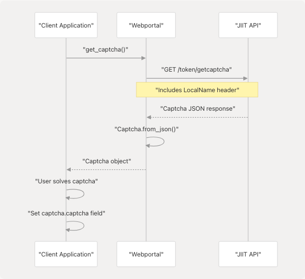
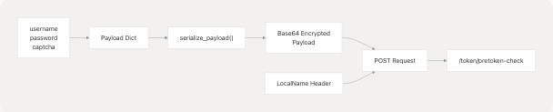
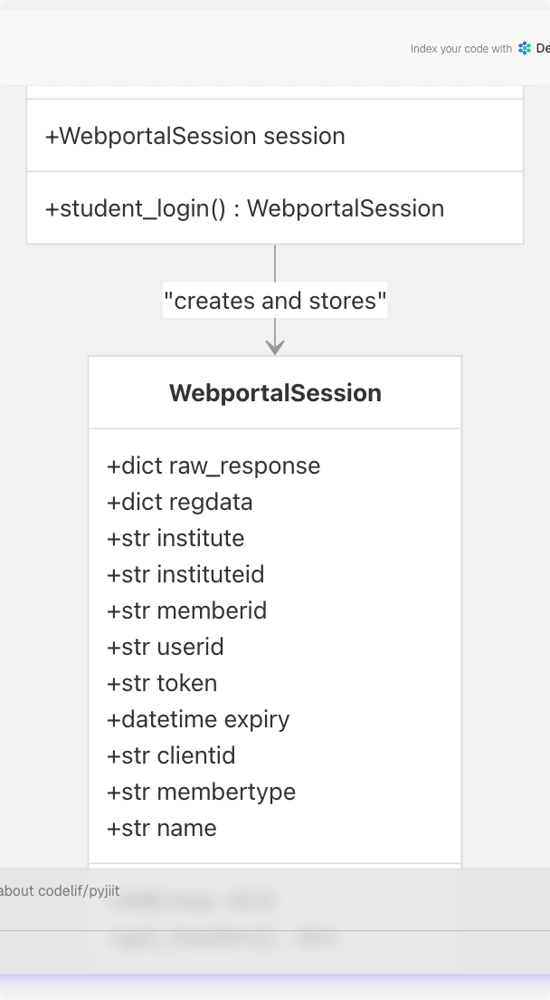
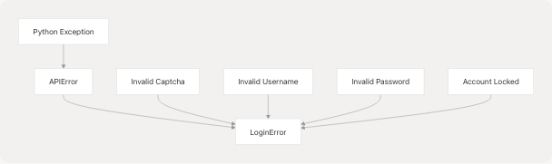
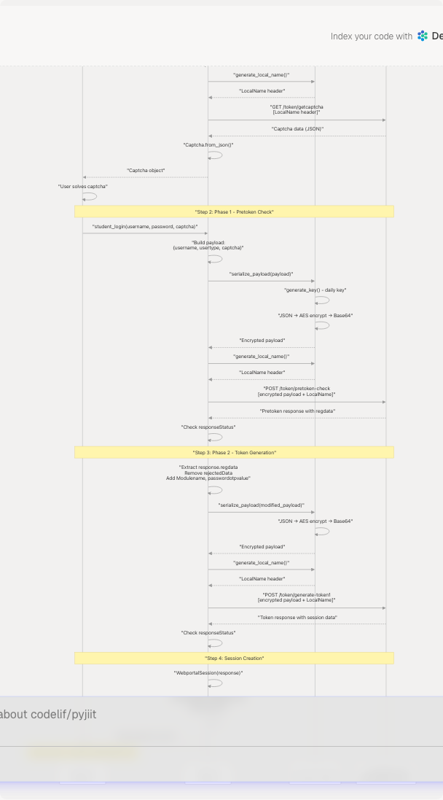

# Authentication Flow

## Purpose and Scope

This document details the two-phase authentication mechanism used to establish a session with the JIIT Webportal API. It covers captcha acquisition, credential validation, token generation, and session initialization.

For information about managing active sessions and making authenticated API calls, see [Session Management](/codelif/pyjiit/3.2-session-management). For details on the encryption used during authentication, see [Encryption System](/codelif/pyjiit/4.1-encryption-system).

---

## Overview

The JIIT Webportal API employs a **two-phase authentication process** that requires:

1. **Phase 1 (Pretoken Check)**: Username and captcha validation via `/token/pretoken-check`
2. **Phase 2 (Token Generation)**: Password validation and session token creation via `/token/generate-token1`

Both phases require encrypted payloads and the `LocalName` header. The process is implemented in the `Webportal.student_login()` method.

**Sources:** [pyjiit/wrapper.py111-143](https://github.com/codelif/pyjiit/blob/0fe02955/pyjiit/wrapper.py#L111-L143)

---

## Captcha Acquisition

Before authentication can begin, a valid captcha must be obtained from the API.

### Captcha Structure

The `Captcha` class encapsulates three fields:

| Field | Type | Description |
| --- | --- | --- |
| `captcha` | `str` | The captcha answer string |
| `hidden` | `str` | Base64-encoded captcha identifier |
| `image` | `str` | Base64-encoded PNG image of the captcha |

### Obtaining a Captcha


```

The `Webportal.get_captcha()` method retrieves a captcha object with an empty `captcha` field. The application must present the base64 image to the user and populate the `captcha` field with the user's answer before proceeding to authentication.

**Sources:** [pyjiit/wrapper.py145-154](https://github.com/codelif/pyjiit/blob/0fe02955/pyjiit/wrapper.py#L145-L154) [pyjiit/tokens.py4-27](https://github.com/codelif/pyjiit/blob/0fe02955/pyjiit/tokens.py#L4-L27)

---

## Phase 1: Pretoken Check

The first authentication phase validates the username, user type, and captcha.

### Request Construction



The payload dictionary contains:

```
{
    "username": <username>,
    "usertype": "S",  // S = Student
    "captcha": {
        "captcha": <answer>,
        "hidden": <id>
    }
}
```

This payload is encrypted using `serialize_payload()` from [pyjiit/encryption.py39-44](https://github.com/codelif/pyjiit/blob/0fe02955/pyjiit/encryption.py#L39-L44) which:

1. Converts the dictionary to JSON
2. Encrypts with AES-CBC using a daily-rotated key
3. Base64-encodes the result

### Response Processing

The API returns an encrypted response containing registration data. The response structure includes:

* **regdata**: Registration information needed for Phase 2
* **rejectedData**: Unused field that must be removed before Phase 2

The `Webportal.__hit()` method handles the HTTP request and validates the response status. If the `responseStatus` is not `"Success"`, a `LoginError` exception is raised.

**Sources:** [pyjiit/wrapper.py111-130](https://github.com/codelif/pyjiit/blob/0fe02955/pyjiit/wrapper.py#L111-L130) [pyjiit/encryption.py39-44](https://github.com/codelif/pyjiit/blob/0fe02955/pyjiit/encryption.py#L39-L44) [test\_signin.py15-34](https://github.com/codelif/pyjiit/blob/0fe02955/test_signin.py#L15-L34)

---

## Phase 2: Token Generation

The second phase validates the password and generates the authentication token.

### Request Construction

The Phase 2 payload is built from the Phase 1 response:


The modified payload contains:

* All fields from Phase 1's `response` object (except `rejectedData`)
* `Modulename`: Set to `"STUDENTMODULE"`
* `passwordotpvalue`: The user's password

This payload is encrypted and sent with a fresh `LocalName` header to `/token/generate-token1`.

### Response Structure

On successful authentication, the response contains a `response` object with:

| Field | Description |
| --- | --- |
| `regdata` | Complete registration data including token |
| `token` | JWT token for authenticated requests |
| `memberid` | Student identifier |
| `userid` | User identifier |
| `clientid` | Client identifier |
| `membertype` | User type identifier |
| `institutelist` | Array with institute information |

**Sources:** [pyjiit/wrapper.py132-143](https://github.com/codelif/pyjiit/blob/0fe02955/pyjiit/wrapper.py#L132-L143) [test\_signin.py36-48](https://github.com/codelif/pyjiit/blob/0fe02955/test_signin.py#L36-L48)

---

## Session Creation

Upon successful Phase 2 completion, a `WebportalSession` object is instantiated and stored in `Webportal.session`.

### WebportalSession Initialization



The `WebportalSession` constructor [pyjiit/wrapper.py38-59](https://github.com/codelif/pyjiit/blob/0fe02955/pyjiit/wrapper.py#L38-L59) performs the following:

1. **Stores raw response** in `raw_response`
2. **Extracts regdata** from response
3. **Parses institute information** from `institutelist[0]`
4. **Extracts identifiers**: `memberid`, `userid`, `clientid`, `membertype`, `name`
5. **Decodes JWT token** to extract expiry timestamp:
   * Splits token by `.` to get payload segment
   * Base64 decodes the payload
   * Parses JSON to extract `exp` claim
   * Converts Unix timestamp to `datetime` object

### Session Headers

The `get_headers()` method [pyjiit/wrapper.py61-68](https://github.com/codelif/pyjiit/blob/0fe02955/pyjiit/wrapper.py#L61-L68) returns headers required for authenticated requests:

```
{
    "Authorization": "Bearer <token>",
    "LocalName": <encrypted_random_string>
}
```

The `LocalName` header is regenerated for each request using `generate_local_name()`, which creates a unique encrypted identifier based on random characters and the current date sequence.

**Sources:** [pyjiit/wrapper.py38-68](https://github.com/codelif/pyjiit/blob/0fe02955/pyjiit/wrapper.py#L38-L68)

---

## Authentication Error Handling

The authentication process can fail at multiple points, each raising specific exceptions.

### Exception Types



### Error Scenarios

| Scenario | Phase | Exception | Cause |
| --- | --- | --- | --- |
| Invalid captcha | Phase 1 | `LoginError` | Incorrect captcha answer |
| Invalid username | Phase 1 | `LoginError` | Username not found |
| Invalid password | Phase 2 | `LoginError` | Incorrect password |
| API communication error | Either | `LoginError` | Network or server issue |

The `Webportal.__hit()` method [pyjiit/wrapper.py82-108](https://github.com/codelif/pyjiit/blob/0fe02955/pyjiit/wrapper.py#L82-L108) centralizes error handling:

1. Checks if `resp["status"]` is an integer `401` → raises `SessionExpired`
2. Checks if `resp["status"]["responseStatus"] != "Success"` → raises the specified exception

For `student_login()`, the exception parameter is set to `LoginError` [pyjiit/wrapper.py130-139](https://github.com/codelif/pyjiit/blob/0fe02955/pyjiit/wrapper.py#L130-L139) ensuring authentication failures are properly typed.

**Sources:** [pyjiit/wrapper.py82-143](https://github.com/codelif/pyjiit/blob/0fe02955/pyjiit/wrapper.py#L82-L143) [pyjiit/exceptions.py](https://github.com/codelif/pyjiit/blob/0fe02955/pyjiit/exceptions.py)

---

## Complete Authentication Flow



**Sources:** [pyjiit/wrapper.py111-143](https://github.com/codelif/pyjiit/blob/0fe02955/pyjiit/wrapper.py#L111-L143) [pyjiit/wrapper.py38-68](https://github.com/codelif/pyjiit/blob/0fe02955/pyjiit/wrapper.py#L38-L68) [pyjiit/encryption.py13-44](https://github.com/codelif/pyjiit/blob/0fe02955/pyjiit/encryption.py#L13-L44) [test\_signin.py1-52](https://github.com/codelif/pyjiit/blob/0fe02955/test_signin.py#L1-L52)

---

## Implementation Details

### Method Signature

The `student_login()` method signature [pyjiit/wrapper.py111-117](https://github.com/codelif/pyjiit/blob/0fe02955/pyjiit/wrapper.py#L111-L117):

```
def student_login(self, username: str, password: str, captcha: Captcha) -> WebportalSession
```

**Parameters:**

* `username`: Student username (typically enrollment number)
* `password`: Student password
* `captcha`: Completed `Captcha` object with solved answer

**Returns:** `WebportalSession` object containing authentication token and user information

**Raises:** `LoginError` for any authentication failure

### Internal Request Handler

The `__hit()` method [pyjiit/wrapper.py82-108](https://github.com/codelif/pyjiit/blob/0fe02955/pyjiit/wrapper.py#L82-L108) is a private method that:

1. **Determines exception type** from kwargs (defaults to `APIError`)
2. **Manages headers**:
   * If `authenticated=True` kwarg: uses `session.get_headers()`
   * Otherwise: generates standalone `LocalName` header
3. **Makes HTTP request** via `requests.request()`
4. **Validates response**:
   * HTTP 401 status → raises `SessionExpired`
   * `responseStatus != "Success"` → raises specified exception
5. **Returns response** dictionary if successful

For authentication, the method is called without `authenticated=True`, so it generates a new `LocalName` header for each phase.

### API Endpoint Constants

The base API URL is defined as a module constant [pyjiit/wrapper.py17](https://github.com/codelif/pyjiit/blob/0fe02955/pyjiit/wrapper.py#L17-L17):

```
API = "https://webportal.jiit.ac.in:6011/StudentPortalAPI"
```

Authentication endpoints:

* Captcha: `GET /token/getcaptcha`
* Phase 1: `POST /token/pretoken-check`
* Phase 2: `POST /token/generate-token1`

**Sources:** [pyjiit/wrapper.py17-143](https://github.com/codelif/pyjiit/blob/0fe02955/pyjiit/wrapper.py#L17-L143)

---

## Usage Example

```
```
from pyjiit import Webportal

# Initialize webportal client
webportal = Webportal()

# Step 1: Get captcha
captcha = webportal.get_captcha()
# Display captcha.image to user and get answer
captcha.captcha = "cfmab"  # User's answer

# Step 2: Authenticate
try:
    session = webportal.student_login(
        username="21BCS1234",
        password="mypassword",
        captcha=captcha
    )
    print(f"Logged in as: {session.name}")
    print(f"Token expires: {session.expiry}")
except LoginError as e:
    print(f"Login failed: {e}")
```

Once `student_login()` succeeds, the `Webportal` instance's `session` attribute is set, enabling all `@authenticated` methods to be called (see [Session Management](/codelif/pyjiit/3.2-session-management)).

**Sources:** [pyjiit/wrapper.py111-143](https://github.com/codelif/pyjiit/blob/0fe02955/pyjiit/wrapper.py#L111-L143) [pyjiit/wrapper.py19-36](https://github.com/codelif/pyjiit/blob/0fe02955/pyjiit/wrapper.py#L19-L36)
