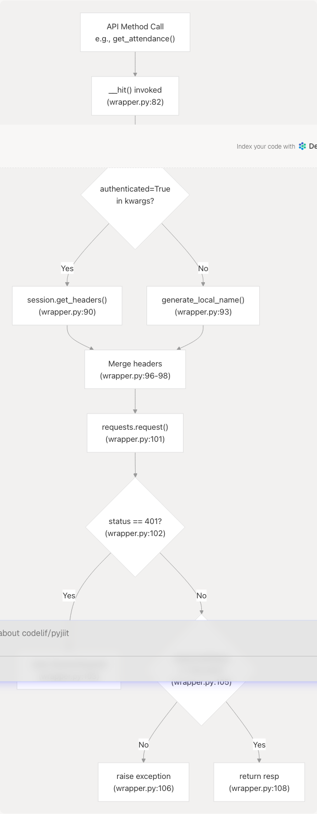
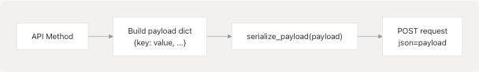
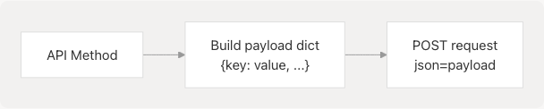

# Core API Reference

This document provides a comprehensive reference for the core API components of pyjiit. It covers the `Webportal` class (the main API client), `WebportalSession` (session management), and the overall structure of API interactions with the JIIT Webportal backend.

For detailed information on authentication and login flow, see [Authentication Flow](/codelif/pyjiit/2.3-authentication-flow). For security and encryption details, see [Security and Encryption](/codelif/pyjiit/4-security-and-encryption). For specific data model structures, see the subsections under [Data Models](/codelif/pyjiit/3.3-data-models).

## Overview

The core API is implemented in [pyjiit/wrapper.py](https://github.com/codelif/pyjiit/blob/0fe02955/pyjiit/wrapper.py) The primary entry point is the `Webportal` class, which provides methods for all JIIT Webportal operations. After authentication via `student_login()`, a `WebportalSession` object maintains the session state and authorization tokens for subsequent API calls.

**Sources:** [pyjiit/wrapper.py1-489](https://github.com/codelif/pyjiit/blob/0fe02955/pyjiit/wrapper.py#L1-L489) [pyjiit/\_\_init\_\_.py1-3](https://github.com/codelif/pyjiit/blob/0fe02955/pyjiit/__init__.py#L1-L3)

## Core Class Hierarchy


```

**Sources:** [pyjiit/wrapper.py1-489](https://github.com/codelif/pyjiit/blob/0fe02955/pyjiit/wrapper.py#L1-L489) [pyjiit/\_\_init\_\_.py1-3](https://github.com/codelif/pyjiit/blob/0fe02955/pyjiit/__init__.py#L1-L3)

## Webportal Class

The `Webportal` class at [pyjiit/wrapper.py70-489](https://github.com/codelif/pyjiit/blob/0fe02955/pyjiit/wrapper.py#L70-L489) is the main API client. It manages the session lifecycle and provides methods for all webportal operations.

### Initialization

```
# No parameters required
webportal = Webportal()
```

The constructor [pyjiit/wrapper.py76-77](https://github.com/codelif/pyjiit/blob/0fe02955/pyjiit/wrapper.py#L76-L77) initializes with `self.session = None`. The session is populated after successful authentication via `student_login()`.

**Sources:** [pyjiit/wrapper.py70-77](https://github.com/codelif/pyjiit/blob/0fe02955/pyjiit/wrapper.py#L70-L77)

### Internal Request Handler: `__hit()`

The `__hit()` method at [pyjiit/wrapper.py82-108](https://github.com/codelif/pyjiit/blob/0fe02955/pyjiit/wrapper.py#L82-L108) is the internal HTTP request handler used by all API methods. It centralizes:

| Responsibility | Implementation |
| --- | --- |
| **Header Management** | Injects `LocalName` header (unauthenticated) or full auth headers (authenticated) |
| **Request Execution** | Delegates to `requests.request()` with provided arguments |
| **Session Validation** | Checks for HTTP 401 status, raises `SessionExpired` |
| **Response Validation** | Checks `responseStatus`, raises custom exceptions on failure |
| **Exception Customization** | Accepts `exception` kwarg to specify which exception type to raise |



**Sources:** [pyjiit/wrapper.py82-108](https://github.com/codelif/pyjiit/blob/0fe02955/pyjiit/wrapper.py#L82-L108)

### Authentication Decorator

The `@authenticated` decorator at [pyjiit/wrapper.py19-36](https://github.com/codelif/pyjiit/blob/0fe02955/pyjiit/wrapper.py#L19-L36) enforces session validation before method execution:

```
def authenticated(method):
    @wraps(method)
    def wrapper(self, *args, **kwargs):
        if self.session is None:
            raise NotLoggedIn
        return method(self, *args, **kwargs)
    return wrapper
```

All methods requiring authentication are decorated with `@authenticated`. If called without a valid session, they raise `NotLoggedIn` immediately.

**Sources:** [pyjiit/wrapper.py19-36](https://github.com/codelif/pyjiit/blob/0fe02955/pyjiit/wrapper.py#L19-L36)

## WebportalSession Class

The `WebportalSession` class at [pyjiit/wrapper.py38-68](https://github.com/codelif/pyjiit/blob/0fe02955/pyjiit/wrapper.py#L38-L68) encapsulates session state after successful login.

### Session Attributes

| Attribute | Type | Source | Description |
| --- | --- | --- | --- |
| `raw_response` | dict | [wrapper.py43](https://github.com/codelif/pyjiit/blob/0fe02955/wrapper.py#L43-L43) | Complete raw API response |
| `regdata` | dict | [wrapper.py44](https://github.com/codelif/pyjiit/blob/0fe02955/wrapper.py#L44-L44) | Registration data dictionary |
| `institute` | str | [wrapper.py47](https://github.com/codelif/pyjiit/blob/0fe02955/wrapper.py#L47-L47) | Institute name (label) |
| `instituteid` | str | [wrapper.py48](https://github.com/codelif/pyjiit/blob/0fe02955/wrapper.py#L48-L48) | Institute ID (value) |
| `memberid` | str | [wrapper.py49](https://github.com/codelif/pyjiit/blob/0fe02955/wrapper.py#L49-L49) | Student member ID |
| `userid` | str | [wrapper.py51](https://github.com/codelif/pyjiit/blob/0fe02955/wrapper.py#L51-L51) | User ID |
| `token` | str | [wrapper.py53](https://github.com/codelif/pyjiit/blob/0fe02955/wrapper.py#L53-L53) | JWT authentication token |
| `expiry` | datetime | [wrapper.py54-55](https://github.com/codelif/pyjiit/blob/0fe02955/wrapper.py#L54-L55) | Token expiration timestamp (decoded from JWT) |
| `clientid` | str | [wrapper.py57](https://github.com/codelif/pyjiit/blob/0fe02955/wrapper.py#L57-L57) | Client ID |
| `membertype` | str | [wrapper.py58](https://github.com/codelif/pyjiit/blob/0fe02955/wrapper.py#L58-L58) | Member type |
| `name` | str | [wrapper.py59](https://github.com/codelif/pyjiit/blob/0fe02955/wrapper.py#L59-L59) | Student name |

### get\_headers() Method

The `get_headers()` method at [pyjiit/wrapper.py61-68](https://github.com/codelif/pyjiit/blob/0fe02955/pyjiit/wrapper.py#L61-L68) generates HTTP headers required for authenticated requests:

```
{
    "Authorization": f"Bearer {self.token}",
    "LocalName": generate_local_name()
}
```

The `LocalName` header is regenerated for every request using the encryption module's `generate_local_name()` function.

**Sources:** [pyjiit/wrapper.py38-68](https://github.com/codelif/pyjiit/blob/0fe02955/pyjiit/wrapper.py#L38-L68)

## API Method Catalog

The following table categorizes all public API methods by functionality:

### Authentication Methods

| Method | Line | Parameters | Returns | Exception |
| --- | --- | --- | --- | --- |
| `student_login()` | [111-143](https://github.com/codelif/pyjiit/blob/0fe02955/111-143) | `username`, `password`, `captcha` | `WebportalSession` | `LoginError` |
| `get_captcha()` | [145-154](https://github.com/codelif/pyjiit/blob/0fe02955/145-154) | None | `Captcha` | `APIError` |

### Attendance Methods

| Method | Line | Parameters | Returns | Exception |
| --- | --- | --- | --- | --- |
| `get_attendance_meta()` | [173-188](https://github.com/codelif/pyjiit/blob/0fe02955/173-188) | None | `AttendanceMeta` | `APIError` |
| `get_attendance()` | [191-211](https://github.com/codelif/pyjiit/blob/0fe02955/191-211) | `header`, `semester` | dict | `APIError` |

### Registration Methods

| Method | Line | Parameters | Returns | Exception |
| --- | --- | --- | --- | --- |
| `get_registered_semesters()` | [233-249](https://github.com/codelif/pyjiit/blob/0fe02955/233-249) | None | list[`Semester`] | `APIError` |
| `get_registered_subjects_and_faculties()` | [252-269](https://github.com/codelif/pyjiit/blob/0fe02955/252-269) | `semester` | `Registrations` | `APIError` |
| `get_subject_choices()` | [473-488](https://github.com/codelif/pyjiit/blob/0fe02955/473-488) | `semester` | dict | `APIError` |

### Exam Methods

| Method | Line | Parameters | Returns | Exception |
| --- | --- | --- | --- | --- |
| `get_semesters_for_exam_events()` | [273-289](https://github.com/codelif/pyjiit/blob/0fe02955/273-289) | None | list[`Semester`] | `APIError` |
| `get_exam_events()` | [292-308](https://github.com/codelif/pyjiit/blob/0fe02955/292-308) | `semester` | list[`ExamEvent`] | `APIError` |
| `get_exam_schedule()` | [311-328](https://github.com/codelif/pyjiit/blob/0fe02955/311-328) | `exam_event` | dict | `APIError` |

### Marks and Grades Methods

| Method | Line | Parameters | Returns | Exception |
| --- | --- | --- | --- | --- |
| `get_semesters_for_marks()` | [331-346](https://github.com/codelif/pyjiit/blob/0fe02955/331-346) | None | list[`Semester`] | `APIError` |
| `download_marks()` | [349-367](https://github.com/codelif/pyjiit/blob/0fe02955/349-367) | `semester` | bytes (PDF) | `APIError` |
| `get_semesters_for_grade_card()` | [370-383](https://github.com/codelif/pyjiit/blob/0fe02955/370-383) | None | list[`Semester`] | `APIError` |
| `get_grade_card()` | [403-421](https://github.com/codelif/pyjiit/blob/0fe02955/403-421) | `semester` | dict | `APIError` |
| `get_sgpa_cgpa()` | [424-438](https://github.com/codelif/pyjiit/blob/0fe02955/424-438) | `stynumber` (optional) | dict | `APIError` |

### Fee Methods

| Method | Line | Parameters | Returns | Exception |
| --- | --- | --- | --- | --- |
| `get_fines_msc_charges()` | [441-456](https://github.com/codelif/pyjiit/blob/0fe02955/441-456) | None | dict | `APIError` |
| `get_fee_summary()` | [459-470](https://github.com/codelif/pyjiit/blob/0fe02955/459-470) | None | dict | `APIError` |

### Account Methods

| Method | Line | Parameters | Returns | Exception |
| --- | --- | --- | --- | --- |
| `set_password()` | [214-230](https://github.com/codelif/pyjiit/blob/0fe02955/214-230) | `old_pswd`, `new_pswd` | None | `AccountAPIError` |
| `get_student_bank_info()` | [157-170](https://github.com/codelif/pyjiit/blob/0fe02955/157-170) | None | dict | `APIError` |

**Sources:** [pyjiit/wrapper.py111-488](https://github.com/codelif/pyjiit/blob/0fe02955/pyjiit/wrapper.py#L111-L488)

## API Endpoint Mapping

This diagram maps public API methods to their corresponding JIIT Webportal backend endpoints:


**Sources:** [pyjiit/wrapper.py111-488](https://github.com/codelif/pyjiit/blob/0fe02955/pyjiit/wrapper.py#L111-L488)

## Request Payload Patterns

API methods use two payload patterns depending on the endpoint security requirements:

### Pattern 1: Encrypted Payload (serialize\_payload)

Used by methods requiring encryption, invoked via `serialize_payload()` from the encryption module:



**Methods using encrypted payloads:**

* `student_login()` [wrapper.py128-137](https://github.com/codelif/pyjiit/blob/0fe02955/wrapper.py#L128-L137)
* `get_attendance()` [wrapper.py207](https://github.com/codelif/pyjiit/blob/0fe02955/wrapper.py#L207-L207)
* `get_registered_semesters()` [wrapper.py244](https://github.com/codelif/pyjiit/blob/0fe02955/wrapper.py#L244-L244)
* `get_registered_subjects_and_faculties()` [wrapper.py265](https://github.com/codelif/pyjiit/blob/0fe02955/wrapper.py#L265-L265)
* `get_semesters_for_exam_events()` [wrapper.py285](https://github.com/codelif/pyjiit/blob/0fe02955/wrapper.py#L285-L285)
* `get_exam_events()` [wrapper.py304](https://github.com/codelif/pyjiit/blob/0fe02955/wrapper.py#L304-L304)
* `get_exam_schedule()` [wrapper.py324](https://github.com/codelif/pyjiit/blob/0fe02955/wrapper.py#L324-L324)
* `get_semesters_for_marks()` [wrapper.py342](https://github.com/codelif/pyjiit/blob/0fe02955/wrapper.py#L342-L342)
* `get_semesters_for_grade_card()` [wrapper.py379](https://github.com/codelif/pyjiit/blob/0fe02955/wrapper.py#L379-L379)
* `get_grade_card()` [wrapper.py419](https://github.com/codelif/pyjiit/blob/0fe02955/wrapper.py#L419-L419)
* `get_sgpa_cgpa()` [wrapper.py436](https://github.com/codelif/pyjiit/blob/0fe02955/wrapper.py#L436-L436)
* `get_fines_msc_charges()` [wrapper.py454](https://github.com/codelif/pyjiit/blob/0fe02955/wrapper.py#L454-L454)
* `get_subject_choices()` [wrapper.py486](https://github.com/codelif/pyjiit/blob/0fe02955/wrapper.py#L486-L486)

### Pattern 2: Plain JSON Payload

Used by methods where the backend accepts unencrypted JSON:



**Methods using plain JSON payloads:**

* `get_student_bank_info()` [wrapper.py164-168](https://github.com/codelif/pyjiit/blob/0fe02955/wrapper.py#L164-L168)
* `get_attendance_meta()` [wrapper.py180-186](https://github.com/codelif/pyjiit/blob/0fe02955/wrapper.py#L180-L186)
* `set_password()` [wrapper.py222-229](https://github.com/codelif/pyjiit/blob/0fe02955/wrapper.py#L222-L229)
* `get_fee_summary()` [wrapper.py466-469](https://github.com/codelif/pyjiit/blob/0fe02955/wrapper.py#L466-L469)

**Sources:** [pyjiit/wrapper.py111-488](https://github.com/codelif/pyjiit/blob/0fe02955/pyjiit/wrapper.py#L111-L488)

## Data Model Return Types


| Method | Return Type | Module | Description |
| --- | --- | --- | --- |
| `student_login()` | `WebportalSession` | [wrapper.py38](https://github.com/codelif/pyjiit/blob/0fe02955/wrapper.py#L38-L38) | Session object with auth tokens |
| `get_captcha()` | `Captcha` | tokens.py | Captcha challenge object |
| `get_attendance_meta()` | `AttendanceMeta` | attendance.py | Metadata for attendance queries |
| `get_registered_semesters()` | list[`Semester`] | attendance.py | Available semesters |
| `get_registered_subjects_and_faculties()` | `Registrations` | [registration.py36](https://github.com/codelif/pyjiit/blob/0fe02955/registration.py#L36-L36) | Subject and faculty information |
| `get_exam_events()` | list[`ExamEvent`] | [exam.py4](https://github.com/codelif/pyjiit/blob/0fe02955/exam.py#L4-L4) | Exam event information |
| `get_semesters_for_exam_events()` | list[`Semester`] | attendance.py | Semesters with exam events |
| `get_semesters_for_marks()` | list[`Semester`] | attendance.py | Semesters with marks data |
| `get_semesters_for_grade_card()` | list[`Semester`] | attendance.py | Semesters with grade cards |

Other methods return raw `dict` objects containing API response data.

**Sources:** [pyjiit/wrapper.py111-488](https://github.com/codelif/pyjiit/blob/0fe02955/pyjiit/wrapper.py#L111-L488) [pyjiit/exam.py1-23](https://github.com/codelif/pyjiit/blob/0fe02955/pyjiit/exam.py#L1-L23) [pyjiit/registration.py1-43](https://github.com/codelif/pyjiit/blob/0fe02955/pyjiit/registration.py#L1-L43)

## Exception Flow

```


### Exception Types by Method

| Method | Custom Exception | Line |
| --- | --- | --- |
| `student_login()` | `LoginError` | [130, 139](https://github.com/codelif/pyjiit/blob/0fe02955/130, 139) |
| `set_password()` | `AccountAPIError` | [229](https://github.com/codelif/pyjiit/blob/0fe02955/229) |
| All other authenticated methods | `APIError` (default) | [82-106](https://github.com/codelif/pyjiit/blob/0fe02955/82-106) |

**Sources:** [pyjiit/wrapper.py19-108](https://github.com/codelif/pyjiit/blob/0fe02955/pyjiit/wrapper.py#L19-L108)

## API Base URL

All API requests target the base URL defined at [pyjiit/wrapper.py17](https://github.com/codelif/pyjiit/blob/0fe02955/pyjiit/wrapper.py#L17-L17):

```
API = "https://webportal.jiit.ac.in:6011/StudentPortalAPI"
```

Each method appends its specific endpoint path to this base URL. For example:

* `get_attendance()` → `https://webportal.jiit.ac.in:6011/StudentPortalAPI/StudentClassAttendance/getstudentattendancedetail`

**Sources:** [pyjiit/wrapper.py17](https://github.com/codelif/pyjiit/blob/0fe02955/pyjiit/wrapper.py#L17-L17)

## Usage Summary

A typical API interaction flow:

1. **Initialize**: Create a `Webportal()` instance
2. **Get Captcha**: Call `get_captcha()` to retrieve a captcha challenge
3. **Authenticate**: Call `student_login(username, password, captcha)` to establish session
4. **Query Data**: Call authenticated methods like `get_attendance()`, `get_exam_schedule()`, etc.
5. **Handle Errors**: Catch `NotLoggedIn`, `SessionExpired`, `LoginError`, `APIError` as needed

For detailed usage examples, see [Quick Start Guide](/codelif/pyjiit/2.2-quick-start-guide).

**Sources:** [pyjiit/wrapper.py70-489](https://github.com/codelif/pyjiit/blob/0fe02955/pyjiit/wrapper.py#L70-L489)
