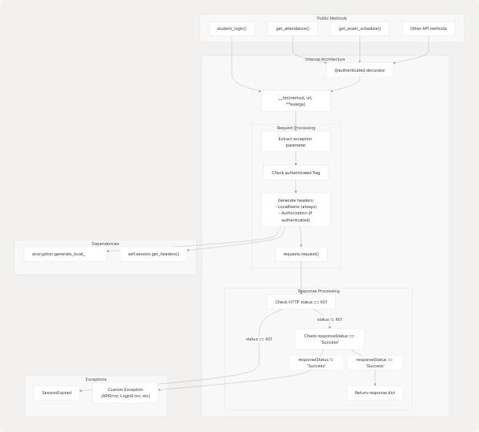
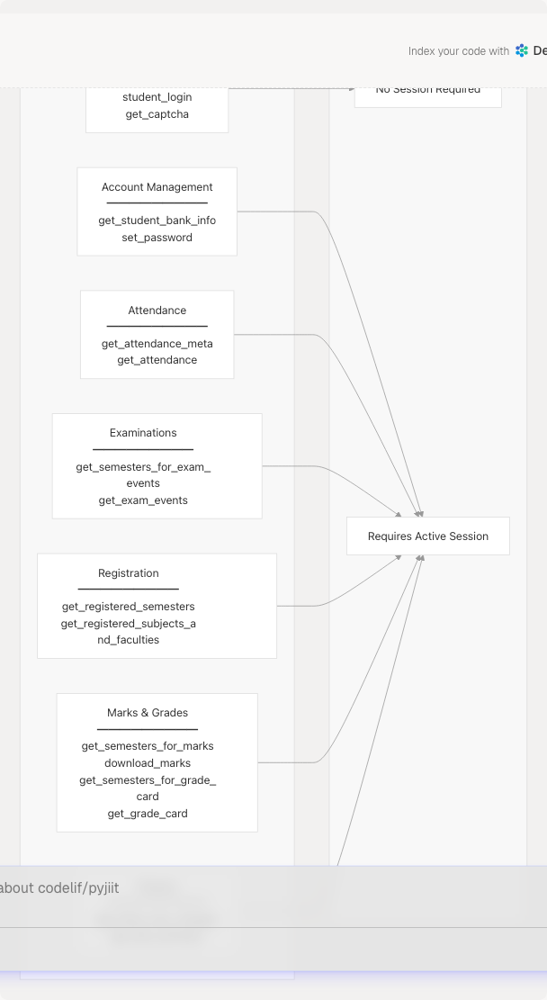
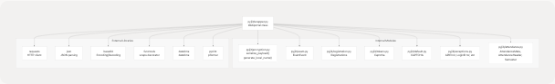

# Webportal Class

## Purpose and Scope

The `Webportal` class is the primary API client for interacting with the JIIT Webportal system. It provides a Python interface to all webportal functionalities including authentication, attendance queries, exam schedules, registration information, marks retrieval, and account management.

This page documents the `Webportal` class structure, initialization, internal architecture, and all public methods. For session lifecycle and token management, see [Session Management](3.2-session-management). For data structures returned by methods, see [Data Models](3.3-data-models). For authentication workflow details, see [Authentication Flow](2.3-authentication-flow).

**Sources:** [pyjiit/wrapper.py70-489](https://github.com/codelif/pyjiit/blob/0fe02955/pyjiit/wrapper.py#L70-L489)

---

## Class Overview

### Class Definition and Initialization

The `Webportal` class is defined in [pyjiit/wrapper.py70-77](https://github.com/codelif/pyjiit/blob/0fe02955/pyjiit/wrapper.py#L70-L77) and provides a stateful client for the JIIT Webportal API.

```
Webportal()
```

**Initialization:**

* Creates a new `Webportal` instance with `self.session = None`
* No parameters required for initialization
* Session is established later via the `student_login()` method

**Key Attributes:**

| Attribute | Type | Description |
| --- | --- | --- |
| `session` | `WebportalSession` or `None` | Contains session cookies, tokens, and user information after successful login |

**Base API URL:** All requests are made to `https://webportal.jiit.ac.in:6011/StudentPortalAPI` as defined in [pyjiit/wrapper.py17](https://github.com/codelif/pyjiit/blob/0fe02955/pyjiit/wrapper.py#L17-L17)

**Sources:** [pyjiit/wrapper.py70-77](https://github.com/codelif/pyjiit/blob/0fe02955/pyjiit/wrapper.py#L70-L77) [pyjiit/wrapper.py17](https://github.com/codelif/pyjiit/blob/0fe02955/pyjiit/wrapper.py#L17-L17)

---

## Architecture and Internal Components

### Internal Request Handler



**Sources:** [pyjiit/wrapper.py82-108](https://github.com/codelif/pyjiit/blob/0fe02955/pyjiit/wrapper.py#L82-L108) [pyjiit/wrapper.py19-36](https://github.com/codelif/pyjiit/blob/0fe02955/pyjiit/wrapper.py#L19-L36)

### The `__hit` Internal Method

The `__hit` method [pyjiit/wrapper.py82-108](https://github.com/codelif/pyjiit/blob/0fe02955/pyjiit/wrapper.py#L82-L108) is the centralized HTTP request handler for all API calls.

**Signature:**

```
__hit(self, *args, **kwargs)
```

**Special Keyword Arguments:**

| Parameter | Type | Description |
| --- | --- | --- |
| `exception` | Exception class | Custom exception to raise on API failure (default: `APIError`) |
| `authenticated` | bool | If `True`, adds session authorization headers |
| `headers` | dict | Additional headers to merge with generated headers |

**Processing Steps:**

1. **Exception Configuration** [pyjiit/wrapper.py83-87](https://github.com/codelif/pyjiit/blob/0fe02955/pyjiit/wrapper.py#L83-L87)

   * Extracts custom exception type from kwargs
   * Defaults to `APIError` if not specified
2. **Header Generation** [pyjiit/wrapper.py89-98](https://github.com/codelif/pyjiit/blob/0fe02955/pyjiit/wrapper.py#L89-L98)

   * If `authenticated=True`: Uses `self.session.get_headers()` for Bearer token
   * Otherwise: Generates only `LocalName` header
   * Merges with any provided headers
3. **Request Execution** [pyjiit/wrapper.py101](https://github.com/codelif/pyjiit/blob/0fe02955/pyjiit/wrapper.py#L101-L101)

   * Forwards all positional and remaining keyword arguments to `requests.request()`
   * Parses JSON response
4. **Error Checking** [pyjiit/wrapper.py102-107](https://github.com/codelif/pyjiit/blob/0fe02955/pyjiit/wrapper.py#L102-L107)

   * HTTP 401 status → raises `SessionExpired`
   * `responseStatus != "Success"` → raises specified exception

**Sources:** [pyjiit/wrapper.py82-108](https://github.com/codelif/pyjiit/blob/0fe02955/pyjiit/wrapper.py#L82-L108)

### The `@authenticated` Decorator

The `@authenticated` decorator [pyjiit/wrapper.py19-36](https://github.com/codelif/pyjiit/blob/0fe02955/pyjiit/wrapper.py#L19-L36) protects methods that require an active session.

**Functionality:**

* Checks if `self.session is None`
* Raises `NotLoggedIn` exception if no session exists
* Preserves original method documentation via `functools.wraps`

**Note:** Session expiry timestamp checking is currently disabled [pyjiit/wrapper.py29-32](https://github.com/codelif/pyjiit/blob/0fe02955/pyjiit/wrapper.py#L29-L32) due to a bug in the webportal API that returns incorrect expiry times.

**Sources:** [pyjiit/wrapper.py19-36](https://github.com/codelif/pyjiit/blob/0fe02955/pyjiit/wrapper.py#L19-L36)

---

## Method Categories



**Sources:** [pyjiit/wrapper.py111-489](https://github.com/codelif/pyjiit/blob/0fe02955/pyjiit/wrapper.py#L111-L489)

---

## Authentication Methods

### `student_login()`

Authenticates a student and establishes a session.

**Signature:**

```
student_login(username: str, password: str, captcha: Captcha) -> WebportalSession
```

**Parameters:**

| Parameter | Type | Description |
| --- | --- | --- |
| `username` | str | Student enrollment number or username |
| `password` | str | Student password |
| `captcha` | Captcha | Captcha object with solved answer |

**Returns:** `WebportalSession` object containing session tokens and user information

**Raises:** `LoginError` for authentication failures

**API Endpoints Used:**

* `/token/pretoken-check` - Pre-authentication validation [pyjiit/wrapper.py119](https://github.com/codelif/pyjiit/blob/0fe02955/pyjiit/wrapper.py#L119-L119)
* `/token/generate-token1` - Token generation [pyjiit/wrapper.py120](https://github.com/codelif/pyjiit/blob/0fe02955/pyjiit/wrapper.py#L120-L120)

**Two-Phase Authentication Flow:**


**Implementation Details:**

1. **Phase 1 - Pretoken Check** [pyjiit/wrapper.py123-130](https://github.com/codelif/pyjiit/blob/0fe02955/pyjiit/wrapper.py#L123-L130)

   * Serializes username, usertype (`"S"` for student), and captcha payload
   * Sends encrypted payload to pretoken endpoint
   * Receives intermediate response data
2. **Phase 2 - Token Generation** [pyjiit/wrapper.py132-139](https://github.com/codelif/pyjiit/blob/0fe02955/pyjiit/wrapper.py#L132-L139)

   * Removes `rejectedData` field from phase 1 response
   * Adds `Modulename: "STUDENTMODULE"` and `passwordotpvalue` (password)
   * Re-serializes and sends to token generation endpoint
   * Receives final session data
3. **Session Establishment** [pyjiit/wrapper.py141-143](https://github.com/codelif/pyjiit/blob/0fe02955/pyjiit/wrapper.py#L141-L143)

   * Creates `WebportalSession` object from response
   * Assigns to `self.session`
   * Returns session object to caller

**Sources:** [pyjiit/wrapper.py111-143](https://github.com/codelif/pyjiit/blob/0fe02955/pyjiit/wrapper.py#L111-L143)

---

### `get_captcha()`

Retrieves a new captcha challenge from the webportal.

**Signature:**

```
get_captcha() -> Captcha
```

**Returns:** `Captcha` object with empty answer field

**Raises:** `APIError` for generic API errors

**API Endpoint:** `/token/getcaptcha` [pyjiit/wrapper.py150](https://github.com/codelif/pyjiit/blob/0fe02955/pyjiit/wrapper.py#L150-L150)

**Usage Pattern:**

```
w = Webportal()
captcha = w.get_captcha()
# Solve captcha and set captcha.answer
# Then call student_login()
```

**Sources:** [pyjiit/wrapper.py145-154](https://github.com/codelif/pyjiit/blob/0fe02955/pyjiit/wrapper.py#L145-L154)

---

## Account Management Methods

### `get_student_bank_info()`

Retrieves student banking information.

**Signature:**

```
@authenticated
get_student_bank_info() -> dict
```

**Returns:** Dictionary with student bank account details

**Raises:** `APIError` for generic API errors, `NotLoggedIn` if not authenticated

**API Endpoint:** `/studentbankdetails/getstudentbankinfo` [pyjiit/wrapper.py162](https://github.com/codelif/pyjiit/blob/0fe02955/pyjiit/wrapper.py#L162-L162)

**Payload Structure:**

* `instituteid`: From session
* `studentid`: From session memberid

**Sources:** [pyjiit/wrapper.py156-170](https://github.com/codelif/pyjiit/blob/0fe02955/pyjiit/wrapper.py#L156-L170)

---

### `set_password()`

Changes the student's password.

**Signature:**

```
@authenticated
set_password(old_pswd: str, new_pswd: str) -> None
```

**Parameters:**

| Parameter | Type | Description |
| --- | --- | --- |
| `old_pswd` | str | Current password |
| `new_pswd` | str | New password to set |

**Raises:** `AccountAPIError` for password change failures, `NotLoggedIn` if not authenticated

**API Endpoint:** `/clxuser/changepassword` [pyjiit/wrapper.py220](https://github.com/codelif/pyjiit/blob/0fe02955/pyjiit/wrapper.py#L220-L220)

**Payload Structure:**

* `membertype`: From session
* `oldpassword`: Old password parameter
* `newpassword`: New password parameter
* `confirmpassword`: New password (duplicate)

**Sources:** [pyjiit/wrapper.py213-230](https://github.com/codelif/pyjiit/blob/0fe02955/pyjiit/wrapper.py#L213-L230)

---

## Attendance Methods

### `get_attendance_meta()`

Retrieves attendance metadata including available headers and semesters.

**Signature:**

```
@authenticated
get_attendance_meta() -> AttendanceMeta
```

**Returns:** `AttendanceMeta` object containing headers and semester list

**Raises:** `APIError` for generic API errors, `NotLoggedIn` if not authenticated

**API Endpoint:** `/StudentClassAttendance/getstudentInforegistrationforattendence` [pyjiit/wrapper.py178](https://github.com/codelif/pyjiit/blob/0fe02955/pyjiit/wrapper.py#L178-L178)

**Payload Structure:**

* `clientid`: From session
* `instituteid`: From session
* `membertype`: From session

**Usage Pattern:**

```
meta = w.get_attendance_meta()
header = meta.headers[0]
semester = meta.semesters[0]
# Use header and semester for get_attendance()
```

**Sources:** [pyjiit/wrapper.py172-188](https://github.com/codelif/pyjiit/blob/0fe02955/pyjiit/wrapper.py#L172-L188)

---

### `get_attendance()`

Retrieves detailed attendance records for a specific header and semester.

**Signature:**

```
@authenticated
get_attendance(header: AttendanceHeader, semester: Semester) -> dict
```

**Parameters:**

| Parameter | Type | Description |
| --- | --- | --- |
| `header` | AttendanceHeader | Attendance header from `get_attendance_meta()` |
| `semester` | Semester | Semester object from `get_attendance_meta()` |

**Returns:** Dictionary with attendance records and statistics

**Raises:** `APIError` for generic API errors, `NotLoggedIn` if not authenticated

**API Endpoint:** `/StudentClassAttendance/getstudentattendancedetail` [pyjiit/wrapper.py198](https://github.com/codelif/pyjiit/blob/0fe02955/pyjiit/wrapper.py#L198-L198)

**Payload Structure:**

* `clientid`: From session
* `instituteid`: From session
* `registrationcode`: From semester parameter
* `registrationid`: From semester parameter
* `stynumber`: From header parameter

**Note:** This endpoint encrypts the payload using `serialize_payload()` [pyjiit/wrapper.py207](https://github.com/codelif/pyjiit/blob/0fe02955/pyjiit/wrapper.py#L207-L207)

**Performance Consideration:** Attendance queries may take >10 seconds due to server-side processing.

**Sources:** [pyjiit/wrapper.py190-211](https://github.com/codelif/pyjiit/blob/0fe02955/pyjiit/wrapper.py#L190-L211)

---

## Examination Methods

### `get_semesters_for_exam_events()`

Retrieves list of semesters that have exam events.

**Signature:**

```
@authenticated
get_semesters_for_exam_events() -> list[Semester]
```

**Returns:** List of `Semester` objects with exam events

**Raises:** `APIError` for generic API errors, `NotLoggedIn` if not authenticated

**API Endpoint:** `/studentcommonsontroller/getsemestercode-withstudentexamevents` [pyjiit/wrapper.py278](https://github.com/codelif/pyjiit/blob/0fe02955/pyjiit/wrapper.py#L278-L278)

**Payload Structure:**

* `clientid`: From session
* `instituteid`: From session
* `memberid`: From session

**Sources:** [pyjiit/wrapper.py272-289](https://github.com/codelif/pyjiit/blob/0fe02955/pyjiit/wrapper.py#L272-L289)

---

### `get_exam_events()`

Retrieves exam events for a specific semester.

**Signature:**

```
@authenticated
get_exam_events(semester: Semester) -> list[ExamEvent]
```

**Parameters:**

| Parameter | Type | Description |
| --- | --- | --- |
| `semester` | Semester | Semester object from `get_semesters_for_exam_events()` |

**Returns:** List of `ExamEvent` objects

**Raises:** `APIError` for generic API errors, `NotLoggedIn` if not authenticated

**API Endpoint:** `/studentcommonsontroller/getstudentexamevents` [pyjiit/wrapper.py298](https://github.com/codelif/pyjiit/blob/0fe02955/pyjiit/wrapper.py#L298-L298)

**Payload Structure:**

* `instituteid`: From session
* `registationid`: From semester parameter (note: API typo, not "registrationid")

**Sources:** [pyjiit/wrapper.py291-308](https://github.com/codelif/pyjiit/blob/0fe02955/pyjiit/wrapper.py#L291-L308)

---

### `get_exam_schedule()`

Retrieves the detailed exam schedule for a specific exam event.

**Signature:**

```
@authenticated
get_exam_schedule(exam_event: ExamEvent) -> dict
```

**Parameters:**

| Parameter | Type | Description |
| --- | --- | --- |
| `exam_event` | ExamEvent | Exam event object from `get_exam_events()` |

**Returns:** Dictionary with exam schedule details (dates, times, venues)

**Raises:** `APIError` for generic API errors, `NotLoggedIn` if not authenticated

**API Endpoint:** `/studentsttattview/getstudent-examschedule` [pyjiit/wrapper.py317](https://github.com/codelif/pyjiit/blob/0fe02955/pyjiit/wrapper.py#L317-L317)

**Payload Structure:**

* `instituteid`: From session
* `registrationid`: From exam event parameter
* `exameventid`: From exam event parameter

**Sources:** [pyjiit/wrapper.py310-328](https://github.com/codelif/pyjiit/blob/0fe02955/pyjiit/wrapper.py#L310-L328)

---

## Registration Methods

### `get_registered_semesters()`

Retrieves list of all semesters the student is registered for.

**Signature:**

```
@authenticated
get_registered_semesters() -> list[Semester]
```

**Returns:** List of `Semester` objects

**Raises:** `APIError` for generic API errors, `NotLoggedIn` if not authenticated

**API Endpoint:** `/reqsubfaculty/getregistrationList` [pyjiit/wrapper.py238](https://github.com/codelif/pyjiit/blob/0fe02955/pyjiit/wrapper.py#L238-L238)

**Payload Structure:**

* `instituteid`: From session
* `studentid`: From session memberid

**Sources:** [pyjiit/wrapper.py232-249](https://github.com/codelif/pyjiit/blob/0fe02955/pyjiit/wrapper.py#L232-L249)

---

### `get_registered_subjects_and_faculties()`

Retrieves all registered subjects and faculty details for a semester.

**Signature:**

```
@authenticated
get_registered_subjects_and_faculties(semester: Semester) -> Registrations
```

**Parameters:**

| Parameter | Type | Description |
| --- | --- | --- |
| `semester` | Semester | Semester object from `get_registered_semesters()` |

**Returns:** `Registrations` object containing list of `RegisteredSubject` objects and total credits

**Raises:** `APIError` for generic API errors, `NotLoggedIn` if not authenticated

**API Endpoint:** `/reqsubfaculty/getfaculties` [pyjiit/wrapper.py258](https://github.com/codelif/pyjiit/blob/0fe02955/pyjiit/wrapper.py#L258-L258)

**Payload Structure:**

* `instituteid`: From session
* `studentid`: From session memberid
* `registrationid`: From semester parameter

**Sources:** [pyjiit/wrapper.py251-269](https://github.com/codelif/pyjiit/blob/0fe02955/pyjiit/wrapper.py#L251-L269)

---

### `get_subject_choices()`

Retrieves subject choice preferences for a semester.

**Signature:**

```
@authenticated
get_subject_choices(semester: Semester) -> dict
```

**Parameters:**

| Parameter | Type | Description |
| --- | --- | --- |
| `semester` | Semester | Semester object |

**Returns:** Dictionary with subject preference data. If subjects are allocated, `response["subjectpreferencegrid"]` contains array of dicts with `subjectrunning == "Y"` attribute.

**Raises:** `APIError` for generic API errors, `NotLoggedIn` if not authenticated

**API Endpoint:** `/studentchoiceprint/getsubjectpreference` [pyjiit/wrapper.py480](https://github.com/codelif/pyjiit/blob/0fe02955/pyjiit/wrapper.py#L480-L480)

**Payload Structure:**

* `instituteid`: From session
* `clientid`: From session
* `registrationid`: From semester parameter

**Sources:** [pyjiit/wrapper.py472-488](https://github.com/codelif/pyjiit/blob/0fe02955/pyjiit/wrapper.py#L472-L488)

---

## Marks and Grades Methods

### `get_semesters_for_marks()`

Retrieves list of semesters for which marks are available.

**Signature:**

```
@authenticated
get_semesters_for_marks() -> list[Semester]
```

**Returns:** List of `Semester` objects with available marks

**Raises:** `APIError` for generic API errors, `NotLoggedIn` if not authenticated

**API Endpoint:** `/studentcommonsontroller/getsemestercode-exammarks` [pyjiit/wrapper.py336](https://github.com/codelif/pyjiit/blob/0fe02955/pyjiit/wrapper.py#L336-L336)

**Payload Structure:**

* `instituteid`: From session
* `memberid`: From session

**Sources:** [pyjiit/wrapper.py330-346](https://github.com/codelif/pyjiit/blob/0fe02955/pyjiit/wrapper.py#L330-L346)

---

### `download_marks()`

Downloads marks PDF for a specific semester.

**Signature:**

```
@authenticated
download_marks(semester: Semester) -> bytes
```

**Parameters:**

| Parameter | Type | Description |
| --- | --- | --- |
| `semester` | Semester | Semester object from `get_semesters_for_marks()` |

**Returns:** Raw bytes of PDF file content

**Raises:** `APIError` for download failures, `NotLoggedIn` if not authenticated

**API Endpoint:** `/studentsexamview/printstudent-exammarks/{instituteid}/{registration_id}/{registration_code}` [pyjiit/wrapper.py354-359](https://github.com/codelif/pyjiit/blob/0fe02955/pyjiit/wrapper.py#L354-L359)

**Implementation Notes:**

* Uses `requests.get()` directly (not via `__hit()`) [pyjiit/wrapper.py363](https://github.com/codelif/pyjiit/blob/0fe02955/pyjiit/wrapper.py#L363-L363)
* Streams response for memory efficiency
* Checks HTTP status code 200 explicitly
* URL parameters are path components, not query string

**Sources:** [pyjiit/wrapper.py348-367](https://github.com/codelif/pyjiit/blob/0fe02955/pyjiit/wrapper.py#L348-L367)

---

### `get_semesters_for_grade_card()`

Retrieves list of semesters for which grade cards are available.

**Signature:**

```
@authenticated
get_semesters_for_grade_card() -> list[Semester]
```

**Returns:** List of `Semester` objects with available grade cards

**Raises:** `APIError` for generic API errors, `NotLoggedIn` if not authenticated

**API Endpoint:** `/studentgradecard/getregistrationList` [pyjiit/wrapper.py375](https://github.com/codelif/pyjiit/blob/0fe02955/pyjiit/wrapper.py#L375-L375)

**Payload Structure:**

* `instituteid`: From session

**Sources:** [pyjiit/wrapper.py369-383](https://github.com/codelif/pyjiit/blob/0fe02955/pyjiit/wrapper.py#L369-L383)

---

### `get_grade_card()`

Retrieves the grade card for a specific semester.

**Signature:**

```
@authenticated
get_grade_card(semester: Semester) -> dict
```

**Parameters:**

| Parameter | Type | Description |
| --- | --- | --- |
| `semester` | Semester | Semester object from `get_semesters_for_grade_card()` |

**Returns:** Dictionary with complete grade card data

**Raises:** `APIError` for generic API errors, `NotLoggedIn` if not authenticated

**API Endpoint:** `/studentgradecard/showstudentgradecard` [pyjiit/wrapper.py412](https://github.com/codelif/pyjiit/blob/0fe02955/pyjiit/wrapper.py#L412-L412)

**Implementation Notes:**

* Calls internal helper `__get_program_and_branch_id()` [pyjiit/wrapper.py409](https://github.com/codelif/pyjiit/blob/0fe02955/pyjiit/wrapper.py#L409-L409) to fetch required IDs
* Requires `branchid` and `programid` in addition to session data

**Payload Structure:**

* `branchid`: From internal helper method
* `instituteid`: From session
* `programid`: From internal helper method
* `registrationid`: From semester parameter

**Sources:** [pyjiit/wrapper.py402-421](https://github.com/codelif/pyjiit/blob/0fe02955/pyjiit/wrapper.py#L402-L421)

---

### `__get_program_and_branch_id()`

Internal helper method to fetch program and branch IDs for grade card operations.

**Signature:**

```
@authenticated
__get_program_and_branch_id() -> dict
```

**Returns:** Dictionary with keys `programid` and `branchid`

**Raises:** `APIError` for generic API errors

**API Endpoint:** `/studentgradecard/getstudentinfo` [pyjiit/wrapper.py392](https://github.com/codelif/pyjiit/blob/0fe02955/pyjiit/wrapper.py#L392-L392)

**Note:** This is a private method (indicated by `__` prefix) used internally by `get_grade_card()`.

**Sources:** [pyjiit/wrapper.py386-400](https://github.com/codelif/pyjiit/blob/0fe02955/pyjiit/wrapper.py#L386-L400)

---

### `get_sgpa_cgpa()`

Retrieves SGPA and CGPA data for all or a specific semester.

**Signature:**

```
@authenticated
get_sgpa_cgpa(stynumber: int = 0) -> dict
```

**Parameters:**

| Parameter | Type | Default | Description |
| --- | --- | --- | --- |
| `stynumber` | int | 0 | Semester number (0 for all semesters) |

**Returns:** Dictionary containing SGPA and CGPA information

**Raises:** `APIError` for generic API errors, `NotLoggedIn` if not authenticated

**API Endpoint:** `/studentsgpacgpa/getallsemesterdata` [pyjiit/wrapper.py430](https://github.com/codelif/pyjiit/blob/0fe02955/pyjiit/wrapper.py#L430-L430)

**Payload Structure:**

* `instituteid`: From session
* `studentid`: From session memberid
* `stynumber`: From parameter (0 retrieves all semesters)

**Sources:** [pyjiit/wrapper.py423-438](https://github.com/codelif/pyjiit/blob/0fe02955/pyjiit/wrapper.py#L423-L438)

---

## Finance Methods

### `get_fines_msc_charges()`

Fetches pending miscellaneous charges and fines.

**Signature:**

```
@authenticated
get_fines_msc_charges() -> dict
```

**Returns:** Dictionary with pending payment data. If no pending payments exist, API returns status "Failure" with error "NO APPROVED REQUEST FOUND".

**Raises:** `APIError` for generic API errors (including when no pending payments exist), `NotLoggedIn` if not authenticated

**API Endpoint:** `/collectionpendingpayments/getpendingpaymentsdata` [pyjiit/wrapper.py449](https://github.com/codelif/pyjiit/blob/0fe02955/pyjiit/wrapper.py#L449-L449)

**Payload Structure:**

* `instituteid`: From session
* `studentid`: From session memberid

**Behavior Note:** The API treats "no pending payments" as an error condition. Calling code should catch `APIError` and check for "NO APPROVED REQUEST FOUND" message.

**Sources:** [pyjiit/wrapper.py440-456](https://github.com/codelif/pyjiit/blob/0fe02955/pyjiit/wrapper.py#L440-L456)

---

### `get_fee_summary()`

Fetches the complete fee summary for the student.

**Signature:**

```
@authenticated
get_fee_summary() -> dict
```

**Returns:** Dictionary with fee ledger and summary information

**Raises:** `APIError` for generic API errors, `NotLoggedIn` if not authenticated

**API Endpoint:** `/studentfeeledger/loadfeesummary` [pyjiit/wrapper.py465](https://github.com/codelif/pyjiit/blob/0fe02955/pyjiit/wrapper.py#L465-L465)

**Payload Structure:**

* `instituteid`: From session

**Note:** Unlike `get_fines_msc_charges()`, this method does not encrypt the payload.

**Sources:** [pyjiit/wrapper.py458-470](https://github.com/codelif/pyjiit/blob/0fe02955/pyjiit/wrapper.py#L458-L470)

---

## Method Usage Patterns

### Typical Workflow Example


**Sources:** [pyjiit/wrapper.py70-489](https://github.com/codelif/pyjiit/blob/0fe02955/pyjiit/wrapper.py#L70-L489)

---

## Method Summary Table

| Method | Authentication | Encryption | Returns | Primary Use Case |
| --- | --- | --- | --- | --- |
| `student_login()` | No | Yes | `WebportalSession` | Initial authentication |
| `get_captcha()` | No | No | `Captcha` | Retrieve captcha challenge |
| `get_student_bank_info()` | Required | No | dict | Bank account details |
| `set_password()` | Required | No | None | Password management |
| `get_attendance_meta()` | Required | No | `AttendanceMeta` | Get attendance parameters |
| `get_attendance()` | Required | Yes | dict | Detailed attendance records |
| `get_semesters_for_exam_events()` | Required | Yes | list[`Semester`] | Available exam semesters |
| `get_exam_events()` | Required | Yes | list[`ExamEvent`] | Exam events for semester |
| `get_exam_schedule()` | Required | Yes | dict | Detailed exam schedule |
| `get_registered_semesters()` | Required | Yes | list[`Semester`] | Registration semesters |
| `get_registered_subjects_and_faculties()` | Required | Yes | `Registrations` | Subject and faculty info |
| `get_subject_choices()` | Required | Yes | dict | Subject preferences |
| `get_semesters_for_marks()` | Required | Yes | list[`Semester`] | Marks availability |
| `download_marks()` | Required | No | bytes | PDF marks download |
| `get_semesters_for_grade_card()` | Required | Yes | list[`Semester`] | Grade card availability |
| `get_grade_card()` | Required | Yes | dict | Complete grade card |
| `get_sgpa_cgpa()` | Required | Yes | dict | SGPA/CGPA data |
| `get_fines_msc_charges()` | Required | Yes | dict | Pending payments |
| `get_fee_summary()` | Required | No | dict | Fee ledger summary |

**Sources:** [pyjiit/wrapper.py70-489](https://github.com/codelif/pyjiit/blob/0fe02955/pyjiit/wrapper.py#L70-L489)

---

## Dependencies and Imports



**Import Statements:** [pyjiit/wrapper.py1-14](https://github.com/codelif/pyjiit/blob/0fe02955/pyjiit/wrapper.py#L1-L14)

**Sources:** [pyjiit/wrapper.py1-17](https://github.com/codelif/pyjiit/blob/0fe02955/pyjiit/wrapper.py#L1-L17)
