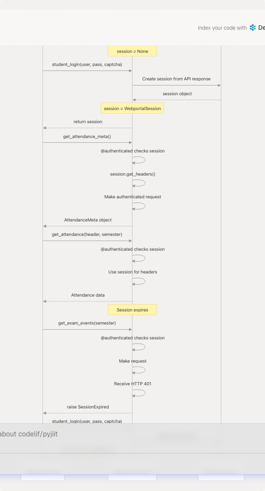

# Session Management

> Source: https://deepwiki.com/codelif/pyjiit/3.2-session-management

# Session Management

Relevant source files

* [.gitignore](https://github.com/codelif/pyjiit/blob/0fe02955/.gitignore)
* [LICENSE](https://github.com/codelif/pyjiit/blob/0fe02955/LICENSE)
* [pyjiit/exam.py](https://github.com/codelif/pyjiit/blob/0fe02955/pyjiit/exam.py)
* [pyjiit/exceptions.py](https://github.com/codelif/pyjiit/blob/0fe02955/pyjiit/exceptions.py)
* [pyjiit/registration.py](https://github.com/codelif/pyjiit/blob/0fe02955/pyjiit/registration.py)
* [pyjiit/wrapper.py](https://github.com/codelif/pyjiit/blob/0fe02955/pyjiit/wrapper.py)

This document explains how pyjiit manages authenticated sessions with the JIIT Webportal API. It covers the `WebportalSession` class, session lifecycle, token-based authentication, and session validation mechanisms.

For information about the initial authentication process that creates sessions, see [Authentication Flow](/codelif/pyjiit/2.3-authentication-flow). For details about session-related exceptions, see [Exception Handling](/codelif/pyjiit/3.4-exception-handling).

---

## WebportalSession Class

The `WebportalSession` class encapsulates authentication state and credentials required for making authenticated API requests. It is created automatically during the login process and stores session tokens, user identity information, and institutional context.

### Class Structure and Initialization

The `WebportalSession` class is initialized from the API response received after successful authentication. It extracts and stores multiple pieces of session-critical information:

| Attribute | Type | Description |
| --- | --- | --- |
| `raw_response` | dict | Complete API response for debugging |
| `regdata` | dict | Registration data containing all session fields |
| `institute` | str | Institute name (label) |
| `instituteid` | str | Institute identifier |
| `memberid` | str | Student member ID |
| `userid` | str | User ID for the session |
| `token` | str | JWT authentication token |
| `expiry` | datetime | Token expiration timestamp |
| `clientid` | str | Client identifier |
| `membertype` | str | Type of member (student/faculty) |
| `name` | str | User's full name |

**Sources:** [pyjiit/wrapper.py38-60](https://github.com/codelif/pyjiit/blob/0fe02955/pyjiit/wrapper.py#L38-L60)

### Token Structure and Expiration

The session token is a JWT (JSON Web Token) that follows standard JWT structure with three base64-encoded segments separated by dots. The `WebportalSession` class extracts the expiration timestamp from the token's payload:


```

The token expiration is decoded at initialization time and stored in the `expiry` attribute. This allows for potential session validation before making API calls.

**Sources:** [pyjiit/wrapper.py53-55](https://github.com/codelif/pyjiit/blob/0fe02955/pyjiit/wrapper.py#L53-L55)

### Session Headers Generation

Every authenticated API request requires specific HTTP headers. The `get_headers()` method generates these headers dynamically:

```

```

The `Authorization` header uses the Bearer scheme with the JWT token, while the `LocalName` header is regenerated for each request using the encryption module's `generate_local_name()` function, providing request-level obfuscation.

**Sources:** [pyjiit/wrapper.py61-68](https://github.com/codelif/pyjiit/blob/0fe02955/pyjiit/wrapper.py#L61-L68) [pyjiit/wrapper.py3](https://github.com/codelif/pyjiit/blob/0fe02955/pyjiit/wrapper.py#L3-L3)

---

## Session Lifecycle

### Session Creation During Login

A `WebportalSession` instance is created as the final step of the two-phase authentication process. The following diagram shows how the session object is instantiated and stored in the `Webportal` class:

```

```

The session is stored in the `Webportal` instance's `session` attribute, which is initially `None` and gets populated only after successful authentication.

**Sources:** [pyjiit/wrapper.py111-143](https://github.com/codelif/pyjiit/blob/0fe02955/pyjiit/wrapper.py#L111-L143) [pyjiit/wrapper.py76-77](https://github.com/codelif/pyjiit/blob/0fe02955/pyjiit/wrapper.py#L76-L77)

### Session Storage in Webportal Class

The `Webportal` class maintains a single session reference:

| Webportal Attribute | Initial Value | Post-Login Value |
| --- | --- | --- |
| `self.session` | `None` | `WebportalSession` instance |

All authenticated methods access `self.session` to retrieve session data and generate headers. The session persists for the lifetime of the `Webportal` instance.

**Sources:** [pyjiit/wrapper.py76-77](https://github.com/codelif/pyjiit/blob/0fe02955/pyjiit/wrapper.py#L76-L77) [pyjiit/wrapper.py141](https://github.com/codelif/pyjiit/blob/0fe02955/pyjiit/wrapper.py#L141-L141)

---

## Authentication Decorator

The `@authenticated` decorator enforces session requirements on methods that need valid authentication. It performs validation checks before allowing the underlying method to execute.

### Decorator Implementation

```

```

The decorator wraps the original method and preserves its docstring using `@wraps(method)` from the `functools` module.

**Sources:** [pyjiit/wrapper.py19-36](https://github.com/codelif/pyjiit/blob/0fe02955/pyjiit/wrapper.py#L19-L36)

### Session Expiry Check (Currently Disabled)

The decorator contains commented-out code for checking token expiration:

```
```
# Commenting this because rn the webportal api is bugged,
# and returns wrong expiry time for perfectly valid cookies
# if self.session.expiry < datetime.now():
#     raise SessionExpired
```
```

This check compares `self.session.expiry` against the current time. It is disabled due to API bugs where valid tokens report incorrect expiration times. When enabled, it would raise `SessionExpired` before making an API call with an expired token.

**Sources:** [pyjiit/wrapper.py29-32](https://github.com/codelif/pyjiit/blob/0fe02955/pyjiit/wrapper.py#L29-L32)

### Decorated Methods

All API methods that require authentication use this decorator. Examples include:

| Method | Decorator | Purpose |
| --- | --- | --- |
| `get_attendance_meta()` | `@authenticated` | Fetch attendance metadata |
| `get_attendance()` | `@authenticated` | Get detailed attendance |
| `get_registered_semesters()` | `@authenticated` | List registered semesters |
| `get_exam_events()` | `@authenticated` | Retrieve exam events |
| `set_password()` | `@authenticated` | Change account password |

**Sources:** [pyjiit/wrapper.py156](https://github.com/codelif/pyjiit/blob/0fe02955/pyjiit/wrapper.py#L156-L156) [pyjiit/wrapper.py190](https://github.com/codelif/pyjiit/blob/0fe02955/pyjiit/wrapper.py#L190-L190) [pyjiit/wrapper.py232](https://github.com/codelif/pyjiit/blob/0fe02955/pyjiit/wrapper.py#L232-L232) [pyjiit/wrapper.py291](https://github.com/codelif/pyjiit/blob/0fe02955/pyjiit/wrapper.py#L291-L291) [pyjiit/wrapper.py213](https://github.com/codelif/pyjiit/blob/0fe02955/pyjiit/wrapper.py#L213-L213)

---

## Session Validation in API Requests

### The \_\_hit() Method

The internal `__hit()` method centralizes all HTTP requests and handles session-related headers. When `authenticated=True` is passed, it uses the session to generate headers:

```

```

The method assumes that if `authenticated=True`, the calling method is already wrapped with `@authenticated`, so `self.session` is guaranteed to be non-null.

**Sources:** [pyjiit/wrapper.py82-108](https://github.com/codelif/pyjiit/blob/0fe02955/pyjiit/wrapper.py#L82-L108)

### HTTP 401 Handling

After receiving an API response, `__hit()` checks for HTTP 401 status codes which indicate session expiration or invalid tokens:

```
```
if type(resp["status"]) is int and resp["status"] == 401:
    raise SessionExpired(resp["error"])
```
```

This provides runtime detection of expired sessions even when the pre-call expiry check is disabled.

**Sources:** [pyjiit/wrapper.py102-103](https://github.com/codelif/pyjiit/blob/0fe02955/pyjiit/wrapper.py#L102-L103)

---

## Session Expiration Scenarios

### Token Expiration Detection

Session expiration can be detected through multiple mechanisms:

```

```

**Sources:** [pyjiit/wrapper.py29-32](https://github.com/codelif/pyjiit/blob/0fe02955/pyjiit/wrapper.py#L29-L32) [pyjiit/wrapper.py102-103](https://github.com/codelif/pyjiit/blob/0fe02955/pyjiit/wrapper.py#L102-L103)

### Re-authentication Requirement

When a session expires, the user must call `student_login()` again to establish a new session. The library does not automatically refresh tokens or maintain session state between `Webportal` instances.

**Sources:** [pyjiit/wrapper.py111-143](https://github.com/codelif/pyjiit/blob/0fe02955/pyjiit/wrapper.py#L111-L143)

---

## Session-Related Exception Hierarchy

Session management uses specific exception types defined in the exception hierarchy:

```

```

### Exception Types

| Exception | Raised When | Raised By |
| --- | --- | --- |
| `NotLoggedIn` | No session exists (session is `None`) | `@authenticated` decorator |
| `SessionExpired` | HTTP 401 received from API | `__hit()` method |
| `SessionError` | Base class for session errors | Not raised directly |

**Sources:** [pyjiit/exceptions.py8-14](https://github.com/codelif/pyjiit/blob/0fe02955/pyjiit/exceptions.py#L8-L14) [pyjiit/wrapper.py27](https://github.com/codelif/pyjiit/blob/0fe02955/pyjiit/wrapper.py#L27-L27) [pyjiit/wrapper.py103](https://github.com/codelif/pyjiit/blob/0fe02955/pyjiit/wrapper.py#L103-L103)

---

## Usage Patterns

### Typical Session Flow

```

```

**Sources:** [pyjiit/wrapper.py76-77](https://github.com/codelif/pyjiit/blob/0fe02955/pyjiit/wrapper.py#L76-L77) [pyjiit/wrapper.py111-143](https://github.com/codelif/pyjiit/blob/0fe02955/pyjiit/wrapper.py#L111-L143) [pyjiit/wrapper.py19-36](https://github.com/codelif/pyjiit/blob/0fe02955/pyjiit/wrapper.py#L19-L36)

### Error Handling Best Practices

Applications should catch session-related exceptions and handle re-authentication:

```
```
try:
    data = webportal.get_attendance_meta()
except NotLoggedIn:
    # Handle case where login() was never called
    session = webportal.student_login(username, password, captcha)
except SessionExpired:
    # Handle expired session - need to login again
    session = webportal.student_login(username, password, captcha)
    # Retry the operation
    data = webportal.get_attendance_meta()
```

**Sources:** [pyjiit/exceptions.py8-14](https://github.com/codelif/pyjiit/blob/0fe02955/pyjiit/exceptions.py#L8-L14) [pyjiit/wrapper.py19-36](https://github.com/codelif/pyjiit/blob/0fe02955/pyjiit/wrapper.py#L19-L36)

---

## Implementation Details

### Session Data Access Patterns

Methods that use session data access it directly through `self.session`:

| Method | Session Data Used |
| --- | --- |
| `get_attendance_meta()` | `clientid`, `instituteid`, `membertype` |
| `get_attendance()` | `clientid`, `instituteid` |
| `get_registered_semesters()` | `instituteid`, `memberid` |
| `set_password()` | `membertype` |
| All authenticated methods | `token` (via headers) |

**Sources:** [pyjiit/wrapper.py173-188](https://github.com/codelif/pyjiit/blob/0fe02955/pyjiit/wrapper.py#L173-L188) [pyjiit/wrapper.py190-211](https://github.com/codelif/pyjiit/blob/0fe02955/pyjiit/wrapper.py#L190-L211) [pyjiit/wrapper.py232-249](https://github.com/codelif/pyjiit/blob/0fe02955/pyjiit/wrapper.py#L232-L249) [pyjiit/wrapper.py213-229](https://github.com/codelif/pyjiit/blob/0fe02955/pyjiit/wrapper.py#L213-L229)

### Thread Safety Considerations

The `WebportalSession` class and `Webportal` instance are not thread-safe. Each thread should maintain its own `Webportal` instance with its own session. The session object does not contain any locking mechanisms.

**Sources:** [pyjiit/wrapper.py38-68](https://github.com/codelif/pyjiit/blob/0fe02955/pyjiit/wrapper.py#L38-L68) [pyjiit/wrapper.py70-77](https://github.com/codelif/pyjiit/blob/0fe02955/pyjiit/wrapper.py#L70-L77)