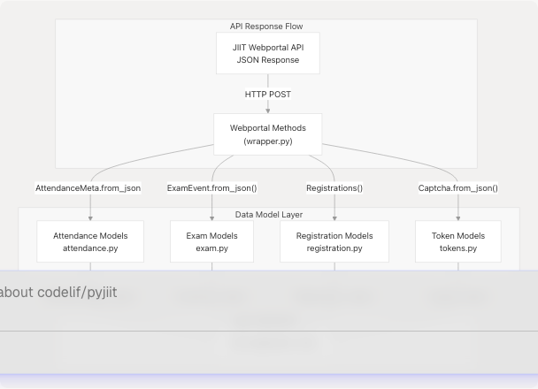
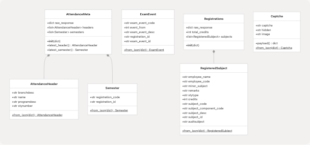
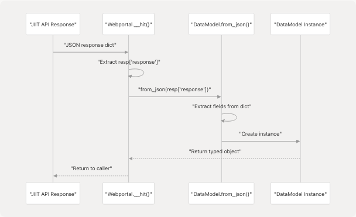
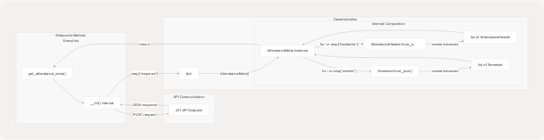

# Data Models

Relevant source files

* [pyjiit/attendance.py](https://github.com/codelif/pyjiit/blob/0fe02955/pyjiit/attendance.py)
* [pyjiit/default.py](https://github.com/codelif/pyjiit/blob/0fe02955/pyjiit/default.py)
* [pyjiit/exam.py](https://github.com/codelif/pyjiit/blob/0fe02955/pyjiit/exam.py)
* [pyjiit/registration.py](https://github.com/codelif/pyjiit/blob/0fe02955/pyjiit/registration.py)
* [pyjiit/tokens.py](https://github.com/codelif/pyjiit/blob/0fe02955/pyjiit/tokens.py)
* [pyjiit/wrapper.py](https://github.com/codelif/pyjiit/blob/0fe02955/pyjiit/wrapper.py)

This document provides an overview of all data model classes in pyjiit. These classes provide structured, type-safe access to raw JSON responses from the JIIT Webportal API. Each model represents a specific domain entity (attendance, exams, registrations, or authentication tokens) and encapsulates the deserialization logic for API responses.

For detailed documentation of specific model groups, see:

* Attendance-related models: [3.3.1](/codelif/pyjiit/3.3.1-attendance-models)
* Exam-related models: [3.3.2](/codelif/pyjiit/3.3.2-exam-models)
* Registration-related models: [3.3.3](/codelif/pyjiit/3.3.3-registration-models)
* Token and captcha models: [3.3.4](/codelif/pyjiit/3.3.4-tokens-and-captcha)

For information about the `Webportal` class that returns these models, see [3.1](/codelif/pyjiit/3.1-webportal-class).

## Data Model Architecture

All data models in pyjiit follow a consistent architectural pattern. They serve as intermediaries between raw JSON API responses and Python application code, providing attribute-based access and type safety.


```

**Sources:** [pyjiit/wrapper.py1-489](https://github.com/codelif/pyjiit/blob/0fe02955/pyjiit/wrapper.py#L1-L489) [pyjiit/attendance.py1-53](https://github.com/codelif/pyjiit/blob/0fe02955/pyjiit/attendance.py#L1-L53) [pyjiit/exam.py1-24](https://github.com/codelif/pyjiit/blob/0fe02955/pyjiit/exam.py#L1-L24) [pyjiit/registration.py1-44](https://github.com/codelif/pyjiit/blob/0fe02955/pyjiit/registration.py#L1-L44) [pyjiit/tokens.py1-29](https://github.com/codelif/pyjiit/blob/0fe02955/pyjiit/tokens.py#L1-L29)

## Model Categories

The library contains four distinct categories of data models, each serving a specific domain within the JIIT Webportal system:

| Category | Module | Primary Models | Purpose |
| --- | --- | --- | --- |
| Attendance | `pyjiit/attendance.py` | `AttendanceMeta`, `AttendanceHeader`, `Semester` | Represent attendance metadata, headers, and semester information |
| Exams | `pyjiit/exam.py` | `ExamEvent` | Represent exam events and scheduling information |
| Registration | `pyjiit/registration.py` | `Registrations`, `RegisteredSubject` | Represent course registrations and subject details |
| Tokens | `pyjiit/tokens.py` | `Captcha` | Represent authentication captcha data |

**Sources:** [pyjiit/attendance.py1-53](https://github.com/codelif/pyjiit/blob/0fe02955/pyjiit/attendance.py#L1-L53) [pyjiit/exam.py1-24](https://github.com/codelif/pyjiit/blob/0fe02955/pyjiit/exam.py#L1-L24) [pyjiit/registration.py1-44](https://github.com/codelif/pyjiit/blob/0fe02955/pyjiit/registration.py#L1-L44) [pyjiit/tokens.py1-29](https://github.com/codelif/pyjiit/blob/0fe02955/pyjiit/tokens.py#L1-L29)

## Model Class Structure

```

```

**Sources:** [pyjiit/attendance.py4-51](https://github.com/codelif/pyjiit/blob/0fe02955/pyjiit/attendance.py#L4-L51) [pyjiit/exam.py4-21](https://github.com/codelif/pyjiit/blob/0fe02955/pyjiit/exam.py#L4-L21) [pyjiit/registration.py4-42](https://github.com/codelif/pyjiit/blob/0fe02955/pyjiit/registration.py#L4-L42) [pyjiit/tokens.py4-28](https://github.com/codelif/pyjiit/blob/0fe02955/pyjiit/tokens.py#L4-L28)

## Common Design Patterns

All data models in pyjiit implement consistent patterns that simplify their usage and maintenance:

### Dataclass Decoration

Most models use Python's `@dataclass` decorator for automatic initialization and representation methods:

| Model | Uses `@dataclass` | Constructor Pattern |
| --- | --- | --- |
| `AttendanceHeader` | ✓ | Static factory via `from_json()` |
| `Semester` | ✓ | Static factory via `from_json()` |
| `AttendanceMeta` | ✗ | Custom `__init__()` with composition |
| `ExamEvent` | ✓ | Static factory via `from_json()` |
| `RegisteredSubject` | ✓ | Static factory via `from_json()` |
| `Registrations` | ✗ | Custom `__init__()` with composition |
| `Captcha` | ✓ | Static factory via `from_json()` |

**Sources:** [pyjiit/attendance.py3-36](https://github.com/codelif/pyjiit/blob/0fe02955/pyjiit/attendance.py#L3-L36) [pyjiit/exam.py3-21](https://github.com/codelif/pyjiit/blob/0fe02955/pyjiit/exam.py#L3-L21) [pyjiit/registration.py3-32](https://github.com/codelif/pyjiit/blob/0fe02955/pyjiit/registration.py#L3-L32) [pyjiit/tokens.py3-28](https://github.com/codelif/pyjiit/blob/0fe02955/pyjiit/tokens.py#L3-L28)

### Static Factory Methods

All models provide `from_json()` static methods that construct instances from dictionary responses:

```

```

**Sources:** [pyjiit/attendance.py13-36](https://github.com/codelif/pyjiit/blob/0fe02955/pyjiit/attendance.py#L13-L36) [pyjiit/exam.py12-20](https://github.com/codelif/pyjiit/blob/0fe02955/pyjiit/exam.py#L12-L20) [pyjiit/registration.py18-32](https://github.com/codelif/pyjiit/blob/0fe02955/pyjiit/registration.py#L18-L32) [pyjiit/tokens.py21-27](https://github.com/codelif/pyjiit/blob/0fe02955/pyjiit/tokens.py#L21-L27)

### Container Models

Two models (`AttendanceMeta` and `Registrations`) serve as containers that aggregate multiple child objects and provide convenience methods:

* **`AttendanceMeta`** ([pyjiit/attendance.py40-51](https://github.com/codelif/pyjiit/blob/0fe02955/pyjiit/attendance.py#L40-L51)):

  + Contains lists of `AttendanceHeader` and `Semester` objects
  + Provides `latest_header()` and `latest_semester()` convenience methods
  + Stores `raw_response` for direct access to original data
* **`Registrations`** ([pyjiit/registration.py36-42](https://github.com/codelif/pyjiit/blob/0fe02955/pyjiit/registration.py#L36-L42)):

  + Contains list of `RegisteredSubject` objects
  + Provides `total_credits` summary field
  + Stores `raw_response` for direct access to original data

**Sources:** [pyjiit/attendance.py40-51](https://github.com/codelif/pyjiit/blob/0fe02955/pyjiit/attendance.py#L40-L51) [pyjiit/registration.py36-42](https://github.com/codelif/pyjiit/blob/0fe02955/pyjiit/registration.py#L36-L42)

## Model Usage in Webportal Methods

The `Webportal` class methods return data model instances to provide structured access to API responses. The following table maps each method to its return type:

| Method | Return Type | Lines | Description |
| --- | --- | --- | --- |
| `get_captcha()` | `Captcha` | [pyjiit/wrapper.py145-154](https://github.com/codelif/pyjiit/blob/0fe02955/pyjiit/wrapper.py#L145-L154) | Returns captcha for login |
| `get_attendance_meta()` | `AttendanceMeta` | [pyjiit/wrapper.py173-188](https://github.com/codelif/pyjiit/blob/0fe02955/pyjiit/wrapper.py#L173-L188) | Returns attendance metadata with headers and semesters |
| `get_registered_semesters()` | `list[Semester]` | [pyjiit/wrapper.py233-249](https://github.com/codelif/pyjiit/blob/0fe02955/pyjiit/wrapper.py#L233-L249) | Returns list of registered semesters |
| `get_registered_subjects_and_faculties()` | `Registrations` | [pyjiit/wrapper.py252-269](https://github.com/codelif/pyjiit/blob/0fe02955/pyjiit/wrapper.py#L252-L269) | Returns registrations with subjects |
| `get_semesters_for_exam_events()` | `list[Semester]` | [pyjiit/wrapper.py273-289](https://github.com/codelif/pyjiit/blob/0fe02955/pyjiit/wrapper.py#L273-L289) | Returns semesters with exam events |
| `get_exam_events()` | `list[ExamEvent]` | [pyjiit/wrapper.py292-308](https://github.com/codelif/pyjiit/blob/0fe02955/pyjiit/wrapper.py#L292-L308) | Returns exam events for a semester |
| `get_semesters_for_marks()` | `list[Semester]` | [pyjiit/wrapper.py331-346](https://github.com/codelif/pyjiit/blob/0fe02955/pyjiit/wrapper.py#L331-L346) | Returns semesters with marks available |
| `get_semesters_for_grade_card()` | `list[Semester]` | [pyjiit/wrapper.py370-383](https://github.com/codelif/pyjiit/blob/0fe02955/pyjiit/wrapper.py#L370-L383) | Returns semesters with grade cards |

**Sources:** [pyjiit/wrapper.py145-383](https://github.com/codelif/pyjiit/blob/0fe02955/pyjiit/wrapper.py#L145-L383)

## Model Instantiation Flow

```


**Sources:** [pyjiit/wrapper.py173-188](https://github.com/codelif/pyjiit/blob/0fe02955/pyjiit/wrapper.py#L173-L188) [pyjiit/attendance.py40-51](https://github.com/codelif/pyjiit/blob/0fe02955/pyjiit/attendance.py#L40-L51) [pyjiit/attendance.py13-20](https://github.com/codelif/pyjiit/blob/0fe02955/pyjiit/attendance.py#L13-L20) [pyjiit/attendance.py32-36](https://github.com/codelif/pyjiit/blob/0fe02955/pyjiit/attendance.py#L32-L36)

## Shared Model: Semester

The `Semester` class is unique in that it's used across multiple domains (attendance, exams, registrations, marks, grade cards). This model represents a semester registration period and contains two key identifiers:

| Field | Type | Description |
| --- | --- | --- |
| `registration_code` | `str` | Semester code (e.g., "202301") |
| `registration_id` | `str` | Unique registration identifier |

Methods that require semester-specific operations accept `Semester` objects as parameters:

* `get_attendance()` ([pyjiit/wrapper.py191-211](https://github.com/codelif/pyjiit/blob/0fe02955/pyjiit/wrapper.py#L191-L211))
* `get_registered_subjects_and_faculties()` ([pyjiit/wrapper.py252-269](https://github.com/codelif/pyjiit/blob/0fe02955/pyjiit/wrapper.py#L252-L269))
* `get_exam_events()` ([pyjiit/wrapper.py292-308](https://github.com/codelif/pyjiit/blob/0fe02955/pyjiit/wrapper.py#L292-L308))
* `download_marks()` ([pyjiit/wrapper.py349-367](https://github.com/codelif/pyjiit/blob/0fe02955/pyjiit/wrapper.py#L349-L367))
* `get_grade_card()` ([pyjiit/wrapper.py403-421](https://github.com/codelif/pyjiit/blob/0fe02955/pyjiit/wrapper.py#L403-L421))

**Sources:** [pyjiit/attendance.py24-36](https://github.com/codelif/pyjiit/blob/0fe02955/pyjiit/attendance.py#L24-L36) [pyjiit/wrapper.py191-421](https://github.com/codelif/pyjiit/blob/0fe02955/pyjiit/wrapper.py#L191-L421)

## Raw Response Preservation

Models that aggregate complex data preserve the original API response in a `raw_response` attribute. This allows users to access fields not explicitly mapped to model attributes:

* **`AttendanceMeta.raw_response`** ([pyjiit/attendance.py42](https://github.com/codelif/pyjiit/blob/0fe02955/pyjiit/attendance.py#L42-L42)):

  + Full response from `/StudentClassAttendance/getstudentInforegistrationforattendence`
* **`Registrations.raw_response`** ([pyjiit/registration.py39](https://github.com/codelif/pyjiit/blob/0fe02955/pyjiit/registration.py#L39-L39)):

  + Full response from `/reqsubfaculty/getfaculties`
* **`WebportalSession.raw_response`** ([pyjiit/wrapper.py43](https://github.com/codelif/pyjiit/blob/0fe02955/pyjiit/wrapper.py#L43-L43)):

  + Full token generation response (not technically a data model, but follows same pattern)

**Sources:** [pyjiit/attendance.py40-43](https://github.com/codelif/pyjiit/blob/0fe02955/pyjiit/attendance.py#L40-L43) [pyjiit/registration.py36-39](https://github.com/codelif/pyjiit/blob/0fe02955/pyjiit/registration.py#L36-L39) [pyjiit/wrapper.py38-43](https://github.com/codelif/pyjiit/blob/0fe02955/pyjiit/wrapper.py#L38-L43)