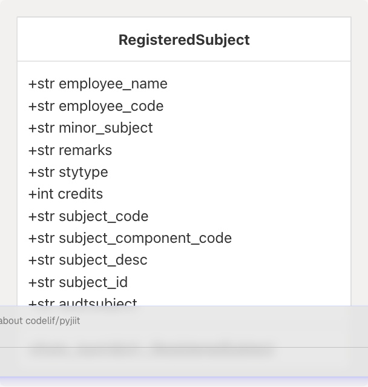
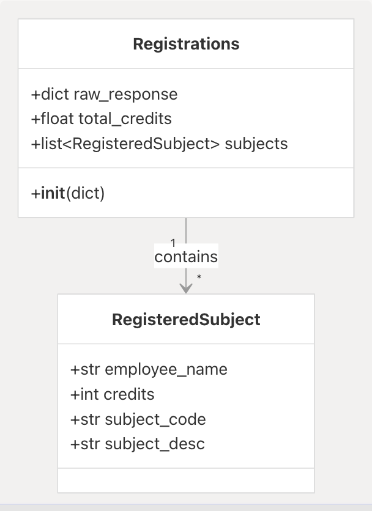
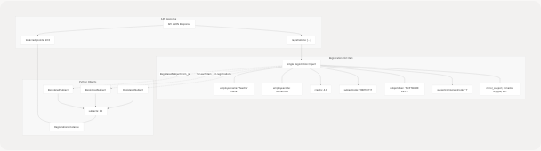

# Registration Models

Relevant source files

* [docs/usage.rst](https://github.com/codelif/pyjiit/blob/0fe02955/docs/usage.rst)
* [pyjiit/exam.py](https://github.com/codelif/pyjiit/blob/0fe02955/pyjiit/exam.py)
* [pyjiit/registration.py](https://github.com/codelif/pyjiit/blob/0fe02955/pyjiit/registration.py)
* [pyjiit/wrapper.py](https://github.com/codelif/pyjiit/blob/0fe02955/pyjiit/wrapper.py)

This page documents the data model classes used to represent student course registration information in pyjiit. These models structure the responses from registration-related API endpoints into typed Python objects.

For information about session management and authentication, see [3.2](/codelif/pyjiit/3.2-session-management). For attendance-related models, see [3.3.1](/codelif/pyjiit/3.3.1-attendance-models). For exam-related models, see [3.3.2](/codelif/pyjiit/3.3.2-exam-models).

## Overview

The registration module provides two primary classes for handling course registration data:

| Class | Purpose | Location |
| --- | --- | --- |
| `RegisteredSubject` | Represents a single registered subject/course with faculty and credit information | [pyjiit/registration.py4-32](https://github.com/codelif/pyjiit/blob/0fe02955/pyjiit/registration.py#L4-L32) |
| `Registrations` | Container for all registered subjects in a semester, including total credits | [pyjiit/registration.py36-43](https://github.com/codelif/pyjiit/blob/0fe02955/pyjiit/registration.py#L36-L43) |

These models are used by the `Webportal.get_registered_subjects_and_faculties()` method to structure API responses from the `/reqsubfaculty/getfaculties` endpoint.

**Sources:** [pyjiit/registration.py1-44](https://github.com/codelif/pyjiit/blob/0fe02955/pyjiit/registration.py#L1-L44) [pyjiit/wrapper.py5](https://github.com/codelif/pyjiit/blob/0fe02955/pyjiit/wrapper.py#L5-L5) [pyjiit/wrapper.py252-269](https://github.com/codelif/pyjiit/blob/0fe02955/pyjiit/wrapper.py#L252-L269)

## RegisteredSubject Dataclass

The `RegisteredSubject` dataclass encapsulates all information about a single registered subject for a student.

### Structure


```

### Field Descriptions

| Field | Type | Description |
| --- | --- | --- |
| `employee_name` | `str` | Name of the faculty member assigned to teach the subject |
| `employee_code` | `str` | Unique identifier for the faculty member |
| `minor_subject` | `str` | Flag indicating if this is a minor subject (typically "N" or "Y") |
| `remarks` | `str` | Registration status remarks (e.g., "REG" for registered) |
| `stytype` | `str` | Subject type (e.g., "REG" for regular) |
| `credits` | `int` | Number of credits for this subject |
| `subject_code` | `str` | Unique subject code (e.g., "15B11CI111") |
| `subject_component_code` | `str` | Component type (e.g., "T" for theory, "L" for lab, "P" for practical) |
| `subject_desc` | `str` | Full descriptive name of the subject |
| `subject_id` | `str` | Internal subject identifier |
| `audtsubject` | `str` | Flag indicating if this is an audit subject (typically "N" or "Y") |

### Factory Method

The `from_json()` static method constructs a `RegisteredSubject` instance from the raw API response dictionary. It maps API field names (lowercase with no underscores) to Python attribute names (lowercase with underscores).

**Example API-to-Object mapping:**

* `"employeename"` → `employee_name`
* `"subjectcode"` → `subject_code`
* `"subjectcomponentcode"` → `subject_component_code`

**Sources:** [pyjiit/registration.py4-32](https://github.com/codelif/pyjiit/blob/0fe02955/pyjiit/registration.py#L4-L32)

## Registrations Container Class

The `Registrations` class aggregates all registered subjects for a given semester and provides the total credit count.

### Structure

```

```

### Attributes

| Attribute | Type | Description |
| --- | --- | --- |
| `raw_response` | `dict` | The complete unprocessed API response for reference |
| `total_credits` | `float` | Sum of all credits for registered subjects in the semester |
| `subjects` | `list[RegisteredSubject]` | List of all registered subjects as `RegisteredSubject` objects |

### Initialization

The constructor accepts the raw API response dictionary and:

1. Stores the complete response in `raw_response`
2. Extracts `totalcreditpoints` as `total_credits`
3. Transforms the `registrations` array into a list of `RegisteredSubject` objects using `RegisteredSubject.from_json()`

**Sources:** [pyjiit/registration.py36-43](https://github.com/codelif/pyjiit/blob/0fe02955/pyjiit/registration.py#L36-L43)

## Usage in Webportal API

The registration models are used in the following workflow within the `Webportal` class:

```

```

### Method: get\_registered\_semesters()

This method retrieves the list of semesters for which the student has registered subjects. It returns a list of `Semester` objects (defined in the attendance module).

**Endpoint:** `/reqsubfaculty/getregistrationList`

**Implementation:** [pyjiit/wrapper.py233-249](https://github.com/codelif/pyjiit/blob/0fe02955/pyjiit/wrapper.py#L233-L249)

### Method: get\_registered\_subjects\_and\_faculties()

This method retrieves all registered subjects and their assigned faculty for a specific semester.

**Parameters:**

* `semester`: A `Semester` object (typically obtained from `get_registered_semesters()`)

**Returns:** `Registrations` object containing all subject registrations

**Endpoint:** `/reqsubfaculty/getfaculties`

**Implementation:** [pyjiit/wrapper.py252-269](https://github.com/codelif/pyjiit/blob/0fe02955/pyjiit/wrapper.py#L252-L269)

**Sources:** [pyjiit/wrapper.py233-269](https://github.com/codelif/pyjiit/blob/0fe02955/pyjiit/wrapper.py#L233-L269) [docs/usage.rst111-137](https://github.com/codelif/pyjiit/blob/0fe02955/docs/usage.rst#L111-L137)

## Data Flow: API Response to Model Objects

The following diagram illustrates how raw API data is transformed into typed model objects:

```

```

**Sources:** [pyjiit/registration.py18-32](https://github.com/codelif/pyjiit/blob/0fe02955/pyjiit/registration.py#L18-L32) [pyjiit/registration.py38-41](https://github.com/codelif/pyjiit/blob/0fe02955/pyjiit/registration.py#L38-L41)

## Typical Usage Pattern

The following example demonstrates the standard workflow for retrieving and working with registration data:

**Code Example from Documentation:**

```
```
# Assumes w = Webportal() and login completed

# Step 1: Get list of registered semesters
semesters = w.get_registered_semesters()
sem = semesters[0]  # Select a semester (latest in this case)

# Step 2: Get all registered subjects for the semester
reg = w.get_registered_subjects_and_faculties(sem)

# Step 3: Access individual subjects
for subject in reg.subjects:
    print(f"Subject: {subject.subject_desc}")
    print(f"Faculty: {subject.employee_name}")
    print(f"Credits: {subject.credits}")

# Step 4: Access total credits
print(f"Total credits: {reg.total_credits}")
```
```

**Expected Output Structure:**

```
RegisteredSubject(
    employee_name='Teacher name',
    employee_code='SomeCode',
    minor_subject='N',
    remarks='REG',
    stytype='REG',
    credits=4.0,
    subject_code='15B11CI111',
    subject_component_code='T',
    subject_desc='SOFTWARE DEVELOPMENT FUNDAMENTALS-1',
    subject_id='150046',
    audtsubject='N'
)
```

**Sources:** [docs/usage.rst111-137](https://github.com/codelif/pyjiit/blob/0fe02955/docs/usage.rst#L111-L137)

## Relationship to Other Models

```


The `Semester` class (defined in [pyjiit/attendance.py](https://github.com/codelif/pyjiit/blob/0fe02955/pyjiit/attendance.py)) is shared between attendance and registration functionalities. The same `Semester` objects returned by `get_registered_semesters()` can be used with:

* `get_registered_subjects_and_faculties()` (registration data)
* `get_attendance()` (attendance data)
* `get_exam_events()` (exam data)

**Sources:** [pyjiit/wrapper.py233-269](https://github.com/codelif/pyjiit/blob/0fe02955/pyjiit/wrapper.py#L233-L269) [pyjiit/attendance.py13-28](https://github.com/codelif/pyjiit/blob/0fe02955/pyjiit/attendance.py#L13-L28)

## Implementation Details

### Dataclass vs Regular Class

The `RegisteredSubject` uses Python's `@dataclass` decorator, which automatically generates:

* `__init__()` method
* `__repr__()` method for readable string representation
* `__eq__()` method for equality comparison

The `Registrations` class uses a traditional class definition because it requires custom initialization logic to transform the raw API response.

### API Field Mapping

The API uses lowercase field names without underscores (e.g., `employeename`, `subjectcode`), while the Python models use snake\_case for PEP 8 compliance (e.g., `employee_name`, `subject_code`). The `from_json()` method handles this translation.

**Sources:** [pyjiit/registration.py1-44](https://github.com/codelif/pyjiit/blob/0fe02955/pyjiit/registration.py#L1-L44)